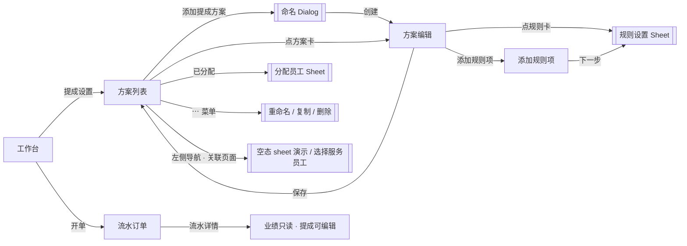
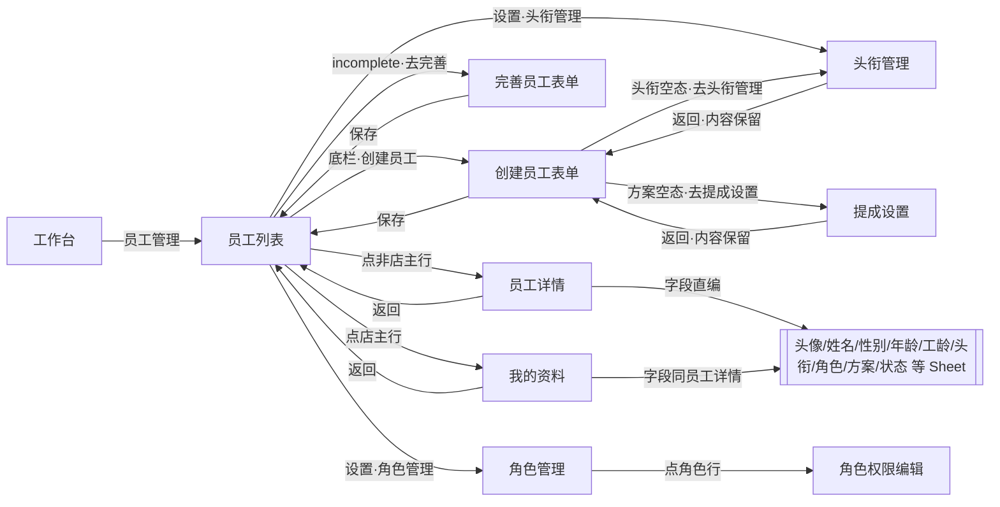
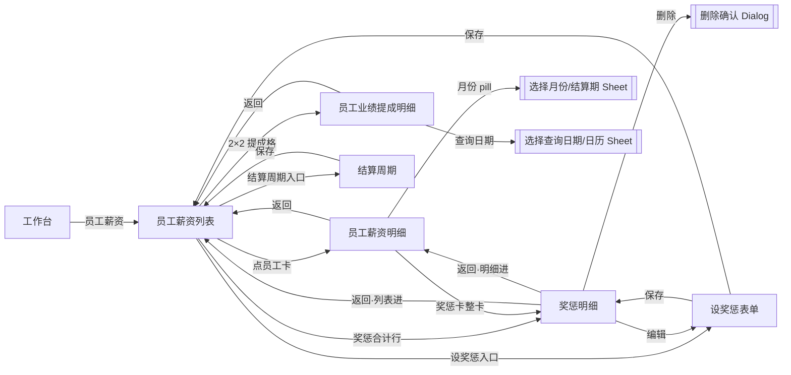

# PRD：提成设置 · 员工管理 · 员工薪资（独立原型 · 三链路）

| 字段 | 内容 |
|------|------|
| 交互原型（唯一可视依据） | 本目录 `index.html`（独立原型 · hub 三链路） |
| 画布 | 390 × 844 |
| 目的 | 供前端 / 后端 / 测试及 AI 工具落地独立原型全部功能；**只需本文 + 交互原型** |
| 关联（非必读） | 同目录 `PRD-项目创建与管理.md`（价目）；`PRD-会员卡管理.md`（卡模板） |
| 修订（2026-09-07） | 金额展示：一律两位小数；小数点及之后数字小一号（仅展示态；见 §5.1 / §11） |
| 修订（2026-09-15） | 规则卡改卡头结构（图标+标题+「＞」，内容区左参数右两控件）；规则 Sheet「提成」恒名 + 「+ 点客提成」虚线条；`guestSplit`；删参数精简与选择页工具条；员工列表「头衔/角色」（品牌色文字，无图标）；「社区形象」卡；规则卡左竖条随卡片轮廓裁切、参数区与右栏控件顶部对齐；Sheet 比例输入框 `%` 紧贴数值；「点」标签中轴对齐；参数区恒显「提成」/工位名标签（同款样式）；提成值与点客值间改为 1px 竖线、「点」标签在点客值左侧；卡头分隔线不压左侧装饰条；右栏两控件恢复卡上可直接点选 |
| 修订（2026-09-16） | 新增 §4.5.2「开单选择服务员工」跨系统约束（类内 OR · 门店维度）：该类未开启「点客提成」→ 不再必选「点客 / 散客」；该类既未开按工位、也未开点客提成 → **点选员工即完成勾选**，无「员工变为按钮」动效；同步 §1.3 / §1.5 / §6.3 / §8 规则 7b / §9.1 / §10.2 验收 53c–53f。另修正 §8.2 顾问方案演示数据、§8.1 试算行数、头衔可删除与唯一头衔、提成编辑权限文案 |
| 修订（2026-09-16 二次） | 重构 §4.5 跨系统约束「开单选择服务员工」：由「类内 OR · 门店维度」下钻为「**项 × 员工**」维度——对每项、每候选员工按该员工所属方案命中块 OR 判定是否需选工位 / 点客-散客；§4.5.1 / §4.5.2 合并为一条；§8 规则 7a / 7b 合并重写；§1.3 / §1.5 / §6.3 / §6.9 交叉引用同步；§10.2 验收 53a / 53c–53f 重写并新增 53g–53j；明确项→类映射（项目 / 产品 / 办卡 / 充卡 / 快捷开单；充卡含充值 / 续次 / 续费，其中「续费」即延期；商城订单无提成块） |
| 修订（2026-09-16 三次） | **模型变更：「按工位分配」与「点客提成」由正交互斥（3×2 = 6 值）改为独立叠加（3 工位提成 + 1 全局点客 = 4 值）**。点客提成提升为 `CatRule` 级单值、与工位无关，`stations[*]` 仅存提成侧；旧数据点客值取 `stationIds[0]`。Sheet 按工位态改为 3 个工位行（各 1 张「提成」卡）+ 第 4 行「点客」行（未开点客为虚线卡，工位行内不再各放虚线卡）；规则卡按工位态摘要为 4 段（`大工 12% 中工 10% 小工 8% 点客 15%`）。同步 §1.3 / §1.5 / §4.5.1 / §5.2 / §6.2.1 / §6.2.3 / §6.3 / §6.4 / §7.2.1 / §8 规则 7·8·29 / §8.1 / §8.2 / §10.2 验收；`comm2.js` / `comm2.css` 演示数据一并改为新形态 |
| 修订（2026-09-16 四次） | 新增 **§6.7.1 关联页面 · 选择服务员工（`staff-pick`）**：整套复制 `RTB开单结账@开单页面/index.html` 的选人员工卡片网格 + Morph 展开动效（含 `.09s` 收窄 / `.17s` 展开 / 窄条 32px / `vibrate(8)` / 减弱动态效果降级），外壳取 `card/demo.html` 的独立底部 Sheet +「完成」+ 入口回填；页面内「不分工位 / 按工位」手动切换二级面板深度，工位名读当前方案 `stationLabels`。同步 §3.1 导航树 / §3.0 页面流 / 左侧导航「关联页面」入口与抓取路由 |
| 修订（2026-09-16 六次） | **选择服务员工交互动效重做（四态）**：按工位+开点客 → 纵排「点客 / 选工位」，点客即完成、选工位裂成 3 工位；按工位未开点客 → 直接三工位；不分工位+开点客 → 纵排点客/散客；皆否 → 点选即勾选。iOS spring 弹性 + 按下反馈；演示页增「开点客/未开点客」开关。同步 §6.7.1 |
| 修订（2026-09-16 七次） | §6.7.1 演示 UI：不分工位+开点客时下钮与摘要由「散客」改为「普通」（业务口径仍称点客/散客；数据仍 `designated=false`） |
| 修订（2026-09-16 八次） | **「点客」全局改名「顾客指定」；顾客指定提成由「与工位互斥」改判为「在原提成之上*额外叠加*的奖励」**。数据字段 `guestSplit` / `designated*` → `extraSplit` / `extraValue` / `extraAmt` / `extraValueMode`（旧数据加载时自动迁移，取值不变）。设置 Sheet 参数区：**3 工位卡横排一行 + 第 2 行「顾客指定」卡**（宽 = 单工位卡、左对齐）；卡内标题「提成」「额外」，字色 `#929292`；工位名 13px（与卡内标题同号）、改名图标 16px；「比例 / 金额」改为**卡内右下角两段式胶囊**（点整块即切换，热区为整块控件）；未开顾客指定时第 2 行为虚线卡「+ 额外」。规则卡摘要：提成值后追加「额外 +{值}」（如 `大工 12% 额外 +5% 中工 10% 小工 8%`）。§6.7.1 选人交互重做为**整行 N 张勾选卡**（工位单选；「顾客指定」可与任一工位同时勾选；保存后收缩为员工卡并显示右侧放大勾选控件，点它取消选择；**删除**员工卡右上角 ×）。同步 §1.3 / §1.5 / §4.5.1 / §5.1 / §5.2 / §6.2.1 / §6.2.3 / §6.2.4 / §6.3 / §6.4 / §6.7.1 / §6.9 / §7.2.1 / §8 规则 7·7a·8·29 / §8.1 / §8.2 / §9 / §10.2 |
| 修订（2026-09-16 九次） | **规则卡上的「额外」段改称「顾客指定」**（取值语义不变，仍是叠加在提成之上的顾客指定提成；Sheet 参数卡标题仍为「额外」）；**未开顾客指定时的虚线卡文案由「+ 额外」改为「+ 顾客指定提成」**（不分工位并排卡与按工位「顾客指定」行两处一致）。**修复「比例 / 金额」两段式胶囊溢出 BUG**：Sheet 内参数卡改**分行布局**（第 1 行取值、第 2 行胶囊右对齐贴卡片右下角）；金额模式输入框改为吃掉「输入行 − 胶囊」的剩余宽度 —— 任意数值下胶囊恒定贴卡片右下角、**不溢出卡片**（旧问题：点「金额」后 `<input>` 回落默认宽度把胶囊顶出卡外约 200px，看起来「消失 / 飞走」）。同步 §1.3 / §1.5 / §6.2.1 / §6.2.3 / §6.2.4 / §6.3 / §6.4 / §9.1 / §10.2 |
| 修订（2026-09-16 十次） | **Sheet 参数卡取值行布局定稿**：**宽卡**（不分工位：「提成」+「额外」并排，卡 175px）值与胶囊**同一行**（左取值、右胶囊）；**窄卡**（按工位：3 工位卡横排一行 + 「顾客指定」行卡，卡 114px）装不下 → **胶囊换到第 2 行右对齐**（= 卡片右下角）、**保持原始尺寸不压缩**，取值行因此可占满整行（金额输入框不再被挤成 22px）。任一情况下胶囊恒定贴卡片右侧 / 右下角、**不溢出卡片**。**PRD 内「额外」统一改称「顾客指定」**（含模型说明、计算规则 7/7a/8/29、字段表、演示数据、文案清单、验收 56i3 / 56i4 等）；**仅 Sheet 参数卡标题**保留「额外」。同步 §1.3 / §1.5 / §5.1 / §6.2.1 / §6.2.3 / §6.2.4 / §6.3 / §6.4 / §7.2.1 / §8 / §8.1 / §8.2 / §9 / §10.2 |
| 修订（2026-09-16 十一次） | ①**不分工位 + 开顾客指定**的 Sheet 参数区改为**两列并排 + 静态列头**「普通」/「顾客指定」（列头 UI 同工位列头：圆点 + 13px、**不可编辑、无改名图标**，「顾客指定」圆点用品牌红；卡宽仍半宽「宽卡」）；**不分工位 + 未开顾客指定**维持「提成卡 + 虚线卡并排、**无列头**」不变。②**选择服务员工交互重定义**：**工位为必选项**——必须用户手点才勾选（**不再预选默认工位**），未点工位的员工**不计入已选**；先勾「顾客指定」而缺工位时**保持展开**等工位；展开态**再点已勾选的工位不取消**（该卡播 **iOS 抖动**提醒，不弹 toast —— 要改工位就点另一个工位、要取消整人就到收缩态点右侧勾选控件）；「顾客指定」可再点取消——待选工位态取消 → **保持展开**且仍未选，已有工位取消 → 退回仅工位并收起，不分工位取消 → 退回「普通」；「普通」再点 → 取消该员工；收起时**保留**「顾客指定」勾选记忆（Sheet 关闭后再打开仍在）。③**勾选控件新动效**：点按后**快速变红（120ms）→ 勾从左到右画出（220ms）**，取消**反序播放**（收勾 → 褪红）；**切换工位时旧勾先反序收回、再画新勾**；**卡片的收起 / 展开都必须等动效播完**；动效期间的新交互**抢断**当前动效（立即落定后执行，不排队、不丢失）。同步 §4.5.1 / §6.2.3 / §6.2.4 / §6.3 / §6.4 / §6.7.1 / §9 / §10.2.1 |
| 修订（2026-09-16 十二次） | **勾选动效提速一倍 + 「播完才收起」改为按真实动画终点判定 + 展开态点卡片区任意处都收起**。①**提速一倍**：变红 120ms → **60ms**、画勾 220ms → **110ms**（单轮 **170ms**；切换工位约 **340ms**）。时长抽成 CSS 变量 `--sp-check-red` / `--sp-check-draw`，**JS 与 CSS 同源**（`comm2.js` 直接读变量算门控时长），避免两边对不齐。②**收起 / 展开不再用固定计时**：改为等**真实动画播完**（`Animation.finished`）+ 「已过名义时长」两者取长（+超时兜底）——动效被改慢时收起随之推后；**修复「还没播完就收起」**（原固定 `setTimeout(340ms)` 在主线程卡顿 / 动效期间点其他区域时会提前落定）。③**动效期间的新交互仍抢断**（不排队、不丢失），但抢断时**先把进行中的勾补画成终点态**再落定 —— 勾永远不会停在半路。④**展开态「点选项卡之外的区域都收起」**：**服务员工卡片区**内（编辑卡自身空白 / 选项行间隙 / 卡片区与 Sheet 正文空白 / `scrim`）任意点击都收起；**Sheet 标题、提示行、底部栏**（卡片区之外）点了不收起；底部「完成」与 Sheet 外遮罩仍旧**关闭整个 Sheet**；点另一张员工卡 = **收起当前 + 展开新的**；展开 Morph（380ms）播完前不收起。⑤**收起后收缩态员工卡右侧的勾不再重画**（选项卡上已画过，直接呈现完整态）；「不分工位 + 未开顾客指定」的**点选即勾选**态仍在员工卡上**画出**勾（该态无选项卡）。同步 §4.5.1 / §6.4 / §6.7.1 / §9.1 / §10.2.1（新增 53z–53ad） |
| 修订（2026-09-16 十三次） | **新增 §12「交互动效规范」——全套动效进 PRD，作为唯一规范来源。** 覆盖 **26 项动效**（A 选人 Sheet 13 项 · B 提成设置 6 项 · C 员工管理 / 薪资 4 项 · D 壳层基座 4 项，其中 C 组 2 项属阶梯提成、§1.4 本期不做）。每项固定给出 10 个字段（触发 / 起始态 / 过程 / 结束态 / 时长 / 缓动 / **可中断** / **互斥** / **降级** / 实现锚点），并提供**可照抄的 CSS / JS 代码块**。新增 5 个全局小节：①**时长阶梯**（含 `--sp-check-red 60ms` / `--sp-check-draw 110ms`，要求 JS 门控与 CSS **同源**）；②**缓动曲线**（iOS spring `cubic-bezier(.34,1.3,.64,1)` / Apple 标准 `.22,.82,.24,1` / 抖动 `.36,.07,.19,.97` / 画勾必须 `linear`）；③**几何与视觉 token**（实测 `gridW 332` / `cellW 105.33` / 位移步长 `113.33` 等）；④**触觉**（选人 `8ms`、拖拽 `12ms`）；⑤**按压反馈统一规则**（仅三类元素有形变）。**动效细节实证补全**：Morph 展开的关键帧与公式、**收起为即时重绘（实测 2ms、无过渡）**、同行卡片淡出（瞬时）、选项卡分裂逐张 `0/35/70/105ms`、选项面板淡入（实测 ≈200ms）、门控状态机（`morphUntil` + `checkUntil` 双门 + 名义时长取长 + `300ms` 兜底 + 抢断补画 + 只认最后一次意图）、左滑删除（横向位移绝对量 > 8px 起滑、`clamp(−72,0,dx)`、`dx≤−48` 吸附、`.22s`）、列表拖拽排序（长按 `400ms`、移动 `8px` 取消、`opacity .55 / .15s`）、Toast（`.2s`、`2000/2600ms`、`>18` 字多行）、抽屉（`.28s`、`.55` 阈值、`22px` 热区）。新增 §12.7 组合 / 互斥矩阵、§12.8 降级与可访问性、**§12.9 动效专项验收 N1–N24**、§12.10 实现自检清单 + **2 项已知偏差待确认**（收起与展开不对称、`opened` 判据；原「重绘重播 `staffDonePop`/`staffCheckIn`」已**同批修掉** —— 改为一次性标记 `is-pop` / `is-in`，`spSelectStaff()` 置位、渲染读取、渲染后清空，多选时不再「噗噗」连弹，回归项 N18 / N25）。**同批附带修掉一个连带 BUG**：刚展开（`is-splitting` 仍在 DOM）时点已选工位，抖动会被 `fill: both` 的入场动画吃掉（`is-shake` 被 `staffRoleSplit` 的 `animationend` 在 ≈260ms 截断）—— ① CSS 中抖动规则移到 `is-splitting` 之后并加组合选择器；② `animationend` 回调按 `animationName` 过滤；③ `is-splitting` 延到 `520ms` 才摘除。回归项 **N26**。同步 §12.11 变更流程。§6.7.1 动效表精简为摘要并链至 §12.3。模块编号顺延：原「模块 12 交付物」→ **模块 13 交付物** |
| 修订（2026-09-17 十四次） | **反向（取消）勾选动效提速一倍**：取消 = **反序播放**（先收勾、再褪红），时长整体**减半** —— 收勾 `110ms → 55ms`、褪红 `60ms → 30ms`，单轮 `170ms → **85ms**`（时长与速度都是正向的一半）。新增两个 CSS 变量 `--sp-uncheck-draw: 55ms` / `--sp-uncheck-red: 30ms`，**JS 与 CSS 仍同源**：`comm2.js` 新增 `spUncheckMs()` 读这两个变量，并按方向取时长（`spCheckMsFor(on)`：正向 170ms / 反向 85ms），反向路径的门控名义时长改由它给出；兜底上限仍取较长的正向 `spCheckMs() + 300ms`。**生效范围 = 全部反向路径**：①切换工位时被取消的旧工位；②取消「顾客指定」（退回「普通」/ 仅工位）；③取消「普通」；④收缩态员工卡点右侧勾选控件取消选择。**切换工位（A8）**随之从 `170 + 170 = 340ms`（实测 359ms）变为 `85 + 170 = **255ms**`（实测 **267ms**）。正向 A6 **不变**（仍 170ms）；A6/A7 时长**刻意不对称**（取消求干脆、确认求笔顺），已在 §12.10 标注「设计如此、不是偏差」。**实测**：`.is-undraw` 盒 `transition-duration 30ms / delay 55ms`，`svg path` 上 `spCheckUndraw` `duration 55ms / delay 0`；取消「顾客指定」→ 落定 **91ms**；`--sp-uncheck-draw` 拉到 `600ms` → 落定 **636ms**（证明读的是反向变量）。同步 §4.5.1 / §6.7.1 / §10.2.1（53q / 53r / 53y 改写 + 新增 53ab2）、§12.2.1（时长阶梯新增两变量 + 公式 + 1/2 硬性约束）、§12.3 A6 / A7 / A8 / A13、§12.8、§12.9（N6 / N7 / N9 改写 + 新增 N9b / N9c）、§12.10 |
| 修订（2026-09-17 十五次） | **换选时「被取消那卡的红」真正快速消失 —— 修掉一个 CSS 优先级 BUG + 换工位改为并行「红色交接」**。**① 修 BUG（根因）**：反向褪红一直**没生效** —— 旧卡勾选框的红来自 `.staff-opt.is-on .staff-opt__box`（特异性 `0,3,0`），压过了反向的 `.staff-opt__box.is-undraw`（`0,2,0`），实测旧卡在整个动效期间（26→276ms）**恒为纯红 `rgb(243,47,65)`**、只在落定重绘那一帧「啪」地硬切消失。现以**组合选择器反超**：`.staff-opt.is-on .staff-opt__box.is-undraw`（`0,4,0`）。**② 整卡红色一起淡出**：反向时**宿主卡片**也标 `is-undraw`（新增 `spCheckHost()`：选项卡 → `.staff-opt`；收缩态员工卡 → `.staff-card`），让**选项卡红边 + 红投影**、**员工卡粉底 + 粉描边 + 头像粉圈**与勾选框**同一个节拍**（`--sp-uncheck-draw` 后起、`--sp-uncheck-red` 内结束）退干净；选项卡用 `.staff-opt.is-on.is-undraw` 反超 `.staff-opt.is-on`，`顾客指定`卡取消后回它自己的基线红边 `rgba(243,47,65,.18)`。**③ 粉底不可插值**：员工卡粉底是 `linear-gradient`，渐变 → 白色只能硬切；故在 `.is-done` 下垫一层同色 `background-color: #FFF5F5`、渐变置其上，褪色时先摘渐变（同色、肉眼无感）再让 `background-color` 过渡到白（实测采到 `#FFF5F5 → #FFF6F6 → #FFFCFC → #FFFEFE → #FFF`）。**④ 换工位由串行改为并行「红色交接」（A8 重写）**：**新卡立刻**变红 + 画勾（正向 170ms），**同时**旧卡整卡红色快速淡出 + 收勾（反向 85ms），落定取较长者 = **170ms**（实测 182ms）；串行版本（旧先淡、新后画 = 255ms / 实测 267ms）因「旧卡红先淡、新卡才画勾」而观感断成两截，已废弃。**⑤ 生效范围 = 全部反向路径**：换工位 / 取消「顾客指定」/ 取消「普通」/ 收缩态点勾取消选择。**实测**：换工位时 **62ms** 新卡勾选框已纯红、**82ms** 旧卡红底退净、**182ms** 落定；`is-undraw` 期间旧卡盒底为白 `rgb(255,255,255)`、卡片边框褪到 `rgb(232,232,232)`。同步 §4.5.1 / §6.7.1 / §10.2.1（53q 改写 + 新增 53ab3 / 53ab4）、§12.2.1（换工位公式 `max(170,85)=170`）、§12.3 A7（新增「宿主卡片红色」字段 + 反超 CSS/JS 代码块）/ A8（重写为并行）/ A13、§12.8、§12.9（N7 改写 + 新增 N9d / N9e）、§12.10 |
| 修订（2026-09-17 十六次） | **Sheet 参数卡口径与排布 + 选人交互收紧（收起时机 / 未选待选态 / 点掉工位）**。**① Sheet 参数卡**：卡内标题「额外」→「**指定**」；**「不分工位」**下的 2 张参数卡由「左右并排一行（居中）」改为「**两行居左**」（`comm2-sheet-avg-rows`，尺寸不变 `175×66`，行首 x 与「按工位」的首行对齐）—— 两种分配模式切换时窗口抖动由 **150px 降到 48px**；「按工位」下的行标签「普通」→「**提成**」（「不分工位」的两张卡沿用同一批行标签，不再用列头）。**② 收起时机收紧**：展开态下**只要点选了任一按钮就收起**，**包括「按工位」下先点「顾客指定」**（原实现会「保持展开等工位」）。**③ 未选待选态（新增，A13b）**：只勾「顾客指定」没点工位时，卡片为**选中态样式**（`is-done`：粉底 + 粉描边 + 头像粉圈）但**没有勾选控件**，摘要工位位显示**灰字「未选」**（`rgb(146,146,146)`）+ **红字「顾客指定」**；该员工**不计入已选**（入口仍「未选择」）；再次展开时「顾客指定」仍保留勾选记忆。**④ 点掉工位（A12 重写）**：已勾选的工位**再点即取消**（工位单选且可点掉），走**反向收勾**（55 + 30 = 85ms）；若同时勾着「顾客指定」→ 落入**未选待选态**，否则**完全取消该员工**；原「iOS 抖动（`spOptShake` / `is-shake` / 440ms，状态不变）」**已整个废止**（CSS 规则、JS 函数、时长阶梯、缓动曲线、触觉说明一并清理）。同步 §4.5.1 / §6.2.3 / §6.3 / §6.4 / §6.7.1 / §10.2.1（53s / 53u / 53v / 53x / 53z 改写）、§12.2.1 / §12.2.2 / §12.2.4 / §12.3（A4 / A12 重写 + 新增 A13b）/ §12.8 / §12.9（N14 / N15–N17 / N26 改写 + 新增 N17b）/ §12.10 |
| 修订（2026-09-17 十七次） | **两组参数各自独立、可单选可叠加；「顾客指定提成」可脱离工位单独分配（只发顾客指定提成）**。口径一句话：**「提成侧」（按工位 = 大工/中工/小工 可多选；不分工位 = 单张「提成」）与「顾客指定侧」两组参数各自独立、可单选可叠加，只要勾了任一组就算已选。** **① 废止「工位必选」**：未点工位的员工**不再**因此不计入已选 —— 只勾「顾客指定」就是一次有效的单独分配。**② 废止「未选待选态」（A13b 语义重写）**：十六次的「不计入已选、无勾选控件、摘要 `未选 · 顾客指定`」改为 **计入已选、出现勾选控件、摘要 `无工位 · 顾客指定`**（`无工位` 灰字 + `顾客指定` 红字）。**③ 不分工位解除二选一**：「普通」改名「**提成**」，与「顾客指定」**可叠加**（`spApplyOptionToggle` 删掉 `staffExtra = false` 的互斥写；`spOptionChecked` 的 `plain` 不再由 `chosen && !extra` 推导）。**④ 数据模型（f1 最小新增）**：`staffRoles[sid]` 统一存**提成侧选择**（按工位 = 工位 id；不分工位 = 哨兵 `SP_PICK_AVG = 'avg'`）；订单行新增 **`basePicked`** 区分「明确没勾提成侧」（`false` → **提成侧折 0、只发顾客指定提成**）与「历史缺字段」（照常计提，工位仍回落 `stationIds[0]`）。**⑤ 计提口径**：`lineBasePicked(line)` → `lineRateMeta` 在 `basePicked=false` 时返回 `{rate:0, none:true}`；`schemeLineAmount` 的费率标签在提成侧折 0 时**只出顾客指定段**（`顾客指定 5%`，**不得**出现 `0%`）。**⑥ 状态收敛**：`spEnsureState` 三者（`staffRoles` / `staffChosen` / `staffExtra`）**一律以 `staffIds` 为准**（在册即保留、不在册即清）；`spDropStaff` 把 `staffRoles` 与 `staffExtra` **一并删除**；`spSelectStaff(sid, fresh)` **不再写 `staffRoles`**（由调用方先行写入），以便「只勾顾客指定」原样保留提成侧为空。**⑦ 文案**：hint 四态文案、分配模式说明 Dialog 补「只勾「顾客指定」也可单独分配（只发顾客指定提成）」；界面不再出现「普通」作为不分工位侧标签、也不再出现「未选」作为摘要文案。同步 §4.5.1（四态矩阵 / 口径要点 / 落库与计提）/ §4.5 / §6.2.3 / §6.7.1（入口摘要、hint、勾选卡表、交互四态、动效摘要）/ §7.2.1（字段表新增 `basePicked`）/ §8 规则 7 · 7a · 8 / §8.1 演示试算 / §9.1 / §10.2.1（53e / 53g / 53s / 53t / 53u / 53v / 53v2 / 53w / 53x 改写 + 新增 53v3 / 53x2）/ §12.3 A12 · A13b / §12.8 / §12.9（N6 / N14 / N15–N17b / N26 改写 + 新增 N14b / N17c）/ §12.10·12.11 |
| 修订（2026-09-17 十八次） | **选人摘要文案分工：「未选工位」不再写在卡片上**。按工位分配时若**没选工位、只勾了「顾客指定」**，**员工卡第三行**从 `无工位 · 顾客指定` 改为**只画红字 `顾客指定`**（`spSummaryHtml` 的 `miss` 分支直接返回单个 `.staff-card__pick-x` span，与不分工位态同款）；**「未选工位」这条信息只在入口下方「已选员工」摘要行**保留为 `无工位 · 顾客指定`（`spSummaryText` 不变，纯文本无灰/红拆分）。**该状态的其余口径全部不变**：`is-done` 选中态样式、**有勾选控件**、**计入已选**（入口 `已选 1 人`）、订单行落库 `basePicked=false` → 提成侧折 0、**只发顾客指定提成**；再次展开仍是勾选态；点掉工位 / 点掉顾客指定 / 换工位的反向动效与落定口径均不变。**代码清理**：`.staff-card__pick-miss` 规则**从 `comm2.css` 删除**（卡片已不再渲染灰字「无工位」，该 class 无引用）。同步 §4.5.1（四态矩阵 / 口径要点 / 取消勾选）/ §6.7.1（入口摘要 · 勾选卡表 · 交互四态 · 动效摘要）/ §9.1 / §10.2.1（53v / 53x 改写）/ §12.3 A12 · A13b / §12.8 / §12.9（N14 / N15 / N26 改写）/ §12.10 |
| 修订（2026-09-17 十九次） | **收缩态员工卡的红色勾选控件整个删除 + 收起补动画 + 「提成」改「服务提成」**。**① 删卡上勾**：`.staff-card__tick`（收缩态员工卡右上角 `20×20` 红勾）**连同它的点击分支、`spTickEl()`、`freshTick` 标记、`staffCheckIn` / `.is-in` 弹入动效一并删除** —— 勾**只存在于展开态选项卡**的 `.staff-opt__box`（不变）。取消该员工的入口收为两条：**①展开卡片取消勾选；②入口「已选员工」摘要行右侧 ×**（`data-staff-summary-del`，本就是另一套、不受影响）。连带废止：**A10「勾弹入」整项**、原「收缩态点勾取消 → 粉底淡出」（A13 / 原 N9c / N9d），`spCheckHost()` 的 `.staff-card` 分支与 `.staff-card.is-done.is-undraw` 一组 CSS 一并清理。**② 态4 反馈**（不分工位 + 未开顾客指定，该态没有展开态）：选中反馈只剩 **粉底 + 粉描边 + 头像粉圈 + 卡片回弹（`is-pop`，A9 不变）**；取消 = 再点该卡。**③ 收起动画（A2 重写）**：原「裸 `innerHTML` 重绘、实测 2ms、无过渡」改为**反向 Morph** —— 已展开的那张卡把**宽度 `gridW 332 → cellW 105.33`**、**位移 `dx → 0`** 收回去（`--sp-collapse` **220ms** / `--sp-ease-std` Apple 标准 `.22,.82,.24,1`，**JS 读同一变量、与 CSS 同源**），**同行其余卡片淡入回**（原展开的淡出仍是瞬时，只有淡入挂 220ms 内联过渡），**两层交叉**：上层 `.staff-card__opts`（4 张选项卡）**整体淡出**、下层**新增的 `.staff-card__panel--base`（头像 / 姓名 / 摘要，与收缩态卡面同一套 DOM）淡入** —— 动画终点与重绘后的静态卡面**像素级一致**，落定那一帧不跳。新增类 `is-collapsing`；展开卡里同时渲染 `data-face="opts"`（`z-index:1`）与 `data-face="base"`（`z-index:0`）两个面板。**④ 生效路径 = 全部**：点选项卡后收起 / 点遮罩 `scrim` / 点编辑卡自身空白 / **点另一张员工卡（先收 220ms、再展开 380ms，串行）**。**⑤ 改名**：选人展开态选项卡「提成」→「**服务提成**」（**仅此一处**；「不分工位」的 Sheet 行标签 / 卡内标题、以及摘要文案 `提成 · 顾客指定` **仍为「提成」**）。**实测**（Edge headless，390×880）：收起动画存活 **202–221ms**（H3：勾选动效结束 `90ms` → 落定 `320ms`；I4：`tCollapse 181ms` → `tSettle 413ms`；I5：重绘 `228ms`）；卡宽逐帧采样 **16 个中间值**（`301 → 106`）；选项卡 `opacity` `0.857 → 0.00002` 同时头像卡面 `0.143 → 0.9999`；三条非选项卡路径 span 均 `218/218/221ms`。**点选项卡后的总落定** = 勾选动效 `170ms` + 收起 `220ms` ≈ **390ms**（反向取消：`85 + 220` ≈ `305ms`）。同步 §4.5.1 / §6.7.1（收缩后的员工卡 · 收起 · 速查摘要 · 交互四态）/ §9.1 / §10.2.1（53o / 53q / 53r / 53v / 53y / 53ab2 改写）/ §12.2.1（新增 `--sp-collapse` / `--sp-ease-std`）/ §12.3 **A2 重写** · **A10 整项废止** · A9 · A11 · A13 · A13b / §12.7 / §12.8 / §12.9（N9b / N9c / N10 / N14 / N18 / N19 / N25 改写 + 新增 N19b / N19c）/ §12.10 / §12.11 |
| 修订（2026-09-17 二十次） | **「选择服务员工」整套动效写入可还原级规范（新增 §12.3.0 实现总览）+ 几何过期值更正**。**① 新增 §12.3.0 实现总览（14 小节，前置在 A1 之前）**，目标是「不读原型源码也能 1:1 还原」，含：**§12.3.0.1 交付物与建议实现顺序**（7 步，点明「门控必须先做」）、**§12.3.0.2 DOM 契约**（完整骨架 + 11 个属性/内联样式的「作用 / 缺失后果」表 + 两个易错点：收缩态面板必须 `<button>`、展开卡两层面板必须并存）、**§12.3.0.3 数据与状态模型**（`spState` 全字段表 + 4 个派生量 + **摘要两处口径对照表**）、**§12.3.0.4 类名总表**（14 个类：谁加 / 何时加 / 何时清 / 是否常驻）、**§12.3.0.5 一次完整交互的类名时间线**（点选全过程逐时刻）、**§12.3.0.6 几何契约**（公式 + 实测 + `col` 取法 + 多视口提醒）、**§12.3.0.7 事件绑定契约**（12 行点击分派表 + 3 条硬约束 + 抢断标注）、**§12.3.0.8 函数契约表与调用关系**（10 个常量 + 30 个函数签名/职责/副作用 + 三条主链调用图）、**§12.3.0.9 组合时间轴**（4 条链路毫秒级 + 6 条并行/串行关系）、**§12.3.0.10 完整 CSS 清单**（16 段、可整块照抄，标注 3 处「必须反超」与顺序敏感点）、**§12.3.0.11 完整 JS 清单**（A–K 共 11 组、动效必需函数全文）、**§12.3.0.12 反例清单**（16 条已踩过的坑 + 实测现象 + 正确做法）、**§12.3.0.13 边界与异常用例**（16 条）、**§12.3.0.14 还原自查清单**（18 项）。**② 几何过期值更正**：`gridW` `332 → 334`、`cellW` `105.33 → 106`、位移步长 `113.33 → 114`、`dx` `0 / −113.33 / −226.67 → 0 / −114 / −228`、展开卡宽 `332 → 334`（**共 8 处**：§12.2.3 · §6.7.1 动效摘要 · A1 几何/结束态 · A2 起始态/几何 · §10.2.1 `53o` · §12.9 `N1`）。**③ A4「变换原点」行更正**：`--staff-origin` / `data-origin` 经核为**渲染了但 CSS 从未消费的死属性**（实测 `.staff-opt` 的 `transform-origin` = `38.75px 48px` = 自身中心），原「按列从卡片所在侧展开」的表述与实现不符 → 改为「实测 = 默认 `center center`，还原时**不要消费**；要改属变更」。**④ 另识别 2 个死属性**：`data-outside-close`（写在 `#comm2StaffSheetMask` 上、全仓无消费方，点遮罩关闭实际由 `t === mask` 实现）、`edit.opened`（十六次后恒为 `false`，`.is-opened` 永不渲染）。**⑤ §12.3 章首补「读法」**：先读 §12.3.0 再逐项对齐 A1–A13b。**本次仅文档与探针，未改任何原型行为**（`comm2.js` / `comm2.css` / `index.html` **零改动**）。同步 §12.3（新增 §12.3.0.1–§12.3.0.14）· §12.2.3 · §6.7.1 · §12.3 A1 · A2 · A4 · §10.2.1（`53o`）· §12.9（`N1`）· §12.10 |
| 修订（2026-09-17 二十一次） | **清理「选择服务员工」的三类死属性 / 死字段（原型 + §12.3.0 规范 + §12.10 偏差表同步）**。**① `--staff-origin` / `data-origin`（死属性）**：`spRenderPickerHtml()` 按列算出的 `origin` / `originSide` 内联写进两张卡（展开卡 + 收缩态卡）的 `style` 与 `data-origin`，但全仓**无任何 CSS 消费方**（实测 `.staff-opt` 的 `transform-origin` 恒为自身中心 `38.75px 48px`）→ 删除 `spCardOrigin()`、`origin` / `originSide` 两个变量、两处 `style` / `data-origin` 属性，`cards.map` 不再需要 `index` 形参。**② `edit.opened`（死字段）与 `.is-opened`（死类）**：十六次废止「保持展开等工位」后该位**恒为 `false`**，`.is-opened` **永不渲染**（十九次仅把它**复用**进收起动画选择器作兼容）→ 删除 `spState.edit.opened`、`spRenderPickerHtml()` 的 `(edit.opened ? ' is-opened' : '')`、`spAnimateStaffMorphLayout()` 里读 `is-opened` 的 `alreadyOpen` **整条分支**（展开路径不再有「已展开不重播」短路，**每次展开都播 Morph**，与实测行为一致）、`comm2.css` 的**三条** `.is-opened` 规则（死规则本体 + 收起选择器并列项 + `prefers-reduced-motion` 并列项）。**③ `data-outside-close="1"`（死属性）**：写在 `#comm2StaffSheetMask` 上但全仓无消费方（点遮罩关闭实际由 `t === mask` **严格相等**判定）→ 从 `index.html` 删除；§6.7.1 D1「关闭」行改写为「遮罩点击关闭**由各处事件分派自行判定**，全仓**没有**通用 outside-close 机制」。**④ 文档同步**：§12.3.0.2 DOM 骨架与属性契约表去掉这两个内联属性（**11 行 → 10 行**）、§12.3.0.3 `spState.edit` 注解与字段表去掉 `opened`（**11 行 → 10 行**）、**§12.3.0.4 类名总表「14 个」→「13 个」**、§12.3.0.6 变换原点改为「变换原点 = **默认 `center center`**（实测自身中心）」、§12.3.0.7 遮罩关闭改为「只按 `t === mask` 实现，不要另做通用 outside-close」、§12.3.0.9 调用图 `edit = { staffId, splitting }`、§12.3.0.10 CSS 清单删 1 段、改 2 段、§12.3.0.11 JS 清单 **B / D / G / I** 四块同步、**§12.3.0.12 反例 6 改写**为「不要消费已不存在的 `--staff-origin`」、**§12.3.0.14 自查清单末项改写**为「三个死属性 + `is-opened` 死类均不存在」、§12.3 **A1**（已展开卡重绘行 + 实现锚点）/ **A4**（变换原点行）改写、**§12.10 偏差表 2 / 3 / 4 三行标记「二十一次已清理」**。**⑤ 回归**：`_tmp_probe_geom2.mjs`（几何 `334 / 106 / 114` 不变、`transform-origin` 仍为自身中心）、`_tmp_probe_collapse.mjs`（四条路径收起动画）、`_tmp_probe_newspec.mjs`、`_tmp_probe_entry.mjs`、`_tmp_ui_verify.mjs`、`_tmp_smoke.js` **全 PASS**；`_tmp_check.py` 新增 12 条清理断言（`comm2.js` / `comm2.css` / `index.html` 里 `--staff-origin` / `data-origin` / `spCardOrigin` / `is-opened` / `alreadyOpen` / `opened: false` / `data-outside-close` **一律为零**）。**行为零变化**：卡片几何、动效时序、勾选门控、摘要文案、计提口径均未改 |
| 修订（2026-09-18 二十二次） | **方案编辑页标题右侧新增「信息增强 ⓘ」+ 白话版「提成怎么设、钱怎么算」帮助弹窗**。**① 入口**：方案编辑页标题栏从 `<span class="title" id="comm2EditTitle">{方案名}</span>` 改为 `<span class="title title--with-help" id="comm2EditTitle"><span class="title__txt" id="comm2EditTitleText">…</span><button class="emp-ach-help-btn" id="comm2EditHelpBtn">ⓘ</button></span>` —— **复用列表页帮助同一组件**（`20×20` 热区 / `16×16` 线性 ⓘ / `#B2B2B2` / 与标题文字间距 `4px`）。`renderEdit()` 的标题写入目标由 `#comm2EditTitle` 改为 **`#comm2EditTitleText`**（写外层会连带 `textContent` 清掉 ⓘ）；新增样式 `.page-title-bar .title.title--with-help > .title__txt { min-width:0; overflow:hidden; text-overflow:ellipsis; white-space:nowrap; }`，方案名过长时**只截断文字、ⓘ 恒完整可见**（实测：超长名时 `scrollWidth > clientWidth` 且 `text-overflow: ellipsis`、ⓘ 仍完整落在标题栏内）。**② 弹窗**：新增 `#comm2RuleHelpMask`（`dialog dialog--emp-help` + `dialog__scroll emp-help-body`，`max-width 326px` / `max-height min(520px,75vh)` / 正文可滚动 / 底部单按钮「知道了」），标题「**提成怎么设、钱怎么算**」，两节 **「一、怎么设置（5 步）」/「二、钱怎么算出来（8 条）」共 13 条**；条目渲染为**序号卡片**（新增 `.comm2-hint-list` / `.comm2-hint-item` / `__no` / `__main` / `__t` / `__d`：序号 `18×18` 圆形 `#F0F0F0` + `11px/600`、与分节标题 `h4` **左对齐**、与文字间距 `8px`；结论 `13px/600` `var(--text)`；补充 `12px` `var(--text-sec)` `#929292`）。**两条 `__t` / `__d` 规则必须写作 `.emp-help-body .comm2-hint-item__*`**（特异性 `0,2,0`），否则被 `.emp-help-body p`（`0,1,1`）覆盖。**③ 定位 = 白话 + 分工**：面向文化水平有限的小店主 / 店员，**不出现「取高 / 分摊 / 覆盖优先于默认」等术语**；与列表页「多方案规则」**分工不合并**（列表页讲多方案之间的取高规则，本弹窗讲「这张卡怎么填 + 钱怎么算」）。**④ 范围**：**仅方案编辑页**（添加规则项页不加）；**列表页 `comm2HelpMask` 内容与触发均未改动**。**⑤ 关闭**：`知道了` / 点遮罩空白（`e.target === mask`）。**实测**（Edge headless 390×880）：`_tmp_probe_rulehelp.mjs` **33 项全 PASS** —— 入口（组件/尺寸/色值/间距/不溢出/长名不挤掉）、结构（两节 5+8、序号各从 1 连续、13 条两段式）、样式（`18×18`/`50%`/`#F0F0F0`、`13px/600`、`12px` `rgb(146,146,146)`）、排版（零横向溢出、`overflow-y: auto`、序号与标题左对齐 `154 = 154`）、关闭（按钮 / 遮罩）、以及**列表页帮助未被串改**的回归项。`_tmp_ui_verify.mjs`（65 项）· `_tmp_probe_collapse.mjs` · `_tmp_smoke.js` **全 PASS**（改 `renderEdit` 未影响既有断言）。同步 §3 页面清单与 IA 树 · §6.2 · §6.9（新增弹窗行 + **文案原文表 + 样式契约**）· §9.1 · §10.2（新增 `56l` / `56l2`）· **开发版 PRD（§6.2 · §6.9 附 · §9.1 · §10.2 同步 + 版本摘要新增一行 + 附录 A 文件索引补充）** |
| 修订（2026-09-18 二十三次） | **两处「孤立帮助弹窗」接入触发点 + 补文案**。原型 HTML 里早已有 `#comm2BaseHelpMask`（计算基数说明）与 `#comm2PickHelpMask`（分配模式说明）两个弹窗，但**此前 JS 里没有任何打开入口**（死 UI）；本次补上。**① 触发点**：规则设置 Sheet 的**行标签右侧 ⓘ** —— 「计算基数」行 → `#comm2BaseHelpMask`、「分配模式」行 → `#comm2PickHelpMask`（仅这两行有 ⓘ，其余行不变；不用「原价模式」段控旁，段控位置太挤且语义偏）。**② 实现**：`sheetRowHtml(lbl, ctrlHtml, cls, attrs, helpKey)` 新增第 5 参 `helpKey`——非空时在标签文字后注入 `<button type="button" class="emp-ach-info-btn comm2-sheet-row__help" data-comm2-sheet-help="{key}" aria-label="{行标签}说明">?</button>`；调用处「计算基数」传 `'base'`、「分配模式」传 `'pick'`。**③ 事件**：绑在 `#comm2CatSheetBody` 上**委派** `[data-comm2-sheet-help]`（Sheet 会整块重渲染，一次性绑定会失效——探针 `B1` 专测「重渲染后仍可点」），命中后 `openDialog` 对应 mask 并 `return`（不干扰既有分支）。**④ 关闭**：`#comm2BaseHelpOk` / `#comm2PickHelpOk` 的 `知道了`，以及点遮罩空白（`e.target === mask`）。**⑤ 样式**：`.comm2-sheet-row__lbl` 由块级改 `display:inline-flex; align-items:center; gap:4px`（仅在有 ⓘ 时用内联弹性排布，无 ⓘ 的行视觉不变），ⓘ 直接复用 `.emp-ach-info-btn`（`14×14` 圆 `#929292` / 字号 `9px`）。**布局实测**：行标签内容宽 `52 + 4 + 14 = 70` ≤ 列宽 `72`（右侧余 `2px`，**不溢出、不换行**），列宽 `72`、控件区左缘 `555`、段控右端 `829` **全部未位移**。**⑥ 层级与并存**：说明弹窗 `z-index 50` > Sheet `30`，弹窗打开时 **Sheet 保持打开**（可边看说明边配置），关闭弹窗不影响 Sheet。**⑦ 文案补充**：「分配模式说明」补十七次口径「只勾「顾客指定」也可单独分配（只发顾客指定提成）」——与 §4.5.1 / §6.7.1 一致。**实测**（Edge headless 1100×880）：`_tmp_probe_sheethelp.mjs` **32 项全 PASS**（A 组存在性/唯一性/`aria-label`/尺寸/色值/字号/不压控件/不换行/列宽不变/内联弹性 · B 组重渲染后委派仍生效 · C/E 组两条链路各自开对弹窗与内容 · D/E 关闭路径 · F 组其他行不受影响）。同步 §6.9 两行的**触发点标注**。 |
| 修订（2026-09-18 二十四次） | **列表页帮助弹窗白话重写：「多方案规则」→「一个人挂几个方案，钱怎么算」**。原型 HTML 里该弹窗（`#comm2HelpMask`）原有 5 段技术条目（含「取高 / 分摊 / 覆盖优先于默认 / 订单行 / 试算金额」等内部术语与基数公式），对文化水平有限的小店主 / 店员完全不可读；本次整篇重写为**白话序号卡片**，与编辑页弹窗**文风统一**（复用同一批 `.comm2-hint-list` / `.comm2-hint-item*` 样式，**零新增 CSS**）。**① 标题**：`#comm2HelpTitle` 改「**一个人挂几个方案，钱怎么算**」；`#comm2HelpBtn` 的 `aria-label` 同步改为**弹窗标题原文**（与编辑页 ⓘ 同约定）。**② 结构**：两节 **「一、谁能挂几个方案（2 条）」/「二、钱怎么算（5 条）」共 7 条**，序号在两个分节内**各自从 1 起**（与编辑页 5 + 8 同约定），每条为「加粗 13px 白话结论 + 12px `#929292` 灰字补充」。**③ 术语清洗**：原「计算项重叠时取高」→「**哪个方案算出来的钱多，就按哪个给**」（并列 →「**钱一样多时，看方案列表里谁在前面**」）；原「覆盖优先」→「**单独加的规则项，比大类卡更优先**」；原「不同行可相加」→「**一笔生意里不同的项目，各算各的，最后加起来**」；新增「同一个方案里，好几张卡都管到同一个项目 → 也是挑钱多的那张算」。**④ 整条删除**：原「**按项分摊 · 适用范围**」（原价模式基数 = 原价 ×（范围内实付 ÷ 该行全部实付）、卡付面值 / 计次折算）—— 该内容由规则 Sheet「计算基数」行右侧 ⓘ（`#comm2BaseHelpMask`）在配置现场用白话承担，**列表页不得出现公式**；原第 1 段里的实现细节「分配 Sheet 中若已在其他方案，副文显示图标与方案名（无「也在：」字面）」也**删除**（对店家无意义）。**⑤ 与编辑页弹窗的关系**：两份弹窗**文风统一**、条目层面**允许重复**（第 3–5 条与编辑页同义）—— 两条 ⓘ 分挂列表页与编辑页，读者可能只从其中一个入口进来，**各自自洽优于强行去重**；分工仍成立（列表页讲**方案之间怎么比 / 方案内重复卡怎么比**，编辑页讲**这张卡怎么填 + 钱怎么算一遍**）。**⑥ 实测**（Edge headless 1100×880）：新建 `_tmp_probe_listhelp.mjs` **35 项全 PASS** —— 入口（`aria-label` / `20×20` / `#B2B2B2` / 不溢出）、结构（两节 2 + 5、序号各自从 1、7 条两段式、标题、`dialog--emp-help`）、**白话纯净度（16 个术语/公式关键词零命中）**、样式（`18×18`/`50%`/`#F0F0F0`、`13px/600`、`12px rgb(146,146,146)`、零横向溢出、`overflow-y: auto`、间距 `8`、序号与标题左对齐 `509 = 509`）、关闭（按钮 / 遮罩）、以及**编辑页弹窗 5 + 8 未被牵连 + 两处触发互不串台**的回归项。同步 §3 页面清单与 IA 树 · §6.1 · §6.9（**新增「附 2」文案原文表 + 关系说明 + 作废原文对照表**）· §9.1 · §10.2（新增 `56n`，并改 `56l2` 末句）· **开发版 PRD（§3 · §6.1 · §6.9 · §9.1 · §10.2 同步 + 版本摘要新增一行 + 附录 A）** |
| 修订（2026-09-19 二十五次） | **按工位分配：一个员工可勾选多个工位**。①**交互**：工位由「三选一」改为**多选**（0～3，大→中→小序）；点新工位 = **追加**（旧勾保留），**废止**原「红色交接 / 换工位替换」；再点已勾选工位 = 取消该工位；**展开后任一选项卡点一下仍立刻收起**（加选其它工位需再展开）。②**计提**：多工位提成侧金额 = **Σ(各勾选工位金额)**，再 ± 顾客指定；费率标签如 `12% + 10%`。③**数据**：`staffRoles[sid]` 改为 **工位 id 数组**（不分工位仍为 `[avg]`；旧单值字符串自动包成数组）；订单行 `station` → **`stations: string[]`**（旧单值兼容）。④**摘要 UI**：员工卡统一加高至 **112px**，摘要区预留两行高；工位数 > 1 **且**勾了顾客指定 → **两行**（上行工位 `大工 · 中工`，下行 `顾客指定`）；单行摘要在该区内**垂直居中**；入口摘要行仍单行 `大工 · 中工 · 顾客指定`。⑤**A8**「并行红色交接」在「加选工位」路径**废止**（仅取消单工位时仍走 A7 反向单轮）。同步 §1.3 / §4.5.1 / §6.7.1 / §7.2.1 / §7.4 / §8 规则 7·7a·8 / §9 / §10.2.1 / §12.3 A8 · 开发版 PRD。 |
| 修订（2026-09-19 二十五次补） | **选人卡摘要：工位固定两行拆分**，杜绝三工位省略号。① **1～2 个工位**仍单行（如 大工 · 中工）；**3 个工位**固定拆成两行——上行前 2 个（大工 · 中工）、下行第 3 个（小工），**禁止** `text-overflow: ellipsis` 截断。② 勾了顾客指定时：工位>1（或工位已是两行）→「顾客指定」**再独占一行**（全选最多 3 行：大工 · 中工 / 小工 / 顾客指定）；单工位 + 顾客指定仍同行。③ 卡高 **112 → 128px**，摘要区 min-height: 3.6em（可长到 3 行）、单行仍垂直居中；入口摘要行仍单行  ·  连接。同步 §6.7.1 / §10.2.1（53q2）/ 开发版 PRD。 |

---

## 怎么读这份 PRD

正文按模块编排。**不用通读全文**，按角色跳章即可。

| # | 模块 | 前端 | 后端 | 测试 | 说明 |
|---|------|:----:|:----:|:----:|------|
| 1 | 背景 / 目标 / 范围 / 能力映射 | ✓ | ✓ | ✓ | 重构叙事、防范围蔓延 |
| 2 | 用户场景与成功标准 | ✓ | 了解 | ✓ | 测「业务对不对」 |
| 3 | 信息架构与页面清单 | ✓ | 了解 | ✓ | 做哪些页 |
| 4 | 状态机 | ✓ | **必看** | **必看** | 方案/规则块/编辑态/工位/分配 |
| 5 | 交互细则 / 异常流 | ✓ | 了解 | ✓ | 校验、toast、拦截 |
| 6 | 功能规格 | ✓ | 了解 | ✓ | 逐屏字段与跳转；§6.1–6.6 提成设置 · §6.11 员工管理 · §6.12 员工薪资 |
| 7 | 数据模型与接口约定 | ✓ | **必看** | ✓ | 字段、能力清单、时序 |
| 8 | 业务规则 | ✓ | **必看** | **必看** | 计提规则、多方案取高、业绩四部分、权限 |
| 9 | 文案清单与权限 | ✓ | 部分 | ✓ | 文案；角色权限矩阵 |
| 10 | 验收 P0 + 造数场景 | 了解 | 了解 | **必看** | Given→When→Then |
| 11 | 非功能（极简） | ✓ | ✓ | ✓ | |
| 12 | 交互动效规范 | ✓ | — | ✓ | **动效唯一规范来源**（26 项 + 全局约定）；§12.3 选人 Sheet 动效墙必看 |
| 13 | 交付物 | ✓ | — | ✓ | 仅 PRD + 原型 |

**先读这几条（贯穿全文）**

1. 本期为**新版提成设置**（原型「提成设置」），采用 **多方案** 模型：每个提成方案可整体分配给若干员工，方案内按「项目 / 产品 / 办卡 / 充卡 / **快捷开单**」**5 项默认** + N 条**覆盖规则项**配置提成。**每人可分配多个提成方案**；开单计提时对该员工所属全部方案按**订单行**分别计算，**计算项重叠时取提成金额更高者**（并列按方案列表顺序先出现者胜出；见 §8）。不同行分别取高后可相加。**快捷开单**在 UI 为第 5 张默认卡，数据上是系统项目覆盖项（`system: true`，`refId=quick`），不可删除。
2. **提成计算不再依赖旧「业绩设置」**：旧「业绩设置」功能（简单模式 / 进阶基础设置）**本期被完全移除**，工作台不再提供入口；其“按业绩计算提成”的旧口径一律废除。试点门店存量配置由**线下人工**处理，**本期不做数据迁移方案**。
3. 系统内「业绩」与「业绩提成」**解耦**：业绩**只作为经营统计维度**，**不参与提成计算**，也**不可人工编辑**（见 §8 规则 16）。业绩统计金额口径为对应项的**开单原价（标价）加总**（不用实收）。展示分列：「员工薪资明细 · 业绩统计」与「员工业绩提成明细 · 月合计业绩」按支付方式 **现金 / 卡付 / 团购 / 签单**（签单 = 经理签单 + 记为欠款）；「提成统计」按提成设置 5 类（项目 / 产品 / 办卡 / 充卡 / 快捷开单，项目列扣快消）。服务摘要 = 项目 + 快捷开单（人次 / **实收**）；售卡摘要 = 办卡 + 充卡（数量 / **实收**，不含产品）。见 §6.10。
4. **流水订单 / 提成明细**：订单行「业绩」**只读**；「提成」可编辑（**店主 / 合伙人 / 店长**），**保存即生效**，写入 `commEditLogs`（操作人 / 时间 / 前后值 / 原因选填）；**无**待确认 / 同意 / 驳回。覆盖页：开单流水详情、流水订单修改、项目流水修改、员工业绩提成明细（见 §6.8、§6.10、§8 规则 18–19）。
5. **提成生效时点**：开单（结算）时按员工所属方案自动计算提成并**写入订单行** `staffCommissions`；此后可在流水 / 业绩提成明细人工修正（有权限者，直接生效）。薪资侧「提成统计 / 提成分列」字段对齐提成设置 5 类，且 **「项目」列 = 项目类提成合计 − 快捷开单提成**（快捷开单另列；五列之和 = 提成总计）；详见 §6.10。
6. 每条提成规则的**适用范围**为支付方式多选：**现金 / 卡付 / 团购** 三类。按订单行内**范围内实付金额分摊**计提（非整单命中/整单过滤）；经理签单仍特殊，不走三类适用范围（见 §8）。
7. 原型工具栏「无数据 / 有数据」造数**仅演示**，不进正式产品。接口路径标 `【待联调确认】`，正式接口文档暂无交付时间；不臆造现网 URL。
8. 本期**仅单店**。**本期不做阶梯提成方案**（不在新模型新建 / 编辑阶梯）。试点门店相关历史配置问题线下解决，不提供迁移 Job / 结果弹窗。

交互行为与文案以 **本目录 `index.html`（及 `comm2.js`）当前表现** 为准。

---

# 模块 1　背景 / 目标 / 范围 / 能力映射
> 读者：前端 ✓ · 后端 ✓ · 测试 ✓

## 1.1 背景

旧提成为「阶梯比例」单方案模型，且提成计算依赖旧「业绩设置」产出的计算基数；「业绩设置」同时承担业绩口径配置，职责混叠、配置链路长，商户难以表达“不同分类、不同支付方式、不同工位”的差异化提成。

本期重构为**多方案提成设置**：

- **方案化**：一套提成规则即一个「提成方案」，可命名、复制、整方案分配员工；**每人可分配多个方案**，开单按行对多方案结果**取高**；适应多岗位（顾问 / 技师 / 销售）并存的门店。
- **规则块化**：方案内 5 项默认（项目 / 产品 / 办卡 / 充卡 / **快捷开单**）+ 用户覆盖规则项（指定项目、产品、会员卡、整类分组）；快捷开单在数据上为系统项目覆盖项。
- **口径独立**：提成基数 = 订单行**原价 / 实收**（按规则配置），不再经过旧「业绩设置」；旧「业绩设置」整体移除。
- **业绩解耦**：业绩按**原价加总**统计、只读、不参与提成；展示分列因页而异（支付方式或提成设置 5 类，见 §6.10）。
- **流水闭环**：开单自动写提成 → 流水详情可查看 / 人工修正（店主 / 合伙人 / **店长**）→ 改动留痕可审计。

## 1.2 目标

| 目标 | 说明 |
|------|------|
| 多方案并存 | 多套方案并存；**每人可分配多个方案**；同行重叠取金额更高者 |
| 规则可分层 | 5 项默认（含快捷开单系统覆盖）+ 用户覆盖规则项 |
| 口径独立 | 计算基数（原价 / 实收）与适用范围（现金 / 卡付 / 团购）由规则自定，不依赖业绩设置 |
| 分配灵活 | 方案整体分配员工；工位（默认大 / 中 / 小工，固定 3 个（大/中/小工），**可改名、不可增减**；改名**全局同步**本店全部方案）参与按工位分配 |
| 业绩解耦 | 业绩按原价加总、只读、不参与提成；展示分列因页而异（支付方式或 5 类，见 §6.10） |
| 流水可审计 | 开单自动算提成写行；详情可查看，人工修正（店主 / 合伙人 / **店长**）留修改日志 |

## 1.3 本期做（In）

- 提成方案列表（新建 / 重命名 / 复制 / 删除；未分配员工提示）
- 方案编辑页：5 项默认规则卡（含快捷开单）+ 覆盖规则项卡 + 「添加规则项」
- 规则设置 Sheet：适用范围、计算基数、分配模式、提成取值；**不分工位**=**两行居左**，第 1 行「提成」卡 + 第 2 行「顾客指定」卡（未开顾客指定时为虚线卡「+ 顾客指定提成」，`extraSplit`）；**按工位**=**3 工位卡横排一行**（各 1 张「提成」卡）+ **第 2 行「顾客指定」卡**（宽 = 单工位卡、左对齐；未开为虚线卡「+ 顾客指定提成」）；卡内标题「提成」「指定」字色 `#929292`；每卡取值行右对齐**两段式胶囊**「比例 / 金额」（点整块切换取值模式；**宽卡同行、窄卡换行**贴卡片右下角，尺寸不变、不溢出卡片）；工位名内联改名（固定 3，不可增减；全局同步；工位名 13px、改名图标 16px）；**规则卡上的顾客指定段显示名为「顾客指定」（不再写 Sheet 卡标题用的「指定」）**
- 添加规则项页：类型 Tab + 分组筛选 + 多选；**无**全选/已选 N/反选工具行；允许重复添加同一目标（**无**次数标签）
- 分配员工 Sheet（员工池多选、全选、清空；已在其他方案者可勾选，副文为 **file-multiple 图标 + 方案名**）
- 规则卡：**卡头**（图标 + 标题 + 右侧「＞」）+ **内容区**（左提成参数；右 120px 槽竖排两控件）；右栏两控件**可直接点选**（点 chip 不打开 Sheet）；**整卡**进全量 Sheet；**无**参数精简；覆盖左滑删；固定金额时基数区显只读「固定」
- 左侧导航「**关联页面**」区域：仅「头衔空态 sheet」「方案空态 sheet」演示入口
- 试算口径：示例订单行按员工方案集合计算提成（原型试算引擎）
- **开单侧「选择服务员工」口径**（跨系统约束；**仅锁口径，不在本仓库改开单代码**）：按「**具体项 × 具体员工**」判定（§4.5.1）——对每一项、每一个候选员工，只看该员工所属启用方案按 §8 规则 5 解析出的命中块集，任一命中块 `pickMode=station` → 该员工需选**工位**（工位**可多选**）；任一命中块 `extraSplit=true` → 该员工还需勾选「**顾客指定**」（**可与任一工位叠加**，顾客指定提成另计）；两者皆否 → **点击员工即完成勾选**，无二次选择、**不播放**「员工变为按钮」展开动效
- 流水订单 / 薪资关联口径（§6.8 / §6.10）：**规格保留（本系统现有页面）**
- 关联页面口径对齐：员工薪资明细（业绩统计 / 提成统计）、员工业绩提成明细（见 §6.10；非本包 UI）
- 工作台移除「业绩设置」入口；旧单项提成配置下线；**本期不做阶梯提成方案**（见 §1.4）
- **无数据迁移方案**：试点门店存量问题线下解决
- 权限：`achCommSet` 仅店主 / 合伙人；流水 / 业绩提成明细提成编辑：店主 / 合伙人 / **店长**
- **hub 链路二 · 员工管理**：员工列表（拖动排序；标题栏右侧「头衔/角色」品牌色文字下拉（无图标）：头衔管理 / 角色管理；底栏次「创建员工」+ 主「邀请员工」；**无**列表内虚线「+ 创建员工」；点店主 → **我的资料**，点他人 → 员工详情）/ **头衔管理** / **角色管理**（12 项敏感权限按角色配置）/ 员工详情 / **我的资料**（同详情内容；**不做**线上选填项：个人项目价格 / 个人说明）/ 创建·编辑·完善员工；详情/表单底部次要「社区形象」卡（剑号/宝剑）；**头衔**与**角色**分离；敏感权限**完全跟随角色**（`EmployeeStore.roleSensitivePerms`），**无**个人覆盖；员工表单**无**敏感权限区
- **hub 链路三 · 员工薪资**：员工薪资列表 / **员工薪资明细** / 结算周期（发薪日）/ 员工业绩提成明细 / 设奖惩 / 奖惩明细；与提成设置 5 类及支付四格口径对齐（§6.12）
- **三链路数据联动**：`EmployeeStore.staff` 为员工权威源；员工表单「提成方案」写回 `Comm2Demo` 方案 `assigneeIds`；薪资列表与提成分配共用员工池

## 1.4 本期不做（Out）

- 员工薪资核算页的完整规格（**hub 链路三见 §6.12**；§6.10 为跨系统口径参考）
- 左侧导航「关联页面」仅空态 sheet 演示（**非 hub 三链路**）
- 流水订单三页完整 UI（§6.8 / §6.10.3 保留口径参考，**不在本原型 hub**）
- 业绩排行 / 业绩报表（仅业绩四部分统计口径在本文定义）
- 多门店提成配置与同步（**本期仅单店**）
- 正式提成结算单 / 工资条打印
- 原型的「无数据 / 有数据」造数开关
- **阶梯提成方案功能（本期明确不做）**：不在新模型中新建 / 编辑阶梯方案；本原型不交付阶梯 UI
- 新提成规则块内「扣成本」一等公民字段（长期增强另期）
- **原型残留死代码（非交付功能，不计入验收）**：`index.html` / `employee.js` / `comm2.js` 仍残留旧提成设置（阶梯 / 业绩方案）、迁移演示弹窗（仅 `?migrationResult=match|diff` URL 触发）、独立工位 Sheet、删除工位、覆盖撤销删除、业绩提成明细「待确认 / 同意 / 驳回」流程等不可达代码与文案（`ln.pending` 从未被赋值、无对应 UI 入口）。**一律以 hub 三链路当前可点路径为准**，不计入交付与验收。

## 1.5 旧 → 新能力映射（不写废弃产品名）

| 旧体系常见能力（语义） | 新体系如何配置 |
|------------------------|----------------|
| 单一固定提成比例 | 多方案：每方案 5 项默认规则（项目 / 产品 / 办卡 / 充卡 / **快捷开单**） |
| 按“业绩”计算提成 | 移除：提成基数由规则「原价 / 实收」直接定义，与业绩解耦 |
| 业绩设置（高级+按项%） | 试点线下处理；新方案直接配置 `baseMode` + 覆盖规则 |
| 单项提成（提成/顾客指定/%/¥/工位） | 新方案 `CatRule` / 按项 `overrides` |
| 阶梯提成 | **本期不做**新阶梯方案；试点历史问题线下处理 |
| 特殊项目单独提成 | 覆盖规则项：指定项目 / 产品 / 会员卡 / 整类分组 |
| 快捷开单单独提成 | 第 5 项默认「快捷开单」；数据为系统项目覆盖项（`ov_sys_quick`），不吃「项目」默认 |
| 按工位分别设提成 | 分配模式 = 按工位分配：**逐工位各 1 个「提成」参数（3 个，横排一行）**；「顾客指定」为 `CatRule` 级**全局单值（1 个，第 2 行）**、与工位无关，且为**在原提成之上的叠加**（不是互斥的另一档）——共 4 个参数（旧体系为正交 3×2 = 6 个，语义也不同）。工位在规则 Sheet 内联改名（固定 3，不可增减；全局同步） |
| 开单选员工必选「点客 / 散客」 | 按**项 × 员工**判定（§4.5.1）：该员工命中块任一 `extraSplit=true` → 需勾选「**顾客指定**」（叠加，不替代工位）；任一 `pickMode=station` → 需选「工位」（可多选）；两者皆否 → **点选即勾选**（无展开动效） |
| 全体员工一套规则 | 方案 + 分配员工；**可一人多方案，重叠取高** |
| 流水改业绩 / 改提成 | 业绩只读；提成可改（店主 / 合伙人 / **店长**）且留修改日志 |

映射不足时以原型字段与行为为准；存量配置试点线下处理，无迁移模块。

---

# 模块 2　用户场景与成功标准
> 读者：前端 ✓ · 后端 了解 · 测试 ✓

## 2.1 角色

| 角色 | 说明 |
|------|------|
| 店主（默认） | 全部能力：配置提成方案、分配员工、编辑流水提成 |
| 合伙人 | 同店主（含 `achCommSet`、流水提成编辑） |
| 店长 | 无提成**配置**权限；**可**编辑流水 / 业绩提成明细中的提成（与店主/合伙人相同保存即生效规则） |
| 高级店员 / 店员 | 无提成配置权限；不可编辑流水提成；业绩全程只读 |

## 2.2 核心场景

| 场景 | 用户期望 | 成功标准 |
|------|----------|----------|
| 新建提成方案 | 输入名称即建方案并进入编辑 | 列表出现新方案；未分配前“未分配” |
| 配 5 项默认提成 | 项目 / 产品 / 办卡 / 充卡 / 快捷开单分别设范围、基数、分配、参数 | 各规则卡摘要正确；保存后列表摘要更新 |
| 覆盖指定项目 | 某项目单独给更高提成 | 覆盖规则卡在编辑页出现且优先级高于默认 |
| 覆盖整类分组 | 把价目某自定义分组整类设统一提成 | 分组内所有项目 / 产品命中该覆盖 |
| 按工位分配 | 大 / 中 / 小工**各自设「提成」**（3 个，横排一行）；「顾客指定」可选、开启后为**全局单值**（+1，共 4 个，单独一行）——**叠加**在原提成之上 | 规则卡显示 3 段工位提成，开顾客指定后追加「顾客指定 +{值}」；工位改名全局同步本店全部方案 |
| 分配员工 | 把方案分配给人，**可一人多方案** | 已在其他方案者可勾选并以图标+方案名提示；列表“已分配”显示人名 |
| 快捷开单独立计提 | 快消不吃「项目」默认 | 命中系统覆盖 `ov_sys_quick`；不可删除 |
| 经理签单按基数计提 | 经理签单实收=0；按命中块 baseMode：原价计、实收不计 | 试算行可见；不走三类适用范围 |
| 流水查看与修正 | 详情看业绩（只读）与提成 | 业绩不可编辑、无编辑 icon；提成可编辑（店主 / 合伙人 / **店长**）且留修改日志 |
| 店员看流水 | 可查看，但不可改提成 | 编辑被权限拦截并 toast |
| 薪资明细对齐 | 业绩 / 提成统计与提成设置口径一致 | 业绩按原价加总；提成分列 5 类且「项目」扣快捷开单（§6.10） |

---

# 模块 3　信息架构与页面清单
> 读者：前端 ✓ · 后端 了解 · 测试 ✓

```
提成设置（多方案）
 ├─ 方案列表
 │    ├─ 标题栏：提成设置 · 帮助（一个人挂几个方案，钱怎么算）
 │    ├─ 未分配提示条（还有 N 人未分配任何提成方案）
 │    ├─ 方案卡：图标 · 名称 · 已分配员工
 │    │         · 分配入口 · ⋯ 菜单（重命名 / 复制方案 / 删除）
 │    └─ 底部「+ 添加提成方案」/ 空态
├─ 方案编辑
 │    ├─ 标题栏：{方案名} · 帮助（提成怎么设、钱怎么算）
 │    ├─ 5 张默认规则卡（项目 / 产品 / 办卡 / 充卡 / 快捷开单）
│    ├─ 覆盖规则项卡（可删除；不含系统快消）+「+ 添加规则项」
│    └─ 底部「保存」
├─ 添加规则项
│    ├─ 类型 Tab：项目 / 产品 / 会员卡
│    ├─ 分组轨（全部 / 自定义组）；**无**全选/已选/反选工具行
│    ├─ 列表（名称 + 价格 / 面值；可重复添加；可重复勾选（**无**次数标签）；整类分组可勾）
│    └─ 底部「取消 / 下一步(N)」
├─ 规则设置 Sheet（分类 / 覆盖 / 添加规则项共用；**仅全量**，见 §6.3）
│    ├─ 整卡进入：适用范围 + 基数 + 分配 + 提成取值 + 提成/顾客指定（`extraSplit`）
│    ├─ 按工位时：固定 3 工位横排一行（工位名 13px + edit-02 16px 行内改名，不可增减；改名全局同步）+ 第 2 行「顾客指定」（宽 = 单工位卡）
│    └─ 取消 / 确定
├─ 分配员工 Sheet：员工卡多选（也在其他方案可勾选并提示）· 全选 / 清空 · 已选 N 人 · 确定
├─ 关联页面（左侧导航区域）
│    ├─ 头衔空态 sheet
│    ├─ 方案空态 sheet
│    └─ 选择服务员工（开单侧卡片网格 + Morph 交互复刻，见 §6.7.1）
└─ 弹层：方案命名 / 重命名、删除方案确认、未保存返回、帮助说明；覆盖删除确认 Dialog（左滑垃圾桶，§5.5）
```

### 3.0 页面流（示意）



| 页面/层 | 导航标题（原型） | 说明 |
|---------|------------------|------|
| 方案列表 | 提成设置 | 帮助；未分配提示条；底部「+ 添加提成方案」 |
| 方案编辑 | {方案名} | 标题右侧帮助（提成怎么设、钱怎么算）；5 默认规则卡（含快捷开单）+ 用户覆盖规则项 +「+ 添加规则项」；底部「保存」 |
| 添加规则项 | 添加规则项 | 类型 Tab / 分组轨 / 下一步（N）；**无**全选·反选；可重复添加（无次数标签） |
| 规则设置 | 分类名 / 覆盖名 / 添加规则项 · 设置 | 底部「取消 / 确定」；按工位时内联改名（固定 3） |
| 分配员工 | 分配员工 | 底部「取消 / 确定」 |
| 头衔空态 sheet | 创建员工 · 选择头衔 | 强制空态演示 |
| 方案空态 sheet | 创建员工 · 提成方案 | 强制空态演示 |
| 流水详情 | 流水详情 | 业绩 / 提成指标；修改记录入口 |

功能链路演示节点（FLOW_MAP「提成设置」）：`comm2-list` / `comm2-edit` / `comm2-pick`（原型内嵌 FLOW_NAV 亦有 `comm2` 系列）；捕获深链 `?capture=comm2-advisor` 直开「顾问标准提成」编辑页。

实现路由建议（名称可调整）：`comm2-scheme-list` / `comm2-scheme-edit` / `comm2-rule-pick` / `comm2-rule-sheet` / `comm2-assign-sheet`。

> **注**：关联页面现仅保留头衔/方案空态 sheet 演示，见 §6.7。

### 3.1 Hub 功能入口（`screen-hub`）

| 卡片 | FLOW 入口 | 说明 |
|------|-----------|------|
| 提成设置 | `comm2-list` | 方案列表为链路一首屏 |
| 员工管理 | `staff-list` | 员工列表为链路二首屏 |
| 员工薪资 | `staff-salary` | 薪资列表为链路三首屏 |

左侧桌面导航与 hub 卡片等价；每条链路内 `↓` 表示演示跳转顺序。

### 3.2 链路二：员工管理

```
员工管理
 ├─ 员工列表（screen-emp-list）
 │    ├─ 行：拖动柄 · 头像 · 姓名 · 状态 chip · 副文（性别·头衔）
 │    ├─ incomplete →「去完善」
 │    ├─ 标题栏右侧「头衔/角色」（品牌色文字，无图标）下拉：头衔管理 / 角色管理
 │    ├─ 底栏双按钮：次「创建员工」+ 主「邀请员工」（需 `staffCreate`；邀请 toast 原型）
 │    └─ 长按拖动排序 · 点非店主行 → 员工详情；点**店主**行 → 我的资料（**无**列表内虚线「+ 创建员工」）
 ├─ 头衔管理（screen-emp-roles）
 │    ├─ 头衔列表 · 添加 / 重命名 / 删除（≤6 字；被占用不可删）
 ├─ 角色管理（screen-emp-role-perms）
 │    ├─ 四角色：合伙人 / 店长 / 高级店员 / 店员（店主不出现）
 │    └─ 点行 → 角色权限编辑（screen-emp-role-perm-edit）：12 项敏感权限 Switch
 ├─ 员工详情（screen-emp-detail）：字段直编即时保存；无标题栏「编辑」
 ├─ 我的资料（同屏 screen-emp-detail，标题「我的资料」）：本人固定为**店主**；内容与员工详情一致；**不展示**线上「选填项」（个人项目价格 / 个人说明）
 ├─ 创建员工（formMode=create）：无状态；隐藏性别/年龄/年限；头衔/提成方案 sheet 空态可跳转
 ├─ 编辑员工（formMode=edit）：含状态；无敏感权限折叠区（创建/完善仍用；详情不再经标题栏进入）
 └─ 完善员工（formMode=refine）：顶栏提示 · 保存后 incomplete=false
```

**FLOW**：`staff-list` / `staff-roles` / `staff-role-perms` / `staff-role-perm-edit` / `staff-detail` / `staff-my-profile` / `staff-create` / `staff-refine`。

### 3.2.0 页面流（示意）



| 页面/层 | 导航标题（原型） | 说明 |
|---------|------------------|------|
| 员工列表 | 员工管理 | 行拖动柄 · 头像 · 姓名 · 状态 chip · 副文；incomplete「去完善」；标题栏右侧「头衔/角色」（品牌色文字，无图标）下拉（头衔管理 / 角色管理）；底栏次「创建员工」+ 主「邀请员工」 |
| 头衔管理 | 头衔管理 | 添加 / 重命名 / 删除（≤6 字；被占用不可删）；创建表单空态「去头衔管理」返回时内容保留 |
| 角色管理 | 角色管理 | 四角色卡（合伙人 / 店长 / 高级店员 / 店员，店主不出现）；金银铜铁竖条 +「已开启 N 项权限」 |
| 角色权限编辑 | 角色权限 | 12 项敏感权限 Switch；与线上版本完全对应 |
| 员工详情 | 员工详情 | 字段直编即时保存；**无**标题栏「编辑」；头像可换；卡底「状态」行（在岗/休假/离职·注销，离职确认）；头部 chip 仅在岗/休假 |
| 我的资料 | 我的资料 | 本人固定为**店主**；复用 `screen-emp-detail`；**无**「状态」表单行；头部 chip 保持原交互；**不展示**线上「选填项」（个人项目价格 / 个人说明） |
| 创建员工 | 创建员工 | formMode=create；无状态字段；隐藏性别 / 年龄 / 年限；头衔 / 提成方案 sheet 空态可跳转 |
| 完善员工 | 完善员工 | formMode=refine；顶栏提示「请完善员工信息…」；保存后 incomplete=false |

实现路由建议（名称可调整）：`emp-list` / `emp-roles` / `emp-role-perms` / `emp-role-perm-edit` / `emp-detail` / `emp-my-profile` / `emp-create` / `emp-refine`；表单内字段直编与 picker sheet 复用现有 `emp*Mask` 弹层。

### 3.3 链路三：员工薪资

```
员工薪资
 ├─ 列表（screen-emp-salary）：全店合计 · 月份 · 结算周期 · 员工卡 2×2 提成
 ├─ 员工薪资明细（screen-emp-pay-detail）
 ├─ 结算周期（screen-emp-pay-cycle）
 ├─ 员工业绩提成明细（screen-emp-salary-detail）
 ├─ 设奖惩（screen-emp-rewards）
 └─ 奖惩明细（screen-emp-reward-detail）
```

**FLOW**：`staff-salary` / `staff-pay-detail` / `staff-pay-cycle` / `staff-salary-detail` / `staff-rewards` / `staff-reward-detail`。

### 3.3.0 页面流（示意）



| 页面/层 | 导航标题（原型） | 说明 |
|---------|------------------|------|
| 员工薪资列表 | 员工薪资 | 全店合计 · 月份 pill · 结算周期入口（摘要含发薪日）· 设奖惩入口；员工卡三行（基本工资 / 提成合计 / 奖惩合计）+ 2×2 提成格 |
| 员工薪资明细 | 员工薪资明细 | 大头像 + 姓名 + 头衔 + 月份 pill；薪资 / 业绩 / 提成统计（`?` 释义）；奖惩摘要「查看全部」 |
| 结算周期 | 结算周期 | 模式（自然月 / 自定义）· 结算日 / 发薪日（1–31，clamp 月末）；仅店主 / 合伙人可改全部项 |
| 员工业绩提成明细 | 员工业绩提成明细 | 月份 / 结算期 pill + 查询日期；单日 / 日历选择；「上一有数据日 / 下一有数据日」导航 |
| 设奖惩 | 设奖惩 | 员工 / 日期 / 类型（奖励 / 扣除）/ 金额 / 备注；新增与编辑共用；保存即时刷新列表与摘要 |
| 奖惩明细 | 奖惩明细 | 当月记录列表（按日期倒序）；编辑 / 删除（删除需确认 Dialog） |

实现路由建议（名称可调整）：`salary-list` / `salary-detail` / `pay-cycle` / `comm-detail` / `reward-form` / `reward-detail`；月份 / 查询日期选择复用 `empMonthMask` / `empCommDateMask` 弹层。

### 3.4 三链路数据联动

| 数据 | 权威源 | 联动 |
|------|--------|------|
| 员工 | `EmployeeStore.staff[]` | 三链路共读；管理端写入后薪资、assigneeIds 同步 |
| 方案分配 | `Comm2Demo.assigneeIds` | 员工表单 ↔ 方案编辑「分配员工」 |
| 薪资周期 | `EmployeeStore.payCycle` | 列表月份 / 结算周期 / 明细共用 |
| 奖惩 | `EmployeeStore.rewards[month][]` | 设奖惩 / 明细 / 薪资摘要 |
| 敏感权限 | `EmployeeStore.roleSensitivePerms` | 角色管理维护；按员工 `perm` 只读解析；**无**个人覆盖；enforcement **【待联调】** |

---

# 模块 4　状态机
> 读者：前端 ✓ · 后端 **必看** · 测试 **必看**

## 4.1 方案生命周期

```
未保存草稿 ──保存──► 已保存方案 ──重命名──► 已保存（改名）
已保存 ──复制──► 新副本（未分配员工）
已保存 ──删除──► 移除（确认后）
```

| 状态 | 说明 |
|------|------|
| 草稿（`store._draft`） | 「添加提成方案」命名后进入编辑；保存后入列表顶部 |
| 已保存 | 进入编辑即持 `_snapshot`；未保存返回可还原 |
| 已分配 | `assigneeIds` 非空；员工**可**出现在多个方案 |
| 未分配 | `assigneeIds` 为空；列表「已分配：未分配」；计入未分配提示（不属于**任何**方案） |

## 4.2 编辑脏状态

- 进入编辑页对任一规则 / 覆盖 / 工位 / 适用范围等产生写入即置脏（`_dirty`）。
- 返回时若脏 → Dialog「尚未保存」「尚未保存，确定要返回吗？」「留在本页 / 不保存」。
- 选择「不保存」：草稿丢弃，或已保存方案还原为进入时快照（`_snapshot`）。
- 「保存」成功：toast「提成方案已保存」→ 回列表；快照更新。

## 4.3 规则块（默认 / 覆盖）内部状态

| 字段组 | 取值 | 说明 |
|--------|------|------|
| 适用范围 `payScope` | `{cash, memberCard, groupBuy}` 各布尔 | 至少选 1 类；取消最后 1 类被拦截 |
| 计算基数 `baseMode` | `list` 原价 / `paid` 实收 | 规则卡彩色标签「原价」「实收」；**当该块全部生效取值均为固定金额时**，该标签改显「固定」（`#A7E6A7`） |
| 分配模式 `pickMode` | `avg` 平均 / `station` 按工位 | 按工位时逐工位参数生效 |
| 提成取值（每值独立） | 见 §7.2.1：`nonDesignatedValueMode` / `extraValueMode` / `stations[sid].valueMode` | **不再**规则级统一切换；Sheet 内每张卡取值行右对齐两段式胶囊「比例 / 金额」（**窄卡换行**至卡片右下角、尺寸不变）切换本卡 `%`/`¥`；遗留字段 `valueMode` 仅作迁移/派生（全量固定 → `amount`，否则 `pct`）；**全部生效取值为固定金额时**卡上基数区显「固定」 |

## 4.4 覆盖规则项（Override）

```
添加：选择目标（项目/产品/会员卡/整类分组）→ 设置 → 确定 → 写入 overrides，置脏；标题按命名规则生成（§6.5）
命中：订单行匹配 targets 之一即命中；多 target 命中同一行仍只计一次
删除：左滑露出垃圾桶点删 → 确认 Dialog → 确认后移除，置脏；不可撤销（§5.5）
长按：无操作（无底部 Sheet / 无重命名 / 无选择适用项）
```

- 覆盖规则的**优先级高于**默认规则（§8 规则 5 解析顺序）；命中覆盖后**不再走**默认分类。
- **允许重复添加**：不同覆盖卡可包含同一项目 / 产品 / 会员卡；选择页**不禁用**；**无**次数标签。
- 同方案多覆盖重叠：按订单行试算金额**取高**；金额并列按规则卡**添加顺序**（先添加者胜出）。

## 4.5 工位

默认且固定 3 工位：senior 大工 / mid 中工 / junior 小工
改名 ──► 点工位名或 edit-02 → 行内编辑（失焦 / 回车）；**本店全局同步**全部方案的同 id 显示名
不可新增、不可删除工位

- 改名在**规则设置 Sheet · 按工位**内完成；名称全局统一，改一处全店同步。
- 空名 toast「名称不能为空」；超过 6 字截断或拦截（以原型为准）。
- 按工位模式下，订单行**未声明** `basePicked`（缺字段 / `true`）且工位缺失：取方案 `stationIds` **首个工位**对应参数；若该工位参数块亦不存在 → `defaultPair()`（§8 规则 7）。**订单行 `basePicked=false`（开单侧明确没点工位）不适用本条 —— 提成侧折 0、只发顾客指定提成。**

### 4.5.1 跨系统约束：开单「选择服务员工」的工位 / 顾客指定采集与交互降级（项 × 员工 维度）

> **约束对象**：开单侧「选择服务员工」及相关嵌入式选人交互（含「加入购物车」等内嵌选人 Sheet）。本期**仅在本 PRD 锁定口径**；开单原型/实现按本条联调，**不在本仓库改开单代码**。

**判定范围（项 × 员工）**：开单每添加一项 `I` 并为其选择服务员工时，对候选列表中的**每一个员工 `E` 独立**判定是否需要采集「工位」和 / 或勾选「顾客指定」。判定**只考察 `E` 本人所属的启用中方案**；`E` 不属于任何方案 → 无命中块 → 该员工**点选即勾选**（不需工位、不需顾客指定）。

**项 → 类 → 命中块解析**：先按 `kind` / `cardRole` 映射业务类（口径同 §8 规则 5）：`project`→项目、`product`→产品、`card`+`issue`→办卡、`card`+`card`→充卡（含**充值 / 续次 / 续费**，其中「续费」即延期）、`quick`→快捷开单（系统覆盖）。再在 `E` 的每个方案内按 §8 规则 5 解析出该项命中的**唯一块**（单项覆盖 > 整类分组覆盖 > 整类默认）。`E` 的全部方案所得的命中块构成集合 `B`（每个方案至多一块）。

**OR 合并（两个维度分别独立）**：

1. **工位**：`B` 中**任一**块 `pickMode=station` → 该员工在本项上需选**工位**（**可多选**）；
2. **顾客指定**：`B` 中**任一**块 `rule.extraSplit=true` → 该员工在本项上还需勾选「**顾客指定**」（**可与任一工位同时勾选**，为顾客指定提成，不替代工位提成）。

**四态矩阵**（作用于「本项 × 该员工」；同一项下不同员工可呈现不同交互）：

| 该员工命中块集 `B` · `extraSplit` | 该员工命中块集 `B` · `pickMode` | 开单「选择服务员工」交互（展开后的勾选卡） |
|-----------------------------------|---------------------------------|--------------------------|
| 全部为 `false` | 全部为 `avg` | **点击员工即完成勾选**：不展开任何二次选择、**不播放**「员工变为按钮」的展开动效；该员工按「提成」单值计提 |
| 全部为 `false` | 任一为 `station` | 展开 **3 张**工位卡（大 / 中 / 小工）；工位**可多选**且**必须用户手点**（不预选默认工位），**可点掉、可全不选**（全不选 = 未选）；**再点已勾选的工位 = 取消该工位**；点新工位 = **追加**（旧勾保留）；无「顾客指定」卡 |
| 任一为 `true` | 全部为 `avg` | 展开 **2 张**卡：「**服务提成**」/「顾客指定」（原「普通」→ 十七次改「提成」→ 十九次**选项卡上再改「服务提成」**；Sheet 行标签与卡片摘要仍用「提成」）；两者**各自独立、可叠加**（先勾「服务提成」再勾「顾客指定」，或只勾其一）；**点任一按钮都收起**；**只勾「顾客指定」也是有效的单独分配** —— 该员工仍计入已选、只发顾客指定提成 |
| 任一为 `true` | 任一为 `station` | 展开 **4 张**卡：大 / 中 / 小工 + 「顾客指定」；工位**可多选**且**必须用户手点**（可点掉、可全不选；点新工位 = 追加）；「顾客指定」**独立勾选、不要求先有工位**（可与任一/多个工位叠加，也可单独勾）；**再点已勾选的工位 = 取消该工位**；**任一按钮点选后一律收起**——加选其它工位需再展开；只勾「顾客指定」而没点工位也立即收起，该员工**仍计入已选**，卡片第三行显示红字 `顾客指定`（缺工位信息只在**入口下方摘要行**保留为 `无工位 · 顾客指定`，见 §6.7.1）；三工位固定拆两行；+顾客指定再多一行（最多 3 行，禁止省略号） |

**口径要点**

- **按员工差异化**：同一项下，不同员工按其各自命中块集 `B` 独立呈现——有的直接勾选、有的仅 3 张工位卡、有的多一张「顾客指定」卡，互不影响。
- **两组参数各自独立、可单选可叠加**：**「提成侧」**（按工位 = 大工 / 中工 / 小工**可多选**；不分工位 = 单张「**提成**」）与**「顾客指定侧」**两组参数**互不排斥、互不推导**——任一组单独勾选都是有效选择，两组都不勾才等于未选。
- **顾客指定 = 叠加，且不依赖提成侧**：勾选「顾客指定」**不替代**提成侧，而是在原有提成之上**另加**顾客指定提成（`extraValue` / `extraAmt`，§8 规则 8）；**获得「顾客指定提成」不一定要有工位提成**——只勾「顾客指定」、没选工位/提成时，该员工**只发顾客指定提成、提成侧为 0**（§8 规则 8）。
- **顾客指定值全局、与工位无关**：开启后该块的顾客指定提成为 `CatRule` 级**单值**；按工位态下**顾客指定一律取该值**，3 个工位参数只作用于「提成」侧（§6.3 / §7.2.1）。
- **顾客指定与工位各自采集**：采集口径维持「两个维度各自独立」（上表四态）——命中块 `pickMode=station` 时**可选**工位（用于落库与提成侧），**未选 = 提成侧 0**；顾客指定侧金额一律按全局值计算，不受所选工位影响。
- **工位可多选且可点掉**：需采集工位时，**工位必须由用户手点才勾选**（**不预选 / 不自动带默认工位**）；**再点已勾选的工位 = 取消该工位**（反序收勾 85ms）；**点尚未勾选的工位 = 追加**（旧勾保留，**不再**做「红色交接」替换）；加选其它工位需再次展开（每次点选项卡仍立刻收起）。
- **只勾「顾客指定」= 有效的单独分配**：按工位 + 开顾客指定时，若用户**只点了「顾客指定」**而没点工位，卡片**立即收起**并呈：
  ①**选中态样式**（粉底 + 粉描边 + 头像粉圈，与已选一致）；
  ②卡片第三行摘要为 **红字 `顾客指定`**（与不分工位态同款）；**缺工位信息不再写在卡片上**，只在**入口下方「已选员工」摘要行**保留为 `无工位 · 顾客指定`（十八次调整）；不分工位态下两侧都勾为 `提成 · 顾客指定`；
  ③**计入已选**（`staffIds` 含它）：入口「已选 N 人」人数含它，订单行员工摘要列表出现该员工，**参与计提**——**只发顾客指定提成**。
  **该卡上没有勾选控件**（十九次：收缩态员工卡一律无勾，见下）。
  该「顾客指定」勾选**记忆保留**：再次展开仍是勾选态，点工位即完成叠加（摘要变 `大工 · 顾客指定`），点掉「顾客指定」则完全回到未选态。
- **取消勾选（展开态）**：**任一按钮点选后一律收起**（含只勾「顾客指定」）。①**点掉工位**：**还有「顾客指定」→ 员工仍已选**（卡片第三行回 `顾客指定`、入口摘要行 `无工位 · 顾客指定`，只发顾客指定提成）；否则**完全取消该员工**；②**点掉「顾客指定」**：还有工位/提成 → 退回仅提成侧（员工仍已选）；无提成侧 → 该员工连人一并取消、回到完全未选态；③**点掉「提成」**（仅不分工位态）：还有「顾客指定」→ 员工仍已选（摘要回 `顾客指定`）；否则**取消该员工**选择并收起。
- **取消选择（收缩态）—— 只有两条入口**（十九次）：收缩态员工卡**不再有任何勾选控件**（原 `.staff-card__tick` 整块删除）。取消该员工只有：
  ①**展开该卡 → 取消其勾选**（把提成侧与顾客指定侧都点掉，走 §12.3 A2 收起动画）；
  ②**入口下方「已选员工」摘要行右侧的 ×**（`data-staff-summary-del`，本来就是另一套控件，直接 `spRemoveStaff`）。
  两者都会把该员工的 `staffRoles` + `staffExtra` **一并删除**。
  **态4 例外说明**（不分工位 + 未开顾客指定，该态没有展开态）：点卡片即完成选择、**已选再点即取消**；选中反馈 = **粉底 + 粉描边 + 头像粉圈 + 卡片回弹（`is-pop`，A9）**。
- **动效与门控**：展开态选项卡的勾 → **快速变红（60ms）→ 勾从左到右画出（110ms）= 170ms**；取消**反序播放**（收勾 → 褪红）且**提速一倍**（收勾 55ms + 褪红 30ms = **85ms**），**且被取消的那张选项卡的红色（勾选框红底 + 卡片红边/红投影）与勾同一个节拍同步淡出**；**加选工位**时只给新卡画勾（正向 170ms），旧工位勾**保持**（**废止**「红色交接」）；取消某一工位仍走反向 85ms；卡片的**收起 / 展开都必须等动效**（`Animation.finished` + 名义时长取长），**不用固定计时**；**动效期间的新交互抢断当前动效**——**先把勾补画成终点态**再立即落定进行中的结果、随后执行新交互（不排队、不丢失）；**抢断时勾不会停在半路**。
  **收起动画**（十九次新增，A2）：勾选动效播完 → 卡宽 `gridW 334 → cellW 106`、位移 `dx → 0` 收回去（**220ms / Apple 标准**），**同行其余卡片淡入回**，**选项卡整体淡出 + 下层头像卡面淡入**（两层交叉）；展开态下**服务员工卡片区**内点非选项卡区域（编辑卡空白 / 选项行间隙 / 卡片区与 Sheet 正文空白 / `scrim`）一律走同一套收起动画；**Sheet 标题 / 提示行 / 底部栏**点了不收起（详见 §6.7.1）。`prefers-reduced-motion` 下全部瞬时切态（收起也直接落定）。
- **交互呈现（点击后自适应）**：选人列表**不预打标**；点选某员工时按该员工是否需二次选择决定是否展开「员工变为按钮」动效——需采集（工位或顾客指定**任一**）才展开，两者皆否则直接完成勾选。
- **内嵌选人一并生效**：若「加入购物车」等 Sheet **内嵌**了选服务员工，同一规则一并生效。
- **未采集时的落库与计提**：未勾选「顾客指定」时，订单行该员工**不含顾客指定提成**（`staffExtra=false`），按命中块「提成」侧取值——`pickMode=avg` 取 rule 级 `nonDesignated`，`pickMode=station` 取订单行 `stations[]`（旧 `station` 兼容）各工位金额**相加**；**订单行「提成侧」明确没勾时**（`basePicked=false`）**提成侧折 0，只发顾客指定提成**；**未声明 `basePicked` 的旧订单行**按 §8 规则 7 缺省回落（`stationIds[0]`）。计提仍按 §8 规则 3 取高、规则 7 取值。
- **无提成配置的项**：商城订单（`mall`）无任何提成块命中 → 若开单侧也要为其选服务员工，一律**点选即勾选**。
- **旧数据兼容（旧 `guestSplit` / `designated*` → `extraSplit` / `extraValue`*）**：旧模型「按工位 × 点客」为正交（3 工位 × 2 值 = 6 值），且点客与提成**互斥**；新模型为**叠加**（3 工位提成 + 1 全局顾客指定 = 4 值）。加载旧数据时把点客值提升为 `CatRule` 级 `extraValue`（**取 `stationIds[0]` 对应工位的点客值**，取值不变），`stations[*]` 仅保留提成侧；`guestSplit=true` → `extraSplit=true`，旧判定「两端值不等 → 视为已开启」一并沿用（§6.3）。语义变化：旧数据在新模型下表示「该员工按工位提成**再加**顾客指定值」，不再表示二选一。

## 4.6 分配状态

- 员工池 = 开单员工池（`EmployeeDemo.getBillingStaffPool`；回退内置 st1–st5）。
- **多方案可并存**：同一员工可出现在多个方案的 `assigneeIds`；分配 Sheet 不灰显禁用，副文为图标 + 其他方案名（`aria-label` 含「也在其他方案」）。
- 分配 Sheet：全选勾选当前可见员工池全部人；确定直接写回本方案 `assigneeIds`（不校验互斥）。
- 进入列表时**不再**做一人一方案自动清洗。
- 未分配 = 员工池中不属于任何方案的员工；列表顶部提示「还有 **N** 人未分配任何提成方案」，点击查看名单 Dialog。
- 确定后 toast「已分配 N 人」或「已清空分配」。

## 4.7 流水订单指标状态

| 指标 | 状态 |
|------|------|
| 业绩 | **只读展示**；不再可编辑 |
| 提成 | 可编辑（店主 / 合伙人 / **店长**）；改动写订单行并记录修改日志 |

## 4.8 员工生命周期

```
创建（formMode=create） ──保存──► 在岗（incomplete=false）
完善（formMode=refine，incomplete=true） ──保存──► 在岗
编辑（formMode=edit） ──保存──► 保持原状态（在岗/休假/离职均可）
状态切换（在岗 ⇄ 休假 ⇄ 离职） ──员工详情卡底「状态」行 / 编辑表单──► 即时保存（离职确认 Dialog）
头部状态 chip（员工详情 / 我的资料） ──仅在岗 ⇄ 休假──► 即时保存
```

| 状态 | 说明 |
|------|------|
| 创建 | 仅底栏「创建员工」进入（需 `staffCreate`）；无状态字段（固定「在岗」）；性别/年龄/年限隐藏；头衔/提成方案空态可跳转；创建态末行（基本工资）无底部分隔线 |
| 完善 | 员工列表 `incomplete=true` 行尾「去完善」进入；顶栏提示「请完善员工信息…」；保存后 `incomplete=false` |
| 在岗 / 休假 / 离职 | 员工列表状态 chip 展示三态；创建表单不可选「离职」；**员工详情**卡底「状态」行可切三态（离职确认）；头部 chip **仅**在岗/休假；**我的资料**无状态行，chip 同仅在岗/休假 |
| 待完善数据 | 未完善员工不参与薪资列表（`salaryVisibleStaff` 仅取在岗） |

- 唯一角色约束：新建不可选「店主」；本店已有店主时不可把他人改为店主（toast 拦截）。
- 唯一头衔约束：`uniqueRole` 头衔已有员工占用时，改为该头衔被拦截（见 §8.3）。

## 4.9 薪资链路状态

```
月份/结算期（state.salaryMonth） ──月份 pill / 结算期 pill 切换──► 重算列表/明细
结算周期（PayCycle） ──结算周期页保存──► 月份口径同步（syncSalaryPeriodToCycle）
业绩提成明细范围（commDetailScope） ──查询日期 sheet──► month（本期/本月全部）| day（单日）
奖惩记录（rewards[month][]） ──设奖惩保存/编辑/删除──► 列表与摘要即时刷新
```

| 状态 | 说明 |
|------|------|
| 月份 / 结算期 | 列表/明细顶部 pill；点开「选择月份/选择结算期」sheet（±3 期）；切换后列表、明细、业绩提成明细、设奖惩按新期重算 |
| 结算周期模式 | `calendar` 自然月 / `custom` 自定义周期；仅店主/合伙人可改；自定义跨自然月时 pill / sheet 项仅首尾日期（见 §6.12.1） |
| 明细范围 | 员工业绩提成明细默认「本月全部 / 本期全部」；查询日期 sheet 可选单日（今天/昨天/日历），选单日后头部显示「当日合计」；「上一有数据日 / 下一有数据日」导航 |
| 奖惩 | 设奖惩保存 → `rewards[month]` unshift；明细页编辑/删除 → 即时写回；薪资明细奖惩摘要与明细列表同步 |

---

# 模块 5　交互细则 / 异常流
> 读者：前端 ✓ · 后端 了解 · 测试 ✓

## 5.1 通用

- 返回：列表返回工作台；编辑页返回列表（脏则拦截）；子层逐级返回。
- 金额 / 比例输入：走**金额键盘**（`amountKeypad`，`input-amount` 类）；不得弹系统数字键盘。
- **金额展示**（薪资 / 提成 / 奖惩 / 业绩 / 售价 / 固定金额 ¥ 等一切金额语义数字）：
  - **一律**显示到小数点后 **2** 位（例：`100` → `100.00`；负金额同理）。
  - 小数点及之后数字相对整数部分**小一号**（原型：`.money-frac`，约父级字号 `0.875em`）。
  - **仅展示态**；金额键盘输入过程、编辑中输入框回显按现有键盘逻辑，不强制两位 + 缩小。
  - **比例 `%` 不适用**本条（仍按比例规则展示，不补两位、不缩小小数段）。
- 文本：方案名称 ≤ **20** 字；工位名 ≤ **6** 字；覆盖规则重命名 ≤ **6** 字。
- 比例范围：提成 / 顾客指定比例 **0–100%**；固定金额 **≥ 0**。

## 5.2 校验失败（Toast）

| 条件 | 提示 |
|------|------|
| 方案名称为空（新建 / 重命名） | 请输入方案名称 |
| 规则顾客指定比例无效（非数字 / <0） | 请输入有效的顾客指定比例 |
| 规则提成比例无效 | 请输入有效的提成比例 |
| 按工位某工位提成比例无效（非数字 / <0） | 请输入有效的提成比例（逐工位校验，任一工位不合法即拦截） |
| 固定金额模式顾客指定金额无效 | 请输入有效的顾客指定金额 |
| 固定金额模式提成金额无效 | 请输入有效的提成金额 |
| 比例 > 100% | 比例需在 0–100% |
| 取消某块最后一个支付方式 | 至少选一种支付方式 |
| 保存时某默认类适用范围为 0 | 「{类名}」至少选一种支付方式 |
| 保存时某覆盖适用范围为 0 | 覆盖规则「{标题}」至少选一种支付方式 |
| 工位改名后为空 | 名称不能为空 |
| 工位改名超 6 字 | 工位名最多 6 个字 |
| 权限不足（业绩提成明细改提成） | 仅店主/合伙人/店长可调整提成 |

## 5.3 拦截与确认

| 时机 | 行为 |
|------|------|
| 返回未保存编辑页 | Dialog「尚未保存」；留在本页 / 不保存 |
| 删除方案 | Dialog「确认删除该方案？」「删除后不可恢复。」 |
| 删除覆盖规则项 | Dialog 确认（左滑垃圾桶点删 / 长按 Sheet「删除」均须确认）；确认后不可撤销（§5.5） |
| 编辑流水提成（权限不足） | toast 拦截，数据不变 |

## 5.4 空态

| 页面 | 空态文案 |
|------|----------|
| 方案列表无方案 | 还没有提成方案 / 点下方按钮添加 |
| 添加规则项某分类无内容 | 该分类下暂无内容 |
| 添加规则项列表无分组 | 分组轨隐藏（仅「全部」） |

---

## 5.5 覆盖规则：左滑删除

> 以独立原型为准；删除**必须**确认 Dialog，确认后**不可撤销**（无撤销 toast）。**无**长按操作 Sheet；**无**「选择适用项 / 重命名」入口。

| 方式 | 行为 |
|------|------|
| **左滑删除** | 用户覆盖卡外层 `.comm2-rule-swipe-wrap`；向左滑露出右侧垃圾桶 → **点垃圾桶** → 确认 Dialog → 确认后从 `overrides` 移除；未滑开时红区不可见 |
| **确认文案** | 「确认删除该规则项？」「删除后不可恢复。」（以原型为准） |
| **系统项** | 快捷开单（`system`）不可删；无左滑宿主 |

- 允许不同覆盖卡重复引用同一目标；选择页不禁用已添加项；**不展示**「已被添加设置 N 次」。
- 覆盖卡标题由系统按 §6.5 命名规则生成，用户不可重命名。


# 模块 6　功能规格
> 读者：前端 ✓ · 后端 了解 · 测试 ✓

下列字段、按钮、跳转均须与原型一致；视觉以原型为准（规则卡为**卡头 + 内容区**结构，见 §6.2；基数为连体段控选中莫兰迪橙 `#E89D64`；适用范围为独立 chip 圆角 8px、高度 26px 对齐基数、选中品牌描边；卡面基数段控与适用范围 chip **可直接点选**（点后不打开 Sheet）；固定金额时基数区只读「固定」灰标）。

## 6.1 方案列表

**结构**

- 标题栏：返回 ·「提成设置」· 帮助（**一个人挂几个方案，钱怎么算**）。
- 未分配提示条（`comm2UnassignedTip`）：存在未分配员工时显示「还有 **N** 人未分配任何提成方案」+ 右侧 chevron；点击弹 Dialog 列出名单；无未分配时隐藏。
- 方案卡（`emp-comm-card`）：
  - 主区：图标（提成图）· 方案名称 · 提成规则摘要「5 项默认」或「5 项默认 · N 条覆盖」。
  - 分配行：「已分配」+ 员工名（` · ` 连接；空为「未分配」）。
  - ⋯ 菜单（`comm2MenuMask`）：重命名 / 复制方案 / 删除；取消在 foot。
- 底部：品牌红「+ 添加提成方案」（→ 命名 Dialog）。
- 空态：还没有提成方案 / 点下方按钮添加。

**菜单动作**

| 动作 | 行为 |
|------|------|
| 重命名 | Dialog「重命名方案」，预填当前名；确定 toast「方案已重命名」 |
| 复制方案 | 生成「{原名} 副本」，`assigneeIds` 清空；toast「方案已复制」 |
| 删除 | Dialog「确认删除该方案？」；确认 toast「方案已删除」 |

## 6.2 方案编辑

- 标题 = 方案名；**标题右侧带信息增强 ⓘ**（`comm2EditHelpBtn`，20×20 热区 / 16×16 线性 ⓘ、`#B2B2B2`，与列表页帮助同一组件），点击弹「提成怎么设、钱怎么算」（见 §6.9）。方案名过长时**只截断文字**（`.title__txt` 省略号），**ⓘ 恒完整可见**。
- 卡片区：5 张默认规则卡（项目 / 产品 / 办卡 / 充卡 / 快捷开单）+ 用户覆盖规则项卡 + 底部「+ 添加规则项」。
- 交互分区见下；覆盖删除见 §5.5。
- 底部「保存」：校验全部默认 / 覆盖范围 ≥1 类 → toast「提成方案已保存」→ 回列表。

### 6.2.1 规则卡布局总则（对齐原型）

规则卡为**卡头 + 内容区**结构（默认左竖条品牌色；覆盖 `#FF8A3D`；用户覆盖外包左滑容器；左竖条为**随卡片外轮廓裁切**的背景条，圆角处与卡片轮廓**完全贴合**）：

```
┌─▌ 标题（≤6 字完整）                          │＞│   ← 卡头
│ ────────────────────────────────────────────────  │   ← 1px #F2F2F2
│ 提成 10% │ 顾客指定 +5%        [原价|实收]/固定   │   ← 内容区 · 不分工位
│ 大工 12% │ 顾客指定 +5%        [现金][卡付][团购] │   ← 内容区 · 按工位
│ 中工 10%                                          │
│ 小工 8%                                           │
└─▌                                                  ┘

标签（不分工位=「提成」；按工位=工位名，顾客指定段=「顾客指定」）与数值同为 5px 间距
extraSplit=false：`提成 10%`（标签 + 单值）
extraSplit=true：`提成 10% │ 顾客指定 +5%`（前为提成值、后为**顾客指定**值（叠加，恒带 `+`）；中间为 1px 竖线分隔；「顾客指定」小标签在数值**左侧**；两端可各自为 `%` 或 `¥`）
按工位：**逐工位各 1 段单值**竖排（未开顾客指定 `大工 12%` / `中工 10%` / `小工 8%`）；开启后**「顾客指定 +x」与首工位（大工）同行**、间距 **16px**（例：`大工 12% │ 顾客指定 +5%` / `中工 10%` / `小工 8%`）——顾客指定为 `CatRule` 级全局单值，**不逐工位重复**
```

| 区域 | 左 | 右（120px 槽） |
|------|----|----------------|
| **卡头** | 分类图标 + 标题（≤6 字完整） | 「＞」16px（`#C2C2C2`；**不再**放在卡最右） |
| **内容区** | 提成参数（标签 + 数值；不分工位标签为「提成」、按工位为工位名；开顾客指定后=「提成 + 顾客指定」两段，按工位时顾客指定与首工位同行）；按工位时竖排；`flex:1`；**参数区左缘与标题图标左缘对齐**；**参数区顶部与右栏首个控件顶部对齐** | 竖排两控件（**可直接点选**）：上「原价/实收」连体段控（或只读「固定」），下「现金/卡付/团购」三 chip 均分单行 |

| 热区 | 行为 |
|------|------|
| **整卡**（卡头 / 参数 / ＞ / 空白区） | 打开**全量**规则设置 Sheet；**无**参数精简入口 |
| 「原价/实收」段控 | **卡上可直改** `baseMode`；点后仅切换、**不**打开 Sheet；**全部生效取值为固定金额**时为只读灰标「固定」（点它仍进 Sheet） |
| 「现金/卡付/团购」chip | **卡上可直改** 适用范围；点后仅切换、**不**打开 Sheet；至少保留一种，否则 toast「至少选一种支付方式」且不改动 |
| 卡面改动 | 即时标脏（`markDirty`），点「保存」后写入方案 |
| 覆盖卡左滑垃圾桶 | 删除确认 Dialog（§5.5）；与整卡点击不冲突 |

### 6.2.2 标题

| 规则 | 说明 |
|------|------|
| 结构 | 分类图标 + 标题；覆盖为多目标「、」连接 |
| ≤6 字 | **必须完整显示**（`min-width: 6em`；不加省略类） |
| >6 字 | 至少保留约 6 字宽 + `…`（`is-ellipsis`）；`title` 属性含全文 |
| 计字 | 中英数标点各计 1（`Array.from` 码点） |

### 6.2.3 提成参数展示

| 规则 | 说明 |
|------|------|
| 单提成 | `extraSplit=false`：`提成 10%`——**恒有**左侧标签；比例带 `%`，固定带 `¥`；比例输入框 `%` 紧贴数值右侧 |
| 开顾客指定 | `extraSplit=true`：`提成 10% │ 顾客指定 +5%`（前为提成值，后为**顾客指定**值（叠加，恒带 `+` 号）；中间 **1px 竖线**分隔；「顾客指定」为小标签，位于数值**左侧**；两端可各自 `%`/`¥`） |
| 语义 | **顾客指定 = 叠加，且不依赖提成侧**：该员工实得 = 提成 + 顾客指定（不是二选一、不替代工位提成）；**只勾「顾客指定」、没选工位/提成时，提成侧折 0、实得 = 顾客指定**（§8 规则 7、8） |
| 按工位 | 工位名（同款标签）+ **单值**，竖排 3 段；开启顾客指定后**「顾客指定 +x」与首工位（大工）同行**、间距 **16px**（不追加为第 4 竖段） |
| 标签 | 不分工位用「提成」，按工位用工位名；两者同为 `12px / 500 / #8D8D8D`，与数值间距 `5px` |
| 对齐 | 参数区左缘与标题图标左缘对齐（**勿**按标题文字缩进）；参数区顶部与右栏控件顶部对齐 |

### 6.2.4 控件样式

| 控件 | 样式 |
|------|------|
| 基数段控 | 连体胶囊外观；选中白底 + 字色 `#E89D64`；卡面**可点选**（切换 `baseMode`，不打开 Sheet）；卡面**无**「基数」文案 |
| 适用范围 chip | 独立圆角 **8px**、高 **26px**、字号 11px；卡面**可点选**（至少留一种）；右侧槽 **120px**、三 chip 均分**强制单行** |
| 固定金额 | **全部生效取值均为固定金额**时基数区只读灰标「固定」（不可点选，进 Sheet 改回任一比例） |
| 卡头分隔线 | `1px #F2F2F2`，**从左侧装饰条右侧 3px 处起画**，装饰条整条贯通、不被压线 |
| 分隔竖线 | 提成值与顾客指定值之间：`1px × 12px`、色 `#DCDCDC`、左右 `4px` 间距；与数值中轴对齐 |
| 「顾客指定」小标签 | 10px / 600、圆角 3px、底色 `#F0F0F0`、字色 `#8D8D8D`；位于数值**左侧**（右间距 3px），中轴与数值中轴对齐（规则卡上写「顾客指定」） |
| 整卡 chevron | **卡头右侧**，字号 16px、色 `#C2C2C2` |

### 6.2.5 覆盖规则卡

| 项 | 说明 |
|----|------|
| 长按 | **无操作**（无底部操作 Sheet） |
| 删除 | 左滑露出垃圾桶点删；**须**确认 Dialog，确认后不可撤销（§5.5） |
| 系统快消 | 不可删、无左滑宿主 |
| 标题 | 系统按 §6.5 命名规则生成，不可手改 |

## 6.3 规则设置 Sheet（分类 / 覆盖 / 添加规则项共用）

Sheet **仅全量**变体（同一 `comm2CatSheetMask`；**已删除**参数精简 `params`）：

| 入口 | 含适用范围/基数 | 其他区 |
|------|:-----------:|--------|
| 整卡点击；「添加规则项 · 设置」 | ✓ | 分配模式 + 会员卡（覆盖卡时）+ 提成/顾客指定参数（+工位；每卡独立 `%`/`¥`） |

| 区 | 控件 | 说明 |
|----|------|------|
| 适用范围 | chips 多选（现金 / 卡付 / 团购） | 至少 1 类；按项金额分摊（见 §8） |
| 计算基数 | 分段：原价模式 / 实收模式 | 全部取值为固定金额时卡上仍显「固定」 |
| 分配模式 | 分段：不分工位 / 按工位分配 | 按工位时展开工位参数区（固定 3 工位横排一行 + 第 2 行「顾客指定」，见 §6.4） |
| 会员卡 | 分段：办卡 / 充卡 | **仅**覆盖规则且目标为会员卡时显示 |
| 提成参数 | 区头 hint「点「比例 / 金额」切换」（**无**全局「按比例 / 固定金额」段控） | 每张参数卡：卡头**仅标题**（「提成」/「指定」，字色 `#929292`）；卡上方一行**静态行标签**：**不分工位**为「提成」/「顾客指定」（两行居左），**按工位**为工位名（可改名）/「顾客指定」（见下）；取值行=取值（占满该行，长数值仅在框内裁切）+ **两段式胶囊**（**宽卡同行、窄卡换行**，贴卡片右下角、**尺寸不变**、不溢出卡片）；胶囊**每点一次切换一次**本卡取值模式，**热区为整块控件**；切换时保留另一模式已填值；输入行 `%`/`¥` 只读（金额为 `¥` 前缀），比例输入框宽度自适应、`%` 紧贴数值右侧 |
| 提成 / 顾客指定 | 见下 | `extraSplit` 开关 |

**顾客指定（叠加 · `rule.extraSplit`）**

> **模型**：顾客指定 = 在提成之上**加算**的奖励（**不是**二选一的另一档）。按工位时共 **4 个参数**（3 个工位提成 + 1 个全局顾客指定）；未开顾客指定时共 **3 个**（3 个工位提成）。顾客指定为 `CatRule` 级**单值**，**不逐工位**。各参数**各自**可独立选比例或固定金额。

**不分工位（`pickMode=avg`）** —— **两行居左**，行结构与「按工位」对齐（**尺寸不变**：卡仍为半宽 175px「宽卡」，值与胶囊同一行；行标签静态不可改名、无 edit-02）

| 态 | UI | 存储 |
|----|-----|------|
| 默认关 `false` | **第 1 行**：「提成」静态行标签 + 「提成」输入卡；**第 2 行**：「顾客指定」静态行标签 + **虚线卡**「+ 顾客指定提成」（与「提成」卡**同宽等高 175×66、左对齐**）；点单位切换本卡 `nonDesignatedValueMode` | `nonDesignated` / `nonDesignatedAmt` + `nonDesignatedValueMode` |
| 开 `true` | 同为**两行居左**：第 1 行「提成」静态行标签 + 「提成」卡、第 2 行「顾客指定」静态行标签 + 「指定」卡（卡内标题「提成」「指定」）；行标签 UI 同工位列头（圆点 + 13px、**静态不可编辑、无改名图标**；「顾客指定」圆点用品牌红）；各卡独立 `%`/`¥`（**宽卡**：值与胶囊同行、行内右对齐胶囊切换）；「指定」卡卡头右侧 **×** 收起 | 提成 / 顾客指定各值 + 各自 `*ValueMode` |

> **为何改两行居左**：切换「不分工位 / 按工位」时**不再出现大幅窗口抖动** —— 两态的**行数一致**（都是「提成行 + 顾客指定行」）、**左边缘一致**（`x = 16`，与工位卡左对齐）；实测参数区总高 `430px → 382px`（差 **48px**，仅来自卡片高度差 `88 → 66`）。改前为两列并排，总高 `430 → 280`（差 **150px**）、卡片宽高与位置全变。

**按工位（`pickMode=station`）**

| 态 | UI | 存储 |
|----|-----|------|
| 默认关 `false` | **第 1 行：3 个工位卡横排一行**（等宽；卡内标题「提成」，行标签为工位名 13px + 改名图标 16px）；**第 2 行「顾客指定」**（静态标签、不可改名），内容为**虚线卡**「+ 顾客指定提成」，宽度 = **单个工位卡**（左对齐） | 逐工位 `stations[sid].{nonDesignated, nonDesignatedAmt, valueMode}` |
| 点虚线卡「+ 顾客指定提成」 | 全局 `extraSplit=true`：第 2 行变为「指定」卡（卡头右侧 **×**）；**默认 0**、mode 取**首个工位**（叠加值，不与提成同值） | 新增 rule 级 `extraValue` / `extraAmt` / `extraValueMode` |
| 开 `true` | 3 工位横排一行（每卡：取值 + **换行**右对齐胶囊）+ 第 2 行「指定」卡（宽同单工位）；**每卡胶囊**可独立切 `%`/`¥`，恒贴卡片右下角、尺寸不变、不溢出卡片 | 逐工位提成 + rule 级全局顾客指定 |
| × 收起 | 关回 `false`：`extraValue` / `extraAmt` **归零**，第 2 行回到虚线卡「+ 顾客指定提成」 | — |

**按工位取值口径**：不含顾客指定的员工按所在工位取该工位提成值及其 `valueMode`；**含顾客指定者在此之上再加 rule 级顾客指定值及其 `extraValueMode`（与工位无关）**。见 §6.2.3 / §8 规则 7、8。

| 通用项 | 说明 |
|--------|------|
| 旧数据 | 若旧「点客」≠ 提成（含任一工位）→ **自动视为已开启**（`extraSplit=true`）；迁移时点客值提升为 rule 级 `extraValue`（取 `stationIds[0]`）；旧规则级 `valueMode` 灌入各字段的独立 mode；旧 `designated*` / `guestSplit` 键删除 |
| 开单采集 | 是否勾选「顾客指定」按 **§4.5.1 项 × 员工** 判定 |

标题：默认分类为类名；覆盖为覆盖标题；添加规则项为「添加规则项 · 设置」。取消 / 确定在 foot。

**确定（默认 / 覆盖）**：校验输入 → 写回块 → toast「已更新规则」→ 关 Sheet → 重绘卡片并高亮该卡（flash）。
**确定（添加规则项）**：见 §6.5。

## 6.4 工位（规则设置 Sheet 内联）

> **无**专属「工位设置」主路径依赖；工位在规则设置 Sheet「按工位」态管理。**固定 3 工位**（大 / 中 / 小工，**横排一行**）**+ 第 2 行「顾客指定」**（承载 rule 级全局顾客指定，非工位），均**不可增减**。

> **不分工位态复用同款行标签**：`pickMode=avg` 下，参数区为**两行居左**，每行卡上方为同款**静态行标签**——「提成」（圆点用默认色）与「顾客指定」（圆点用品牌红）；**标签静态、不可编辑、无改名图标**。未开顾客指定时第 2 行同样存在，只是内容换成虚线卡「+ 顾客指定提成」。

| 控件 | 行为 |
|------|------|
| 工位名行 | 工位名（**13px**，与卡内标题同号）+ edit-02（**16px**）可点 → 行内改名；maxlength **6**；位于本工位卡上方 |
| 顾客指定行（第 2 行） | 标签恒为「顾客指定」（同字号，带工位同款圆点，**静态、不可改名**、无 edit-02）；内容为「指定」参数卡或「+ 顾客指定提成」虚线卡（宽 = 单个工位卡、左对齐），见 §6.3 |
| 不分工位行标签（`avg`） | 两行各一行「提成」/「顾客指定」**静态小标题**（圆点 + 13px，同工位名行样式；**不可点、无 edit-02**），行结构与按工位对齐 |
| 新增 / 删除 | **无**（固定大/中/小工） |

- 改名：**本店全局同步**全部方案的 `stationLabels`（同工位 id 显示名一致）。
- 空名 toast「名称不能为空」。


## 6.5 添加规则项

**入口**：编辑页「+ 添加规则项」。

**页面**：
- 类型 Tab：**项目 / 产品 / 会员卡**（默认项目）。
- 分组轨：全部 + 自定义分组（会员卡为卡分组），无分组时隐藏。
- **无**工具行（已删全选 / 已选 N 项 / 反选）。
- 列表项：名称 + 副行（项目 / 产品为价格 `¥x`；会员卡为「面值 ¥x」/「已下架」）。
- 整类行：当前分组顶部「整类 · {组名}」可整体勾选。
- **可重复添加**：**不禁用**已在其它覆盖卡出现的项；**无**次数标签。
- **覆盖卡标题命名**（系统生成，不可手改）：目标排序为整类优先再按名称；展示名：整类→`整类·{组名}`，会员卡→`{卡名}·办卡/·充卡`，其它→名称。**1** 项用全名；**2** 项用 `A、B`（合计 >12 字则 `{A}等2项`）；**≥3** 项用 `{首项}等{N}项`。
- 底部：取消 / **下一步（N）**（N=已选数；为 0 时禁用）。

**交互**：
- 勾选单项：互斥清理——勾选单项时，移除覆盖它的整类组勾选；勾选整类组时，移除组内单项勾选。
- 会员卡类型下，勾选时带当前 `cardRole`（办卡 / 充卡在下一步设置 Sheet 中可切）。
- 「下一步」→ 规则设置 Sheet（标题「添加规则项 · 设置」）→ 确定 → 生成覆盖规则项写入 `overrides`（标题按命名规则），toast「已添加规则项」→ 回编辑页。

**覆盖项数据**：`targets` 保存目标（kind / refId / name；整类为 `group` + `groupKind`；会员卡带 `cardRole`）；标题由命名规则生成（不可手改）。

## 6.6 分配员工 Sheet

- 员工池多选；全选 / 清空；已选 N 人；确定写回 `assigneeIds`。
- **一人可多方案**：不灰显禁用。
- 若员工已在其他方案：副文展示 **file-multiple 图标**（`assets/icons/file-multiple.svg`，12×12，字色 `#C4795A`）+ 其他方案名（`、` 连接）；`aria-label` 为「也在其他方案：…」。
- 未在其他方案：副文为头衔文案。

## 6.7 关联页面 · 空态演示

> **范围**：**不在 hub 三链路**（左侧导航「关联页面」仅演示）。与提成方案编辑无数据联动。

**关联演示入口**（非 hub）：

| 导航 | flow | 说明 |
|------|------|------|
| 头衔空态 sheet | `staff-empty-role` | 打开创建员工 + 头衔 sheet，**强制空态**；关闭清除 flag |
| 方案空态 sheet | `staff-empty-scheme` | 打开创建员工 + 提成方案 sheet，**强制空态**；关闭清除 flag |
| 选择服务员工 | `staff-pick` | 完整还原开单「选择服务员工」卡片网格 + Morph 展开；用于对照 §4.5.1 / §4.5.2 的开单采集口径 |

> 创建员工路径下，真实无头衔/无方案时仍展示空态 tip +「去头衔管理 / 去提成设置」（红字按钮右侧带「＞」；空态时方案列表不显示「暂未分配」；头衔 sheet 无「添加头衔」），与演示入口并存。点「去…」进入管理页后返回：回到创建员工表单（Sheet 已关闭），**已填内容不丢失**（`emptyGotoReturn` flag，不重建表单）。

### 6.7.1 关联页面 · 选择服务员工（`staff-pick`）

> **性质**：**开单侧 UI 的对照演示页**，用于对照 §4.5.1 四态采集口径。**不写提成方案数据**；工位名读取当前方案 `stationLabels`。
> **交互**：本页已按**整行勾选卡**重做（非旧的纵排「点客 / 选工位」两步）；动效为 iOS 向 spring。

**入口**：左侧导航「关联页面 → 选择服务员工」/ hub / 深链 `?flow=staff-pick`；Figma 抓取 key `staff-pick`、`staff-pick-sheet`、`staff-pick-edit`、`staff-pick-role`、`staff-pick-avg`、`staff-pick-direct`、`staff-pick-sel`。

**页面结构**（自上而下）：
1. 标题栏「选择服务员工」+ 返回
2. 说明行
3. **分配模式**分段：`不分工位` / `按工位`（默认按工位）
4. **顾客指定提成**分段：`未开顾客指定` / `开顾客指定`（默认开）—— 与上项组合成四态
5. 白卡「服务员工」：入口行 + 已选摘要

**入口行 / 摘要行**：同前。摘要文案：**工位固定两行拆分**——1～2 个工位单行；**3 个工位** → 上行 `大工 · 中工`、下行 `小工`（禁止省略号）；多工位 + 顾客指定 → 工位行之下再独占一行 `顾客指定`（全选最多 3 行）；入口摘要行仍单行 `大工 · 中工 · 小工 · 顾客指定`；单工位 + 顾客指定 → `大工 · 顾客指定`；**只勾顾客指定、没有工位** → **卡片第三行 `顾客指定`（红字）**、**入口下方「已选员工」摘要行为 `无工位 · 顾客指定`**（卡片呈选中态样式、**无勾选控件**、**计入已选**、**只发顾客指定提成**）；不分工位 + 顾客指定 且勾了「服务提成」→ `提成 · 顾客指定`；不分工位 + 顾客指定 且未勾「服务提成」→ `顾客指定`；**皆否（不分工位 + 未开顾客指定）** → 卡片第三行仍为**灰色头衔**（无红色提成摘要），入口摘要行不写 meta。

> **卡片与入口摘要行的文案分工（十八次）**：**员工卡第三行**只表达「勾了哪一组参数」——按工位下缺工位时**只写红字 `顾客指定`**（与不分工位态对齐，不再前置灰字「无工位」）；**「未选工位」这条信息只在入口下方「已选员工」摘要行**以 `无工位 · 顾客指定` 呈现（该行为纯文本，无灰/红双色拆分）。

**底部 Sheet**：提示文案随四态切换：
- 皆否：`可多选员工；点卡片即完成选择。`
- 仅开顾客指定：`可多选员工；点卡片后勾选「提成」「顾客指定」（两者可同时勾选、提成叠加），只勾「顾客指定」也可单独分配；点选后即收起。`
- 仅按工位：`可多选员工；点卡片后勾选工位（大工/中工/小工），工位可多选、点选后即收起，再点已勾选工位即取消；加选其它工位需再次展开。`
- 按工位 + 开顾客指定：`可多选员工；点卡片后勾选工位（大工/中工/小工），工位可多选、点选后即收起，再点已勾选工位即取消；加选其它工位需再次展开；「顾客指定」可与任一工位同时勾选（提成叠加），也可以不选工位单独分配「顾客指定」——此种情况只发顾客指定提成。`

**收起时机**：**展开态下点任一按钮（勾选 / 取消 / 点掉工位）一律收起** —— 不再有「保持展开等工位」的分支；只勾「顾客指定」也立即收起（该员工**计入已选**）。

**展开后的勾选卡（整行平铺）**：

| 每张卡 | 说明 |
|--------|------|
| 结构 | 卡片按钮（等宽、占满整行）+ **右上角勾选控件**（未勾选 = 空心方块；勾选 = 实心对勾 + `is-on`）+ 居中文案 |
| 点卡片 | **勾选该卡**（`aria-pressed=true`）并立即**收缩**回员工卡；已勾选态在收缩后的员工卡上继续显示 |
| 点已勾选的「服务提成」/「顾客指定」 | **取消该勾**并**收起（走 A2 收起动画）**：「顾客指定」→ 不分工位有「服务提成」则退回仅「服务提成」、按工位有工位则退回仅工位 / **两侧皆空则完全取消该员工**；「服务提成」（仅不分工位）/ 工位 → 还有「顾客指定」则**员工仍已选**（摘要回 `顾客指定`）、否则**取消该员工**选择 |
| 点已勾选的工位 | 走**反向动效**（收勾 `55ms` + 褪红 `30ms` = `85ms`）后**取消该工位**并收起：还有「顾客指定」→ **员工仍已选**（卡片第三行 `顾客指定`、入口摘要行 `无工位 · 顾客指定`，只发顾客指定提成）；否则**完全取消该员工** |
| 工位多张 | 工位之间**可多选**（勾新的 = **追加**，旧勾保留，**无**红色交接）；**可点掉、可全不选**；每次点选后收起，加选需再展开 |
| 「顾客指定」 | **独立勾选，不要求先有工位/提成**——可与任一工位（或「提成」）同时勾选，也可单独勾（= **只发顾客指定提成**）；可再点取消该勾 |
| 只勾「顾客指定」、没选工位/提成 | **立即收起** → 卡片呈**选中态样式**（粉底/粉描边/头像粉圈）、卡片第三行**红字 `顾客指定`**（入口摘要行 `无工位 · 顾客指定`）、**计入已选**（入口人数与订单行摘要列表都含它）；**只发顾客指定提成**（提成侧 0）；再次展开仍是勾选态 |
| 收缩后的员工卡 | 已勾选 → 摘要行显示结果（`大工 · 顾客指定` / `顾客指定` / `提成 · 顾客指定`）、**无**右上角 ×、**也无可点的勾选控件**（十九次：`.staff-card__tick` 整块删除）。取消该员工只有两条路：**①再点这张卡展开、把两侧勾选都点掉；②入口下方「已选员工」摘要行右侧的 ×** |

**交互四态**：

| 按工位 | 开顾客指定 | 点员工卡后（展开的勾选卡） |
|:---:|:---:|------|
| ✓ | ✓ | Morph 展开为**整行 4 张**：「大工」「中工」「小工」「顾客指定」（工位名按 `stationLabels` 映射；每张右上角未勾选控件）；工位**必须手点**（不预选默认工位）、**可多选且可点掉、可全不选**；顾客指定**独立可勾**（不要求先点工位）；**点任一按钮都收起**（加选其它工位需再展开）；只勾顾客指定未点工位 → **仍计入已选**、卡片第三行 `顾客指定`、只发顾客指定提成；多工位 + 顾客指定 → 卡片摘要**两行**（上行工位、下行顾客指定），入口摘要 `大工 · 中工 · 顾客指定` |
| ✓ | ✗ | 展开 **3 张**工位卡；**必须手点**；**可多选**且**可点掉**（点掉最后一个且无顾客指定 = 完全取消该员工）后收缩（员工卡显示工位名，多工位用 ` · ` 连接） |
| ✗ | ✓ | 展开 **2 张**：「**服务提成**」「顾客指定」；**两组各自独立、可叠加**（先勾「服务提成」再勾「顾客指定」）；只勾「服务提成」→ 摘要 `提成`，只勾「顾客指定」→ 摘要 `顾客指定`（**仍计入已选、只发顾客指定提成**），两者都勾 → `提成 · 顾客指定`；再点已勾选的任一张即取消该勾，两侧皆空才取消该员工 |
| ✗ | ✗ | **点选即完成选择**（无展开、无勾选卡；员工卡第三行仍为灰色头衔）；选中反馈 = **粉底 + 粉描边 + 头像粉圈 + 卡片回弹**（十九次：卡上勾已删除）；**已选再点该卡即取消** |

**动效（iOS 向）· 摘要**：

> **完整规格见 §12.3 A 组（A1–A13）**，本节仅保留速查摘要。所有数值以 §12 为准；实现改动须回改 §12。

| 项 | 值（详见 §12.3） |
|----|------------------|
| 展开 Morph（A1） | `380ms cubic-bezier(.34,1.3,.64,1)`；卡宽 `cellW → gridW`，位移 `dx = −列号 × (cellW + 8)`；同行其余卡**瞬时**淡出 |
| 收起（A2 · **十九次重写**） | **反向 Morph `220ms` / Apple 标准 `.22,.82,.24,1`**（`--sp-collapse` / `--sp-ease-std`，JS 与 CSS 同源）：卡宽 `gridW → cellW`、位移 `dx → 0`；同行其余卡**淡入回** `220ms`（淡出仍瞬时）；**选项卡整体淡出 + 下层头像卡面淡入**（两层交叉，落定不跳帧）。**点选项卡后的总落定** = 勾选动效 `170ms` + 收起 `220ms` ≈ **390ms**（反向取消 `85 + 220` ≈ `305ms`）。实测：存活 `202–221ms`、卡宽 16 个中间值、选项卡 `opacity 0.857 → 0.00002` / 头像卡面 `0.143 → 0.9999` |
| 选项卡分裂入场（A4） | `staffRoleSplit 380ms` spring，逐张延迟 `0/35/70/105ms` |
| 选项面板淡入（A5） | `200ms` spring；已展开卡重绘不重播 |
| 按下反馈（A6 前的 A11…见 §12.2.5） | `scale(.96)`，`80ms` |
| 勾选控件（A6 / A7） | **正向**：变红 `60ms`（`--sp-check-red`）→ 画勾 `110ms`（`--sp-check-draw`，`linear`，`stroke-dashoffset 24→0`）= `170ms`；**反向（取消）**：反序播放且**提速一倍** —— 收勾 `55ms`（`--sp-uncheck-draw`）→ 褪红 `30ms`（`--sp-uncheck-red`）= `85ms`，**被取消的那张选项卡的红色（含卡片红边/红投影）同节拍一起淡出**；切换工位为**并行「红色交接」**（新卡立刻勾选 + 旧卡红色同步快淡）≈`170ms`。**勾只在展开态选项卡上**（十九次：收缩态卡上的勾已删除） |
| 收起 / 展开时机（A13） | **等真实动画播完**：`Animation.finished` 与名义时长取长（+`300ms` 兜底）；**Morph 380ms 播完前不收起**；收起本身也是动画（`--sp-collapse` `220ms`），播完才重绘落定 |
| 动效期间点其他处（A13） | **抢断**：先把进行中的勾**补画成终点态**，再落定、随后执行新交互（不排队、点击不丢失，**勾不停在半路**） |
| 展开态点「选项卡之外」 | **卡片区内**（编辑卡空白 / 选项行间隙 / 卡片区与 Sheet 正文空白 / `scrim`）→ **收起（走 A2 动画）**；**Sheet 标题 / 提示行 / 底部栏** → **不收起**；「完成」/ Sheet 外遮罩 → **关闭整个 Sheet**；点另一张员工卡 → **先收当前（A2 `220ms`）再展开新的（A1 `380ms`）**，串行 |
| 收缩态卡上的勾（A10） | **整项废止**（十九次）：`.staff-card__tick` / `staffCheckIn` / `.is-in` / `freshTick` / `spTickEl()` 全部删除；「点选即勾选」态（态4）的选中反馈改为 **粉底 + 粉描边 + 头像粉圈 + 回弹（A9）** |
| 点掉已勾选工位（A12） | 走**反向**收勾动效（`55ms` + `30ms` = `85ms`）后取消该工位并收起；**原「iOS 抖动提醒」已废止**（工位改为可点掉）。若还有「顾客指定」→ 员工**仍已选**、卡片第三行 `顾客指定`（见 A13b），否则完全取消该员工 |
| 收缩回弹（A9） | `staffDonePop` `420ms`，同 spring |
| 触觉 | `vibrate(8)` |
| 减弱动态 | `prefers-reduced-motion` 时瞬时切态（终态一致；选项区恒可见。见 §12.8） |

**工位名 / 员工池**：同前（`stationLabels` / `EmployeeDemo.getBillingStaffPool()`）。

## 6.8 流水订单：业绩只读 + 提成编辑

> **本系统现有页面**：下列规格约束本系统流水页；本目录 `index.html` 不含完整流水 UI。

**范围**（工作台路径）：
- 流水订单 → 门店流水 → **开单流水详情**
- 流水订单 → 门店流水 → **流水订单修改**
- 流水订单 → 门店流水 → 流水订单修改 → **项目流水修改**

以及流水详情 / 编辑项内员工指标行（与 §6.10.3 配图一致）。

| 指标 | 行为 |
|------|------|
| 业绩 | **只读**：不可点、不可改；**去掉**表示可编辑的铅笔 / 编辑 icon；样式不得暗示可点（如可编辑胶囊态） |
| 提成 | 可点金额键盘编辑；**店主 / 合伙人 / 店长**；每次修改写订单行 `staffCommissions` 并追加修改日志 |

- 开单流水详情展开员工行：可见「现金类」等支付标签旁的「业绩 / 提成」并排胶囊；业绩只读、提成可点（本期**不改**行头「现金类」等支付标签文案，另单处理）。
- 流水订单修改：卡片可保留「编辑」入口进入项目流水修改；卡片上业绩胶囊不可点、无编辑暗示。
- 项目流水修改：业绩行去掉铅笔 icon 并禁止改值；提成行保留铅笔 icon 与编辑能力。
- 修改日志：复用流水现有修改记录（`editLogs`，结构 `{id, time, operator, summary}`）；提成改动时 `summary` 记「修改提成：{旧值}→{新值}」，`operator` 取当前登录员工，`time` 取当前时间；流水详情「修改记录 · N」/「修改订单 · 查看」入口可查看。
- 权限不足（高级店员 / 店员）点击提成：toast 拦截，值不变；**店长可改**。
- 原型流水编辑提示文案「…再为项目设置服务人与业绩」中“业绩可设置”表述与本期“业绩只读”不符，随本期调整为仅提及成（最终文案以原型联调为准）。

## 6.9 帮助弹窗（原型文案）

| 弹窗 | 内容 |
|------|------|
| **一个人挂几个方案，钱怎么算**（列表页帮助，`#comm2HelpMask`，**二十三次白话重写**） | **白话条目版**，面向文化水平有限的小店主 / 店员，**全篇不得出现「取高 / 分摊 / 覆盖 / 分类默认 / 订单行 / 试算 / 计提 / 并列 / 命中 / 金额最大 / 写入 / 胜出 / 适用范围」等内部术语，也不得出现任何公式（`×` `÷`）**。分两节 **「一、谁能挂几个方案（2 条）」/「二、钱怎么算（5 条）」共 7 条**，条目渲染复用 `.comm2-hint-list` / `.comm2-hint-item` **序号圆点卡片**（零新增 CSS），序号与分节标题左对齐，正文区可滚动。**原 5 段技术条目已整组作废**：原「按项分摊 · 适用范围」（含基数公式 / 卡付面值 / 计次折算）**整条删除**——该内容改由规则 Sheet「计算基数」行标签右侧 ⓘ（`#comm2BaseHelpMask`）在配置现场用白话承担；原第 1 段里的实现细节（分配 Sheet 副文显示图标与方案名、「也在：」字面）**删除**，对店家无意义。文案原文见下 |
| 计算基数说明（规则 Sheet **「计算基数」行标签右侧 ⓘ** 打开 `#comm2BaseHelpMask`） | **按项分摊**（非整单过滤）：原价模式基数 = 原价 × (范围内实付 / 该行全部实付)；实收模式基数 = 范围内实付之和；固定金额时提成 = 固定额 × (范围内实付 / 全部实付)。**卡付**计入面值（充值+赠送）与计次（购买+赠送）；计次按卡内成本/均价折算。经理签单不走三类适用范围（见 §8 规则 32） |
| 分配模式说明（规则 Sheet **「分配模式」行标签右侧 ⓘ** 打开 `#comm2PickHelpMask`） | 不分工位：开单不分工位，统一按提成计提、顾客指定可单独设置（**叠加**在原提成之上）；按工位分配：固定大 / 中 / 小工分别设置提成；可点工位名改名（全局同步，不可增减）。**开单是否采集「选择工位」/ 勾选「顾客指定」**不单看当前规则卡，而按 **§4.5.1 项 × 员工 维度**（按每项、每员工各自命中块 OR 判定）。补「只勾「顾客指定」也可单独分配（只发顾客指定提成）」 |
| **提成怎么设、钱怎么算** | **方案编辑页**标题右侧 ⓘ（`comm2EditHelpBtn`）打开（`comm2RuleHelpMask`）。**白话条目版**，面向文化水平有限的小店主 / 店员；与列表页「一个人挂几个方案，钱怎么算」**分工**：列表页讲**方案之间怎么比 / 方案内重复卡怎么比**，本弹窗讲**「这张卡怎么填 + 钱怎么算一遍」**（两者文风统一为白话序号卡片，条目层面允许重复，见 §6.9 附 2 末段）。分两节：**「一、怎么设置（5 步）」/「二、钱怎么算出来（8 条）」**，条目渲染为**序号圆点卡片**（序号 18×18 圆形 + 加粗 13px 结论 + 12px `#929292` 补充），序号与分节标题**左对齐**，正文区可滚动。文案原文见下（可整段照抄） |

**§6.9 附 · 「提成怎么设、钱怎么算」文案原文（原型 `#comm2RuleHelpMask`，须逐字一致）**

弹窗标题：**提成怎么设、钱怎么算**；底部单按钮「知道了」。

| 节 | 序 | 加粗结论（`comm2-hint-item__t`，13px/600） | 灰字补充（`comm2-hint-item__d`，12px/`#929292`） |
|---|:--:|---|---|
| 一、怎么设置（5 步） | 1 | 一个方案管一类人 | 比如「顾问」「技师」各建一个方案，谁用哪个，就把方案分给谁。 |
| | 2 | 方案里有 5 张卡，每张卡管一类业务 | 项目、产品、办卡、充卡、快捷开单。哪张要改就点哪张。 |
| | 3 | 想单独给某个项目定数，就加「规则项」 | 加进去的项目按这张新卡算，不再按大类算，而且它更优先。 |
| | 4 | 每张卡要定 4 件事 | ① 哪些付款方式算（现金 / 卡付 / 团购）② 按原价还是按实收算 ③ 分不分工位 ④ 给几个点（%）还是给几块钱。 |
| | 5 | 改完点「保存」 | 没保存就返回，改动不会生效。 |
| 二、钱怎么算出来（8 条） | 1 | 先看这单属于哪一类 | 项目、产品、办卡、充卡还是快捷开单，找对应的卡。 |
| | 2 | 再看付款方式算不算 | 卡上只勾了「现金」，那刷卡付的那部分钱就不给提成。 |
| | 3 | 算出「基数」 | 按原价算就是标价；按实收算就是实际收到的钱。 |
| | 4 | 基数 × 比例 = 提成 | 如果设的是固定金额，就直接给那个钱数。 |
| | 5 | 单独加的卡更优先 | 有单独加的规则项，就按它算，不再按大类卡算。 |
| | 6 | 一个人挂了好几个方案怎么办 | 同一笔业务，只按「算出来钱最多」的那个方案给，不叠加。 |
| | 7 | 不同业务各算各的，最后加起来 | 洗剪吹和买产品，分开算完再相加。 |
| | 8 | 「顾客指定」是另外加的 | 在提成上再加一笔；只勾了顾客指定、没选工位，就只发这一笔。 |

**样式契约（`comm2.css`）**：

- 容器 `.comm2-hint-list`（`flex` 竖排、`gap: 9px`）；条目 `.comm2-hint-item`（`flex`、`gap: 8px`、`align-items: flex-start`）＋ `.comm2-hint-item__no`＋ `.comm2-hint-item__main`
- `.comm2-hint-item__no`：`18×18`、`border-radius: 50%`、`background: #F0F0F0`、`color: #666`、`11px/600`、`line-height: 18px`、居中、`margin-top: 1px`（与首行文字视觉居中）
- 结论 `.comm2-hint-item__t`：`margin: 0`、`13px/600`、`color: var(--text)`、`line-height: 1.45`
- 补充 `.comm2-hint-item__d`：`margin: 2px 0 0`、`12px`、`color: var(--text-sec)`（`#929292`）、`line-height: 1.6`
- 两条 `__t` / `__d` 规则须写作 **`.emp-help-body .comm2-hint-item__*`**（特异性 `0,2,0`）—— 否则被 `.emp-help-body p`（`0,1,1`）覆盖
- 复用 `dialog dialog--emp-help` + `dialog__scroll emp-help-body`（`max-width: 326px` / `max-height: min(520px, 75vh)` / `padding: 20px 20px 16px`）
- 标题栏：`.page-title-bar .title.title--with-help > .title__txt { min-width: 0; overflow: hidden; text-overflow: ellipsis; white-space: nowrap; }` —— 方案名可省略，ⓘ 不被裁切
- 方案名写入 `#comm2EditTitleText`（**不是** `#comm2EditTitle`；后者含 ⓘ 按钮，写 `textContent` 会连带清掉）

**关闭**：`知道了` / 点遮罩空白（`e.target === mask`）。

**§6.9 附 2 · 「一个人挂几个方案，钱怎么算」文案原文（原型 `#comm2HelpMask`，须逐字一致，二十三次白话重写）**

弹窗标题：**一个人挂几个方案，钱怎么算**；底部单按钮「知道了」；`#comm2HelpBtn` 的 `aria-label` 取**弹窗标题原文**（与编辑页 ⓘ 同约定）。

| 节 | 序 | 加粗结论（`comm2-hint-item__t`，13px/600） | 灰字补充（`comm2-hint-item__d`，12px/`#929292`） |
|---|:--:|---|---|
| 一、谁能挂几个方案（2 条） | 1 | 一个人可以同时挂几个方案 | 在方案卡上点「已分配」把人加进来；已经在别的方案里的人，还能再加进来，不冲突。 |
| | 2 | 挂得多，不等于拿得多 | 同一笔生意只会用**一个**方案算钱，不会几个方案都给他。 |
| 二、钱怎么算（5 条） | 1 | 哪个方案算出来的钱多，就按哪个给 | 同一笔生意，把他挂的每个方案都算一遍，挑钱最多的那个给他，多的不算。 |
| | 2 | 钱一样多时，看方案列表里谁在前面 | 从上往下数，排在前面那个方案说了算。 |
| | 3 | 单独加的规则项，比大类卡更优先 | 给某个项目单独加过规则项，就按它算，不再按大类卡算。 |
| | 4 | 同一个方案里，好几张卡都管到同一个项目 | 也是挑钱多的那张算；钱一样多，就按加卡的先后。 |
| | 5 | 一笔生意里不同的项目，各算各的，最后加起来 | 比如洗剪吹和买产品，分开算完再加在一起。 |

**与编辑页弹窗的关系（二十三次更新）**：两份弹窗**文风统一为白话序号卡片**，条目层面**允许重复**（第 3–5 条与编辑页「单独加的卡更优先 / 一个人挂了好几个方案怎么办 / 不同业务各算各的」同义）—— 两条 ⓘ 分别挂在列表页与编辑页，读者可能只从其中一个入口进来，**各自自洽优于强行去重**。二者分工仍成立：**列表页只讲方案之间怎么比、方案内重复卡怎么比**（不涉及某张卡怎么填），**编辑页讲「这张卡怎么填 + 钱怎么算一遍」**。

**样式契约**：与编辑页弹窗**完全同源**，复用同一批 `.comm2-hint-list` / `.comm2-hint-item` / `__no` / `__main` / `__t` / `__d` 规则与 `dialog dialog--emp-help` + `dialog__scroll emp-help-body` 容器 —— **本次零新增 CSS**。序号在两个分节内**各自从 1 起**（与编辑页 5 + 8 同约定）。

**本次作废的原文（供回溯，不得再出现于原型）**：

| 作废段落 | 原技术口径 | 处置 |
|---|---|---|
| 「每人可分配多个提成方案」 | 含「分配 Sheet 中若已在其他方案，副文显示图标与方案名（无「也在：」字面）」 | **实现细节删除**，只留「照样能加进来，不冲突」 |
| 「计算项重叠时取高」 | 开单按**订单行**计提、取**金额最大**者**写入本行**、多方案**不加总**、并列按方案列表顺序、同方案多覆盖**试算金额取高** | **改白话**为「哪个方案算出来的钱多，就按哪个给」+「钱一样多时，看方案列表里谁在前面」+「同一个方案里，好几张卡都管到同一个项目」 |
| 「按项分摊 · 适用范围」 | 原价模式基数 = 原价 ×（范围内实付 ÷ 该行全部实付）；实收模式 = 范围内实付之和；固定额 × 分摊系数；卡付面值 / 计次折算 | **整条删除** —— 该内容由 Sheet「计算基数」行右侧 ⓘ（`#comm2BaseHelpMask`）在配置现场承担；**列表页不得出现公式** |
| 「覆盖优先」 | 覆盖规则项（含「快捷开单」）优先于**分类默认**；命中覆盖后不再吃分类默认；覆盖间取高；方案间再取高 | **改白话**为「单独加的规则项，比大类卡更优先」 |
| 「不同行可相加」 | 不同业务行分别取高后相加汇总 | **改白话**为「一笔生意里不同的项目，各算各的，最后加起来」 |

## 6.10 关联页面变更（薪资 / 流水 · 对齐提成设置）

> **本系统现有页面**：本章约束本系统薪资 / 流水关联页；配图见 `assets/related/`。本目录原型仅演示提成方案配置。薪资页完整交互另模块；**此处仅锁定口径与字段对齐**。

### 6.10.0 通用口径

| 概念 | 口径 |
|------|------|
| 业绩金额 | 对应分类 / 分列项的**开单原价（标价）加总**；**不用实收**；与提成设置「原价模式」的标价定义一致 |
| 业绩与提成 | 业绩只读、不参与提成计算；提成来自订单行 `staffCommissions`（开单自动算 + 有权限人工修正） |
| 提成分列 5 类 | **项目 / 产品 / 办卡 / 充卡 / 快捷开单**（对齐提成设置默认卡） |
| 「项目」提成净值 | **项目列展示值 = 项目类提成合计 − 快捷开单提成**；「快捷开单」单独成列；**五列之和 = 提成总计**（不加总两次） |
| 「项目」业绩（5 类场景） | **项目列 = 项目类原价合计（不含快捷开单）**；快捷开单单独成列；**五列之和 = 业绩总计** |
| 提成展示实时生成 | **页面展示的「当前提成」数值（薪资卡提成分列 / 提成统计 / 月合计提成 / 流水行提成）必须实时按订单行 `staffCommissions` 与方案规则计算生成**，供展示查看；不得使用静态快照 / 缓存快照或预置数值 |

### 6.10.1 工作台 → 员工薪资 → 员工薪资明细

**入口**：员工薪资列表 → 点员工卡进入薪资明细；点员工卡 **2×2 提成格**可**直达**员工业绩提成明细；薪资明细标题栏右侧 **file-search-02** 图标亦可进入业绩提成明细；业绩提成明细亦可从左侧导航进入。

**返回栈**：
- 从列表 **2×2 提成格** / 侧栏进入「员工业绩提成明细」后，标题栏返回 → **员工薪资**列表；**不经**「员工薪资明细」。
- 从「员工薪资明细」标题栏图标进入后，标题栏返回 → **员工薪资明细**。

| 区块 | 规格 |
|------|------|
| 身份与月份 | 头像 + 姓名 + 头衔；月份 pill（与列表同周期） |
| 薪资卡 | 当月合计 = 基本 + 提成总计 + 奖惩净额；三列展示基本 / 提成 / 奖惩 |
| 业绩统计 | **总计** + 横向比例条：**现金 / 卡付 / 团购 / 签单**（签单 = 经理签单 + 记为欠款）；金额 = **原价加总** |
| 提成统计 | **总计** + 横向比例条：**项目 / 产品 / 办卡 / 充卡 / 快捷开单**；项目列扣快消；五列之和 = 提成总计 |
| 服务 / 售卡 | 服务 = 项目 + 快捷开单（人次 + **实收**金额）；售卡 = 办卡 + 充卡（数量 + **实收**，**不含产品**）；卡内金额标签写「**金额**」（不写「（实收）」）；**服务 / 售卡**标题旁均有 **?**，共用同一释义 |
| 奖惩 | 最近 5 条；**无「查看全部」**；整卡点击 → 奖惩明细 |
| 列表页配套 | 删「生效中」；卡面「合计」左置 + 中部三行（基本工资 / 提成合计 / 奖惩合计带进度条，奖惩合计行 → 奖惩明细）+ 提成 2×2（项目 / 产品 / 办卡·充卡 / 快捷开单，无进度条；点格可直达业绩提成明细，**返回回员工薪资列表**）；月份 pill 可点（选择月份/结算期 ±3 期；跨自然月仅首尾日期，见 §6.12.1）；结算周期页结算日/发薪日均可 **1–31**（当月无该日则 clamp 月末；**仅店主/合伙人可改结算周期全部项**） |

### 6.10.2 工作台 → 员工薪资 → 员工业绩提成明细

| 区块 | 规格 |
|------|------|
| 月合计 · 业绩 | 与 §6.10.1 一致：现金 / 卡付 / 团购 / 签单（原价） |
| 月合计 · 提成 | 与 §6.10.1 一致：五类（项目扣快消） |
| 日列表 | 日期头：业绩 / 提成；行：时间 · 名称 · 业绩 · 提成；有改动显示「改」标记可开修改记录 |
| 编辑 | 店主/合伙人改**提成**保存即生效；业绩只读；原因选填；无待确认筛与同意/驳回 |
| 视角（正式产品） | **无标题栏「员工视角 / 店主视角」切换**。页面按登录身份自动落位：店主 / 合伙人 / **店长**进入本页时可改提成；员工进入本页时固定为员工视角（只读，可查看修改记录）。两端互不串视。 |

> **原型演示说明（非交付范围）**：交互原型标题栏右侧的「员工视角 / 店主视角」切换，**仅供演示联调时对照两端差异**，正式开发页面**不得**提供该入口。正式产品中：店主、合伙人始终看到店主视角的本页；员工始终看到员工视角的本页。

### 6.10.3 工作台 → 流水订单 → 门店流水（三页）

**配图**：
- 开单流水详情（收起态）：`assets/related/MuMu-20260828-100043-464.png`
- 开单流水详情（展开员工业绩 / 提成）：`assets/related/MuMu-20260828-172659-652.png`
- 流水订单修改：`assets/related/MuMu-20260828-100802-339.png`
- 项目流水修改：`assets/related/MuMu-20260828-101035-436.png`

| 页面 | 变更 |
|------|------|
| 开单流水详情 | 展开员工行后出现「现金类」+「业绩」+「提成」并排区：业绩**只读**（无铅笔 / 无编辑暗示）；提成**可编辑**（店主 / 合伙人 / **店长**）；行头支付标签文案本期不改 |
| 流水订单修改 | 卡片上业绩胶囊只读、不可点；可保留「编辑」进入项目流水修改；提成仍可经编辑链路修改 |
| 项目流水修改 | 业绩行**删除铅笔 icon**并禁止输入；提成行保留铅笔 icon 与编辑；「指定」开关等其他控件不变 |

行为细则与权限、修改日志同 §6.8。

> **hub 原型说明**：§6.10.1 / §6.10.2 口径已并入 **§6.12**（以 `index.html` 为准）。§6.8 / §6.10.3 流水页**不在 hub**，保留作跨系统参考。

## 6.11 员工管理（hub 链路二）

> 屏幕 id 前缀 `screen-emp-*`；逻辑见 `employee.js` + `staff-fragment.html`。

### 6.11.0 术语

| 字段 | 原型文案 | 说明 |
|------|----------|------|
| 头衔 | 原「职位」；用户可见一律「头衔」 | 展示用岗位名（美容师等）；**头衔管理**维护，≤6 字；sheet 标题「选择头衔」 |
| 角色 | 原「权限」 | 五档：`店主` / `合伙人` / `店长` / `高级店员` / `店员`；敏感权限完全跟随角色配置 |
| 提成方案 | — | **可多选叠加**（一人可属多个方案）；写回各方案 `assigneeIds`；开单按订单行对多方案结果**取高**（金额并列按方案列表顺序先出现者胜出，见 §8） |

### 6.11.1 员工列表

| 元素 | 规格 |
|------|------|
| 行内容 | 拖动柄 · 头像 · 姓名 · 状态 chip（在岗/休假/离职）· 副文「性别·头衔」 |
| 去完善 | `incomplete=true` 时行尾显示，进 `formMode=refine` |
| 排序 | 长按行进入拖动；松手提交顺序至 `EmployeeStore.staff` 数组顺序 |
| 点击 | 点**非店主**行 → 员工详情；点**店主**行 → 我的资料（同屏，标题不同） |
| 「创建员工」 | 底栏次按钮；需 `staffCreate`；进 `formMode=create` |
| 「邀请员工」 | 底栏主按钮；原型 toast「功能开发中」 |
| 标题栏「头衔/角色」 | 右侧品牌色文字「头衔/角色」（无图标，与「保存 / 设奖惩」等文字入口同一规格）+ 下拉：头衔管理 → `screen-emp-roles`；角色管理 → `screen-emp-role-perms` |
| 底栏 | 双按钮：次「创建员工」+ 主「邀请员工」；**无**列表内虚线「+ 创建员工」 |

### 6.11.2 头衔管理（`screen-emp-roles`）

- 标题「**头衔管理**」；列表展示全部头衔；支持添加、重命名、删除。
- 名称 ≤6 字；**头衔可删除（即使被员工占用）**——删除确认 Dialog「确认删除「{头衔名}」？」；被占用时正文提示「有 N 名员工使用该头衔，删除后其头衔将变为「未设置」」，确认后移除头衔并将这些员工的头衔清空为「未设置」；toast「头衔已删除」/「头衔已删除，已清空 N 名员工的头衔」。
- 唯一头衔为「**店主**」与「**店长**」（`uniqueRole`）：仅可一人持有；他人已占用时 toast「本店已有店主，不可重复设置」/「本店已有店长，不可重复设置」，其余唯一头衔为「该头衔已有人担任」。

### 6.11.3 角色管理（`screen-emp-role-perms` / `screen-emp-role-perm-edit`）

- **列表页** `screen-emp-role-perms`：仅展示 **合伙人 / 店长 / 高级店员 / 店员**（**店主不出现**）；白底圆角卡、列表 `gap:12px`；左侧金属色竖条（合伙人金 `#C9A227`、店长银 `#8E8E93`、高级店员铜 `#B87333`、店员铁 `#5C5C5C`）；副文动态「已开启 N 项权限」。
- **编辑页** `screen-emp-role-perm-edit`：维护该角色 12 项敏感权限 Switch；权限名称 `font-weight:500`；行间分隔线左右各缩进 16px 与内容对齐；保存写入 `EmployeeStore.roleSensitivePerms[角色名]`。
- **生效**：员工敏感能力**完全跟随**其 `perm`（角色）在 `roleSensitivePerms` 中的配置；**废除** `staff.sensitivePerms` 个人覆盖；改角色即改读路径，无需个人表单。
- **与线上对齐（强制）**：本 12 项与**当前线上版本**「敏感权限」**一一对应、逻辑相同**（开/关语义、联动范围、默认值以线上为准）。原型表与 PRD 下表仅作索引；**开发联调与验收一律以线上现网内容为准**，若表与线上不一致，**以线上为准并回写 PRD**。

| key | 标签 | 关闭时语义（产品 · 索引，以线上为准） |
|-----|------|-------------------|
| staffLogin | 员工端登录 | 不可登录员工端 App；账号仍可由店主端管理 |
| memberPhoneView | 查看顾客手机号 | 中间四位打码 |
| memberStatsView | 查看会员数及办卡明细 | 含看板、办卡/充卡流水、经营报表 |
| customerListView | 查看客户列表 | 与会员统计**独立**控制 |
| cardRefund | 退卡 | 不可退卡 |
| billVoid | 单据作废 | 含挂单作废；作废后业绩/提成回滚 |
| cardOps | 卡相关操作（办卡/充卡） | 办卡/充卡/续次/延期（不含退卡） |
| orderHold | 挂单 | 不可创建或操作任何挂单 |
| viewOthersBill | 查看他人开单 | 本店全部员工开单/流水只读 |
| cashierBill | 收银开单 | 不可进入收银台并完成结账 |
| debtManage | 欠款/还款 | 不可登记欠款与收款还款 |
| viewOthersPerf | 查看他人业绩 | 仅可看本人；**改提成权限另见 §9 / 拍板结论**（与本 Switch 独立） |

**各角色初始默认**（角色管理可改写；**默认开关以线上为准**；店主逻辑全开但不进本列表）：

| 角色 | 默认关闭项 | 默认开启 |
|------|------------|----------|
| 店主 | — | 全部（不进角色管理） |
| 合伙人 | 查看他人业绩 | 其余 11 项 |
| 店长 | 查看顾客手机号、查看他人业绩 | 其余 10 项 |
| 高级店员 | 查看顾客手机号、查看会员数及办卡明细、查看他人开单、欠款/还款、查看他人业绩 | 其余 7 项 |
| 店员 | 除下述 5 项外全部关闭 | 员工端登录、查看客户列表、卡相关操作、挂单、收银开单 |

> **enforcement**：角色级存储与 UI 本期完成；业务拦截行为与线上一致，耦合细节 **【待联调 · 以线上为准】**。

### 6.11.4 创建 / 编辑 / 完善员工（`screen-emp-form`）

| 字段 | 创建 | 编辑 | 完善 |
|------|:----:|:----:|:----:|
| 头像（主卡原位） | ✓ | ✓ | ✓ |
| 社区形象卡（剑号 / 宝剑，内容区底部次要卡） | ✓ | ✓ | ✓ |
| 员工姓名* / 手机号* | ✓ | ✓ | ✓ |
| 性别 / 年龄段 / 从业年限 | 隐藏 | 平铺 | 平铺 |
| 头衔* / 角色* | ✓ | ✓ | ✓ |
| 提成方案 / 基本工资* | ✓ | ✓ | ✓ |
| 状态 | 隐藏（固定逻辑在岗） | ✓ | ✓ |
| 敏感权限 | **不显示**（三态均无折叠区） | — | — |

**校验**：姓名 ≤20 字；手机号 11 位大陆号；基本工资 0–999,999.99；新建不可选「店主」；本店已有店主时不可把他人改为店主。

**空态（创建）**：头衔 sheet / 提成方案 sheet 无数据时提示空态（主文案「暂无头衔 / 暂无提成方案」**15px/500** + 灰字说明 **12px** + 红字按钮「去头衔管理 / 去提成设置」**14px/500** 右侧带「＞」；主文案弱于 sheet 标题 17px/600）；头衔 sheet **无**「添加头衔」按钮；空态时方案列表**不显示**「暂未分配」行（有方案时保留）。点「去…」进入管理页后返回：回到创建员工表单（Sheet 已关），**已填内容不丢失**（不重建表单）。

**保存**：创建 push 新 `staff`；编辑/完善 `Object.assign`；同步 `assigneeIds`；完善成功 `incomplete=false`；**不写** `sensitivePerms`。

### 6.11.5 权限说明（helpLines）

角色选择 / 说明弹层仍用各角色 **helpLines** 能力文案（`PERM_DEFS.helpLines`）。**可与**角色管理 12 项敏感权限**不同步**（helpLines 描述广义能力，不要求与 Switch 一一对应）。

| 约束 | 说明 |
|------|------|
| 合伙人 | 能力含**查看顾客手机号**（helpLines / caps 均体现） |
| 店员 | helpLines **不再**写「不能延期卡」 |
| 其余 | 沿用旧能力文案（开单结算、价目/卡项、创建员工等） |

### 6.11.6 员工详情 / 我的资料

- **直编**：有 `staffCreate` 权限时，点详情字段即可编辑并**即时保存**（无需标题栏「编辑」；该按钮已删除）。
- **可点字段**：头像、姓名、性别、年龄段、从业年限、手机号、头衔、角色、基本工资、提成方案、**状态**（仅员工详情，见下）；**社区形象**卡内剑号/宝剑；头部状态 chip 仍可改。
- **社区形象**：内容区主信息卡之后的独立白底圆角卡，标题「社区形象」，内仅「剑号」「宝剑」两行（交互不变）；信息等级为**次要**；头像仍在顶部主卡，不进本卡。
- **状态（仅员工详情）**：主信息卡**最后一行**「状态」；点右侧唤出 Sheet，选项为 **在岗 / 休假 / 离职（注销账号）**（存储值 `在岗`/`休假`/`离职`）；选离职走确认 Dialog。
- **头部状态 chip**（员工详情与我的资料相同）：保持原交互，Sheet **仅**「在岗 / 休假」，**不含**离职。
- **我的资料**：**无**「状态」表单行；头部 chip 行为不变。
- **交互**：选择类复用现有 Sheet；文本类（姓名/手机/年限/基本工资）用 Dialog，确定即写回；头像走相机/相册/裁剪后写回。
- **无权限**：字段只读、无 chevron、不可点（含状态行）。
- **限制**：店主角色/唯一头衔等规则与编辑表单一致（Y）。
- **薪资不可见**时，基本工资 / 提成方案不展示为可编行（保持「薪资信息不可见」）；此时「状态」仍为卡内最后一行。
- 离职等危险操作仍走确认 Dialog（以原型为准）。
- **我的资料**：
  - **本人固定为店主**（`perm === '店主'`；与演示会话身份切换无关）。
  - 员工列表点店主行，或侧栏「我的资料」→ 打开同屏 `screen-emp-detail`，标题为「我的资料」。
  - **内容与员工详情一致，但无「状态」表单行**；头部 chip 行为不变。
  - **刻意不展示**线上「我的资料」中的「选填项」区块及其字段：**个人项目价格**、**个人说明**（原型不做、不渲染）。

---

## 6.12 员工薪资（hub 链路三）

> 屏幕 id `screen-emp-salary` 等；以当前 `index.html` 实现为准。

### 6.12.0 通用口径（与 §6.10.0 一致）

| 概念 | 口径 |
|------|------|
| 业绩金额 | **开单原价加总**；不用实收 |
| 业绩 | 只读、不参与提成计算 |
| 提成分列 | 项目 / 产品 / 办卡 / 充卡 / 快捷开单；**项目列 = 项目类提成 − 快捷开单提成** |
| 业绩分列（明细/提成页） | 现金 / 卡付 / 团购 / **签单**（经理签单 + 欠款） |
| 服务 / 售卡摘要 | 服务 = 项目+快消（人次/**实收**）；售卡 = 办卡+充卡（数量/**实收**，不含产品） |
| 提成修改 | 店主/合伙人/店长可改提成；**保存即生效**；`commEditLogs` 留痕；**无**待确认流 |

### 6.12.1 员工薪资列表

| 区块 | 规格 |
|------|------|
| 顶部 | **删「生效中」整块**；全店合计薪酬（员工视角显示「我的薪酬」）+ 月份 pill + 结算周期入口（摘要含发薪日） |
| 月份 pill | 点击弹出「选择月份 / 选择结算期」sheet（±3 期）。**自定义且起止跨自然月**时：员工薪资列表、员工薪资明细顶卡 pill，以及 sheet 列表项，**均仅**显示首尾日期（如 `7.16–8.15`），不显示「N期」、无灰字副文；自然月仍显示 `YYYY年MM月` |
| 员工卡 | 左：头像+姓名；**合计**金额左置同行；**中部三行**：基本工资 / 提成合计 / 奖惩合计（带横向进度条，奖惩合计行可点击 → 奖惩明细）；分隔线；下：**2×2 提成四格**（项目/产品/办卡·充卡/快捷开单，**无**进度条；四格均带 chevron 可点） |
| 点击卡体 | → **员工薪资明细** |
| 点击三行（奖惩合计） | → **奖惩明细**（直达该员工当月奖惩）；标题栏返回 → **员工薪资**列表（`rewardDetailFrom=salary-list`） |
| 点击 2×2 格 | → **直达员工业绩提成明细**（合法捷径；与点卡体路径并存） |
| 2×2 进入后的返回 | 标题栏返回 → **员工薪资**列表；**不经**「员工薪资明细」 |
| 薪资明细图标进入后的返回 | 从薪资明细标题栏 file-search-02 进入后，返回 → **员工薪资明细** |
| 设奖惩 | 列表标题栏入口 → `screen-emp-rewards` |

### 6.12.2 员工薪资明细（`screen-emp-pay-detail`）

| 区块 | 规格 |
|------|------|
| 入口 | 薪资列表点员工卡（卡体） |
| 顶栏 | 标题「员工薪资明细」；右侧深灰 **file-search-02** 图标（仅图标）→ 员工业绩提成明细（返回回本页） |
| 方案胶囊 | ≤3 个全展示；≥4 个展示前 2 个 + `+N`；点 `+N` toast 全部方案名 |
| 身份 | 大头像 + 姓名 + 头衔 + 月份 pill（**可点击切换月份/结算期**，同 §6.12.1） |
| 薪资卡 | 当月合计 = 基本 + 提成总计 + 奖惩净额；三列展示；标题旁 **?** 释义 |
| 业绩统计 | 总计 + 横向比例条：**现金/卡付/团购/签单**（原价）；标题旁 **?** |
| 提成统计 | 总计 + 比例条：**五类**（项目扣快捷开单；标签一律「快捷开单」）；标题旁 **?** |
| 服务/售卡 | 双卡摘要（见 6.12.0）；金额标签写「**金额**」（**不写**「（实收）」字样；口径仍为实收）；**服务 / 售卡**标题旁均有 **?**，共用同一释义弹窗（§6.12.7） |
| 奖惩 | 最近 5 条；**无「查看全部」**；整卡点击 → 奖惩明细（`rewardDetailFrom=pay-detail`；返回回本页） |

### 6.12.3 结算周期

| 项 | 规格 |
|----|------|
| 模式 | 自然月 / 自定义周期；**仅店主/合伙人可改**（非授权角色：模式 + 结算日 + 发薪日**全部禁用**） |
| 每月结算日 | 仅**自定义**模式显示；左侧 **pie-chart-02** 图标；可选 **1–31** |
| 每月发薪日 | 钱包图标；可选 **1–31**；编辑权限同上（店主/合伙人） |
| 无该日 | 当月无对应日（如 2 月 31）→ **clamp 到月末**；配置仍记「第 N 日」 |
| 恢复默认 | **删除**发薪日「恢复默认」入口 |

### 6.12.4 员工业绩提成明细

| 区块 | 规格 |
|------|------|
| 员工视角 banner | 若当月存在他人修改提成：品牌橙贴边 banner（bell 图标 +「去查看」循环跳转 + 关闭） |
| 月份/结算期 | 与列表同周期；本页以「查询日期」入口为主（本月/本期全部或单日），结算期切换沿用列表/薪资明细的月份 pill |
| 查询日期 | 日期区中央按钮显示当前范围（「本月全部 / 本期全部」或具体日期）；点击弹「选择查询日期」sheet |
| 查询日期 sheet | 快捷项：**本月全部 / 本期全部 · 今天 · 昨天**；日历选择单日（仅可点本结算周期内日期，其余禁用置灰）；有数据的日期带数据点标识；底部提示「仅可查本结算周期（{区间}）」；取消 / 确定 |
| 上一/下一有数据日 | 日期区左右箭头：跳至当前可见范围内上一个/下一个**有提成数据**的日期（无则禁用） |
| 单日视图 | 选单日后：头部标题「{日期} 当日合计」；业绩/提成展示该日数据；日列表仅该日；月合计比例条隐藏 |
| 月合计 | 业绩四格 + 提成五类（与 6.12.2 口径一致；标签一律「快捷开单」，**不**用「快消」缩写）；标题旁 **?**；**不展示**较上期环比箭头 |
| 日列表 | 仅日期 pill（**删**日期下业绩/提成汇总行） |
| 行卡片 | 分类标签：**项**蓝 `#4A90D9` / **产**红 `#F32F41` / **卡**绿 `#3CB371` / **快**=橙色闪电图标（无方底）；标题行右侧时间；业绩/提成同行；提成侧 **edit-02**（店主/合伙人/**店长**）；他人改动行显示「改」标记，点击可开修改记录 |
| 调整提成 Sheet | 标题「调整提成」；业绩只读 + 提成输入；edit-02 唤起金额键盘；**删**「当前生效」与底部说明；保存即生效并写修改日志 |
| 修改记录 | 行「改」标记 / 修改记录入口 → 该行 `editLogs`（操作人 / 时间 / 前后值）；可关闭 |
| 视角 | **正式产品无标题栏视角切换**；原型 switch 仅演示（见 §6.10.2 说明）；员工视角固定只读（可看修改记录） |

### 6.12.5 设奖惩 / 奖惩明细

| 页 | 规格 |
|----|------|
| 设奖惩 | 日期/员工/奖励\|扣除/金额/备注；底部「最近记录」**默认收起**；「查看记录」展开最近条目 |
| 表单校验 | 未选员工 → toast「请选择员工」；金额为空/0 → toast「请输入奖惩金额」；超上限 → toast「金额不能超过 N」；备注为空 → toast「请输入备注」；备注超长 → toast「备注最多 N 字」 |
| 保存 | toast「奖惩已保存」/「奖惩已保存给 N 名员工」；写入 `rewards[month]`；薪资摘要同步 |
| 编辑奖惩 | 奖惩明细每条记录提供「编辑」→ 回设奖惩页预填该记录（标题变「编辑奖惩」）；保存 toast「已更新奖惩记录」 |
| 删除奖惩 | 奖惩明细每条记录提供「删除」→ 确认 Dialog「确定删除该奖惩记录？」→ 删除并 toast「已删除」；薪资摘要同步 |
| 奖惩明细 | 当月全部记录列表（按日期倒序）；员工视角仅本人记录；含编辑/删除操作 |
| 徽章 | 奖 / 扣统一：**奖**蓝圆徽章 / **扣**红圆徽章（薪资明细卡、设奖惩、明细列表一致） |
| 金额 | 奖励正、扣除负；展示带 +/- |
| 薪资明细入口 | 奖惩卡**无「查看全部」**；整卡进入奖惩明细（`rewardDetailFrom=pay-detail`） |
| 奖惩明细返回栈 | 与业绩提成明细同模式：从**员工薪资列表 · 奖惩合计**进入 → 标题栏返回 **员工薪资**列表；从**员工薪资明细 · 奖惩卡**进入 → 标题栏返回 **员工薪资明细**。禁止一律回薪资明细 |

### 6.12.6 权限摘要（薪资链路）

| 能力 | 店主 | 合伙人 | 店长 | 高级店员/店员 |
|------|:----:|:------:|:----:|:-------------:|
| 查看薪资列表/明细 | ✓ | ✓ | 以角色敏感权限为准 | 以角色敏感权限为准 |
| 结算周期（模式/结算日/发薪日） | ✓ | ✓ | ✗ | ✗ |
| 改提成 | ✓ | ✓ | ✓ | ✗ |
| 设奖惩 | ✓ | ✓ | 以原型为准 | ✗ |

### 6.12.7 字段释义（业绩 / 提成 / 薪资）

> UI：员工薪资明细、员工业绩提成明细关键标题旁提供 **?**，点开说明弹层（文案与下表一致）。**服务 / 售卡**双卡标题旁均有 **?**，共用同一弹窗。

| 字段 / 区块 | 释义 |
|-------------|------|
| 当月合计薪资 | **基本薪资 + 提成总计 + 奖惩净额**（奖励正、扣除负） |
| 基本薪资 / 基本工资 | 员工表单维护的底薪；列表 meter 称「基本工资」，明细三列称「基本薪资」，**口径相同** |
| 提成总计 / 提成合计 | 本周期提成金额合计；与提成统计五列之和一致 |
| 奖惩总计 | 本周期奖励与扣除的净额 |
| 业绩 / 业绩统计 | **开单原价（标价）加总**，不用实收；只读；不参与提成计算 |
| 业绩分列 | 现金 / 卡付 / 团购 / **签单**；签单 = **经理签单 + 记为欠款** |
| 卡付（业绩 / 适用范围） | **面值**（充值+赠送）+ **计次**（购买+赠送）；计次按卡内成本/均价折算为金额后再计入 |
| 适用范围 | 规则块支付方式多选（现金 / 卡付 / 团购）；按订单行内范围内实付**分摊**计提，非整单命中 |
| 提成 / 提成统计 | 提成设置五类：项目 / 产品 / 办卡 / 充卡 / **快捷开单**（用户可见一律全称，不用「快消」） |
| 提成「项目」列 | **项目类提成合计 − 快捷开单提成**；快捷开单另列；五列之和 = 提成总计 |
| 服务 | 项目 + 快捷开单；人次 + **实收**金额；卡内金额标签写「金额」（不写「（实收）」） |
| 售卡 | 办卡 + 充卡；数量 + **实收**金额；**不含产品**；卡内金额标签写「金额」（不写「（实收）」） |
| 合计薪酬 / 我的薪酬 | 列表顶：当前可见范围内员工「合计」之和（店主/合伙人看全店；员工视角看本人） |
| 环比箭头 | **不展示**（原型已移除） |

---

# 模块 7　数据模型与接口约定
> 读者：前端 ✓ · 后端 **必看** · 测试 ✓

## 7.1 提成方案 `Scheme`

| 字段 | 类型 | 说明 |
|------|------|------|
| id | string | 唯一；新建为 `c2_{timestamp}` |
| name | string | 方案名；≤20 字 |
| stationIds | string[] | 工位 id 列表；固定 `['senior','mid','junior']`（**3 个，不可增减**） |
| stationLabels | object | `{ [stationId]: { label } }`；缺省回退默认标签（大工 / 中工 / 小工）；label ≤6 字 |
| defaults | object | 4 类分类默认规则块，键：`labor` 项目 / `sales` 产品 / `issue` 办卡 / `card` 充卡（见 7.2） |
| overrides | OverrideRule[] | 覆盖规则项（见 7.3）；**必含**系统项 `ov_sys_quick`（快捷开单，`system: true`） |
| assigneeIds | string[] | 分配员工 id；可空；**同一员工可出现在多个方案** |
| _v3 | boolean | 数据模型版本标记 |

## 7.2 规则块 `RuleBlock`（defaults 值 & override 主体共用）

| 字段 | 类型 | 说明 |
|------|------|------|
| payScope | object | `{ cash, memberCard, groupBuy }` 各布尔；**至少 1 个 true**；UI 文案「适用范围」 |
| baseMode | 'list' \| 'paid' | 原价模式 / 实收模式；规则卡标签「原价」/「实收」 |
| pickMode | 'avg' \| 'station' | 不分工位 / 按工位分配 |
| rule | CatRule | 见 7.2.1 |
| cardRole | 'issue' \| 'card' | 仅覆盖会员卡规则；办卡 / 充卡（影响归属类与命中） |

### 7.2.1 分类规则 `CatRule`

| 字段 | 类型 | 说明 |
|------|------|------|
| valueMode | 'pct' \| 'amount' | **遗留/派生**：全部生效取值为固定金额时为 `amount`，否则 `pct`；读写以各独立 mode 为准 |
| nonDesignatedValueMode | 'pct' \| 'amount' | 不分工位「提成」的取值模式 |
| extraValueMode | 'pct' \| 'amount' | 顾客指定的取值模式 |
| extraSplit | boolean | 是否开启顾客指定（叠加）提成；默认 `false`；旧数据「点客 ≠ 提成」时自动为 `true` |
| extraValue | number | **顾客指定值（pct）——`CatRule` 级全局单值，与工位无关；叠加在提成之上**；`extraSplit=false` 时归零 |
| nonDesignated | number | 提成比例（pct）——**`pickMode=avg` 时使用** |
| extraAmt | number | 顾客指定金额（amount）——同 `extraValue`，全局单值 |
| nonDesignatedAmt | number | 提成金额（amount）——`pickMode=avg` 时使用 |
| stations | object | `{ [stationId]: { nonDesignated, nonDesignatedAmt, valueMode } }`——按工位「提成」值 + **该工位独立** `valueMode`；顾客指定不逐工位存储 |
| _ex1 | boolean | 内部迁移标记；`true` 表示已按「3 工位 + 1 全局顾客指定」新模型归一化（旧 `_gs2` 已废弃） |
| _vm2 | boolean | 内部迁移标记；`true` 表示已按「每值独立 valueMode」归一化 |

> 旧字段 `guestSplit` / `designated` / `designatedAmt` / `designatedValueMode` 在加载时迁移为 `extraSplit` / `extraValue` / `extraAmt` / `extraValueMode`（取值不变，旧键随后删除）；旧 `_gs2` 视同 `_ex1`。

## 7.3 覆盖规则项 `OverrideRule`

| 字段 | 类型 | 说明 |
|------|------|------|
| id | string | 唯一；用户项 `ov_{timestamp}`；系统快消固定 `ov_sys_quick` |
| system | boolean | 可选；`true` 表示系统项（快捷开单），UI 进默认区、不可删 |
| belongCat | 'labor'\|'sales'\|'issue'\|'card' | 归属分类（决定图标与解析兜底）；快消为 `labor` |
| title | string | 目标名「、」连接；长标题省略号截断；快消固定「快捷开单」 |
| payScope / baseMode / pickMode / rule | 同 7.2 | |
| targets | Target[] | 命中目标（见 7.3.1）；快消为 `[{ kind:'project', refId:'quick', name:'快捷开单' }]` |

### 7.3.1 目标 `Target`

| 字段 | 类型 | 说明 |
|------|------|------|
| kind | 'project'\|'product'\|'card'\|'group' | 项目 / 产品 / 会员卡 / 整类分组 |
| refId | string | 价目项目 / 产品 id，或会员卡模板 id，或分组 id |
| name | string | 展示名 |
| cardRole | 'issue'\|'card' | 仅会员卡目标 |
| groupKind | 'project'\|'product' | 仅整类分组目标（区分项目组 / 产品组） |

## 7.4 流水订单扩展字段（与提成相关）

订单行（`FLOW_ORDERS.items[]`）已含：

| 字段 | 说明 |
|------|------|
| staffIds / staffExtra / staffRoles / staffChosen | 员工、顾客指定标记（`staffExtra`，旧 `staffDesignated`）、**提成侧选择**（`staffRoles[staffId]`：按工位 = **工位 id 数组**；不分工位 = `[avg]`；旧单值字符串兼容）、是否已勾选（`staffChosen`） |
| basePicked | **提成侧是否被明确勾选**：`false` = 开单侧明确没勾提成侧（按工位 = 未点工位 / 不分工位 = 未勾「提成」）→ **提成侧折 0、只发顾客指定提成**；`true` 或缺字段（旧订单行）= 照常计提（工位缺失仍按 §8 规则 7 回落 `stationIds[0]`） |
| stations | **按工位勾选的工位 id 数组**（大→中→小序）；旧字段 `station`（单值字符串）加载时包成 `[station]`；`basePicked=false` 时本字段可空 |
| stations | **按工位勾选的工位 id 数组**（大→中→小序）；旧字段 `station`（单值字符串）加载时包成 `[station]`；`basePicked=false` 时本字段可空 |
| staffAchievements | 每员工业绩（**只读**） |
| staffCommissions | 每员工提成（可编辑，店主 / 合伙人 / **店长**） |
| editLogs | 修改记录 `{id, time, operator, summary}`；提成人工改动追加「修改提成：旧→新」 |

订单级 `achievement` / `commission` 为汇总展示。业绩不再可编辑；提成编辑写 `staffCommissions` 并追加 `editLogs`（操作人 / 时间 / 前后值）。

## 7.5 能力清单（路径【待联调确认】；正式文档暂无交付时间）

| 能力 | 说明 |
|------|------|
| 方案 CRUD | 新建 / 重命名 / 复制 / 删除；校验名称非空 ≤20 |
| 方案默认规则读写 | 4 类块：payScope（适用范围）/ baseMode / pickMode / rule |
| 覆盖规则 CRUD | 增删改；目标解析（项目 / 产品 / 会员卡 / 整类分组）；允许跨卡重复目标；删除须确认 |
| 工位管理 | 改名（≤6 字）；固定 3 工位，**不可新增 / 删除**；全局同步本店全部方案 |
| 员工分配 | 方案 ↔ 员工多对多；未分配查询 |
| 价目 / 卡模板桥接 | 添加规则项读取项目 / 产品 / 会员卡目录与分组（未隐藏项） |
| 提成计算 | 开单按方案集合逐行计提写入订单行（见 §8 规则 1–8）；适用范围按项分摊 |
| 流水提成编辑 | 店主 / 合伙人 / **店长**；写订单行 + 修改日志 |
| 业绩展示 | 订单行业绩只读（现金 / 卡付 / 团购 四部分合计） |

## 7.7 员工 `Staff`（`EmployeeStore.staff[]`）

| 字段 | 类型 | 说明 |
|------|------|------|
| id | string | `st` + timestamp 等 |
| name / short | string | 姓名 ≤20；short 用于头像字 |
| phone | string | 11 位手机号 |
| gender / ageBand / yearsExp | string/number | 可选；创建页不采集 |
| role | string | **头衔**（岗位名） |
| perm | string | **角色**（五档之一） |
| status | string | 在岗 / 休假 / 离职 |
| baseSalary | number | 基本工资 |
| scheme / schemeId | string | 提成方案展示名与 id |
| schemeIds | string[] | 可选；多方案绑定扩展 |
| avatar / swordTitle / swordId | string | 头像与宝剑展示 |
| incomplete | boolean | 是否待完善 |

> **已废除** `staff.sensitivePerms`：敏感权限不再个人覆盖。

## 7.8 敏感权限 `EmployeeStore.roleSensitivePerms`

- 结构：`{ [角色名]: { [key]: boolean } }`；key 表见 §6.11.3。
- 角色管理可编辑四角色（合伙人/店长/高级店员/店员）；店主固定全开、不进列表。
- 运行时按员工 `perm` 只读解析；**无**个人覆盖字段。
- 初始默认见 §6.11.3 默认表。

## 7.9 薪资周期 `PayCycle`（`EmployeeStore.payCycle`）

| 字段 | 说明 |
|------|------|
| mode | `calendar` \| `custom` |
| settleDay | **1–31**（自定义结算日）；当月无该日则 clamp 月末 |
| payDayOfMonth | **1–31** 发薪日；当月无该日则 clamp 月末 |

## 7.10 奖惩 `Reward`（`EmployeeStore.rewards[monthKey][]`）

| 字段 | 说明 |
|------|------|
| id | 唯一 |
| staffId | 员工 |
| date | YYYY-MM-DD |
| title | 备注摘要 |
| amount |  signed；奖励正、扣除负 |
| type | `reward` \| `deduct` |

## 7.11 三链路同步时序

```
员工管理保存 staff
  → 更新 EmployeeStore.staff
  → syncSchemeAssigned：Comm2Demo 方案 assigneeIds 追加/清理
  → 薪资列表 / 提成方案分配 UI 下次 render 反映

提成设置保存 assigneeIds
  → 员工详情/表单「提成方案」字段 syncStaffSchemeFromComm2

设奖惩保存
  → rewards[month] unshift
  → 薪资明细奖惩摘要 / 奖惩明细列表更新
```

## 7.6 时序（示意）

```
商户保存方案
  → API 写方案（defaults/overrides/assigneeIds/stations）
  → 返回列表，toast 成功

开单结算（员工 A 属方案 S1、S2）
  → 对每订单行：S1、S2 各自解析覆盖/默认块 → 按适用范围分摊基数 → 计算金额
  → 按该员工全部方案分别解析并计算金额，按行取金额最大者写入 staffCommissions[staffId]（建议含 winnerSchemeId）
  → 流水详情展示；店主/合伙人可修正并写修改日志

添加规则项
  → 读价目项目/产品（未隐藏）、会员卡模板及分组
  → 多选目标（可与已有覆盖重复）→ 设置 → 写 overrides → 回编辑页
```

---

# 模块 8　业务规则
> 读者：前端 ✓ · 后端 **必看** · 测试 **必看**

1. **多方案可并存**：一个员工可同时属于多个方案；开单计提时读取其所属**全部方案**。
2. **适用范围按项分摊（非整单命中）**：对每个候选方案，命中块选定适用范围后，按订单行内**支付拆分金额**分摊计算基数，**不是**「整单支付方式命中才计 / 未命中整行不计」。设该行全部实付为 `paidAll`，范围内实付为 `paidInScope`（支付拆分属现金 / 卡付 / 团购且落在 `payScope` 内的金额之和）：
   - **原价**（`baseMode=list`）：基数 = 原价 × (`paidInScope` / `paidAll`)；`paidAll=0` 时基数为 0（经理签单另见规则 32）。
   - **实收**（`baseMode=paid`）：基数 = `paidInScope`（范围内实付之和）。
   - **固定额**（`valueMode=amount`）：提成 = 固定额 × (`paidInScope` / `paidAll`)；`paidAll=0` 时为 0（经理签单固定额仍取固定额，见规则 32）。
   - **卡付**计入：面值（充值+赠送）+ 计次（购买+赠送）；计次按卡内成本/均价折算为金额后再参与分摊。
   - **经理签单行（`sign=true`，实收=0）不走三类适用范围**，是否计提由命中块 `baseMode` / `valueMode` 决定（规则 32）。
3. **重叠取最高（按行 · 比金额）**：同一员工、同一订单行，对各所属方案分别解析块并算出提成金额后，取 **金额最大** 者写入本行；多方案**不加总**。比较单位为最终金额（`pct` 与 `amount`、原价与实收均先算完再比）。金额并列时按方案在列表中的顺序，**先出现的方案胜出**。建议落库字段含 `winnerSchemeId`（原型试算已带；正式流水 UI 本期可不强调展示）。
4. **不同行可相加**：不同业务行各自取高后，行与行之间可相加汇总。
5. **覆盖优先于默认（方案内）**：解析顺序——先按目标匹配覆盖规则项（含系统快捷开单 `refId=quick`；单项目 / 产品 / 会员卡按 `kind+refId`；整类分组按 `groupKind+refId`），**命中任一条覆盖即不再回落默认分类**（项目→`labor`、产品→`sales`、办卡→`issue`、充卡→`card`）。快捷开单行（`kind=quick` / 名称「快捷开单」）**只命中系统覆盖**，不吃项目默认。方案之间再执行规则 3。
6. **计算基数**：见规则 2 分摊公式；§6.9 帮助口径与此一致。`valueMode=amount` 时按规则 2 对固定额乘分摊系数（不再整单直接取固定额）。
7. **分配取值**：**顾客指定与工位相互独立、且为叠加**——凡命中块开启顾客指定（订单行该员工 `staffExtra=true`），先按工位 / 规则级取「提成」值：`pickMode=avg`（UI「不分工位」）取 rule 级 `nonDesignated` / `nonDesignatedAmt`，`pickMode=station`（UI「按工位分配」）取订单行 `stations[]`（旧 `station` 兼容）**各**勾选工位的 `stations[id].nonDesignated` / `.nonDesignatedAmt`，**金额相加**；**再加** rule 级全局顾客指定值 `extraValue` / `extraAmt`（**与工位无关**）。未勾选顾客指定时仅取「提成」侧、不加顾客指定。**工位 / 提成侧缺失**分两种，靠订单行显式标记 `basePicked` 区分（§7.2.1）：**`basePicked=false` = 开单侧明确没勾「提成侧」**（按工位 = 未点工位；不分工位 = 未勾「提成」）→ **提成侧折 0，只发顾客指定提成**（获得顾客指定提成**不要求**有工位提成）；**缺字段（旧订单行）** → 照常计提，工位用方案 `stationIds[0]` 对应工位参数，若无则工位默认值 `{ nonDesignated: 10, nonDesignatedAmt: 0 }`（与原型 `lineRateFor` 一致）。按工位且开顾客指定时共 **4 个**可配参数（3 工位提成 + 1 全局顾客指定），未开共 **3 个**。两侧**可各自**为比例或固定金额（允许混用，如工位提成按比例 + 顾客指定按固定金额）。**提成侧折 0 时标签只出顾客指定段**（如 `顾客指定 5%`），**不得**出现 `0%`。
7a. **开单「选择服务员工」的工位 / 顾客指定采集与交互降级（项 × 员工 维度）**：开单每添加一项 `I`、对候选每个员工 `E` 独立判定——只考察 `E` 所属启用方案，按规则 5 解析该项在每个方案内的唯一命中块（单项覆盖 > 整类分组覆盖 > 整类默认；快捷开单只命中系统覆盖），得命中块集 `B`；`B` 中任一 `pickMode=station` → 该员工需采集**工位**（**可多选、可点掉、可全不选**；已勾选的工位再点即取消；点新工位追加），任一 `extraSplit=true` → 还需采集「**顾客指定**」（**独立勾选、可与任一工位叠加，也可不选工位单独勾选**）；**两组参数各自独立、可单选可叠加** —— 只要任一组勾选即完成选择（落库 `basePicked=true` / `staffExtra`），两组皆空则该员工未选。两者皆否 → **点选即勾选**（不展开、无二次选择）。`E` 无方案或项无提成配置（如商城订单）→ 点选即勾选。未勾选顾客指定按规则 7「无顾客指定」路径取值（`avg` 取 `nonDesignated`、`station` 取该工位 `nonDesignated`）；**只勾顾客指定、未选工位/提成时落库 `basePicked=false`，提成侧折 0、只发顾客指定提成**。计提仍按规则 3 取高。**顾客指定值一律按全局值加算，不受所选工位影响。** 本条约束 UI 采集，详见 §4.5.1。
8. **金额计算**：`pct` → `round(base × rate / 100)`；`amount` → 固定金额（提成侧用 `nonDesignatedAmt` / 按工位用各勾选工位 `stations[id].nonDesignatedAmt` **相加**；**顾客指定用 rule 级全局 `extraAmt`**）再乘分摊系数（规则 2）。**按工位多选时提成侧 = Σ(各工位金额)**。**命中顾客指定时：金额 = 「提成」侧金额 + 「顾客指定」侧金额**（两侧各自按本条与规则 2 计算后相加）；**订单行 `basePicked=false` 时提成侧按 0 计**（`0 + 顾客指定侧`）。费率取值见规则 7。
9. **适用范围合法性**：任一默认块 / 覆盖块的 `payScope` 至少 1 类；保存时全校验。
10. **允许重复添加**：不同覆盖卡可包含同一项目 / 产品 / 会员卡；选择页**不禁用**；**无**次数标签。覆盖卡标题按命名规则生成。（整类与单项勾选互斥仍见规则 11。）
11. **整类与单项互斥**：添加规则项勾选整类组会清掉组内单项勾选；勾选单项会清掉涵盖它的整类勾选。
12. **工位**：固定 **3** 个；**可改名、不可增减**；改名**全局同步**本店全部方案同 id 显示名。
13. **未分配提示**：员工池中存在不属于**任何**方案的员工 → 列表提示「还有 N 人未分配任何提成方案」；全部至少有一个方案则隐藏。
14. **复制语义**：复制方案清空分配（`assigneeIds=[]`），规则与工位原样（含系统快捷开单）。
15. **适用范围三类**：现金、卡付、团购；原型 `COMM2_PAY_SCOPE` 与此一致。**经理签单为独立支付方式（相当于免单），不进入三类多选**；计提见规则 32。
16. **业绩与提成解耦**：业绩**不参与提成计算**、**不可人工编辑**；金额口径为对应项**开单原价加总**（见 §6.10.0）。展示分列：员工薪资明细 / 员工业绩提成明细的业绩按支付四格（现金 / 卡付 / 团购 / 签单）；提成按 5 类且「项目」列扣减快捷开单提成（§6.10）。服务 / 售卡摘要金额为**实收**。
17. **旧「业绩设置」移除**：工作台「业绩设置」入口删除；旧口径（按业绩算提成）一律不再使用。
18. **流水提成编辑权限**：**店主 / 合伙人 / 店长**；高级店员 / 店员点击提成编辑被 toast 拦截。
19. **流水修改日志**：提成每次人工改动写 `editLogs`（复用现有修改记录，结构 `{id, time, operator, summary}`），`summary` 记录前后值（如「修改提成：8.00→10.00」），详情「修改记录」可查。
20. **本期仅单店**；方案数据不跨店同步。
21. **快捷开单系统卡**：UI 为第 5 张默认卡；数据为 `overrides` 中 `id=ov_sys_quick`、`system:true`、`targets=[{kind:'project', refId:'quick'}]`；初始参数与「项目」默认相同；**不可删除**。
22. **关联页字段对齐**（本系统现有页面）：员工薪资明细 / 员工业绩提成明细的提成分列、员工薪资明细的业绩统计分列，必须与提成设置 5 类一致；流水三页业绩只读去编辑 icon（§6.8、§6.10）。
23. **敏感权限**：完全跟随 `EmployeeStore.roleSensitivePerms[角色]`（§6.11.3）；**无**个人 Switch / `staff.sensitivePerms`；业务 enforcement 待联调。
24. **三链路员工单源**：`EmployeeStore.staff` 为权威；员工管理增删改后薪资列表与 `assigneeIds` 一致，无需二次导入。
25. **头衔与角色分离**：表单「头衔」来自头衔管理；「角色」为五档 perm；二者独立校验与展示。
26. **卡面只读**：基数与适用范围仅展示，须进全量 Sheet 修改；整卡点击进 Sheet；覆盖左滑删除与整卡点击不冲突。
27. **多覆盖冲突（方案内）**：同一订单行可被多条用户 `overrides` 匹配时，对各命中块分别试算提成金额，取 **金额更高** 者；金额并列按规则卡**添加顺序**（`overrides` 数组更靠前者胜出）。覆盖仍优先于默认（命中覆盖不再走默认）。跨方案仍按规则 3 取高。
28. **金额为 0 仍参与取高**：分摊后算出 0 元，仍作为候选；仅完全无可用基数且非经理签单固定额路径时才 `skipped`、不参与比较（以原型试算为准）。
29. **固定金额与 baseMode**：某费率按其自身 `valueMode` 为固定金额时，按规则 2 分摊固定额；**规则卡「固定」灰标仅当该块全部生效取值均为固定金额时显示**。按工位时提成侧取对应工位金额（若该工位 `valueMode=amount`），**顾客指定侧取 rule 级全局 `extraAmt`（若 `extraValueMode=amount`）并与其相加**。
30. **员工 0 方案或全被滤掉**：该行提成金额为 0，`winnerSchemeId` 为空 / 不写入胜出方案。
31. **覆盖删除**：见 §5.5；确认 Dialog 后不可撤销（无撤销 toast）。
32. **经理签单按 baseMode**：经理签单订单行（`sign=true`，实收=0）**不走三类适用范围**。命中覆盖/默认块后：`baseMode=list` → 按原价计提；`baseMode=paid` → 基数为 0，**比例**模式下金额为 0（`skipped='sign'`，note「实收模式下经理签单不计提成」）；该行所用费率若为固定金额则仍取固定额。无方案级 `signComm` 字段。

## 8.1 试算口径（原型试算引擎）

原型内置 10 条示例订单行（`COMM2_TRIAL_LINES`）用于演示与验证：开卡·尊享组合卡、充卡·老客续充、深层补水护理、染发、染发·混合支付（原价 100 / 现金 40 + 卡付 60）、剑琅玻尿酸精华液、团购体验·洗头、卡付·时尚洗吹、**快捷开单**、**经理签单·深层补水护理**（原价 268 / 实收 0，`sign=true`）。

计提验证步骤：取员工所属**全部**方案（列表顺序）→ 每行对每个方案解析覆盖/默认块 → 非经理签单行按适用范围分摊基数，经理签单行按命中块 `baseMode` / `valueMode` → 计算金额 → **取金额最大者**（并列保留列表更靠前方案）→ 汇总。结果行带 `winnerSchemeId`。费率取值：**含顾客指定者 = 提成（工位提成 / 规则级提成）+ rule 级全局顾客指定值（与工位无关）**；不含者仅按 §8 规则 7 取工位提成 / 规则级提成；**订单行 `basePicked=false`（明确没勾提成侧）时提成侧按 0 计 —— 只发顾客指定**。此口径与 §8 一致，作为联调参考样例（非正式接口）。

## 8.2 演示数据（造数参考）

原型内置 3 个演示方案：

| 方案 | 要点 |
|------|------|
| 顾问标准提成 | 项目 提成 10% + 顾客指定 2%、产品 10%、办卡 5%、充卡 3%（均 `%`，无工位）；分配给 st0、st1、st2、st3 |
| 卡付劳动专项 | 项目 / 产品范围仅「卡付」3%（无顾客指定）；办卡 / 充卡全范围 0%；分配给 **st1、st3**（st1 多方案演示） |
| 资深技师综合方案 | 项目**按工位**：逐工位「提成」大工 12 / 中工 10 / 小工 8，**顾客指定 +5**（开顾客指定共 4 个参数；不开则 3 个）；产品实收模式 10%（无顾客指定）；办卡 12 + 顾客指定 3；充卡 8%；5 条覆盖（深层补水 15 + 顾客指定 3、染烫 / 剑琅精华液 15 + 顾客指定 5、尊享组合卡办卡 10 + 顾客指定 2、洗头固定 ¥5 + 顾客指定 ¥2、**烫染整类按工位：提成 15 / 12 / 10 + 顾客指定 5**）；分配给 st4 |

资深技师方案项目为原价模式时，经理签单·深层补水护理行按深层补水覆盖（15% 提成 + 3% 顾客指定 = 18%）× 原价 268 计提 ¥48.24；若改为实收模式则该行比例提成为 0。

**模型说明（3 工位 + 1 全局顾客指定）**：按工位方案的「顾客指定」为 **`CatRule` 级全局单值**，**不逐工位**，且**叠加**在提成之上。开顾客指定共 **4 个**参数（3 工位提成 + 1 顾客指定），未开共 **3 个**（3 工位提成）。勾选顾客指定者无论订单行落在大工 / 中工 / 小工，一律按全局顾客指定值（如 +5%）**加算**；未勾选者仅按所在工位提成（12% / 10% / 8%）计提。

正式环境自备等价数据；演示开关不进产品。

## 8.3 员工管理业务规则

30. **姓名必填**：创建/编辑/完善员工保存时姓名不能为空（toast「请输入员工姓名」）；长度 ≤20 字（超限 toast「员工姓名最多 N 字」）。
31. **手机号校验**：必填且为 **11 位大陆手机号**（toast「请输入员工手机号」「请输入正确的手机号」）；保存时自动去除非数字字符。
32. **角色必填 & 合法**：创建/编辑/完善必须选择角色（toast「请选择员工角色」）；角色必须属于五档枚举，否则 toast「请选择有效的角色身份」。
33. **店主唯一**：新建不可选「店主」（toast「新建员工不可设为店主」）；编辑时本店已有店主且非本人 → toast「本店已有店主（{姓名}）」。
34. **头衔唯一**：`uniqueRole` 头衔为「**店主**」「**店长**」，仅可一人持有；改/设为该头衔且他人已占用 → toast「本店已有店主，不可重复设置」/「本店已有店长，不可重复设置」，其余唯一头衔为「该头衔已有人担任」。
35. **从业年限**：非负整数（toast「请输入有效从业年限」）；> 上限（50 年）toast「从业年限不能超过 N 年」。
36. **基本工资**：必填非负数字（toast「请输入员工基本工资」「请输入有效基本工资」）；> 999,999.99 toast「金额不能超过 N」。
37. **头衔/角色分离**：头衔为展示用岗位名（头衔管理维护）；角色为五档权限；二者独立校验、独立展示。
38. **敏感权限跟随角色**：员工能力完全由 `roleSensitivePerms[perm]` 解析；**无**个人 `staff.sensitivePerms`；改角色即改读路径。
39. **员工排序**：员工列表长按拖动排序；松手即提交 `EmployeeStore.staff` 数组顺序（薪资/分配等展示顺序联动）。
40. **头衔管理约束**：名称 ≤6 字；**头衔可删除**（即使被员工占用，删除后相关员工头衔清空为「未设置」，见 §6.11.2）；唯一头衔受 §8.3 规则 34 约束。
41. **状态与表单**：创建表单不可选「离职」；**员工详情**卡底「状态」行可选在岗/休假/离职（离职确认 Dialog）；头部 chip（详情与我的资料）**仅**在岗/休假；**我的资料**无状态行；编辑表单状态可改。

## 8.4 员工薪资业务规则

42. **薪资可见范围**：店员 / 高级店员仅看**本人**；店长可见 店长 / 高级店员 / 店员；店主 / 合伙人可见**全部在岗员工**。薪资列表 / 明细 / 业绩提成明细 / 奖惩明细均受此范围约束。
43. **仅统计在岗员工**：`salaryVisibleStaff` 仅取 `status==='在岗'`；休假 / 离职员工不出现在薪资列表与合计（`我的薪酬` 为员工视角本人合计）。
44. **合计口径**：`合计薪酬`（店主/合伙人）= 当前可见在岗员工「合计」之和；员工视角显示 `我的薪酬` = 本人合计。
45. **员工薪资合计**：`当月合计 = 基本工资 + 提成总计 + 奖惩净额`（奖励正、扣除负）；列表/明细/业绩提成明细三处口径一致。
46. **基本工资即时生效**：改基本工资后当月薪资统计以最新值为准（表单内注「当修改基本工资后，当月的薪资统计以最新的为准」）。
47. **结算周期权限**：仅店主 / 合伙人可改模式（自然月/自定义）、结算日、发薪日；其他角色全部禁用只读。
48. **结算日/发薪日**：可选 1–31；当月无该日（如 2 月 31）→ clamp 到月末；配置仍记「第 N 日」。
49. **月份/结算期切换**：薪资列表/明细顶部 pill 切换（±3 期）；自定义跨自然月时 pill 与 sheet 项仅 `M.D–M.D`（无「N期」、无灰字副文）；切换后重算并刷新。
50. **奖惩**：设奖惩保存 → 写入 `rewards[monthKey]`；金额奖励正、扣除负；保存/编辑/删除即时刷新薪资摘要与明细列表。
50a. **奖惩明细返回栈**：记录入口 `rewardDetailFrom`（`salary-list` | `pay-detail`）。列表「奖惩合计」进入 → 返回员工薪资列表；薪资明细奖惩卡进入 → 返回员工薪资明细。禁止因 `currentStaffId` 一律回薪资明细。
51. **业绩提成明细范围**：默认「本期/本月全部」；查询日期 sheet 可选单日（今天/昨天/日历），单日视图头部显示「当日合计」，仅可查本结算周期内日期（跨期日期禁用）。

---

# 模块 9　文案清单与权限
> 读者：前端 ✓ · 后端 部分 · 测试 ✓

## 9.1 文案清单（须与原型一致）

**导航/按钮**：提成设置、添加提成方案、添加规则项、保存、取消、确定、完成、下一步、全选、清空、重命名、复制方案、删除、改名、分配员工、已分配、未分配、已选 N 人、还有 N 人未分配任何提成方案、**基数、适用范围**、5 项默认、5 项默认 · N 条覆盖、项目、产品、会员卡、办卡、充卡、整类 · {组名}、修改记录、**关联页面、头衔空态 sheet、方案空态 sheet、选择服务员工**、**顾客指定、指定、提成、小工、中工、大工、不分工位、按工位、未选择、已选 N 人**、**设置、头衔管理、角色管理、选择头衔、创建员工、邀请员工、查看记录**。

**规则卡**：原价、实收、**固定**、提成、**顾客指定**（规则卡上的取值段标签；Sheet 参数卡内标题仍为「指定」）、大工、中工、小工、**基数**、**适用范围**、计算基数、分配模式、不分工位、按工位分配、按比例 %、固定金额 ¥、现金、卡付、团购、提成参数。

**Dialog/Sheet**：方案名称、重命名方案、请输入方案名称、确认删除该方案？、删除后不可恢复。、确认删除该规则项？、尚未保存、尚未保存，确定要返回吗？、留在本页、不保存、**一个人挂几个方案，钱怎么算**（列表页帮助，两节 2 + 5 条白话条目，原文见 §6.9 附 2）、**提成怎么设、钱怎么算**（方案编辑页帮助，两节 5 + 8 条白话条目，原文见 §6.9）、计算基数说明、分配模式说明、未分配任何提成方案、暂无在岗员工、**选择员工、提成、指定、+ 顾客指定提成、顾客指定、大工、中工、小工**、**比例 / 金额（两段式胶囊）**；开单侧选人演示（§6.7.1）：按工位+开顾客指定为 **大工 / 中工 / 小工 / 顾客指定**，不分工位+开顾客指定为 **服务提成 / 顾客指定**。

**选人摘要 / 提示（§6.7.1）**：**员工卡第三行**摘要 `大工` / `大工 · 顾客指定` / `顾客指定` / `提成` / `提成 · 顾客指定`（`顾客指定` 为红字 `.staff-card__pick-x`）；**入口下方「已选员工」摘要行**另记缺工位情形为 `无工位 · 顾客指定`（纯文本）。提示行四态文案见 §6.7.1；分配模式说明 Dialog 含「只勾「顾客指定」也可单独分配（只发顾客指定提成）」。**界面不得再出现「普通」作为不分工位侧标签**（已改「提成」），不得再出现「未选」作为摘要文案，卡片第三行也不得再出现灰字「无工位」（「未选」/「无工位」只允许出现在入口摘要行）。

**Toast**：请输入方案名称、方案已重命名、方案已复制、方案已删除、提成方案已保存、已更新规则、已添加规则项、已删除规则项、已分配 N 人、已清空分配、**已选 N 人**、至少选一种支付方式、「{类}」至少选一种支付方式、覆盖规则「{标题}」至少选一种支付方式、请输入有效的顾客指定比例/金额、请输入有效的提成比例/金额、比例需在 0–100%、名称不能为空、工位名最多 6 个字。

**员工（表单/详情/列表）**：员工管理、员工详情、我的资料、创建员工、邀请员工、编辑员工、完善员工信息、请完善员工信息，以便正常开单与业绩统计、去完善、信息未完善、添加头衔、头衔管理、角色管理、选择头衔、选择员工角色、权限说明、请选择、请选择员工角色、暂未分配、添加头像、剑号、宝剑、更多信息、性别、年龄段、从业年限、状态（在岗/休假/离职）、保存、已保存、请输入员工姓名、员工姓名最多 N 字、请输入员工手机号、请输入正确的手机号、请选择头衔、请选择员工角色、请选择有效的角色身份、新建员工不可设为店主、本店已有店主（{姓名}）、请输入有效从业年限、从业年限不能超过 N 年、请输入员工基本工资、请输入有效基本工资、金额不能超过 N、注：当修改基本工资后，当月的薪资统计以最新的为准、功能开发中。

> **不做文案/字段（线上有、原型隐藏）**：选填项、个人项目价格、个人说明。

**头衔/角色**：暂无头衔、去头衔管理、暂无员工、已分配 N 人、确认删除「{头衔名}」？、有 N 名员工使用该头衔，删除后其头衔将变为「未设置」、头衔已删除、头衔已删除，已清空 N 名员工的头衔、请输入头衔名称、头衔名称不超过 6 个字、该头衔已存在、已添加头衔、头衔已更新、头衔不存在、本店已有店主，不可重复设置、本店已有店长，不可重复设置、该头衔已有人担任。

**薪资**：员工薪资、合计薪酬、我的薪酬、合计、基本工资、提成合计、奖惩合计、项目、产品、办卡/充卡、快捷开单、当月合计薪资、基本薪资、提成总计、奖惩总计、业绩统计、总计、提成统计、服务、售卡、人次、数量、金额、单位：元、本月汇总、本期汇总、当日合计、业绩、提成、奖、扣、奖惩明细、查看记录、收起记录、设奖惩、编辑奖惩、最近记录、本月暂无记录、本月暂无奖惩记录、本周期暂无提成明细、当日暂无提成明细、仅可查本结算周期（{区间}）、选择月份、选择结算期、本月全部、本期全部、今天、昨天、选择查询日期、上一有数据日、下一有数据日、调整提成、请输入奖惩金额、金额不能超过 N、请输入备注、备注最多 N 字、请选择员工、奖惩已保存、奖惩已保存给 N 名员工、已更新奖惩记录、已删除、确定删除该奖惩记录？（以原型为准）、修改记录。

**流水**：业绩（只读）、提成、修改提成、仅店主/合伙人/店长可调整提成、请输入有效提成金额、金额不能为负、金额未变化、已修改，直接生效。

**空态**：还没有提成方案、点下方按钮添加、该分类下暂无内容、暂无头衔、暂无提成方案、暂无在岗员工、信息未完善。

## 9.2 权限

**提成设置链路**：

| 角色 | 提成设置（新版） | 流水提成编辑 | 流水业绩 |
|------|:----:|:----:|:----:|
| 店主 | ✓ | ✓ | 只读 |
| 合伙人 | ✓ | ✓ | 只读 |
| 店长 | ✗ | ✗ | 只读 |
| 高级店员 | ✗ | ✗ | 只读 |
| 店员 | ✗ | ✗ | 只读 |

权限点：`achCommSet`（业绩/提成设置）——店主 / 合伙人。流水 / 业绩提成明细「改提成」——店主 / 合伙人 / **店长**（与 `achCommSet` 分离）。入口处（工作台「提成设置」）无 `achCommSet` 则拦截。

**员工管理链路**：

| 能力 | 店主 | 合伙人 | 店长 | 高级店员 | 店员 |
|------|:----:|:----:|:----:|:----:|:----:|
| 员工列表 / 详情查看 | ✓ | ✓ | 以角色敏感权限为准 | 以角色敏感权限为准 | 以角色敏感权限为准 |
| 创建 / 编辑 / 完善员工（`staffCreate`） | ✓ | ✓ | ✗ | ✗ | ✗ |
| 详情字段直编（`staffCreate`） | ✓ | ✓ | ✗ | ✗ | ✗ |
| 头衔管理（添加/重命名/删除） | ✓ | ✓ | ✗ | ✗ | ✗ |
| 角色管理（12 项敏感权限） | ✓ | ✓ | ✗ | ✗ | ✗ |

**员工薪资链路**：

| 能力 | 店主 | 合伙人 | 店长 | 高级店员 | 店员 |
|------|:----:|:----:|:----:|:----:|:----:|
| 查看薪资列表 / 明细 | ✓ | ✓ | 店长/高级店员/店员 | 仅本人 | 仅本人 |
| 业绩提成明细「改提成」 | ✓ | ✓ | ✓ | ✗ | ✗ |
| 结算周期（模式/结算日/发薪日） | ✓ | ✓ | ✗ | ✗ | ✗ |
| 设奖惩 / 奖惩编辑删除 | ✓ | ✓ | 以原型为准 | ✗ | ✗ |
| 月份 / 结算期切换 | ✓ | ✓ | ✓ | ✓ | ✓ |

> 员工视角（店员/高级店员）进入薪资相关页固定为员工视角：仅本人数据、标题「我的业绩提成明细」、只读（可查看修改记录），无视角切换入口（正式产品）。

本期交互原型按 **店主** 路径演示。

---

# 模块 10　验收 P0 + 造数场景
> 读者：测试 **必看**

## 10.1 造数

| 场景 | 说明 |
|------|------|
| 空数据 | 无任何方案（原型「无数据」） |
| 有数据 | 3 个演示方案（§8.2）+ 员工池含未分配员工 |

正式环境自备等价数据；演示开关不进产品。

## 10.2 Given → When → Then（P0）

1. **Given** 方案列表为空，**When** 添加提成方案并命名「测试方案」，**Then** 进入编辑页，5 项默认规则卡齐全；保存后列表出现方案卡、摘要「5 项默认」。
2. **Given** 编辑「测试方案」，**When** 改项目类适用范围去掉「现金」只剩「卡付、团购」，**Then** 卡片**第二行**适用范围胶囊同步；保存成功。
3. **Given** 项目类规则，**When** 点提成比例输入 120，**Then** toast「比例需在 0–100%」，不写入。
4. **Given** 项目类适用范围仅剩 1 类，**When** 再取消该类，**Then** toast「至少选一种支付方式」，适用范围仍保留该类。
5. **Given** 项目类固定金额且已开顾客指定，**When** 输入提成 ¥3、顾客指定 ¥5 保存，**Then** 规则卡内容区摘要为「提成 ¥3 │ 顾客指定 +¥5」（顾客指定值**恒带 `+`**，规则卡上写「顾客指定」）。
6. **Given** 项目类分配模式「按工位分配」，**When** 进入规则设置 Sheet 按工位态，**Then** 可见固定 3 工位行内改名；**无**添加工位 / 删除入口。
7. **Given** 规则设置 Sheet 按工位，**When** 点「大工」改名「总监」失焦/回车，**Then** 本店全部方案显示「总监」；全局同步。
8. **Given** 用户覆盖规则卡，**When** 长按，**Then** 无底部操作 Sheet、无选择适用项/重命名。
9. **Given** 按工位分配的方案，**When** 查看工位行，**Then** **无**删除 / 新增入口。
10. **Given** 添加规则项（项目 Tab），**When** 勾选项目 A 与项目 B 下一步并确定，**Then** 新增覆盖规则卡标题按命名规则；再进添加规则项，A、B **仍可选**（无次数标签）。
11. **Given** 分组轨选择自定义组 G，**When** 勾选「整类 · G」，**Then** 组内单项勾选被清空；下一步确定后生成整类覆盖；组内单项仍可被其它覆盖卡再次添加（无次数标签）。
12. **Given** 会员卡 Tab，**When** 勾选某卡下一步，**Then** 设置 Sheet 出现「办卡 / 充卡」分段；切「充卡」确定后覆盖卡归属充卡类（图标为充卡）。
13. **Given** 方案 S 已分配员工 A，**When** 打开方案 S2 的分配 Sheet，**Then** A **可勾选**，副文显示图标 +「S」（或含多个方案名）；全选会选中 A。
14. **Given** 员工 A 同时属于方案 S1（项目默认 12%）与 S2（项目仅卡付 3%），**When** 开单一行含卡付劳动，**Then** 两方案按适用范围分摊后算出金额取较高者写入该行。
15. **Given** 员工 A 两方案对同一行算出金额相等，**When** 计提，**Then** 胜出方案为列表中更靠前的方案（`winnerSchemeId` 对应该方案）。
16. **Given** 编辑页 5 张默认卡含「快捷开单」，**When** 试图删除快捷开单，**Then** 无删除按钮 / toast「系统规则不可删除」；快消行命中系统覆盖而非项目默认。
17. **Given** 覆盖规则优先于默认，**When** 同一项目有默认 10% 与覆盖 20%，**Then** 方案内计提用 20%（命中覆盖不再走默认）；若另有方案更高金额，再取跨方案更高者。
18. **Given** 编辑页有改动，**When** 返回，**Then** Dialog「尚未保存」；「不保存」丢弃改动并回列表。
19. **Given** 已保存方案，**When** 重命名、复制、删除，**Then** 分别 toast「方案已重命名 / 已复制 / 已删除」；副本分配清空。
20. **Given** 流水详情，**When** 查看业绩字段，**Then** 只读展示，不可点、不可编辑。
21. **Given** 店主 / 合伙人 / 店长，**When** 点击流水提成并输入新值，**Then** 提成更新且「修改记录」出现该次改动（操作人 / 时间 / 前后值）。
22. **Given** 店员 / 高级店员，**When** 点击流水提成，**Then** toast 权限拦截，值不变。
22a. **Given** 店长，**When** 调整业绩提成明细提成并保存，**Then** 直接生效并留修改日志。
23. **Given** 命中块 `baseMode=paid`，**When** 计提经理签单订单行（实收=0），**Then** 比例模式下金额 0（`skipped='sign'`）；`baseMode=list` 时按原价正常计提。
24. **Given** 工作台，**When** 查看入口，**Then** **无**「业绩设置」；新版「提成设置」与旧「提成设置」（阶梯）并存。
25. **Given** 店员 / 店长 / 高级店员，**When** 点击工作台「提成设置」，**Then** 权限拦截（toast），不进入。
26. **Given** 方案列表有未分配员工，**When** 查看列表顶部，**Then** 提示「还有 N 人未分配任何提成方案」；点击弹名单；每人至少进一个方案后提示消失。
32. **Given** 覆盖规则标题「染发、烫发、剑琅玻尿酸精华液」，**When** 卡片横向空间不足，**Then** 行1 标题 >6 字以 `…` 截断且至少保留约 6 字宽；`title` 含全文；行1 右侧基数控件完整可见。
33. **Given** 按工位分配且未开顾客指定，**When** 查看规则卡，**Then** 「大工」「中工」「小工」全称竖排三行于行2左侧（共 **3 段，无顾客指定段**），适用范围 chip 顶部与参数区**顶部对齐**；数值完整可见；参数区左缘与标题图标左缘对齐。
33a. **Given** 按工位分配且**已开顾客指定**，**When** 查看规则卡，**Then** 「顾客指定 +x」与**首工位（大工）同行**、间距 **16px**（例：`大工 12% │ 顾客指定 +5%`），其下仍竖排中工 / 小工；顾客指定为 `CatRule` 级全局单值，**不逐工位重复**，且为**叠加**（不替代工位提成）；规则卡上**不出现「额外」字样**（Sheet 参数卡内标题用的「指定」也不出现在规则卡上）。
34. **Given** 任意规则卡，**When** 查看布局，**Then** 卡头=图标+标题+「＞」；内容区左参数、右 120px 竖排两控件（可点选）；卡头分隔线从左侧装饰条右侧起画、装饰条贯通不被压线；整卡空白区可点进全量 Sheet。
35. **Given** 不分工位，**When** 查看参数，**Then** 数值左侧恒有「提成」标签（12px/500/#8D8D8D，与工位名同款，间距 5px）；未开顾客指定为 `提成 10%`；已开为 `提成 10% │ 顾客指定 +5%`（中间 1px 竖线分隔；「顾客指定」标签在数值左侧、中轴与数值对齐）。
36. **Given** 规则卡，**When** 点击「原价/实收」或「现金/卡付/团购」，**Then** 卡上直改该值且**不打开** Sheet，保存后写入方案；只有一种支付方式在选时再取消，toast「至少选一种支付方式」且不改动；固定金额时基数区为只读「固定」，点它进 Sheet 改回比例。
37. **Given** 员工薪资明细 · 业绩统计，**When** 查看横向比例条，**Then** 字段为现金 / 卡付 / 团购 / 签单（签单含经理签单+欠款）；金额为原价加总；四列之和 = 总计。
38. **Given** 员工薪资明细 · 提成统计，**When** 查看横向比例条，**Then** 字段为项目 / 产品 / 办卡 / 充卡 / 快捷开单；项目列 = 项目类提成 − 快捷开单提成；五列之和 = 总计。
39. **Given** 员工薪资明细 · 服务/售卡，**When** 查看摘要，**Then** 服务 = 项目+快消（人次/实收）；售卡 = 办卡+充卡（数量/实收，不含产品）；金额标签为「金额」（无「（实收）」字样）；服务与售卡标题旁均有 **?** 且弹窗相同。
40. **Given** 店主在业绩提成明细改提成，**When** 保存，**Then** 直接生效并出现「改」标记；点击可查看修改记录；无待确认流程。
41. **Given** 结算周期页，**When** 店主设结算日/发薪日，**Then** 均可选 1–31；**仅店主/合伙人可改模式+结算日+发薪日**；当月无该日则 clamp 月末；**无**「恢复默认」。
41a. **Given** 店长打开结算周期，**When** 查看，**Then** 模式/结算日/发薪日均不可编辑。
39. **Given** 员工业绩提成明细 · 月合计，**When** 查看业绩分列，**Then** 仍为现金类 / 卡付 / 团购 / 经理签单 / 记为欠款，但金额为对应项原价加总。
40. **Given** 员工业绩提成明细 · 月合计，**When** 查看提成分列，**Then** 为项目 / 产品 / 办卡 / 充卡 / 快捷开单，且项目列已扣快捷开单；五列之和 = 提成总计。
41. **Given** 开单流水详情展开员工行，**When** 查看业绩 / 提成，**Then** 业绩只读、无编辑 icon；提成可点（店主 / 合伙人 / 店长）。
42. **Given** 流水订单修改卡片，**When** 点击「编辑」进入项目流水修改，**Then** 业绩行无铅笔且不可改；提成行保留铅笔可改。
43. **Given** 项目流水修改，**When** 试图修改业绩，**Then** 无输入入口 / 无响应；修改提成成功并写修改日志。
44. **Given** 用户覆盖规则卡，**When** 左滑露出垃圾桶并点删，**Then** 弹出确认 Dialog；确认后删除且**无**撤销 toast；取消则保留。
45. **Given** 用户覆盖规则卡，**When** 长按，**Then** 无操作 Sheet（仅左滑可删）。
46. **Given** 员工已在方案 S，**When** 打开 S2 分配 Sheet，**Then** 副文为 file-multiple 图标 +「S」（可多方案名），仍可勾选。
47. **Given** 员工不属于任何方案，**When** 开单计提试算，**Then** 各行提成 0 且无 winnerSchemeId。
48. **Given** 固定金额 + 按工位，**When** 计提含部分适用范围支付的行，**Then** 提成侧取对应工位 `nonDesignatedAmt`、**顾客指定侧取 rule 级全局 `extraAmt`（若 `extraValueMode=amount`；勾选顾客指定时）**，各再 × (范围内实付 / 全部实付) 后**相加**。
49. **Given** 同方案两条覆盖均可命中一行，**When** 解析，**Then** 对各命中块试算后取金额更高者；并列用添加顺序更靠前的一条。
50. **Given** 两方案算出金额均为 0 且均有可用分摊基数，**When** 取高，**Then** 列表更靠前的方案胜出（金额相等规则）。
51. **Given** 规则卡，**When** 查看布局，**Then** 卡头 = 图标 + 标题 + 右侧「＞」；内容区 = 左提成参数（标签 + 数值）、右 120px 槽竖排两控件（基数 / 适用范围，**可直接点选**），两者**顶部对齐**；左竖条随卡片圆角轮廓贴合、卡头分隔线不压竖条；≤6 字标题完整显示。
52. **Given** 规则设置 Sheet，**When** 切换计算基数原价/实收并确定，**Then** 卡面只读段控同步；卡上点击基数不切换。
53. **Given** 按工位规则卡，**When** 查看参数，**Then** 「大工」「中工」「小工」全称竖排三行，不与适用范围重叠；参数区左缘与标题图标左缘对齐。
53a. **Given** 某员工 `E` 所属方案中，命中当前项 `I` 的块里有一条 `pickMode=station`，**When** 开单为该项选择服务员工，**Then** **该员工 `E`** 在本项上需选工位（项 × 员工维度；见 §4.5.1 / 规则 7a）；同一项下命中块全为 `avg` 的其他员工**不需**选工位。
53b. **Given** 默认「项目」已=`station`，该类全部覆盖均为 `avg`，**When** 开单选服务员工，**Then** 项目类仍需选工位。
53c. **Given** 员工 `E` 命中当前项 `I` 的全部块 `extraSplit=false`，**When** 开单为该项选择服务员工，**Then** **该员工 `E`** 在本项上**不出现**「顾客指定」勾选（不再是旧版必选）；同一项下命中块 `extraSplit=true` 的其他员工仍需勾选。
53d. **Given** 员工 `E` 命中块 `extraSplit=false` 且 `pickMode` 全为 `avg`，**When** 开单点击该员工，**Then** **直接完成勾选**；**不播放**「员工变为按钮」的展开动效、无任何二次选择。
53e. **Given** 员工 `E` 命中当前项 `I` 的某一块 `extraSplit=true`（其余命中块为 `false` 且 `avg`），**When** 开单为该项选择该员工，**Then** **该员工 `E`** 展开 **2 张**卡「**提成** / 顾客指定」（见 §4.5.1 / 规则 7a），并保留展开动效；同一项下命中块全为 `false` 的其他员工直接勾选。
53f. **Given** 员工 `E` 命中块 `extraSplit` 全为 `false`，但任一命中块 `pickMode=station`，**When** 开单选择该员工，**Then** 展开 **3 张**工位卡（可多选），**不出现**「顾客指定」卡。
53g. **Given** 同一项 `I` 下，员工 A 命中块集全为 `false`/`avg`、员工 B 命中块含 `station`、员工 C 命中块含 `extraSplit=true`，**When** 开单为该项选择服务员工，**Then** A 点选即勾选、B 展开 3 张工位卡、C 展开「提成 / 顾客指定」，三者按各自状态独立呈现（项 × 员工维度）。
53h. **Given** 员工 `E` 不属于任何启用方案，**When** 开单为任一项选择该员工，**Then** **点选即勾选**，不需工位、不需顾客指定。
53i. **Given** 当前项为商城订单（`mall`，无提成配置），**When** 开单为其选择服务员工，**Then** 一律**点选即勾选**，不需工位、不需顾客指定。
53j. **Given** 员工 `E` 命中块的旧数据「点客 ≠ 提成」（`guestSplit` 两端值不等），**When** 加载方案，**Then** 视为 `extraSplit=true`（§6.3 旧数据兼容），开单需同时评估顾客指定勾选。
53k. **Given** 员工 `E` 命中块 `pickMode=station` 且 `extraSplit=true`（按工位 **且** 开顾客指定），**When** 开单为该项选择该员工，**Then** 展开 **4 张**卡（大工 / 中工 / 小工 / 顾客指定）：工位**可多选**（可不选），**「顾客指定」可与任一工位同时勾选**（互不替代）；计提 = 所选工位提成 **+** `CatRule` 级全局顾客指定值。
53l. **Given** 员工 `E` 命中块 `pickMode=station` 且 `extraSplit=false`（按工位**未**开顾客指定），**When** 开单为该项选择该员工，**Then** **仅需选工位**，**不出现**「顾客指定」卡；点选后**仍需**展开动效（因有二次选择）——与「点选即勾选」的 `avg` + 未开顾客指定场景区分。
53m. **Given** 同一项 `I` 下员工 A 命中 `station`+开顾客指定、员工 B 命中 `station`+未开顾客指定，**When** 开单为该项选择服务员工，**Then** A 展开 4 张卡（工位可多选 + 顾客指定可叠加）、B 仅展开 3 张工位卡，两者按**各自**命中块状态独立呈现（项 × 员工维度，非项级统一）。
54. **Given** 整卡打开 Sheet，**When** 查看，**Then** 始终含适用范围与计算基数（无参数精简变体）。
55. **Given** 命中块原价模式，**When** 计提经理签单·深层补水（原价268），**Then** 按覆盖比例计提（如 18%→¥48.24）。
56a. **Given** 订单行原价 100、实付拆分现金 40 + 卡付 60，适用范围仅「现金」、原价模式 10%，**When** 计提，**Then** 基数 = 100 × (40/100) = 40，提成 = 4。
56b. **Given** 同上行、实收模式 10%，**When** 计提，**Then** 基数 = 40（范围内实付），提成 = 4。
56c. **Given** 同上行、固定额 ¥10，**When** 计提，**Then** 提成 = 10 × (40/100) = 4。

56d. **Given** 未开顾客指定的规则（`pickMode=avg`），**When** 打开 Sheet，**Then** **两行居左**：第 1 行「提成」静态行标签 + 「提成」卡，第 2 行「顾客指定」静态行标签 + 虚线卡「+ 顾客指定提成」（与「提成」卡**同宽等高 175×66、左对齐**，灰虚线灰字）；**行标签静态不可改名、无 edit-02**；确定后顾客指定值保持 0。
56d2. **Given** 同一方案的规则设置 Sheet，**When** 在「不分工位」与「按工位分配」之间来回切换，**Then** 参数卡**行数与左边缘一致**（都是「提成行 + 顾客指定行」、`x = 16` 与工位卡左对齐），单卡尺寸不变（不分工位 175×66、按工位 114×66）；参数区总高只差卡片高度（实测 `430px ⇄ 382px`，**48px**），**不得**出现原先两列并排时的 `150px` 大幅抖动；「不分工位」下的行标签为「**提成**」/「顾客指定」（**不再**是列头「普通」/「顾客指定」）。
56e. **Given** 未开顾客指定（`pickMode=avg`），**When** 点虚线卡「+ 顾客指定提成」，**Then** 全局 `extraSplit=true`，第 2 行变「指定」参数卡（卡内标题「指定」；默认 0、卡头右侧 ×）；再点 × 收起，`extraValue`/`extraAmt` 归零并回到虚线卡。
56f. **Given** 按工位分配且未开顾客指定，**When** 打开 Sheet，**Then** **第 1 行 3 个工位卡横排**（等宽；卡内标题「提成」、行标签为工位名 13px + 改名图标 16px）；确定后写入 3 个工位提成值及其各自 `valueMode`。
56g. **Given** 按工位分配且未开顾客指定，**When** 查看 Sheet 第 2 行「顾客指定」，**Then** 单独一行、宽度 = **单个工位卡**（左对齐）、标签**静态不可改名**，内容为虚线卡「+ 顾客指定提成」；点该虚线卡则全局 `extraSplit=true`，顾客指定**默认 0**、mode 取**首个工位**（叠加值，不与提成同值）。
56h. **Given** 按工位分配且已开顾客指定，**When** 查看 Sheet，**Then** 3 工位横排一行 + 第 2 行「指定」参数卡（宽同单工位），共 **4 个参数**；**无**全局「按比例 / 固定金额」段控；每卡**两段式胶囊**「比例 / 金额」（卡窄 → **换到第 2 行右对齐**、尺寸不变）可点独立切换取值模式；卡内标题「提成」「指定」字色 `#929292`。
56h2. **Given** Sheet 内任一参数卡（含「提成」卡与「指定」卡），**When** 点胶囊由「比例」切到「金额」（或反向），**Then** 胶囊**位置不变**（窄卡仍在下行右端 / 宽卡仍在取值行右端）、**尺寸不变**且**不溢出卡片右/下边缘** —— 取值行占满可用的整行宽（金额输入框只吃该行剩余宽度、长数值仅在框内裁切），输入 6 位以上数值亦不把胶囊顶出卡外、不把胶囊压扁。
56i. **Given** 按工位分配且已开顾客指定，**When** 修改顾客指定值并确定，**Then** 只写入 rule 级 `extraValue` / `extraAmt` / `extraValueMode`（全局单值），**3 个工位的提成值不受影响**；再次打开 Sheet，各工位显示各自提成、第 2 行显示该全局顾客指定值。
56i2. **Given** Sheet 内任一参数卡，**When** 点**整块**两段式胶囊（热区为整块控件），**Then** 仅该卡模式翻转（高亮段「比例」⇄「金额」），另一模式已填值保留；输入行 `%`/`¥` 只读跟随；保存后规则卡摘要按各卡实际 mode 显示 `%` 或 `¥`。
56i3. **Given** 顾客指定按比例、工位提成按比例，**When** 勾选顾客指定的员工行计提，**Then** 金额 = 提成金额 + 顾客指定金额（叠加，不取二者较大值）。
56i4. **Given** 工位提成按比例、顾客指定按固定金额（混用），**When** 勾选顾客指定的员工行计提，**Then** 金额 = 基数 × 工位比例 + 顾客指定固定额 × 分摊系数。
56j. **Given** 旧数据（正交 3×2 = 6 值，存在 3 组工位点客值且互不相同），**When** 加载方案，**Then** 点客值提升为 `CatRule` 级 `extraValue` 并取 **`stationIds[0]` 对应工位**的点客值；`stations[*]` 仅保留提成侧；旧 `guestSplit` / `designated*` 键删除、`_ex1` 置为已归一化、`extraSplit` 按「点客 ≠ 工位提成」判定为 `true`。
56k. **Given** 按工位 + 开顾客指定的方案，**When** 分别对「未勾选顾客指定」「勾选顾客指定」的员工开单并把订单行落在大工 / 中工 / 小工，**Then** 未勾选者三次金额分别取该工位提成值（互不相同）；勾选者三次金额 = 各自工位提成 **+ 同一全局顾客指定值**。
56l. **Given** 方案编辑页，**When** 查看标题栏，**Then** 标题（方案名）右侧有一个 `20×20` 热区 / `16×16` 线性 ⓘ（`comm2EditHelpBtn`、`#B2B2B2`，与列表页帮助同一组件、与方案名间距 `4px`）；**And When** 把方案名改为超过可视宽度的长名，**Then** **只截断方案名本身**（`#comm2EditTitleText` 省略号），**ⓘ 恒完整可见、不溢出标题栏**；**And** 方案名由 `renderEdit()` 写入 `#comm2EditTitleText`，**不得**直接写 `#comm2EditTitle`（否则会连带清掉 ⓘ）。
56l2. **Given** 方案编辑页，**When** 点标题右侧 ⓘ，**Then** 弹出「**提成怎么设、钱怎么算**」（`comm2RuleHelpMask`，`dialog--emp-help`，`max-width 326px` / `max-height min(520px,75vh)`、正文可滚动、底部单按钮「知道了」）：两节 **「一、怎么设置（5 步）」** 与 **「二、钱怎么算出来（8 条）」**，共 **13 条**；每条为**序号卡片** —— 序号圆点 `18×18`（`border-radius:50%`、`#F0F0F0` 底、`11px/600`）与分节标题**左对齐**、与文字间距 `8px`，右侧为**加粗 13px 白话结论** + **12px `#929292` 灰字补充**（文案逐字见 §6.9「文案原文」表）；**统一用白话**，不得出现「取高」「分摊」「覆盖优先于默认」等术语。**And When** 点「知道了」或点遮罩空白，**Then** 关闭；**And Given** 列表页，**Then** 其 ⓘ 打开**列表页自己的**弹窗（`comm2HelpMask`，二十三次已白话重写，见 `56n`），两处**触发互不串台**。

56m. **Given** 规则设置 Sheet（`#comm2CatSheetBody`），**When** 查看行标签，**Then** **仅「计算基数」「分配模式」两行**标签文字后各有一个 ⓘ（`emp-ach-info-btn comm2-sheet-row__help`，`14×14` 圆 `#929292`、字号 `9px`、`aria-label` 分别为「计算基数说明」「分配模式说明」、`data-comm2-sheet-help` 为 `base` / `pick`），其余行（适用范围 / 提成参数表头等）**无 ⓘ**；**And** 行标签列宽恒为 `72px`、内容宽 `52 + 4 + 14 = 70px`（**不换行、不溢出、控件区左缘不位移**）。**And When** 点「计算基数」ⓘ，**Then** 打开 `#comm2BaseHelpMask`（「计算基数说明」，两节「原价模式 / 实收模式」）；**And** 点「分配模式」ⓘ，**Then** 打开 `#comm2PickHelpMask`（「分配模式说明」，两节「不分工位 / 按工位分配」，含「也可以只勾「顾客指定」单独分配（此种情况只发顾客指定提成）」）。**And** 两弹窗 **`z-index 50` > Sheet `30`**，打开时 **Sheet 保持打开**（可边看说明边配置）；**And When** 点「知道了」或点遮罩空白，**Then** 关弹窗**且不关 Sheet**。**And Given** Sheet 重渲染（改任一参数）后，**Then** 两处 ⓘ **仍可点**（事件绑在 `#comm2CatSheetBody` 上**委派** `[data-comm2-sheet-help]`，不得绑具体按钮）。

56n. **Given** 方案列表页，**When** 点标题「提成设置」右侧 ⓘ（`comm2HelpBtn`，`20×20` 热区 / `16×16` 线性 ⓘ / `#B2B2B2`、`aria-label` = **弹窗标题原文**），**Then** 弹出「**一个人挂几个方案，钱怎么算**」（`comm2HelpMask`，`dialog--emp-help`，`max-width 326px` / `max-height min(520px,75vh)`、正文可滚动、底部单按钮「知道了」）：两节 **「一、谁能挂几个方案（2 条）」** 与 **「二、钱怎么算（5 条）」**，共 **7 条**；每条为**序号卡片** —— 序号圆点 `18×18`、序号与分节标题左对齐、与文字间距 `8px`，右侧为**加粗 13px 白话结论** + **12px `#929292` 灰字补充**（文案逐字见 §6.9 附 2 表）；**两个分节的序号各自从 1 起**（与编辑页弹窗同约定）；样式**复用**编辑页那批 `.comm2-hint-list` / `.comm2-hint-item*`，**零新增 CSS**。**And** 正文**不得出现**「取高 / 分摊 / 覆盖 / 分类默认 / 订单行 / 试算 / 计提 / 并列 / 命中 / 金额最大 / 写入 / 胜出 / 适用范围」等内部术语，**也不得出现任何公式**（`×` `÷`）—— 原「按项分摊 · 适用范围」段（含基数公式 / 卡付面值 / 计次折算）**已整条删除**，该内容由 Sheet「计算基数」行右侧 ⓘ 承担；原「分配 Sheet 副文显示图标与方案名（无「也在：」字面）」实现细节**已删除**。**And When** 点「知道了」或点遮罩空白，**Then** 关闭；**And Given** 方案编辑页，**Then** 其 ⓘ **只开** `comm2RuleHelpMask`（标题「提成怎么设、钱怎么算」、5 + 8 条），**两处触发互不串台**。

### 10.2.1 关联页面 · 选择服务员工（§6.7.1）P0

> **动效专项验收见 §12.9（N1–N25）**：本节覆盖业务结果，§12.9 覆盖动效过程（时序 / 门控 / 抢断 / 降级）。两者**都要过**。

53n. **Given** 按工位 + 开顾客指定，**When** 点击某员工卡，**Then** 该卡 Morph 展开为**整行 4 张**勾选卡「大工 / 中工 / 小工 / 顾客指定」（工位名按 `stationLabels` 映射），每张**右上角**有**未勾选**控件。
53o. **Given** 4 张勾选卡已展开且**未点任何工位**，**When** 查看，**Then** 4 张全为**未勾选**态（工位**不预选默认工位**）；**When** 点「大工」，**Then** 勾选控件**变红并画出对勾**（170ms），随后走**收起动画**（A2：卡宽 `334 → 106`、220ms，选项卡淡出 + 头像卡面淡入），播完才落定；员工卡显示红色摘要 `大工`，**卡上没有任何勾选控件**（十九次：`.staff-card__tick` 已删除），**无**右上角 ×。
53p. **Given** 员工已选「大工」，**When** 再次点击该员工卡，**Then** 重新展开 4 张卡且「大工」为已勾选态；此时再点「顾客指定」，**Then** 「顾客指定」也被勾选，收缩后摘要为 `大工 · 顾客指定`（工位可多选 + 顾客指定叠加）。
53q2. **Given** 员工已选「大工 · 中工 · 小工 + 顾客指定」，**When** 查看收缩态员工卡，**Then** 摘要为**三行**（上行 大工 · 中工、中行 小工、下行 顾客指定），**不得**出现省略号；卡高 ≥128px。**Given** 仅三工位（未勾顾客指定），**Then** 摘要为**两行**（大工 · 中工 / 小工）。**Given** 仅「大工 · 中工」，**Then** 摘要为**单行**，在预留高度内垂直居中。
53q. **Given** 员工已选「大工 + 顾客指定」，**When** 展开后点「中工」，**Then** **仅中工**走正向画勾（170ms），**大工勾保持**（**无**红色交接）；收起后摘要为 **两行**（上行 大工 · 中工、下行 顾客指定），入口摘要行 大工 · 中工 · 顾客指定；**When** 再展开，**Then**「大工」「中工」「顾客指定」均为已勾选。
53r. **Given** 员工已勾选（收缩态），**When** 再次点击该员工卡展开、把两侧勾选都点掉，**Then** 走反向动画（收勾 55ms + 褪红 30ms = 85ms）后走**收起动画**（A2 `220ms`），随后该员工**取消选择**（入口摘要回到「服务员工 未选择」）；**And** 若直接点**入口「已选员工」摘要行右侧的 ×**，**Then** 同样立即取消该员工。**And Given** 收缩态员工卡，**Then** 卡上**不得**存在任何勾选控件（无 `.staff-card__tick` / `[data-staff-tick]`，十九次删除）。
53s. **Given** 不分工位 + 开顾客指定，**When** 点击员工卡，**Then** 展开 **2 张**卡「**服务提成** / 顾客指定」；勾选后收缩，摘要显示 `提成` / `顾客指定` / `提成 · 顾客指定`（**两组可叠加、不再二选一**；注意摘要文案仍用「提成」，只有**选项卡标签**是「服务提成」）；**When** 重新展开并再点已勾选的任一张，**Then** 只取消该勾并**收起**：还有另一侧勾 → 员工仍已选（摘要回 `提成` 或 `顾客指定`）；两侧皆空 → 取消该员工。
53t. **Given** 不分工位 + 未开顾客指定，**When** 点击员工卡，**Then** **点选即完成选择**（无展开卡、无勾选控件；选中反馈 = 粉底 + 粉描边 + 头像粉圈 + 卡片回弹），员工卡第三行仍为**灰色头衔**（无红色摘要）；**When** 再点该卡，**Then** 立即取消该员工。
53u. **Given** 底部 Sheet 打开，**When** 查看提示文案，**Then** 按四态分别为：皆否「可多选员工；点卡片即完成选择。」/ 仅顾客指定「…勾选「提成」「顾客指定」（两者可同时勾选、提成叠加），只勾「顾客指定」也可单独分配；点选后即收起。」/ 仅按工位「…勾选工位（大工/中工/小工），工位可多选、点选后即收起，再点已勾选工位即取消；加选其它工位需再次展开。」/ 按工位 + 顾客指定「…工位可多选、点选后即收起，再点已勾选工位即取消；加选其它工位需再次展开；「顾客指定」可与任一工位同时勾选（提成叠加），也可以不选工位单独分配「顾客指定」——此种情况只发顾客指定提成。」
53v. **Given** 按工位 + 开顾客指定且某员工卡已展开、**尚未点工位**，**When** 点「顾客指定」，**Then** 该勾选**立即画出并随之收起**（**不再保持展开等工位**；收起走 A2 动画 `220ms`），卡片呈：`is-done` 选中态样式（粉底 + 粉描边 + 头像粉圈）、**卡上没有任何勾选控件**（十九次）、**第三行只画红字 `顾客指定`**（`rgb(243,47,65)`，**不得**再出现灰字「无工位」）、**员工计入已选**（入口 `已选 1 人`、订单行员工摘要列表含它，其摘要行为 `无工位 · 顾客指定`）；**When** 再次展开，**Then** 该「顾客指定」**仍为勾选态**（保留记忆，不弹提示）。
53v2. **Given** 处于「只勾顾客指定、无工位」的状态，**When** 点任一工位，**Then** 完成叠加并收起：摘要变为 `大工 · 顾客指定`；**When** 改为点掉已勾选的「顾客指定」，**Then** 该员工**仍已选**（摘要变为 `大工`）；**When** 两侧都点掉，**Then** 卡片**完全回到未选态**（粉底与摘要一并撤除、入口回「未选择」）。
53v3. **Given** 只勾「顾客指定」、没有工位，**When** 该员工参与计提，**Then** **提成侧折 0、只发顾客指定提成**（订单行落库 `basePicked=false`，金额 = 顾客指定侧金额；费率标签只出 `顾客指定 x`，**不得**出现 `0%`）；**Given** 订单行**缺** `basePicked` 字段（旧订单行），**When** 按工位计提且缺 `station`，**Then** 仍按 §8 规则 7 回落 `stationIds[0]` 对应工位参数，**不得**折 0。
53w. **Given** 处于「顾客指定已勾、工位未点」的状态，**When** 点卡片展开，**Then** 「顾客指定」为已勾选态、4 张卡齐备；**When** 点「小工」，**Then** 完成叠加并收缩，摘要为 `小工 · 顾客指定`。
53x. **Given** 员工已勾选「大工」，**When** 再点「大工」（已勾选的那张），**Then** 该工位被**取消**，走**反向收勾动效**（55ms + 30ms = 85ms）后收起；若该员工同时勾了「顾客指定」→ **员工仍已选**（卡片第三行 `顾客指定`、**无勾选控件**、只发顾客指定提成）；否则**完全取消该员工**（回到未选态）；**不再**播放 iOS 抖动、不弹 toast。
53x2. **Given** 员工已勾选「服务提成」（不分工位），**When** 再点「服务提成」，**Then** 该勾被取消并收起；若同时勾了「顾客指定」→ **员工仍已选**（摘要 `顾客指定`）；否则**完全取消该员工**。
53y. **Given** 任一勾选动效播放中（单轮**正向约 170ms / 反向约 85ms**），**When** 立刻点其他交互（点遮罩收起 / 点另一张卡 / 点另一员工），**Then** 当前动效被**抢断**：进行中的勾先**补画成终点态**（不停在半路），随即落定其结果并执行新交互——不排队、点击不丢失。
53z. **Given** 系统开启「减弱动态效果」，**When** 勾选 / 取消勾选 / 切换工位 / 点掉工位，**Then** 动效瞬时切态（不播放变红、画勾），状态变更与摘要仍正确。
53aa. **Given** 单轮勾选动效（变红 60ms + 画勾 110ms = 170ms）+ **收起动画**（A2 `220ms`），**When** 点「顾客指定」完成选择，**Then** 勾选动效播完（≈170ms）后**才开始**收起动画，收起动画播完（≈390ms 总）才重绘落定；**不会**在勾还没画完时收起，也**不会**在卡还没收回格子时就重绘（实测：勾选动效结束 `181ms` → 落定 `413ms`）。
53ab. **Given** 把画勾时长人为拉长（如 `--sp-check-draw: 600ms`），**When** 点「顾客指定」，**Then** 收起动画的起点随之推后到画勾播完之后、落定再 +`220ms`（证明门控按**真实动画终点**判定，而非固定 `setTimeout`）。
53ab2. **Given** 取消（反向）动效提速一倍 —— 收勾 `55ms` + 褪红 `30ms` = **85ms**（`--sp-uncheck-draw` / `--sp-uncheck-red` 恰为 `--sp-check-draw` / `--sp-check-red` 的 1/2），**When** 取消已勾选的「顾客指定」，**Then** **勾选动效**在 ≈ `85ms` 结束（实测 90ms，**不得**仍等 170ms）、勾**反序收回**（先收勾再褪红）、红的底色在收勾结束后才褪完（实测 21ms 仍纯红 → 62ms 中间色 → 81ms 回到基线白），随后**收起动画** `220ms` → 总落定 ≈ `305ms`（实测 320ms）；**When** 把 `--sp-uncheck-draw` 人为拉到 `600ms`，**Then** 勾选动效结束随之推到 ≈`630ms`（实测 635ms，证明反向门控与 CSS **同源**）、落定 ≈ `850ms`（实测 861ms）。
53ab3. **Given** 被取消勾选的选项卡，**When** 观察取消动效期间该卡的计算样式，**Then** **整张卡的红色与勾选框同一个节拍一起淡出**：选项卡的**红边**与**红投影**褪到基线（`is-undraw` 期间盒底为白 `rgb(255,255,255)`、卡片边框为 `rgb(232,232,232)`，**不得**恒为品牌红 `rgb(243,47,65)`）；**顾客指定卡**取消后红边回它自己的基线 `rgba(243,47,65,.18)`，**不得**统一变成灰。（收缩态员工卡的粉底淡出随卡上勾一并废止）
53ae. **Given** 任一员工卡处于展开态，**When** 点选项卡 / 点遮罩 `scrim` / 点编辑卡自身空白 / 点另一张员工卡，**Then** **四条路径都播同一套收起动画**（`is-collapsing` 存活实测 `202 / 218 / 218 / 221ms`）：①卡宽逐帧回缩（采样须 ≥5 个不同宽度，实测 `334 → 301 → … → 106`，共 16 个中间值）；②**同行其余卡片淡入回**（`is-row-muted` 被摘掉、且采到中间 `opacity` 如 `0.10 / 0.19 / 0.25`）；③**两层交叉**：上层 `.staff-card__opts` `opacity` 递减（实测 `0.857 → … → 0.00002`）、下层 `.staff-card__panel--base` `opacity` 递增（实测 `0.143 → … → 0.9999`）。
53ae2. **Given** 收起动画结束，**When** 检查该卡，**Then** 已是**收缩态卡面**（无 `.staff-opt`、无 `is-collapsing`、`is-done` 保留）、**只含一个 `.staff-card__panel`**、且动画终点与静态卡面**像素级一致**（落定那一帧不跳）；**And Given** `prefers-reduced-motion: reduce`，**Then** 收起**不播动画**、直接落定（无 `is-collapsing` 长驻）。
53ae3. **Given** `--sp-collapse` 变量，**When** 读取，**Then** 值 = `220ms`；**When** 人为改其值，**Then** 收起动画时长**随之变化**（JS 读同一变量、与 CSS 同源），**不得**写死常量。
53af. **Given** 不分工位 + 开顾客指定，**When** 点击员工卡，**Then** 展开的 **2 张**卡标签为「**服务提成**」「顾客指定」；**And Given** Sheet 参数区与卡片摘要，**Then** 仍用「提成」（`提成 · 顾客指定`），**不得**出现「服务提成」（改名只作用于**选人展开态选项卡**这一处，十九次）。
53ab4. **Given** 已选「大工」，**When** 点「中工」换工位，**Then** 两路**并行**（新卡立刻变红 + 画勾、旧卡红色同步快淡），**不得**串行等待；实测 **62ms** 新卡勾选框已纯红、**82ms** 旧卡红底退净、**182ms** 落定 —— 总时长 ≈`170ms`（`max(正向, 反向)`），**不得**退化成 `85 + 170 = 255ms`。
53ac. **Given** 某员工卡处于展开态，**When** 点**服务员工卡片区**内任一非选项卡区域（编辑卡自身空白 / 选项行间隙 / 卡片区与 Sheet 正文空白 / `scrim`），**Then** 卡片**收起**；**When** 点 **Sheet 标题 / 提示行 / 底部栏空白**，**Then** **不收起**；**When** 点底部「完成」或 Sheet 外遮罩，**Then** **关闭整个 Sheet**；**When** 点另一张员工卡，**Then** 收起当前并展开那一张。
53ad. **Given** 收缩态员工卡（已选），**When** 观察卡面，**Then** **不得**存在任何勾选控件（无 `.staff-card__tick` / `[data-staff-tick]`，无 `staffCheckIn` / `.is-in` 播放）、**也**无右上角 ×；取消入口只有「再点该卡展开后取消勾选」与「入口摘要行 ×」；**Given**「不分工位 + 未开顾客指定」态点选员工，**Then** 选中反馈为 **粉底 + 粉描边 + 头像粉圈 + 卡片回弹**（无勾可画），再点该卡即取消。
65f. **Given** 员工详情 / 我的资料 / 创建·完善表单，**When** 查看内容区底部，**Then** 有次要白底「社区形象」卡，内仅剑号/宝剑；头像仍在顶部主卡。

### 10.3 链路二 · 员工管理 P0

57. **Given** 员工列表，**When** 长按拖动某员工到新位置松手，**Then** `EmployeeStore.staff` 顺序与 UI 一致。
58. **Given** 员工列表，**When** 查看标题栏与底栏，**Then** 标题栏右侧有品牌色文字「头衔/角色」下拉（头衔管理 / 角色管理，无图标）；底栏次「创建员工」+ 主「邀请员工」；**无**列表内虚线「+ 创建员工」。
58a. **Given** 员工列表，**When** 点「邀请员工」，**Then** toast「功能开发中」。
58b. **Given** 无 `staffCreate` 权限，**When** 点底栏「创建员工」，**Then** 权限拦截，不进入表单。
59. **Given** 创建员工，**When** 不填姓名保存，**Then** toast「请输入员工姓名」。
60. **Given** 创建员工，**When** 角色选「店主」，**Then** toast 拦截「新建员工不可设为店主」。
61. **Given** 创建员工且头衔列表为空，**When** 打开头衔 sheet，**Then** 空态提示并提供「去头衔管理」跳转。
62. **Given** 角色管理列表，**When** 查看，**Then** 仅合伙人/店长/高级店员/店员；无店主；副文为「已开启 N 项权限」；卡左侧为金/银/铜/铁竖条；点行进入 12 项 Switch 编辑。
62a. **Given** 角色权限编辑页，**When** 查看，**Then** 权限名称字重 500；分隔线左右缩进 16px。
62b. **Given** 左侧导航点「头衔空态 sheet / 方案空态 sheet」，**When** 打开，**Then** 展示对应空态 tip+跳转（强制空态）；关闭后 flag 清除，不影响真实 store。
63. **Given** 角色管理改店员「查看客户列表」为开并保存，**When** 该角色员工执行相关能力，**Then** 跟随 `roleSensitivePerms['店员']`；员工表单无敏感权限区、无 `staff.sensitivePerms`。
64. **Given** 编辑任意非店主员工，**When** 进入表单，**Then** 无「敏感权限」折叠区块。
65. **Given** 员工选提成方案 A，**When** 保存，**Then** 方案 A 的 `assigneeIds` 含该员工 id；提成设置分配 Sheet 同步。
65a. **Given** 员工列表存在 `incomplete=true` 员工，**When** 查看，**Then** 行尾显示「去完善」；进入完善表单（formMode=refine）保存后 `incomplete=false` 且提示消失。
65b. **Given** 创建员工，**When** 不填手机号/角色/基本工资保存，**Then** 分别 toast「请输入员工手机号」「请选择员工角色」「请输入员工基本工资」，不写入。
65c. **Given** 员工详情，**When** 点卡底「状态」行选「离职（注销账号）」并确认，**Then** 弹确认 Dialog，确认后状态为离职；创建表单不可选「离职」。
65c2. **Given** 员工详情，**When** 查看，**Then** 「状态」为信息卡最后一行；点开 Sheet 含在岗/休假/离职（注销账号）；点头部 chip 的 Sheet **仅**在岗/休假。
65c3. **Given** 我的资料，**When** 查看，**Then** **无**「状态」表单行；头部状态 chip 仍仅在岗/休假。
65d. **Given** 员工列表存在店主，**When** 点店主行（或侧栏「我的资料」），**Then** 进入标题「我的资料」；**无**「选填项 / 个人项目价格 / 个人说明」。
65e. **Given** 员工列表，**When** 点非店主员工行，**Then** 进入标题「员工详情」。

### 10.4 链路三 · 员工薪资 P0

66. **Given** 薪资列表，**When** 查看顶部，**Then** 无「生效中」区块；有全店合计与发薪日摘要。
67. **Given** 薪资列表员工卡，**When** 查看卡面，**Then** 中部三行（基本工资/提成合计/奖惩合计带进度条）+ 分隔线 + 2×2 四格（无进度条）；项目格为净值（扣快消）；点「奖惩合计」行 → 奖惩明细。
67a. **Given** 由列表「奖惩合计」进入「奖惩明细」，**When** 点标题栏返回，**Then** 回到「员工薪资」列表；**不经**「员工薪资明细」。
67b. **Given** 由「员工薪资明细」奖惩卡进入「奖惩明细」，**When** 点标题栏返回，**Then** 回到「员工薪资明细」。
68. **Given** 点员工卡**卡体**，**When** 进入，**Then** 打开「员工薪资明细」。
68a. **Given** 点员工卡 **2×2 提成格**，**When** 进入，**Then** 直达「员工业绩提成明细」。
68b. **Given** 由列表 **2×2 提成格**进入「员工业绩提成明细」，**When** 点标题栏返回，**Then** 回到「员工薪资」列表；**不经**「员工薪资明细」。
68b2. **Given** 员工薪资明细，**When** 点标题栏右侧 file-search-02 图标，**Then** 进入「员工业绩提成明细」；再点返回 → 回到「员工薪资明细」。
68c. **Given** 薪资列表 / 薪资明细，**When** 点月份 pill，**Then** 弹出「选择月份 / 选择结算期」sheet（±3 期）；**自定义且起止跨自然月**时，列表/明细顶卡 pill 与 sheet 项均仅显示 `M.D–M.D`（无「N期」、无灰字副文）；选定后全链路重算。
69. **Given** 薪资明细，**When** 查看顶栏与服务/售卡卡，**Then** 顶栏右侧有深灰 file-search-02 图标（无「业绩提成明细」文字按钮）；点业绩/提成/服务/**售卡**旁 **?** 可看字段释义（服务与售卡为同一弹窗）；金额标签为「金额」（无「（实收）」字样）。
70. **Given** 薪资明细奖惩卡，**When** 查看/点击，**Then** 无「查看全部」；整卡进入奖惩明细；奖/扣徽章为蓝/红。
71. **Given** 结算周期自定义模式，**When** 设结算日=31、发薪日=31，**Then** 均可选；短月实际落月末；无「恢复默认」。
71a. **Given** 业绩提成明细，**When** 点查询日期，**Then** 弹出选择 sheet：本月全部/今天/昨天 + 日历；仅可点本结算周期内日期；有数据日期带标识；底部提示「仅可查本结算周期（{区间}）」。
71b. **Given** 业绩提成明细选择单日，**When** 确定，**Then** 头部显示「{日期} 当日合计」；日列表仅该日；月合计比例条隐藏；点上一/下一箭头可跳相邻有数据日（无则禁用）。
72. **Given** 业绩提成明细快消行，**When** 查看标签，**Then** 橙色闪电图标（非「快」字方底）。
73. **Given** 店主在明细改提成，**When** 保存，**Then** 立即生效、行显「改」、可开修改记录；无待确认。
74. **Given** 设奖惩页，**When** 进入，**Then** 「最近记录」默认收起；点「查看记录」展开；奖蓝扣红徽章。
74a. **Given** 设奖惩，**When** 未选员工/金额为空/备注为空保存，**Then** 分别 toast「请选择员工」「请输入奖惩金额」「请输入备注」。
74b. **Given** 奖惩明细，**When** 点某条「编辑」，**Then** 回设奖惩页预填（标题「编辑奖惩」）；保存 toast「已更新奖惩记录」。
74c. **Given** 奖惩明细，**When** 点某条「删除」，**Then** 确认 Dialog「确定删除该奖惩记录？」；确认后删除并 toast「已删除」，薪资摘要同步。
75. **Given** 员工视角且当月有他人改提成，**When** 打开业绩提成明细，**Then** 顶栏下显示品牌橙 banner（可关闭、可去查看）。
76. **Given** 本期范围，**When** 查看提成设置能力，**Then** **不交付**阶梯提成方案功能（无新建/编辑阶梯）；无迁移 Job / 结果弹窗。
77. **Given** 店员/高级店员登录，**When** 打开薪资列表/明细，**Then** 仅本人数据、标题「我的薪酬 / 我的业绩提成明细」、只读；无视角切换入口。

---

# 模块 11　非功能（极简）
> 读者：前端 ✓ · 后端 ✓ · 测试 ✓

- 画布与动效对齐原型 390×844。
- **交互动效**：全套规格见 **§12 交互动效规范**（唯一规范来源）；性能与降级要求见 §12.2.6 / §12.2.7 / §12.8。
- 方案数量与员工分配为单店量级；列表无需分页（方案数量少）。
- 埋点：无专表；若现网统一规范另案。
- 图片 / 上传：本模块无上传。
- 金额精度与展示：
  - **计算 / 落库**：提成等金额统一 `round2` / 共用同一 `moneyRound`；比例 0–100。
  - **UI 展示**：与 §5.1「金额展示」一致——金额语义数字一律两位小数，小数点及之后小一号；输入态与比例 `%` 除外。
- **本期仅单店**。

---

# 模块 12　交互动效规范

> 读者：前端 ✓ · 设计 ✓ · 测试 ✓ · 后端 ✗

**本节性质：全套交互动效的唯一规范来源。** 时长、缓动、几何、时序、可中断性、互斥关系与降级行为**一律以本节为准**；实现需要改动时须**回改本节**（见 §12.11）。文中「实现锚点」只标出原型代码位置，**不构成第二事实来源**。

**覆盖范围**：A 选人 Sheet（**14 项**：A1–A13 + A13b）· B 提成设置（6 项）· C 员工管理 / 员工薪资（4 项）· D 壳层基座（4 项），共 **28 项** + 全局约定。**不含**：阶梯提成相关动效（§1.4 本期不做，§C3 / C4 仅列出以便对照原型，不计入验收）。

## 12.1 怎么用这一节

### 12.1.1 单项动效的字段定义

每项动效固定给出 10 个字段。**前端实现时逐字段对齐即可**，不要只看「时长」一列：

| 字段 | 含义 | 为什么必须写 |
|------|------|--------------|
| 触发 | 什么交互 / 状态变化启动它 | 决定事件挂载点 |
| 起始态 | 启动瞬间的精确 DOM/样式（含「同帧关闭过渡」） | 决定是否需要强制 reflow |
| 过程 | 关键帧或逐段数值 | 决定观感是否一致 |
| 结束态 | 落定后的稳定样式 / 类名 | 决定是否清理临时类 |
| 时长 | 精确毫秒 | 见 §12.2.1 阶梯 |
| 缓动 | 精确曲线 | 见 §12.2.2 |
| 可中断 | 动效中再次交互会怎样 | **最易被漏写、最易出 bug** |
| 互斥 / 并行 | 与哪些动效可同时、与哪些必须串行 | 决定门控设计 |
| 降级 | `prefers-reduced-motion` 下的行为 | 见 §12.8 |
| 实现锚点 | 原型代码位置 | 便于对照 |

### 12.1.2 分组与依赖顺序

**A 组**是唯一带**状态机门控**的动效组（§12.3 A13），实现时建议**先做 A13 门控，再填各组员动效**——否则「动效没播完就收起」「勾停在半路」两类问题必然复现。

**B / C 组**以独立过渡与闪示为主，可并行开发。**D 组**是全站基座，**先做 D 组**（页面/Sheet/Toast/抽屉），A–C 组依赖它。

## 12.2 全局约定（所有动效共用）

### 12.2.1 时长阶梯

| token | 值 | 用途 |
|-------|-----|------|
| 即时 | `0ms` | 状态切换、页面切换、Sheet / Dialog 开合、参数卡选中 —— **刻意不做过渡**（见 §12.6 D1 / D2） |
| `--sp-check-red` | `60ms` | 勾选控件「**变红**」（正向 A6） |
| `--sp-check-draw` | `110ms` | 勾选控件「**画勾**」（正向 A6） |
| `--sp-uncheck-draw` | `55ms` | 勾选控件「**收勾**」（反向 A7；恒为 `--sp-check-draw` 的一半） |
| `--sp-uncheck-red` | `30ms` | 勾选控件「**褪红**」（反向 A7；恒为 `--sp-check-red` 的一半） |
| `--sp-collapse` | `220ms` | **收起 Morph**（A2，十九次新增）：卡宽 `gridW → cellW` + 位移 `dx → 0` + 同行卡淡入回 + 两层交叉淡入淡出 |
| 微反馈 | `80ms` | 按下 `scale`（`.staff-card__panel:active` / `.staff-opt:active`） |
| 快过渡 | `.12s` ~ `.18s` | 垃圾桶显隐、chip、段控项、折叠三角、规则卡回弹默认值 |
| 中过渡 | `.2s` ~ `.22s` | 选项面板淡入、左滑吸附、卡片描边/阴影 |
| 长过渡 | `.25s` ~ `.28s` | 阶梯条高度、导航抽屉、遮罩 |
| 弹性 | `380ms` | 选人网格 Morph**展开**（A1）、选项卡分裂入场 |
| 回弹 | `420ms` | 收缩回弹 `staffDonePop` |
| 闪示 | `.45s` / `.7s` / `.9s` / `1.8s` | 阶梯步、规则条、Sheet 锚点、薪资行定位 |
| Toast 停留 | `2000ms` / `2600ms` | 普通 / 警示 |

**单轮勾选（正向）= 60 + 110 = 170ms**（`--sp-check-red + --sp-check-draw`）；
**单轮取消（反向）= 55 + 30 = 85ms**（`--sp-uncheck-draw + --sp-uncheck-red`，**时长减半 = 速度加快一倍**）；
**切换工位（并行「红色交接」）= max(170, 85) = 170ms**；
**收起（A2）= `--sp-collapse` = 220ms**（**反向 Morph 比展开的 380ms 快** —— 延续「取消 / 退出求干脆」的既有不对称原则）。

> **强制要求**：五个变量都必须在 `:root` 定义，**CSS 与 JS 同源**——JS 门控时长直接读这些变量（§12.3 A13：正向 `spCheckMs()`、反向 `spUncheckMs()`、按方向取用 `spCheckMsFor(on)`、收起 `spCollapseMs()`），不得各写一份常量，否则必然对不齐。
>
> **反向提速硬性约束**：`--sp-uncheck-draw` / `--sp-uncheck-red` **必须恒为** `--sp-check-draw` / `--sp-check-red` 的 **1/2**（反向 = 反序播放且速度加快一倍）。改正向必须同时改反向；`--sp-uncheck-*` 只作用于**反向路径**，正向 A6 不受影响。
>
> **收起时长约束**：`--sp-collapse`（`220ms`）与展开的 `SP_EXPAND_MS`（`380ms`）**不要求相等**，且**刻意更快** —— 但 `comm2.js` 的 `spCollapseMs()` 必须**读变量**而非写死；实测把它改掉、收起动画时长随之变化（§12.9 N27b）。

### 12.2.2 缓动曲线

| token | 值 | 用途 |
|-------|-----|------|
| iOS spring | `cubic-bezier(.34,1.3,.64,1)` | 所有「展开 / 分裂 / 回弹 / 选项淡入」（**轻过冲**） |
| Apple 标准 | `cubic-bezier(.22,.82,.24,1)` | **收起 Morph（A2，`--sp-ease-std`）**、左滑吸附、meta 入场、导航抽屉 |
| 线性 | `linear` | 画勾 / 收勾（笔迹必须匀速） |
| `ease` | 默认 | 颜色 / 透明度过渡 |
| `ease-out` | 默认 | 按下 `scale`（`80ms`） |

> **不要**给「画勾」用缓动曲线：笔顺观感依赖匀速。
> **收起用 Apple 标准、展开用 iOS spring**：收起是「退场」，不要过冲（`--sp-ease-std` 也已定义在 `:root`，JS 内联 `transition` 直接引用）。

### 12.2.3 关键视觉 token（动效涉及部分）

| 名称 | 值 |
|------|-----|
| 品牌色 | `--brand: #F32F41` |
| 品牌浅底 | `--brand-soft: #FFF2F2` |
| 品牌描边 | `--brand-border: #FFD5D9` |
| 闪示色 | `#FFF2EE`（规则条 / 锚点行）、`#F0D98C`（薪资行定位环） |
| 删除红 | `#F32F41`（左滑垃圾桶） |
| 页面底 | `--bg-page: #F7F7F7`，卡片 `#FFFFFF` |
| 卡描边 | `#E8E8E8`（选人卡）、`#EDEDED`（分类卡）、`#E6E6E6`（参数卡） |
| 次要文字 | `--text-sec: #929292` |
| 圆角 | 卡 `12px`、选项卡 `12px`、参数卡 `10px`、规则卡 `10px`、按钮 `12px`、Sheet 顶 `16px`、胶囊 `999px` |
| 选人网格 | `grid-template-columns: repeat(3, minmax(0,1fr))`；`gap: 10px 8px`（行 / 列）；`padding: 2px 0 12px` |
| 选人卡 | `min-height: 96px`；展开态 `height: 96px`（`data-face="opts"` 与 `data-face="base"` 两个面板同为 `96px`，故收起动画**无纵向跳动**） |
| 勾选控件 | 选项卡内 `18×18` / 圆角 `9px` / 描边 `1.5px #D6D6D6`（**只有这一处**；十九次起收缩态员工卡上的 `20×20` 实心勾**已删除**） |
| 收起动画面层 | 展开卡内 `[data-face="opts"]` `z-index: 1`（上层，淡出）/ `.staff-card__panel--base` `position:absolute; inset:0; z-index: 0`（下层，淡入） |
| 勾 SVG | `viewBox 0 0 24 24`、`stroke-width 3`、`stroke-linecap/linejoin round`、`d="M5 12l5 5L20 7"`、`stroke-dasharray 24` |
| 左滑删除位 | 宽 `72px`，`background: #F32F41` |
| 拖拽阴影 | `0 6px 18px rgba(0,0,0,.1)`；占位 `min-height: 72px` |
| 抽屉阴影 | `8px 0 28px rgba(0,0,0,.35)` |
| 遮罩 | `rgba(0,0,0,.45)` |
| Toast | `rgba(51,51,51,.9)`、白字 `14px`、圆角 `4px`、`max-width: min(310px, calc(100% - 80px))` |

> 390×844 画布实测：选人网格内容宽 `gridW = 334px` → 单格 `cellW = (334 − 8×2) / 3 = 106px`；展开位移步长 `cellW + 8 = 114px`（**二十次更正**：旧稿写的 `332 / 105.33 / 113.33` 是过期值）。

### 12.2.4 触觉反馈（`navigator.vibrate`）

| 场景 | 值 | 说明 |
|------|-----|------|
| 选人 Sheet：选中 / 取消 / 点掉工位 | `8ms` | `spHaptic()` |
| 列表拖动排序起拖 | `12ms` | 员工列表 / 角色管理 |

**必须**包 `try/catch`，且先判 `navigator.vibrate` 存在（iOS Safari 不支持，须静默跳过）。

### 12.2.5 按压反馈统一规则

**只有三类元素有「按下」形变**，其余一律用 `opacity`/底色：

| 元素 | 按下表现 |
|------|----------|
| 选人卡面板、选项卡 | `transform: scale(.96)`，过渡 `transform .08s ease-out`（选项卡：`transform .08s ease-out` 含在基础过渡里） |
| 收缩态勾选控件 | `transform: scale(.9)`（无过渡声明） |
| 其余按钮 / 行 / chip | `opacity: .8 ~ .92` 或底色变化，**无位移** |

**禁止**新增大面积 `translate` 按下效果（会与 Morph 的 `transform` 抢同一属性）。

### 12.2.6 减弱动态（`prefers-reduced-motion: reduce`）

**总则：所有动效瞬时切态，终态与常规完全一致。** 具体到 A 组：

```css
@media (prefers-reduced-motion: reduce) {
  .staff-card.is-editing .staff-card__panel,
  .staff-card.is-done .staff-card__panel { animation: none !important; }
  .staff-card { transition: none !important; }
  .staff-card__panel { transition: none; }
  .staff-opt { transition: none !important; animation: none !important; }
  .staff-opt__box, .staff-opt__box svg path { animation: none !important; transition: none !important; }
  .staff-opt__box.is-draw svg path { stroke-dashoffset: 0; }
  .staff-opt__box.is-undraw svg path { stroke-dashoffset: 24; }
  .staff-card.is-expanding .staff-card__opts { transition: none !important; opacity: 1; visibility: visible; }
  .staff-card:not(.is-expanding) .staff-card__opts { opacity: 1; visibility: visible; }
  /* 收起动画（A2）直接落定：不做两层交叉淡入淡出 */
  .staff-card.is-editing .staff-card__panel--base { transition: none !important; }
  .staff-card.is-expanding.is-collapsing .staff-card__opts { transition: none !important; }
}
```

注意三点：**①** 降级下 `.staff-card__opts` 必须**恒可见**（不能靠 `is-expanding` 才显示），否则会整块看不见；**②** 降级下仍要落 `stroke-dashoffset` 的终值（`0` / `24`），否则勾会停在半画；**③** 收起动画（A2）整条跳过 —— JS 侧 `spCollapseTarget()` 在 `spReduceMotion()` 为真时直接返回 `null`，**不播动画、不挂 `is-collapsing`、立即重绘落定**。JS 侧同步：`spReduceMotion()` 为真时**跳过所有门控等待**，直接落定。

### 12.2.7 实现约束（硬性）

1. **只动 `transform` / `opacity` / `width`**：不做 `left/top/height` 逐帧动画（除列表拖拽的 `top`，那是跟手必需的）。
2. **`getAnimations()` 驱动落定，不用固定计时**：卡片的收起 / 展开必须等**真实动画播完**（§12.3 A13）。固定 `setTimeout` 在主线程卡顿或动效被中断时会提前落定 —— 这正是「还没播完就收起」的根因。
3. **`innerHTML` 级重绘前先清临时类**：重绘会重建节点，导致 `animation` 类重播。**入场型动效一律用一次性标记**（`is-pop` / `is-in` / `is-draw`），渲染后立即清空；**禁止**把 `animation` 挂在常驻状态类（如 `is-done`）上（见 §12.10）。
4. **同帧改样式必须强制 reflow**：先 `el.classList.remove(...)` → `void el.offsetWidth` → 再 `add(...)`，否则重播不生效。
5. **门控状态下必须有超时兜底**：动画被取消 / 元素被移除时 `finished` 可能永不 resolve，兜底 = 名义时长 + `300ms`。
6. **`will-change` 只给真正在动的元素**：选人卡 `will-change: transform, width`、左滑容器 `will-change: transform`。
7. **不得阻塞点击**：Morph 期间点击卡片外 / 完成 / 另一张卡都必须**不丢失**（见 §12.3 A13 抢断规则）；`pointer-events` 只在 `is-row-muted` / `scrim` 上按需开关。
8. **零内联脚本 / 零 `eval`**：原型为满足 CSP 约束，JS 全部外链，动效类名切换走 `classList`；文档中的代码块可直接落库。

### 12.2.8 动效期间的层叠（z-index）

| 层 | z-index | 说明 |
|----|:---:|------|
| 被展开的选人卡 | `6` | Morph 期间必须压在同行卡之上 |
| 选人区遮罩 `scrim` | 低于 6 | 覆盖未展开卡，承接「点卡片区空白收起」 |
| Sheet / Mask | `30` | `.picker-mask` |
| Dialog / Mask | `50` | `.dialog-mask` |
| 金额键盘 Mask | `50` | `#amountKeypadMask.open` |
| Toast | `50`（`phone-inner` 下 `100`） | `.toast-msg` |
| 导航抽屉 | `400`（遮罩 `350`、热区 `300`） | 仅 `html.view-mobile` |

## 12.3 A 组 · 选择服务员工（`staff-pick` / 选人 Sheet）

> 共 14 项（A1–A13 + **A13b**）。**A13 是门控状态机、A13b 是「只勾顾客指定（未选工位/提成）」卡片，是其余各项的调度与状态收口，必须一并实现。**
>
> **读法（二十次新增）**：**先读 §12.3.0 实现总览**（DOM / 状态 / 类名 / 几何 / 事件 / 函数 / 时间轴 / 可照抄代码 / 反例），再逐项对齐 A1–A13b。A1–A13b 讲「什么观感、为什么」，§12.3.0 讲「建什么、抄什么、坑在哪」——**只读 A1–A13b 不足以还原**。

### 12.3.0 实现总览（可照抄 · 前端还原入口）

> 本节是 A 组的**总纲与代码来源**，目标：**不读原型源码也能 1:1 还原**。
> 所有数字与代码均取自原型实测（390×844 画布，Edge headless）。

#### 12.3.0.1 交付物与建议实现顺序

| 步 | 做什么 | 依据 | 为什么这个顺序 |
|:--:|------|------|----------------|
| 0 | 抄 `:root` 变量（`--sp-check-red/draw`、`--sp-uncheck-draw/red`、`--sp-collapse`、`--sp-ease-std`） | §12.2.1 | 不先落变量，JS 门控与 CSS 必然不同源 |
| 1 | 建 DOM 骨架（`.staff-grid` + 卡「双面」结构） | §12.3.0.2 | 收起动画依赖 `data-face="opts"` / `"base"` 两个面板并存 |
| 2 | 抄整块 CSS，**顺序别改** | §12.3.0.10 | 文中有 3 处「必须反超 `.is-on`」的组合选择器，顺序/特异性错一处就整块失效 |
| 3 | 建状态 + 渲染（`spRenderPickerHtml` / `spOptionsPanelHtml` / `spCardPickLineHtml`） | §12.3.0.3 / §12.3.0.11 | 状态先于交互 |
| 4 | 挂点击分派，**`closest` 判断顺序照抄** | §12.3.0.7 | 顺序一错，点选项会被「兜底收起」抢走 |
| 5 | **实现门控状态机**（`spGateAfter` / `spGateFlush` / `spEditChange`） | §12.3.0.11 / A13 | **最易出错、必须早做**——晚做必然复现「没播完就收起」「勾停半路」 |
| 6 | 实现两段 Morph（`spAnimateStaffMorphLayout` 展开 / `spCollapseMorph` 收起） | §12.3.0.11 / A1 / A2 | 两者几何量**严格互逆**，一起做才不会跳 |
| 7 | 逐项对齐 A1–A13b 的 10 字段 + 跑 §12.3.0.14 自查 | — | 收口 |

#### 12.3.0.2 DOM 契约（完整骨架）

**展开态与收缩态是同一张 `.staff-card` 的两种渲染**（`innerHTML` 级重绘切换），**不是**两个元素：

```html
<!-- ① 入口（在页面上，不在 Sheet 里） -->
<div class="detail-item__staff-block" id="comm2SpBlock">        <!-- JS 只重绘这个容器 -->
  <button type="button" class="detail-staff-entry" data-open-comm2-sp-staff>
    <span class="detail-staff-entry__lbl">服务员工</span>
    <span class="detail-staff-entry__val has-staff">已选 2 人</span>   <!-- 无选中时：无 .has-staff，文案「未选择」 -->
    <span class="chev ui-icon" aria-hidden="true">{SP_CHEV}</span>
  </button>
  <!-- ② 已选员工摘要行（有人才渲染） -->
  <div class="detail-staff-summary">
    <div class="detail-staff-summary__row">
      <div class="detail-staff-summary__main">
        <span class="detail-staff-summary__name">顾清扬</span>
        <span class="detail-staff-summary__role">店长</span>          <!-- 无头衔则不渲染 -->
        <span class="detail-staff-summary__meta">大工 · 顾客指定</span> <!-- 见 §12.3.0.3 摘要口径 -->
      </div>
      <button type="button" class="detail-staff-summary__del"
              data-staff-summary-del data-staff-id="st0" aria-label="移除 顾清扬">{× SVG}</button>
    </div>
  </div>
</div>

<!-- ③ Sheet 外壳（写在 index.html 里，static；JS 只重绘 #comm2StaffSheetRoot） -->
<div class="picker-mask picker-mask--bottom" id="comm2StaffSheetMask">
  <div class="picker-sheet tall" role="dialog" aria-label="选择服务员工">
    <div class="picker-head">选择服务员工</div>
    <p class="add-card-staff-sheet__hint" id="comm2StaffSheetHint">…四态提示，见 §6.7.1…</p>
    <div class="comm2-staff-sheet__body" id="comm2StaffSheetRoot"><!-- ④ 卡片区，JS 重绘 --></div>
    <div class="picker-foot"><button type="button" class="btn-main" id="comm2StaffSheetDone">完成</button></div>
  </div>
</div>
```

**④ 卡片区（`#comm2StaffSheetRoot` 的内容，`spRenderPickerHtml()` 产出）—— 还原难点就在这 3 层**：

```html
<div class="detail-item__staff-block detail-item__staff-block--cards [is-picking]">
  <!-- 展开态才有：承接「点空白收起」（z-index 1，在 grid 之下，靠 grid 的 pointer-events:none 透传，见 §12.3.0.6） -->
  <button type="button" class="staff-card-scrim" data-staff-scrim aria-label="取消选择"></button>

  <div class="staff-grid [is-morphing]"><!-- 展开态才有 is-morphing -->
    <!-- ========== A. 展开态的那一张卡 ========== -->
    <div class="staff-card is-editing [is-done] [is-splitting] [is-expanding] [is-collapsing]"
         data-staff-card data-staff-id="st0">

      <!-- 上层：选项卡面（淡出层，z-index 1）。注意是 <div>——里面要放 <button>，不能嵌套 -->
      <div class="staff-card__panel" data-face="opts">
        <div class="staff-card__opts" role="group" aria-label="选择工位或顾客指定">
          <!-- 每个选项：右上角勾选控件 + 居中文字 -->
          <button type="button" class="staff-opt [is-on] [staff-opt--extra]"
                  data-staff-opt="senior" data-staff-id="st0" aria-pressed="false">
            <span class="staff-opt__box" aria-hidden="true">{SP_CHECK_SVG}</span>
            <span class="staff-opt__txt">大工</span>
          </button>
          <!-- …(工位 3 张 / 不分工位 2 张，见 §6.2.3 四态)… -->
        </div>
      </div>

      <!-- 下层：收缩态卡面（淡入层，z-index 0）。**与下面 B 收缩态卡面是同一份 baseBody** -->
      <div class="staff-card__panel staff-card__panel--base" data-face="base" aria-hidden="true">
        <!-- baseBody ↓ -->
      </div>
    </div>

    <!-- ========== B. 其余收缩态卡（每张一个 <button> 热区） ========== -->
    <div class="staff-card [is-done] [is-pop] [is-dim] [is-row-muted]"
         data-staff-card data-staff-id="st1">
      <button type="button" class="staff-card__panel" data-staff-card-hit data-staff-id="st1" aria-label="李四">
        <!-- baseBody ↓（与 A 的下层面**逐字节相同**，这是收起动画不跳帧的前提） -->
        
        <!-- 无头像时：<span class="staff-card__avatar staff-card__avatar--ph" aria-hidden="true">顾清</span> -->
        <div class="staff-card__name">顾清扬</div>
        <!-- 第三行二选一：未选 / 态4 → 灰字头衔；已选 → 红色摘要 -->
        <div class="staff-card__title">店长</div>
        <!-- 或 -->
        <div class="staff-card__title staff-card__title--pick">大工 · 顾客指定</div>
      </button>
    </div>
  </div>
</div>
```

**`baseBody` 三件套（顺序不可换，CSS 用 `gap: 6px` 纵向排列）**：`头像` + `.staff-card__name` + 第三行（灰字头衔 `.staff-card__title` **或** 红色摘要 `.staff-card__title--pick`）。

**属性契约（缺一个就会出问题）**：

| 属性 / 内联样式 | 挂在哪 | 必需 | 作用 | 缺失后果 |
|------|------|:--:|------|------|
| `data-staff-card` | `.staff-card` | ✔ | 卡容器语义锚点 | JS 靠 `:scope > .staff-card` 取整行，属性本身供事件/抓取脚本识别 |
| `data-staff-id` | `.staff-card`、`.staff-opt`、收缩态 `.staff-card__panel`、摘要删除钮 | ✔ | 员工 id | 点选项找不到人 |
| `data-staff-card-hit` | 收缩态 `.staff-card__panel`（**`<button>`**） | ✔ | 点击热区 → 展开 / 态4 选中 | 点卡片无反应 |
| `data-staff-opt` | `.staff-opt` | ✔ | 选项 key：工位 id / `avg` / `extra` | 勾选无目标 |
| `data-staff-scrim` | `.staff-card-scrim` | ✔（展开态） | 点空白收起 | 卡在展开态出不来 |
| `data-face="opts"` / `"base"` | 展开卡的两个面板 | ✔ | 区分淡出层 / 淡入层 | **收起动画完全没有交叉淡入**（A2 失效） |
| `aria-pressed` | `.staff-opt` | ✔ | `true`/`false` 与勾选态同步 | 可访问性不合格（§12.8） |
| `aria-label` | 收缩态面板 / `scrim` / 摘要删除钮 | ✔ | 含员工名或动作名 | 同上 |
| `aria-hidden="true"` | `.staff-opt__box`、`panel--base`、所有 SVG | ✔ | 纯装饰不收语义 | 读屏重复播报 |

> **两个易错点**：**①** 收缩态面板必须是 `<button>`，而展开态的 `data-face="opts"` 必须是 `<div>` —— 它内部要放 `<button class="staff-opt">`，**不可以**嵌套按钮。**②** 展开卡的两个面板**必须同时存在**（一个 `opacity: 0` 隐藏），收起动画靠它们交叉；只渲染 opts 层会导致收起时「选项卡淡完 → 空卡 → 重绘后啪地跳出头像」。

#### 12.3.0.3 数据与状态模型

```js
var spState = {
  mode: 'station',          // 'station' 按工位 | 'avg' 不分工位   （外部开关，非本组动效）
  extraSplit: true,         // 顾客指定提成开关 true/false        （外部开关）
  edit: null,               // 展开态：null = 全收起；否则 { staffId, splitting }
  freshDone: {},            // 一次性「回弹」标记：本次真的选中了谁 → 下次渲染加 .is-pop
  row: {                    // 订单行的员工选择（本组唯一数据出口）
    id: '__comm2sp__',
    staffIds: [],           // 已选员工 id（有序，**唯一真源**）
    staffRoles: {},         // 提成侧：{ [sid]: 工位 id | 'avg' }
    staffExtra: {},         // 顾客指定侧：{ [sid]: true / false }
    staffChosen: {}         // 计入已选：{ [sid]: true / false }（与 staffIds 同步）
  }
};
var SP_PICK_AVG = 'avg';    // 不分工位「服务提成」卡的哨兵值，存在 staffRoles[sid]
```

| 字段 | 含义 | 关键约束 |
|------|------|----------|
| `row.staffIds` | 已选员工列表 | **唯一真源**；`staffRoles` / `staffExtra` / `staffChosen` 三者一律「以 `staffIds` 为准」收敛（不在册即 `delete`） |
| `row.staffRoles[sid]` | **提成侧**选择 | 按工位 = 工位 id；不分工位 = `'avg'`；**缺席 = 提成侧未选**（≠ 未选工位时的 0 提成，见 §7.2.1 `basePicked`） |
| `row.staffExtra[sid]` | 顾客指定侧 | 与提成侧**互不推导、互不排斥**；规则未开 `extraSplit` 时 `spEnsureState()` 统一置 `false` |
| `row.staffChosen[sid]` | 计入已选 | 与 `staffIds` 同进同出（`spSelectStaff` / `spDropStaff` 成对维护） |
| `edit.staffId` | 当前展开的员工 | **非空 ⇔ 有 `.is-editing` 卡**；`spState.edit = null` = 全收起 |
| `edit.splitting` | 是否播入场分裂 | 仅「首次展开」为 `true`；渲染时加 `.is-splitting`，**`520ms` 后**转 `false` 并摘类 |
| `freshDone[sid]` | 一次性回弹标记 | 渲染读取 → 加 `.is-pop` → **`spAfterStaffPickerPaint()` 内立即清空**（否则每次重绘都重播「噗噗」） |

**派生量（渲染时现算，不落状态）**：

| 变量 | 表达式 | 用途 |
|------|--------|------|
| `isEdit` | `edit && edit.staffId === st.id` | `.is-editing`（展开那一张） |
| `done` | `row.staffIds.indexOf(st.id) >= 0` | `.is-done`（选中态样式）＋ 决定第三行画摘要还是灰字头衔 |
| `dim` | `edit && !isEdit` | `.is-dim`（`opacity: .36`，不参与交互） |
| `isChosen` | `staffChosen[sid] && staffIds 含 sid` | `.is-pop`（回弹）的唯一开关 |

**摘要口径（`spSummaryParts()` → 卡片第三行 / 入口摘要行，两处规则不同，别写成一个函数）**：

| 模式 | 提成侧 | 顾客指定 | 卡片第三行（`spSummaryHtml`） | 入口摘要行（`spSummaryText`） | `basePicked` |
|------|:--:|:--:|------|------|:--:|
| 按工位 | 大工 | — | `大工` | `大工` | `true` |
| 按工位 | 大工 | ✔ | `大工 · 顾客指定` | `大工 · 顾客指定` | `true` |
| 按工位 | —（未选） | ✔ | **`顾客指定`（红字，无灰前缀）** | **`无工位 · 顾客指定`** | **`false`** |
| 按工位 | —（未选） | — | 灰字头衔（未选态） | 不出现该员工 | — |
| 不分工位 | `avg` | — | `提成` | `提成` | `true` |
| 不分工位 | `avg` | ✔ | `提成 · 顾客指定` | `提成 · 顾客指定` | `true` |
| 不分工位 | —（未选） | ✔ | `顾客指定` | `顾客指定` | **`false`** |
| 都不开 | `avg` | — | 灰字头衔（态4） | 不出现该员工 | `true` |

> **两处差异是刻意的（十八次定稿）**：卡片上不写「无工位」（与红字「顾客指定」并列会读成两个状态），缺工位信息只在**入口摘要行**以纯文本保留。**「顾客指定」在卡片上是红字**（`.staff-card__pick-x`），在入口摘要行是普通灰字。

#### 12.3.0.4 类名总表（13 个）

| 类 | 挂在哪 | 谁加 | 何时加 | 何时清 | 常驻 | 作用 |
|----|--------|:--:|--------|--------|:--:|------|
| `.is-editing` | `.staff-card` | 渲染 | `edit.staffId === 本卡` | 重绘收起 | 否 | 展开卡：`z-index: 6`、`pointer-events: auto`、两面板结构 |
| `.is-expanding` | `.staff-card` | **JS** `spAnimateStaffMorphLayout` | 展开 Morph 的 rAF 那一帧 | 每次展开前清 | 否 | 选项卡面由 `opacity: 0` → `1`（A5） |
| `.is-collapsing` | `.staff-card` | **JS** `spCollapseMorph` | 收起动画开始 | `transitionend(width)` 或 `ms + 40` 兜底 | 否 | 下层 `panel--base` 淡入 + 选项卡整体淡出（A2） |
| `.is-splitting` | `.staff-card` | 渲染 | `edit.splitting` | JS 定时 **`520ms`** 摘 | 否 | 选项卡逐张 `staffRoleSplit` 入场（A4） |
| `.is-row-muted` | 同行**其余** `.staff-card` | **JS** `muteRow()` | 展开时 | 收起动画里摘（**带 `220ms` 内联过渡**） | 否 | `opacity: 0`（**淡出瞬时、淡入 220ms**，不对称是刻意的） |
| `.is-done` | `.staff-card` | 渲染 | `staffIds` 含本卡 | 取消选择重绘 | 否 | 粉底 + 粉描边 + 头像粉圈（选中态） |
| `.is-pop` | `.staff-card` | 渲染 | `freshDone[sid]` 为真 | **渲染后立即清空** `freshDone` | 否 | 播 `staffDonePop` 回弹（A9） |
| `.is-dim` | `.staff-card` | 渲染 | `edit && !isEdit` | 重绘 | 否 | `opacity: .36`、`pointer-events: none` |
| `.is-morphing` | `.staff-grid` | **JS** | 有展开卡时 `toggle(true)` | 无展开卡时 `toggle(false)` | 否 | `> .staff-card { justify-self/align-self: start }`，防 Morph 期间被网格拉伸 |
| `.is-picking` | 卡片区根容器 | 渲染 | 有展开卡 | 重绘 | 否 | `overflow: visible` + **`.staff-grid { pointer-events: none }`**（让点击透传到 `scrim`） |
| `.is-on` | `.staff-opt` | 渲染 | 该选项已勾选 | 重绘 | 否 | 红边 + 红投影 + 勾选框实心 |
| `.is-draw` | `.staff-opt__box` | **JS** `spPlayCheck(el, true)` | 点选瞬间 | 抢断 / 重绘 | 否 | 变红 + 画勾（A6） |
| `.is-undraw` | `.staff-opt__box` + **宿主 `.staff-opt`** | **JS** `spPlayCheck(el, false)` | 取消瞬间 | 抢断 / 重绘 | 否 | 收勾 + 褪红 + 宿主红边同步淡出（A7） |

> **常驻类只有渲染产出的 6 个**（`is-editing` / `is-splitting` / `is-done` / `is-pop` / `is-dim` / `is-on`），其余全是**临时态**，**重绘前必须清干净**（§12.3.0.12 反例 3）。

#### 12.3.0.5 一次完整交互的类名时间线（状态矩阵）

以「按工位 + 开顾客指定，点员工卡 → 点『大工』」为例（`t = 0` 为点击时刻）：

| 时刻 | `.staff-grid` | 展开卡 | 同行其余卡 | 选项卡 | 勾选框 | 说明 |
|:--:|----|----|----|----|----|------|
| 点前 | — | 无展开卡 | — | — | — | 全部收缩态 |
| `t=0` 渲染 | `is-morphing` + 根 `is-picking` | `is-editing` `is-splitting` `is-done`? | `is-dim` | 逐张播放 `staffRoleSplit`（`0/35/70/105ms`） | — | 起始态：卡宽 `cellW`、`transition: none`、强制 reflow |
| `t=0` rAF | 同上 | `+ is-expanding` | `+ is-row-muted`（**瞬时 opacity 0**） | 同上 | — | 次帧才加过渡与终态：卡宽 `cellW → gridW`、`translateX(0) → dx`、`z-index: 6` |
| `t=380ms` | 同上 | 同上 | 同上 | 入场播完 | — | Morph 结束；**`morphUntil` 门到期前不接受收起** |
| `t=520ms` | 同上 | `− is-splitting` | 同上 | — | — | 第 4 张卡（延迟 `105ms` + `380ms`）播完才摘类 |
| 点「大工」 | 同上 | 同上 | 同上 | **`.staff-opt.is-on` 由渲染给（旧值），此刻不改** | `.is-draw`（新卡） | `spPlayCheck(box, true)`：`60ms` 变红 → `110ms` 画勾 |
| `t+170ms` | — | — | — | — | `− is-draw`（重绘） | 门控 `spGateAfter` 结束 |
| `t+170ms` 起 | 同上 | `+ is-collapsing` | `− is-row-muted`（**`220ms` 淡入回**） | 整块 `opacity → 0` | — | `spCollapseMorph()`：卡宽 `gridW → cellW`、`translateX(dx) → 0`、下层 `panel--base` `opacity 0 → 1` |
| `t+390ms` | `− is-morphing`、根 `− is-picking` | **重绘为收缩态**：只剩 `is-done`（`+ is-pop`） | 恢复 | — | — | `transitionend(width)` → `done()` → `mutator()` + `spRedraw()`；**内联 `transition`/`width`/`transform`/`zIndex` 全部清空** |

> **一句话记法**：**「展开：两帧 + 380ms；勾选：0 / 170ms；收起：等勾选完 + 220ms；重绘清干净」**。

#### 12.3.0.6 几何契约

| 量 | 怎么来 | 390×880 实测 | 备注 |
|----|--------|:--:|------|
| `gridW` | `grid.clientWidth`（**运行时读，禁止写死**） | **334** | 网格左右 padding 为 0，故 = 内容宽 |
| 列间距 | `gap` 的 column 分量（JS 常量 `SP_GRID_GAP`） | **8** | `gap: 10px 8px` = 行 10 / 列 8 —— **别混用** |
| `cellW` | `(gridW − 2 × colGap) / 3` | **106** | 收缩态卡宽 = 一个格子 |
| `dx` | `−(col × (cellW + colGap))`，`col = 索引 % 3` | 列 0/1/2 → **0 / −114 / −228** | 展开卡的横向位移 |
| 展开卡宽 | `gridW` | **334** | |
| `.staff-opt` 宽 | `(gridW − (N−1) × colGap) / N` | 4 张 → **77.5**；2 张 → **163** | N = 该态选项数 |
| 面板高 | `.staff-card__panel` 定高 | **96** | 两层面板同为 96，收起**无纵向跳动** |
| 员工卡 `min-height` | — | **96** | |
| `.staff-opt__box` | — | **18 × 18**（圆角 `9px`） | 勾 SVG `viewBox 24`、`stroke-width 3`、`d="M5 12l5 5L20 7"`、`stroke-dasharray: 24` |

> **`col` 的取法**：`col = 卡在 `grid.querySelectorAll(':scope > .staff-card')` 列表里的**索引** % 3` —— **按索引取，不要按 `getBoundingClientRect().left` 反推**。员工数 5 / 7 时末行不足 3 张，索引法仍正确（实测第 3 张 → `col 0`、`dx 0`）。
> **`gridW` 会随画布变**：窄机（375）与宽机（414）必须靠 `clientWidth` 现算；写死 `334` 会在大屏上留缝、窄屏上溢出。
> **变换原点 = 默认 `center center`** —— 入场分裂 `staffRoleSplit` 作用于 `.staff-opt`，实测其 `transform-origin` = `38.75px 48px`（= 自身中心，4 张时）/ `81.5px 48px`（= 自身中心，2 张时）。卡片上曾渲染 `--staff-origin` / `data-origin`，但**从未被任何 CSS 消费**（死属性），已于**二十一次删除**（见 §12.3.0.12 反例 6）。

#### 12.3.0.7 事件绑定契约（点击分派）

**全部走 `document` 上的**单个** `click` 委托**（不是逐元素绑定）。**判断顺序必须照抄** —— 顺序一错，点选项就会被末尾的「兜底收起」抢走：

| # | 判断（`t.closest(...)`） | 命中后做什么 | 抢断 | 备注 |
|:--:|------|------|:--:|------|
| 1 | `#comm2StaffPickBack` | `openHub()` | — | 返回 |
| 2 | `[data-comm2-sp-mode]` | 切 `mode` → 清 `edit` → `spSyncModeButtons()` → `spRedraw()` | — | 模式变了要清展开态 |
| 3 | `[data-comm2-sp-extra]` | 切 `extraSplit` → 清 `edit` → 重绘 | — | 同上 |
| 4 | `[data-open-comm2-sp-staff]` | `spOpenSheet()` | — | 入口行 |
| 5 | `#comm2StaffSheetDone` | `spIntend(spCloseSheet)` | ✔ | 抢断后**关闭整个 Sheet**（不是收起卡片） |
| 6 | `t === #comm2StaffSheetMask`（**严格相等，不是 `closest`**） | `spIntend(spCloseSheet)` | ✔ | 严格相等才不会「点 Sheet 内容也关掉」 |
| 7 | **范围闸门**：`!t.closest('#comm2StaffSheetRoot')` **且** `!t.closest('#comm2SpBlock')` | **直接 `return`** | — | 这条实现「Sheet 标题 / 提示行 / 底部栏点击**不收起**」 |
| 8 | `[data-staff-scrim]` | `spIntend(() => spApplyEdit(null))` | ✔ | 点卡片区空白 |
| 9 | `[data-staff-summary-del]` | `spRemoveStaff(id)`（`preventDefault` + **`stopPropagation`**） | — | 入口摘要行 × |
| 10 | `[data-staff-opt]` | `spTapOption(sid, key)`（**`stopPropagation`**） | — | 展开态选项 |
| 11 | `[data-staff-card-hit]` | 同卡（`edit.staffId === id`）→ `spIntend(() => spApplyEdit(null))`；异卡 → `spIntend(() => spEnterEdit(id))` | ✔ | 收缩态卡片热区 |
| 12 | **兜底**（`if (spState.edit)`） | `spIntend(() => spApplyEdit(null))` | ✔ | 编辑卡自身空白 / 选项行间隙 / 卡片区空白 |

> **三条硬约束**：**①** 第 6 条必须是 `t === mask`，用 `closest` 会把「点 Sheet 内部」也算命中。**②** 第 12 条兜底**必须在最后**，且第 8/10/11 条都要能 `return` 拦住它。**③** 第 7 条的范围闸门**必须在第 8 条之前** —— 否则 Sheet 标题也会被当成「卡片区空白」收起。
> **「抢断」列**：打 ✔ 的分支都要经 `spIntend()` —— 它先 `spGateFlush()`（把进行中的勾**补画到终点**）再执行，保证「点击不丢失、勾不停半路」（A13）。
> **点遮罩关闭只由上表第 6 条实现**（`t === mask` **严格相等**，所以点 Sheet 内容不会误关）。`#comm2StaffSheetMask` 上曾挂一个 `data-outside-close="1"` 属性，但**全仓无消费方**（死属性），已于**二十一次删除** —— 不要据此另做一套通用 outside-close 机制。

#### 12.3.0.8 函数契约表与调用关系

**常量（`comm2.js` 顶部，必须与 CSS 同源）**：

| 常量 | 值 | 对应 CSS 变量 |
|------|----|--------------|
| `SP_GRID_GAP` | `8` | 网格 `column-gap` |
| `SP_SPRING` | `cubic-bezier(.34,1.3,.64,1)` | 展开 Morph 的 iOS spring |
| `SP_EASE_STD` | `cubic-bezier(.22,.82,.24,1)` | `--sp-ease-std`（收起 Morph） |
| `SP_EXPAND_MS` | `380` | 展开 Morph 时长（无对应变量，**只此一处**） |
| `SP_COLLAPSE_FALLBACK_MS` | `220` | `--sp-collapse` 的兜底值（正常路径**读变量**） |
| `SP_CHECK_RED_FALLBACK` / `SP_CHECK_DRAW_FALLBACK` | `60` / `110` | `--sp-check-red` / `--sp-check-draw` |
| `SP_UNCHECK_DRAW_FALLBACK` / `SP_UNCHECK_RED_FALLBACK` | `55` / `30` | `--sp-uncheck-draw` / `--sp-uncheck-red` |
| `SP_PICK_AVG` | `'avg'` | —（`staffRoles` 的哨兵值） |
| `spVibrate` | `8`（ms） | —（`spHaptic()` 用） |

| 函数 | 签名 | 职责 | 副作用 |
|------|------|------|--------|
| **门控（6）** ||||
| `spCssMs` | `(name, fallback)` | 读 `:root` 变量 → 毫秒数（支持 `ms`/`s`） | 纯 |
| `spCheckMs` / `spUncheckMs` / `spCheckMsFor` | `()` / `()` / `(on)` | 正向 `170` / 反向 `85` / 按方向取 | 纯 |
| `spGateAfter` | `(roots, apply, minMs)` | 等「`animation.finished` 全 resolve」**且**「过 `minMs`」，取长；兜底 `spCheckMs() + 300` | 写 `spGate.checkUntil` / `timer` / `token` |
| `spGateHoldOnly` | `(ms)` | 展开 Morph 占位门：抬 `morphUntil` | 写 `spGate.morphUntil`（**抢断不清除**） |
| `spGateFlush` | `()` | 抢断：先补画勾（`spSnapChecks`）再立即 `tok.fire()` | 清 timer / `checkUntil` |
| `spSnapChecks` | `()` | 对所有 `.is-draw, .is-undraw` 调 `getAnimations().finish()` | 强制动画到终点 |
| `spGateBusy` | `()` | `now < max(checkUntil, morphUntil)` | 纯 |
| **动画（4）** ||||
| `spPlayCheck` | `(el, on)` | 加 `is-draw` / `is-undraw`；反向时**宿主 `.staff-opt` 同步 `is-undraw`** | 先双向清类 + `void offsetWidth` |
| `spCheckHost` | `(el)` | 反向时的宿主卡片（**恒为 `.staff-opt`**） | 纯 |
| `spAnimateStaffMorphLayout` | `(grid)` | 展开 Morph：归零起始态 → `rAF` → 终态 | 内联 `transition/width/transform/zIndex` + `is-expanding` / `is-row-muted` / `is-morphing` |
| `spCollapseMorph` | `(done)` | 收起 Morph；`done` **只被调一次**（`transitionend(width)` ∨ `ms + 40` 兜底） | 内联样式 + `is-collapsing` |
| **状态变更（8）** ||||
| `spEnsureState` | `()` | 三者**以 `staffIds` 收敛**；未开顾客指定则清 `staffExtra` | 改 `row` |
| `spSelectStaff` | `(sid)` | 入 `staffIds`、`staffChosen = true`、`freshDone[sid] = true`。**不动 `staffRoles`** | 改 `row` |
| `spDropStaff` | `(sid)` | 出 `staffIds` + 清 `staffChosen` / `staffRoles` / `staffExtra` | 改 `row` |
| `spApplyOptionToggle` | `(sid, key)` | 应用勾选结果（**提成侧 / 顾客指定侧各自独立**）→ `spApplyEdit(null)` | 改 `row` + 发起收起 |
| `spTapOption` | `(sid, key)` | 播勾选动效 + `spGateAfter` 门控 → `spApplyOptionToggle` | — |
| `spToggleStaff` | `(sid)` | 态4：已选 → `spRemoveStaff`；未选 → 记 `staffRoles = 'avg'` + `spSelectStaff` | — |
| `spRemoveStaff` | `(sid)` | 摘要行 × / 态4 取消：移除 + 清 `edit` + `spHaptic` + `spRedraw` | — |
| `spEditChange` | `(mutator, collapse)` | **待落定意图**（后到覆盖先到）：等门 →（`collapse` 且有展开卡）播收起 Morph → `mutator()` + `spHaptic()` + `spRedraw()` | 递增 `spEditSeq` |
| `spApplyEdit` | `(next)` | `spEditChange(() => edit = next, next === null)` | — |
| `spEnterEdit` | `(sid)` | 展开入口：态4 转 `spToggleStaff`；**异卡**先收再展；同卡收起由事件层负责 | 写 `edit` |
| `spIntend` | `(fn)` | 动效期间点击：`spGateBusy()` → `spGateFlush()` 后 `fn()` | — |
| **渲染（9）** ||||
| `spOptionList` | `()` | 四态选项表（工位 ×3 [+extra] / `服务提成` + `顾客指定`） | 纯 |
| `spOptionChecked` | `(sid, opt)` | 选项勾选态（**两侧各自独立、不互相推导**） | 纯 |
| `spSummaryParts` | `(sid)` | 摘要拆件 `{miss, main, extra}` | 纯 |
| `spSummaryText` | `(sid)` | 入口摘要行**纯文本** | 纯 |
| `spSummaryHtml` | `(sid)` | 卡片第三行**带样式**（`miss` 分支 → 单个红字 span） | 纯 |
| `spCardPickLineHtml` | `(st, done)` | 第三行：灰字头衔 or 红字摘要 | 纯 |
| `spOptionsPanelHtml` | `(sid)` | `.staff-card__opts` 内 N 个 `.staff-opt` | 纯 |
| `spRenderPickerHtml` | `()` | 卡片区 HTML（**含双面结构**、`is-picking`、`scrim`、`is-morphing`） | 纯 |
| `spAfterStaffPickerPaint` | `(root)` | `rAF` → Morph；`520ms` 摘 `is-splitting`；**清 `freshDone`** | 计时器 |
| `spRenderSheet` / `spRedraw` / `spRenderScreen` | `()` | 重绘 Sheet / 按 Sheet 是否打开分流 / 重绘入口区 | `innerHTML` |
| `spOpenSheet` / `spCloseSheet` | `()` | 打开（清 `edit`、清 `freshDone`）/ 关闭（**`spEditSeq++` 取消所有待落定**、清 `edit`、重绘入口） | `innerHTML` + 类 |

**调用关系（三条主链）**：

```
① 展开（点收缩态卡片热区）
   点击 [data-staff-card-hit]
     └─ spIntend → spEnterEdit(sid)
          ├─ spNeedsPick() === false → spToggleStaff(sid) → spSelectStaff / spRemoveStaff → spRedraw()   ← 态4
          └─ 否则：spEditSeq++ ; edit = { sid, splitting: true } ; spHaptic()
                    ; spGateHoldOnly(380) ; spRedraw()
               └─ spRenderSheet() → spRenderPickerHtml() → spAfterStaffPickerPaint(root)
                    ├─ rAF → spAnimateStaffMorphLayout(grid)      ← A1 展开 Morph（380ms spring）
                    └─ setTimeout 520 → 摘 is-splitting           ← A4 入场（第 4 张 105+380≈485 → 留 35ms 余量）

② 勾选 / 取消（点展开态选项卡）
   点击 [data-staff-opt]
     └─ spTapOption(sid, key)
          ├─ spGateBusy() → spGateFlush()                          ← 抢断：先补画勾
          ├─ 切工位：spPlayCheck(prevBox,false) + spPlayCheck(nextBox,true)
          │           → spGateAfter([prevBox,nextBox], …, max(170,85) = 170)   ← A8 并行「红色交接」
          └─ 单轮：  spPlayCheck(box, on?)
                      → spGateAfter(box, …, spCheckMsFor(on))      ← A6 正向 170 / A7 反向 85
               └─ 门控结束 → spApplyOptionToggle(sid, key)
                    → spSelectStaff / spDropStaff → spApplyEdit(null)
                         └─ spEditChange(fn, collapse = true)
                              ├─ 轮询等 spGate.checkUntil / morphUntil 空（每 busy+20ms 一次）
                              ├─ spGateHoldOnly(220) → spCollapseMorph(done)   ← A2 收起 Morph
                              │     └─ transitionend(width) → done()（或 ms+40 兜底）
                              └─ fn() + spHaptic() + spRedraw()                ← 重绘落定

③ 只收起（点 scrim / 编辑卡空白 / Sheet 正文空白）
   点击 → spIntend → spApplyEdit(null) → spEditChange(fn, true) → 同 ② 的下半段（**跳过勾选动效**，直接 220ms）
```

#### 12.3.0.9 组合时间轴（毫秒级）

| 链路 | 0 | 60 | 85 | 110 | 170 | 220 | 390 | 落定 |
|------|:--:|:--:|:--:|:--:|:--:|:--:|:--:|:--:|
| **① 点选**（未勾 → 勾） | 变红起 | 变红完、画勾起 | — | — | **画勾完** → 收起起 | — | — | **≈390ms**（实测 `tCheckEnd 181` / `tSettle 413`） |
| **② 取消**（勾 → 未勾） | 收勾起 | — | **收勾完** → 褪红起 | — | — | 褪红完 → 收起起 | — | **≈305ms**（实测 `tCheckEnd 90` / `tSettle 320`） |
| **③ 换工位**（并行两路） | 新卡变红 + 旧卡收勾**同时起** | — | 旧卡收勾完 → 旧卡褪红起 | — | 新卡画勾完 **且** 旧卡褪红完（115 < 170）→ 收起起 | — | — | **≈390ms**（实测 `tCollapse 183` / `tSettle 413`） |
| **④ 纯收起**（点空白） | 收起起 | — | — | — | — | — | — | **≈220ms**（实测 `is-collapsing` 存活 `202` / `218` / `218` / `221`） |

**并行 / 串行关系（最容易做错的地方）**：

| 段 | 关系 | 说明 |
|----|------|------|
| 变红 ↔ 画勾 | **串行（靠 delay 对齐）** | 画勾 `animation` 的 `delay = --sp-check-red`；不是嵌套，改一个必须改另一个 |
| 新卡正向 ↔ 旧卡反向（换工位） | **并行** | 一起起跑，落定取 `max(170, 85) = 170`。**串行成 `85 + 170 = 255` 即为 BUG**（实测串行版落定 267ms） |
| 勾选动效 → 收起 Morph | **串行** | 勾选动效播完**才**开始 220ms 收起。**并行会让卡在勾还没画完时就开始缩** |
| 收起 Morph 内部：卡宽 ↔ 位移 ↔ 两层交叉 ↔ 同行淡入 | **并行（同一帧同一组过渡）** | 四条一起跑，总时长都 = `--sp-collapse` |
| 展开 Morph 内的「同行卡淡出」 | **瞬时（`0ms`）** | 展开时 `opacity → 0` 无过渡 |
| 收起 Morph 内的「同行卡淡入」 | **`220ms`** | 摘 `is-row-muted` 时挂内联 `opacity` 过渡 —— **刻意与展开不对称**（退场要「还回来」的过程感） |

> **总时长速查**：点选 `170 + 220 = 390ms`；取消 `85 + 220 = 305ms`；换工位 `170 + 220 = 390ms`；纯收起 `220ms`；展开 `380ms`（+ 第 4 张入场延迟 `105ms` ≈ `485ms`）。

#### 12.3.0.10 完整 CSS 清单（可照抄）

> **照抄即可，但顺序不要改** —— 文中有 3 处「必须反超」的组合选择器（`.staff-opt.is-on .staff-opt__box.is-undraw` / `.staff-opt.is-on.is-undraw` / `.staff-opt--extra.is-on.is-undraw`），以及 `.staff-card.is-done .staff-card__panel` 的 `background-color` 垫底（必须排在 `linear-gradient` 之后）。合并同类项、调换顺序、或被格式化工具重排，都会让动效失效。

```css
/* ══════════ ① 变量（与 JS 门控**同源**：comm2.js 直接读这几个变量算时长） ══════════ */
:root {
  --sp-check-red: 60ms;      /* 正向：变红 */
  --sp-check-draw: 110ms;    /* 正向：画勾 */
  --sp-uncheck-draw: 55ms;   /* 反向：收勾（恒为 --sp-check-draw 的 1/2） */
  --sp-uncheck-red: 30ms;    /* 反向：褪红（恒为 --sp-check-red 的 1/2） */
  --sp-collapse: 220ms;      /* 收起 Morph（A2） */
  --sp-ease-std: cubic-bezier(.22, .82, .24, 1);  /* Apple 标准 = 收起 Morph 缓动 */
}

/* ══════════ ② Sheet 外壳 / 卡片区 ══════════ */
#comm2StaffSheetMask .picker-sheet.tall {
  height: 560px; max-height: 85%; flex: 0 0 auto; box-sizing: border-box;
}
#comm2StaffSheetMask .comm2-staff-sheet__body {
  margin: 0 16px 16px; padding: 12px; background: #FAFAFA; border-radius: 12px;
  box-sizing: border-box; flex: 1 1 auto; min-height: 0;
  overflow-x: hidden; overflow-y: auto; -webkit-overflow-scrolling: touch;
}
.comm2-staff-sheet__body .detail-item__staff-block { margin: 0; }
.comm2-staff-sheet__body .detail-item__panel-row--staff-head { display: none; }
.add-card-staff-sheet__hint { margin: 0 16px 10px; font-size: 12px; line-height: 1.45; color: var(--text-sec); }
/* 预留两行卡片高度，重绘时空档不塌陷 */
#comm2StaffSheetMask .staff-grid { min-height: calc(96px * 2 + 10px + 14px); }

/* ══════════ ③ 点空白收起的 scrim（在 grid 之下，靠 grid 透传点击） ══════════ */
.detail-item__staff-block { border-bottom: none; position: relative; }
.staff-card-scrim {
  position: absolute; inset: -8px -4px -12px; z-index: 1;
  border: none; padding: 0; margin: 0; cursor: pointer;
  background: rgba(247, 247, 247, .42); border-radius: 12px;
  -webkit-tap-highlight-color: transparent;
}

/* ══════════ ④ 网格与卡片 ══════════ */
.staff-grid {
  display: grid; grid-template-columns: repeat(3, minmax(0, 1fr));
  gap: 10px 8px;                     /* 行 10 / 列 8 —— JS 常量 SP_GRID_GAP 只取列的 8 */
  padding: 2px 0 12px; position: relative; z-index: 2; overflow: visible;
}
.staff-grid.is-morphing > .staff-card { justify-self: start; align-self: start; }
.staff-card {
  position: relative; min-height: 96px; width: 100%; box-sizing: border-box; z-index: 1;
  -webkit-tap-highlight-color: transparent;
  will-change: transform, width;     /* 只给真正在动的属性 */
}
.staff-card.is-dim { opacity: .36; pointer-events: none; filter: saturate(.85); }
.detail-item__staff-block--cards.is-picking { overflow: visible; }
/* 关键：展开时 grid 不吃点击 → 透传给它下面的 scrim */
.detail-item__staff-block--cards.is-picking .staff-grid { overflow: visible; pointer-events: none; }
.staff-card.is-editing { z-index: 6; pointer-events: auto; opacity: 1; filter: none; }

/* ══════════ ⑤ 收缩态卡面 + 选中态 + 回弹 ══════════ */
.staff-card__panel {
  position: relative; box-sizing: border-box; width: 100%; min-height: 96px;
  padding: 10px 8px 8px; border-radius: 12px; background: #fff; border: 1px solid #E8E8E8;
  display: flex; flex-direction: column; align-items: center; justify-content: center; gap: 6px;
  cursor: pointer; font-family: inherit; color: #1a1a1a;
  transition: border-color .22s ease, background .22s ease, box-shadow .28s cubic-bezier(.22,.82,.24,1);
  -webkit-tap-highlight-color: transparent;
}
.staff-card__panel:active { transform: scale(.96); transition: transform .08s ease-out; }
.staff-card.is-done .staff-card__panel {
  background: linear-gradient(180deg, #FFF8F8 0%, #FFF2F2 100%);
  border-color: #FFD5D9;
  box-shadow: inset 0 0 0 1px rgba(243, 47, 65, .04);
}
/* 回弹只在「本次交互真的选中了该员工」时播（is-pop 由 JS 一次性标记，渲染后即清） */
.staff-card.is-done.is-pop .staff-card__panel { animation: staffDonePop .42s cubic-bezier(.34,1.3,.64,1); }
@keyframes staffDonePop {
  0%   { transform: scale(.94); }
  55%  { transform: scale(1.04); }
  100% { transform: scale(1); }
}

/* ══════════ ⑥ 展开态面板（opts 层）与面板淡入 ══════════ */
.staff-card.is-editing .staff-card__panel[data-face="opts"] {
  position: relative; z-index: 1;    /* 压在收起动画的「下层卡面」之上（后者 z-index: 0） */
  width: 100%; min-height: 96px; height: 96px; padding: 0; gap: 0;
  border: none; border-radius: 0; overflow: visible; background: transparent;
  cursor: default; box-shadow: none;
}
.staff-card.is-editing .staff-card__panel[data-face="opts"]:active { transform: none; }
.staff-card.is-expanding .staff-card__opts {
  opacity: 1; visibility: visible;
  transition: opacity .2s cubic-bezier(.34,1.3,.64,1);
}
/* 已展开卡片的重绘（勾选态更新）：不重播入场，直接可见 —— 见 §12.3.0.12 反例 3 的「不要重播」原则
   注（二十一次）：原 `.staff-card.is-opened .staff-card__opts` 规则已随 `edit.opened` 死字段一并删除 */
.staff-card:not(.is-expanding) .staff-card__opts { opacity: 0; visibility: hidden; }
/* 展开时同行其余卡片淡出（**瞬时**，无过渡） */
.staff-card.is-row-muted { opacity: 0; pointer-events: none; }

/* ══════════ ⑦ 收起 Morph（A2）：两层交叉 ══════════ */
/* 下层 = 收缩态卡面，与静态收缩卡面**同一套 DOM**，故动画终点像素级一致、落定不跳 */
.staff-card.is-editing .staff-card__panel--base {
  position: absolute; inset: 0; z-index: 0;
  opacity: 0; pointer-events: none;
  transition: opacity var(--sp-collapse) var(--sp-ease-std);
}
.staff-card.is-editing.is-collapsing .staff-card__panel--base { opacity: 1; }
/* 选项卡整体淡出。**必须反超** `.staff-card.is-expanding .staff-card__opts`（0,3,0）→ 用 (0,4,0) 组合选择器。
   注（二十一次）：原并列的 `.staff-card.is-opened.is-collapsing` 选择器已随 `edit.opened` 死字段一并删除
   —— 展开后的卡带的恒为 `is-expanding`，`is-opened` 从不渲染。 */
.staff-card.is-expanding.is-collapsing .staff-card__opts {
  opacity: 0; visibility: visible;
  transition: opacity var(--sp-collapse) var(--sp-ease-std);
}

/* ══════════ ⑧ 减弱动态（终态必须与常规完全一致） ══════════ */
@media (prefers-reduced-motion: reduce) {
  .staff-card.is-editing .staff-card__panel { animation: none !important; }
  .staff-card.is-done.is-pop .staff-card__panel { animation: none !important; }
  .staff-card { transition: none !important; }
  .staff-card__panel { transition: none; }
  .staff-opt { transition: none !important; animation: none !important; }
  .staff-opt__box, .staff-opt__box svg path { animation: none !important; transition: none !important; }
  .staff-opt__box.is-draw svg path { stroke-dashoffset: 0; }      /* 勾必须落终点，不能停在半画 */
  .staff-opt__box.is-undraw svg path { stroke-dashoffset: 24; }
  /* 关键：降级下选项区恒可见（不能只靠 is-expanding 才显示，否则整块隐形） */
  .staff-card.is-expanding .staff-card__opts { transition: none !important; opacity: 1; visibility: visible; }
  .staff-card:not(.is-expanding) .staff-card__opts { opacity: 1; visibility: visible; }
  /* 收起动画整条跳过 */
  .staff-card.is-editing .staff-card__panel--base { transition: none !important; }
  .staff-card.is-expanding.is-collapsing .staff-card__opts { transition: none !important; }
}

/* ══════════ ⑨ 选项卡 .staff-opt 与勾选控件 ══════════ */
.staff-card__opts {
  display: flex; align-items: stretch; width: 100%; height: 100%; gap: 8px;
  box-sizing: border-box; background: transparent;
}
.staff-opt {
  position: relative; flex: 1 1 0; min-width: 0;
  margin: 0; padding: 22px 6px 8px;       /* 上留 22px 给右上角勾选控件，避免与文字相撞 */
  border: 1px solid #E8E8E8; border-radius: 12px; background: #fff; color: #1a1a1a;
  font-size: 14px; font-weight: 600; letter-spacing: .02em; line-height: 1.15;
  font-family: inherit; cursor: pointer;
  display: inline-flex; align-items: center; justify-content: center;
  -webkit-tap-highlight-color: transparent;
  box-shadow: 0 2px 8px rgba(26, 26, 26, .06);
  transition: background .18s ease, color .18s ease, border-color .18s ease,
    transform .08s ease-out, box-shadow .2s cubic-bezier(.34,1.3,.64,1);
}
.staff-opt:active { transform: scale(.96); box-shadow: 0 1px 4px rgba(26, 26, 26, .08); }
.staff-opt--extra {
  color: #C62828; border-color: rgba(243, 47, 65, .18);
  background: linear-gradient(180deg, #FFF9F9 0%, #FFF2F2 100%);
}
.staff-opt__box {
  position: absolute; top: 6px; right: 6px;
  width: 18px; height: 18px; border-radius: 9px;
  border: 1.5px solid #D6D6D6; background: #fff; color: transparent;
  display: inline-flex; align-items: center; justify-content: center; box-sizing: border-box;
  /* 变红是 transition（60ms）—— 与画勾靠 delay 对齐 */
  transition: background-color var(--sp-check-red) ease,
    border-color var(--sp-check-red) ease,
    color var(--sp-check-red) ease;
}
.staff-opt__box svg { width: 11px; height: 11px; display: block; }
.staff-opt.is-on { border-color: var(--brand); box-shadow: 0 2px 10px rgba(243, 47, 65, .16); }
.staff-opt.is-on .staff-opt__box { border-color: var(--brand); background: var(--brand); color: #fff; }
/* 勾路径：d="M5 12l5 5L20 7"、stroke-width 3、stroke-linecap/linejoin round、总长 24 */
.staff-opt__box svg path { stroke-dasharray: 24; stroke-dashoffset: 24; }
.staff-opt.is-on .staff-opt__box svg path { stroke-dashoffset: 0; }

/* ⑩ 正向：点选（A6）—— 立刻变红，勾随后画出（animation delay = 变红时长） */
.staff-opt__box.is-draw { background: var(--brand); border-color: var(--brand); color: #fff; }
.staff-opt__box.is-draw svg path {
  animation: spCheckDraw var(--sp-check-draw) linear var(--sp-check-red) both;
}
/* ⑪ 反向：取消（A7）—— 先收勾再褪红（反序），时长减半 */
.staff-opt__box.is-undraw {
  background: #fff; border-color: #D6D6D6; color: transparent;
  transition: background-color var(--sp-uncheck-red) ease var(--sp-uncheck-draw),
    border-color var(--sp-uncheck-red) ease var(--sp-uncheck-draw),
    color var(--sp-uncheck-red) ease var(--sp-uncheck-draw);
}
.staff-opt__box.is-undraw svg path { animation: spCheckUndraw var(--sp-uncheck-draw) linear both; }
@keyframes spCheckDraw   { from { stroke-dashoffset: 24; } to { stroke-dashoffset: 0; } }
@keyframes spCheckUndraw { from { stroke-dashoffset: 0; }  to { stroke-dashoffset: 24; } }

/* ⑫ 反向「整卡红色快速淡出」—— **三处必须反超 .is-on**（不反超 = 红底纹丝不动、只在落定那一帧硬切） */
/* 12a. 勾选框：.staff-opt.is-on .staff-opt__box (0,3,0) 压过 .staff-opt__box.is-undraw (0,2,0) */
.staff-opt.is-on .staff-opt__box.is-undraw { background: #fff; border-color: #D6D6D6; color: transparent; }
/* 12b. 选项卡红边 / 红投影：来自 .staff-opt.is-on (0,2,0) → 用 (0,3,0) 反超 */
.staff-opt.is-on.is-undraw {
  border-color: #E8E8E8;
  box-shadow: 0 2px 8px rgba(26, 26, 26, .06);
  transition: border-color var(--sp-uncheck-red) ease var(--sp-uncheck-draw),
    box-shadow var(--sp-uncheck-red) ease var(--sp-uncheck-draw);
}
/* 12c. 「顾客指定」卡未勾选时本身就带淡红边，取消后回它自己的基线色（不要统一变灰） */
.staff-opt--extra.is-on.is-undraw { border-color: rgba(243, 47, 65, .18); }

/* ⑬ 员工卡粉底：渐变**不可插值**，故垫一层同色 background-color（必须排在 gradient 之后） */
.staff-card.is-done .staff-card__panel { background-color: #FFF5F5; }

/* ══════════ ⑭ 选项卡入场（A4，逐张延迟 0/35/70/105ms） ══════════ */
.staff-card.is-splitting .staff-opt { animation: staffRoleSplit .38s cubic-bezier(.34,1.3,.64,1) both; }
.staff-card.is-splitting .staff-opt:nth-child(1) { animation-delay: 0ms; }
.staff-card.is-splitting .staff-opt:nth-child(2) { animation-delay: 35ms; }
.staff-card.is-splitting .staff-opt:nth-child(3) { animation-delay: 70ms; }
.staff-card.is-splitting .staff-opt:nth-child(4) { animation-delay: 105ms; }
@keyframes staffRoleSplit {
  from { opacity: 0; transform: scaleX(.42) scaleY(.92); }
  to   { opacity: 1; transform: scaleX(1) scaleY(1); }
}

/* ══════════ ⑮ 收缩态卡面三件套 + 摘要（A11） ══════════ */
.staff-card__avatar {
  width: 40px; height: 40px; border-radius: 20px; object-fit: cover;
  background: var(--brand-soft); flex-shrink: 0; box-shadow: 0 0 0 2px #fff;
}
.staff-card.is-done .staff-card__avatar { box-shadow: 0 0 0 2px #FFE0E3; }
.staff-card__avatar--ph {
  display: flex; align-items: center; justify-content: center;
  font-size: 14px; font-weight: 600; color: var(--brand);
}
.staff-card__name {
  font-size: 12px; font-weight: 500; line-height: 1.25; text-align: center;
  max-width: 100%; overflow: hidden; text-overflow: ellipsis; white-space: nowrap;
}
.staff-card__title {
  font-size: 10px; font-weight: 400; line-height: 1.2; color: var(--text-sec);
  text-align: center; max-width: 100%;
  overflow: hidden; text-overflow: ellipsis; white-space: nowrap;
}
.staff-card__title--pick {
  font-size: 11px; font-weight: 600; color: var(--brand); letter-spacing: .01em;
  animation: staffMetaIn .36s cubic-bezier(.22,.82,.24,1);
}
/* 「只勾顾客指定」态卡片第三行的红字 */
.staff-card__pick-x { color: var(--brand); }
@keyframes staffMetaIn {
  0%   { opacity: 0; transform: translateY(4px); }
  100% { opacity: 1; transform: translateY(0); }
}

/* ══════════ ⑯ 入口行 / 已选摘要行（在页面上，不在 Sheet 里） ══════════ */
.detail-staff-entry {
  width: 100%; display: flex; align-items: center; gap: 8px;
  padding: 12px 0; border: none; background: transparent;
  font-family: inherit; color: inherit; cursor: pointer; text-align: left; box-sizing: border-box;
}
.detail-staff-entry__lbl { flex: 1; min-width: 0; font-size: 14px; font-weight: 500; color: #1A1A1A; }
.detail-staff-entry__val { flex-shrink: 0; font-size: 13px; color: var(--text-sec); }
.detail-staff-entry__val.has-staff { color: var(--brand); font-weight: 500; }
.detail-staff-entry .chev.ui-icon {
  color: var(--text-sec); flex-shrink: 0; width: 16px; height: 16px;
  display: inline-flex; align-items: center; justify-content: center;
}
.detail-staff-summary { display: flex; flex-direction: column; gap: 8px; padding: 0 0 4px; }
.detail-staff-summary__row {
  display: flex; align-items: center; gap: 10px;
  padding: 10px 12px; background: #FFFFFF; border: 1px solid #EDEDED;
  border-radius: 10px; box-sizing: border-box;
}
.detail-staff-summary__main { flex: 1; min-width: 0; display: flex; align-items: baseline; flex-wrap: nowrap; gap: 8px; }
.detail-staff-summary__name { flex-shrink: 0; font-size: 14px; font-weight: 600; color: #1A1A1A; line-height: 20px; }
.detail-staff-summary__role { flex-shrink: 0; font-size: 13px; color: var(--text-sec); line-height: 20px; }
.detail-staff-summary__meta {
  flex: 1; min-width: 0; font-size: 13px; color: var(--text-sec); line-height: 20px;
  overflow: hidden; text-overflow: ellipsis; white-space: nowrap;
}
.detail-staff-summary__del {
  flex-shrink: 0; width: 28px; height: 28px; border: none; border-radius: 50%;
  background: transparent; color: #B2B2B2; cursor: pointer; padding: 0;
  display: inline-flex; align-items: center; justify-content: center;
}
.detail-staff-summary__del:active { background: #EBEBEB; color: #666; }
.detail-staff-summary__del svg { width: 16px; height: 16px; display: block; }
```

> **`--brand` / `--text-sec` / `--brand-soft` 是全站变量**（`#F32F41` / `#929292` / `#FFF2F2`，见 §12.2.3），本模块直接复用，**不要在这里重新定义**。
> **`will-change` 只给 `.staff-card` 的 `transform, width`** —— 别给 `opacity` 或整行都加（会额外开层、反而掉帧）。

#### 12.3.0.11 完整 JS 清单（动效必需函数全文，可照抄）

> 以下按「常量 → 状态 → 门控 → Morph → 状态变更 → 摘要 → 渲染 → 事件分派」排序。**注释保留原文**（含 BUG 根因），因为它们就是「为什么必须这么写」。
> 变量作用域：模块 IIFE 内（`comm2.js` 是 `(function(){ … })()` 的独立模块，全部 `var` / 函数声明，**不污染全局**），只通过 `window.Comm2StaffPick` 暴露 5 个外部入口。

**A. 常量**

```js
var SP_CHECK_SVG = '<svg viewBox="0 0 24 24" fill="none" stroke="currentColor" stroke-width="3" ' +
  'stroke-linecap="round" stroke-linejoin="round" aria-hidden="true"><path d="M5 12l5 5L20 7"/></svg>';
var SP_CHEV = '<svg width="16" height="16" viewBox="0 0 24 24" fill="none" stroke="currentColor" ' +
  'stroke-width="2" aria-hidden="true"><path d="M9 18l6-6-6-6"/></svg>';

var SP_GRID_GAP = 8;                               /* = 网格 column-gap */
var SP_SPRING = 'cubic-bezier(.34,1.3,.64,1)';     /* 展开 Morph（iOS spring） */
var SP_EASE_STD = 'cubic-bezier(.22,.82,.24,1)';   /* 收起 Morph（Apple 标准，= --sp-ease-std） */
var SP_EXPAND_MS = 380;
var SP_COLLAPSE_FALLBACK_MS = 220;                 /* --sp-collapse 的兜底（正常路径读变量） */
var SP_CHECK_RED_FALLBACK = 60;
var SP_CHECK_DRAW_FALLBACK = 110;
var SP_UNCHECK_DRAW_FALLBACK = 55;                 /* 恒为 --sp-check-draw 的 1/2 */
var SP_UNCHECK_RED_FALLBACK = 30;                  /* 恒为 --sp-check-red 的 1/2 */
var SP_PICK_AVG = 'avg';                           /* 不分工位「服务提成」卡的哨兵值 */
var spVibrate = 8;                                 /* spHaptic 的震动毫秒 */
```

**B. 状态模型**

```js
var spSchemeId = 'c2_flagship';
var spState = {
  mode: 'station',          /* 'station' 按工位 | 'avg' 不分工位 */
  extraSplit: true,         /* 顾客指定提成开关 */
  edit: null,               /* null | { staffId, splitting } —— 二十一次：原 `opened` 死字段已删 */
  freshDone: {},            /* 一次性「回弹」标记：本次真的选中了谁 */
  row: { id: '__comm2sp__', staffIds: [], staffRoles: {}, staffExtra: {}, staffChosen: {} }
};

/** 以 staffIds 为准收敛；未开顾客指定则清勾选记忆 */
function spEnsureState() {
  var row = spState.row;
  if (!Array.isArray(row.staffIds)) row.staffIds = [];
  if (!row.staffRoles || typeof row.staffRoles !== 'object') row.staffRoles = {};
  if (!row.staffExtra || typeof row.staffExtra !== 'object') row.staffExtra = {};
  if (!row.staffChosen || typeof row.staffChosen !== 'object') row.staffChosen = {};
  ['staffRoles', 'staffChosen', 'staffExtra'].forEach(function (k) {
    Object.keys(row[k]).forEach(function (sid) {
      if (row.staffIds.indexOf(sid) < 0) delete row[k][sid];
    });
  });
  row.staffIds.forEach(function (sid) {
    if (typeof row.staffExtra[sid] !== 'boolean') row.staffExtra[sid] = false;
    if (typeof row.staffChosen[sid] !== 'boolean') row.staffChosen[sid] = false;
  });
  if (!spNeedExtra()) {
    Object.keys(row.staffExtra).forEach(function (sid) { row.staffExtra[sid] = false; });
  }
}

function spNeedStation() { return spState.mode === 'station'; }
function spNeedExtra() { return !!spState.extraSplit; }
function spNeedsPick() { return spNeedStation() || spNeedExtra(); }   /* false = 态4：点卡即选 */
function spIsAvg() { return !spNeedStation(); }
function spStaffIsChosen(sid) {
  var row = spState.row;
  return !!row.staffChosen[sid] && row.staffIds.indexOf(sid) >= 0;
}
function spBasePicked(sid) { return !!spState.row.staffRoles[sid]; }
function spExtraOnly(sid) {
  var row = spState.row;
  if (!spNeedExtra() || row.staffExtra[sid] !== true) return false;
  return !spBasePicked(sid) && row.staffIds.indexOf(sid) >= 0;
}
function spReduceMotion() {
  return typeof window.matchMedia === 'function'
    && window.matchMedia('(prefers-reduced-motion: reduce)').matches;
}
function spHaptic() {
  try { if (navigator.vibrate) navigator.vibrate(spVibrate); } catch (e) { /* ignore */ }
}
```

**C. 门控状态机（A13 的核心实现）**

```js
/** 读 :root 变量 → 毫秒数（支持 ms / s）。**与 CSS 同源，不要写死** */
function spCssMs(name, fallback) {
  try {
    var raw = String(getComputedStyle(document.documentElement).getPropertyValue(name) || '').trim();
    var m = /^([\d.]+)(ms|s)$/.exec(raw);
    if (!m) return fallback;
    return m[2] === 's' ? parseFloat(m[1]) * 1000 : parseFloat(m[1]);
  } catch (e) { return fallback; }
}
function spCheckMs()   { return spCssMs('--sp-check-red', SP_CHECK_RED_FALLBACK)
                              + spCssMs('--sp-check-draw', SP_CHECK_DRAW_FALLBACK); }        /* 170 */
function spUncheckMs() { return spCssMs('--sp-uncheck-draw', SP_UNCHECK_DRAW_FALLBACK)
                              + spCssMs('--sp-uncheck-red', SP_UNCHECK_RED_FALLBACK); }      /*  85 */
function spCheckMsFor(on) { return on ? spCheckMs() : spUncheckMs(); }

var spGate = { checkUntil: 0, morphUntil: 0, timer: 0, floorTimer: 0, token: null };
function spGateBusy() { return Date.now() < Math.max(spGate.checkUntil, spGate.morphUntil); }

/** 勾选控件（+ 其 svg path）上正在跑的动画 */
function spCheckAnims(root) {
  var out = [];
  var push = function (el) {
    if (!el || typeof el.getAnimations !== 'function') return;
    el.getAnimations().forEach(function (a) { out.push(a); });
  };
  if (!root) return out;
  push(root);
  if (root.querySelector) push(root.querySelector('svg path'));
  return out;
}

/** 抢断用：把进行中的勾**立即补画到终点**（勾不会停在半路） */
function spSnapChecks() {
  var root = spEl('comm2StaffSheetRoot');
  if (!root || !root.querySelectorAll) return;
  Array.prototype.slice.call(root.querySelectorAll('.is-draw, .is-undraw')).forEach(function (el) {
    spCheckAnims(el).forEach(function (a) { try { a.finish(); } catch (e) { /* ignore */ } });
  });
}

/** 等动效**真正播完**再执行一次状态变更（收起 / 展开）。
    判定 = 「所有相关 animation.finished 全 resolve」**且**「已过 minMs 名义时长」，取长者。 */
function spGateAfter(roots, apply, minMs) {
  if (spReduceMotion()) { apply(); return null; }
  var list = Array.isArray(roots) ? roots : [roots];
  var floor = minMs || 0;
  var tok = { done: false };
  tok.fire = function () {
    if (tok.done) return;
    tok.done = true;
    if (spGate.token === tok) spGate.token = null;
    if (spGate.timer) { clearTimeout(spGate.timer); spGate.timer = 0; }
    if (spGate.floorTimer) { clearTimeout(spGate.floorTimer); spGate.floorTimer = 0; }
    spGate.checkUntil = 0;
    apply();
  };
  var anims = [];
  list.forEach(function (r) { spCheckAnims(r).forEach(function (a) { anims.push(a); }); });
  var animsDone = !anims.length;
  var floorDone = !floor;
  if (animsDone && floorDone) { tok.fire(); return tok; }
  var maybe = function () { if (animsDone && floorDone) tok.fire(); };
  spGate.token = tok;
  /* 兜底上限取**较长**的正向单轮（170ms）—— 反向更短，故 spCheckMs() 恒为上界 */
  var guard = Math.max(spCheckMs() + 300, floor + 300);
  spGate.checkUntil = Date.now() + guard;
  spGate.timer = setTimeout(tok.fire, guard);        /* 动画被取消 / 不触发也能落定 */
  if (!animsDone) {
    var left = anims.length;
    anims.forEach(function (a) {
      var one = function () { if (--left === 0) { animsDone = true; maybe(); } };
      try { a.finished.then(one, one); } catch (e) { one(); }
    });
  }
  if (!floorDone) {
    spGate.floorTimer = setTimeout(function () { spGate.floorTimer = 0; floorDone = true; maybe(); }, floor);
  }
  return tok;
}

/** 展开 Morph 占用门：Morph 播完前不接受收起。**独立于勾选门控，抢断不清除** */
function spGateHoldOnly(ms) {
  var wait = spReduceMotion() ? 0 : ms;
  if (!wait) return;
  spGate.morphUntil = Math.max(spGate.morphUntil, Date.now() + wait);
}

/** 抢断：先补画勾，再立即落定本次状态变更 */
function spGateFlush() {
  var tok = spGate.token;
  if (spGate.timer) { clearTimeout(spGate.timer); spGate.timer = 0; }
  if (spGate.floorTimer) { clearTimeout(spGate.floorTimer); spGate.floorTimer = 0; }
  spGate.checkUntil = 0;
  spGate.token = null;
  spSnapChecks();
  if (tok) tok.fire();
}

/** 动效期间的交互：抢断后立即执行（点击不丢失） */
function spIntend(fn) {
  if (spGateBusy()) spGateFlush();
  fn();
  return true;
}
```

**D. 两段 Morph（A1 展开 / A2 收起）**

```js
/** 展开：被点卡片横向撑满整行（3 列宽），行内其余卡片**瞬时**淡出 */
function spAnimateStaffMorphLayout(grid) {
  if (!grid) return;
  var token = (grid._staffMorphToken = (grid._staffMorphToken || 0) + 1);
  var cards = Array.prototype.slice.call(grid.querySelectorAll(':scope > .staff-card'));
  var editing = cards.filter(function (c) { return c.classList.contains('is-editing'); })[0];
  var reduce = spReduceMotion();

  cards.forEach(function (c) {                       /* 全部归零到起始态 */
    c.classList.remove('is-expanding', 'is-row-muted');
    c.style.transition = 'none';
    c.style.transform = '';
    c.style.width = '';
    c.style.zIndex = '';
  });
  grid.classList.toggle('is-morphing', !!editing);

  if (!editing) {                                    /* 无展开卡：只清干净 */
    requestAnimationFrame(function () {
      if (grid._staffMorphToken !== token) return;
      cards.forEach(function (c) { c.style.transition = ''; });
    });
    return;
  }

  var gap = SP_GRID_GAP;
  var gridW = grid.clientWidth;
  if (gridW <= 0) return;
  var cellW = (gridW - gap * 2) / 3;
  var idx = cards.indexOf(editing);
  if (idx < 0) return;
  var col = idx % 3;
  var rowStart = idx - col;
  var dx = -(col * (cellW + gap));
  var springTrans = 'transform ' + (SP_EXPAND_MS / 1000) + 's ' + SP_SPRING +
    ', width ' + (SP_EXPAND_MS / 1000) + 's ' + SP_SPRING;

  var muteRow = function (on) {                      /* 同行其余卡：去重，排除自己 */
    for (var i = 0; i < 3; i++) {
      var card = cards[rowStart + i];
      if (!card || card === editing) continue;
      card.classList.toggle('is-row-muted', on);
    }
  };
  var applyFinalLayout = function (withTransition) {
    editing.style.transition = withTransition === false ? 'none' : springTrans;
    editing.style.width = gridW + 'px';
    editing.style.transform = 'translateX(' + dx + 'px)';
    editing.style.zIndex = '6';
    muteRow(true);
  };

  /* 已展开卡片的重绘（勾选态更新）：不重播入场动画，直接落位
     注（二十一次）：原 `alreadyOpen`（读 `is-opened`）分支已随 `edit.opened` 死字段删除 —— 该位恒为 false，分支永不进入 */
  editing.style.zIndex = '6';
  if (reduce) {
    editing.classList.add('is-expanding');
    applyFinalLayout(false);
    return;
  }
  /* 真正的展开：先落起始态 → 强制 reflow → 次帧再改目标值（否则过渡不触发） */
  editing.style.width = cellW + 'px';
  editing.style.transform = 'translateX(0)';
  void grid.offsetWidth;

  requestAnimationFrame(function () {
    if (grid._staffMorphToken !== token) return;
    editing.classList.add('is-expanding');
    applyFinalLayout();
  });
}

function spCollapseMs() {
  var root = document.documentElement;
  if (!root) return SP_COLLAPSE_FALLBACK_MS;
  var v = getComputedStyle(root).getPropertyValue('--sp-collapse');
  var n = parseFloat(v);
  return isNaN(n) ? SP_COLLAPSE_FALLBACK_MS : (v.indexOf('ms') > 0 ? n : n * 1000);
}
function spCollapseTarget() {
  var root = spEl('comm2StaffSheetRoot');
  if (!root) return null;
  var grid = root.querySelector('.staff-grid');
  if (!grid) return null;
  var card = grid.querySelector(':scope > .staff-card.is-editing');
  if (!card) return null;
  var cards = Array.prototype.slice.call(grid.querySelectorAll(':scope > .staff-card'));
  return { grid: grid, card: card, cards: cards };
}
/** 收起 Morph（A2 展开 Morph 的镜像，更快更干脆）。done **只被调用一次**。 */
function spCollapseMorph(done) {
  var t = spReduceMotion() ? null : spCollapseTarget();
  if (!t) { done(); return; }                        /* 降级 / 无展开卡：直接落定 */
  var gridW = t.grid.clientWidth;
  var idx = t.cards.indexOf(t.card);
  if (gridW <= 0 || idx < 0) { done(); return; }
  var cellW = (gridW - SP_GRID_GAP * 2) / 3;
  var col = idx % 3;
  var ms = spCollapseMs();
  var sec = (ms / 1000) + 's';
  var trans = 'transform ' + sec + ' ' + SP_EASE_STD + ', width ' + sec + ' ' + SP_EASE_STD;

  /* 同行其余卡淡入回（淡出是瞬时的，淡入给 220ms —— 刻意不对称） */
  for (var i = 0; i < 3; i++) {
    var c = t.cards[idx - col + i];
    if (!c || c === t.card) continue;
    c.style.transition = 'opacity ' + sec + ' ' + SP_EASE_STD;
    c.classList.remove('is-row-muted');
  }
  t.card.classList.add('is-collapsing');             /* → 下层卡面淡入 + 选项卡整体淡出 */
  t.card.style.zIndex = '6';
  t.card.style.transition = trans;
  void t.card.offsetWidth;                           /* 先落起始态（gridW / dx），再改目标值 */
  t.card.style.width = cellW + 'px';
  t.card.style.transform = 'translateX(0)';

  var fired = false;
  var finish = function () {
    if (fired) return;
    fired = true;
    t.card.style.transition = 'none';
    done();
  };
  t.card.addEventListener('transitionend', function (e) {
    if (e && e.propertyName === 'width') finish();   /* 认 width，不认 transform（同时跑） */
  });
  setTimeout(finish, ms + 40);                       /* 兜底：transition 被取消也能落定 */
}
```

**E. 待落定意图（收起 / 展开的唯一出口）**

```js
var spEditSeq = 0;
/** 同一时刻只认最后一次意图（后到覆盖先到），避免「先收起、随后又被旧意图展开」 */
function spEditChange(mutator, collapse) {
  var seq = ++spEditSeq;
  var commit = function () { mutator(); spHaptic(); spRedraw(); };
  var attempt = function () {
    if (seq !== spEditSeq) return;                   /* 已被更新的意图取代 */
    var until = Math.max(spGate.checkUntil, spGate.morphUntil);
    var busy = spReduceMotion() ? 0 : Math.max(0, until - Date.now());
    if (busy > 0) { setTimeout(attempt, busy + 20); return; }   /* 轮询等门空 */
    if (collapse && spCollapseTarget()) {            /* 收起且有展开卡 → 先播反向 Morph */
      spGateHoldOnly(spCollapseMs());
      spCollapseMorph(function () {
        if (seq !== spEditSeq) return;
        commit();
      });
      return;
    }
    commit();
  };
  var wait = spReduceMotion() ? 0 : Math.max(0, spGate.morphUntil - Date.now());
  if (wait > 0) setTimeout(attempt, wait); else attempt();
}
function spApplyEdit(next) {
  spEditChange(function () { spState.edit = next; }, next === null);
}
```

**F. 勾选动效播放（A6 / A7 / A8）**

```js
/** 反向时的「宿主卡片」：十九次起恒为展开态选项卡 */
function spCheckHost(el) {
  if (!el || typeof el.closest !== 'function') return null;
  return el.closest('.staff-opt');
}
/** on = 变红 + 画勾；off = 收勾 + 褪红（反序），且宿主卡片红色**同步快速淡出** */
function spPlayCheck(el, on) {
  if (!el || spReduceMotion()) return;
  var host = spCheckHost(el);
  el.classList.remove('is-draw', 'is-undraw');       /* 同一张卡上不并存两个方向 */
  if (host) host.classList.remove('is-undraw');
  void el.offsetWidth;                               /* 同帧重启动画 */
  el.classList.add(on ? 'is-draw' : 'is-undraw');
  if (!on && host) host.classList.add('is-undraw');
}
function spOptBoxEl(sid, key) {
  var root = spEl('comm2StaffSheetRoot');
  if (!root || !sid || !key) return null;
  var btn = root.querySelector('[data-staff-opt="' + key + '"][data-staff-id="' + sid + '"]');
  return btn ? btn.querySelector('.staff-opt__box') : null;
}
/** 点展开态选项卡。**切换工位 = 并行「红色交接」**：新卡立刻 170ms 正向，旧卡同时 85ms 反向 */
function spTapOption(sid, key) {
  if (!sid || !key) return;
  if (!spState.edit || spState.edit.staffId !== sid) return;
  if (spGateBusy()) spGateFlush();                   /* 抢断：先把勾补画成完整态 */
  var opt = spOptionByKey(key);
  if (!opt) return;
  var checked = spOptionChecked(sid, opt);
  var prevKey = opt.kind === 'role' ? spState.row.staffRoles[sid] : null;
  var prevBox = (prevKey && prevKey !== key) ? spOptBoxEl(sid, prevKey) : null;
  if (prevBox) {                                     /* 换工位：两路并行 */
    var nextBox = spOptBoxEl(sid, key);
    spPlayCheck(prevBox, false);
    spPlayCheck(nextBox, true);
    spGateAfter([prevBox, nextBox], function () { spApplyOptionToggle(sid, key); },
      Math.max(spCheckMs(), spUncheckMs()));
    return;
  }
  /* 单轮：勾按正向 170ms、取消按反向 85ms */
  spPlayCheck(spOptBoxEl(sid, key), !checked);
  spGateAfter(spOptBoxEl(sid, key), function () { spApplyOptionToggle(sid, key); }, spCheckMsFor(!checked));
}
```

**G. 状态变更（选中 / 取消 / 应用勾选）**

```js
/** 选中员工。**本函数不动 staffRoles**：提成侧由调用方先行写入 */
function spSelectStaff(sid) {
  var row = spState.row;
  if (row.staffIds.indexOf(sid) < 0) row.staffIds.push(sid);
  row.staffChosen[sid] = true;
  spState.freshDone[sid] = true;                     /* → 下次渲染播 staffDonePop */
}
/** 取消员工选择：提成侧与顾客指定侧**一并清掉** */
function spDropStaff(sid) {
  var row = spState.row;
  row.staffIds = row.staffIds.filter(function (x) { return x !== sid; });
  row.staffChosen[sid] = false;
  delete row.staffRoles[sid];
  delete row.staffExtra[sid];
}
/** 应用一次勾选结果。**点任一按钮后一律收起**（`spApplyEdit(null)`），收起由门控驱动。 */
function spApplyOptionToggle(sid, key) {
  if (!sid || !key) return;
  spEnsureState();
  var row = spState.row;
  var opt = spOptionByKey(key);
  if (!opt) return;
  var checked = spOptionChecked(sid, opt);

  if (opt.kind === 'extra') {
    if (checked) {                                   /* 取消「顾客指定」 */
      row.staffExtra[sid] = false;
      if (!spBasePicked(sid)) spDropStaff(sid);      /* 两侧皆空 → 取消该员工 */
    } else {                                         /* 勾「顾客指定」：不要求工位/提成 */
      row.staffExtra[sid] = true;
      spSelectStaff(sid);
    }
    spApplyEdit(null);
    return;
  }
  /* 提成侧（工位 / 不分工位的「提成」卡）：单选且可点掉 */
  if (checked) {
    delete row.staffRoles[sid];
    if (row.staffExtra[sid] !== true) spDropStaff(sid);   /* 还有顾客指定 → 员工仍已选 */
  } else {
    row.staffRoles[sid] = (opt.kind === 'plain') ? SP_PICK_AVG : key;
    spSelectStaff(sid);
  }
  spApplyEdit(null);
}
/** 态4（不分工位 + 未开顾客指定）：点卡即完成选择 / 已选再点即取消。**无选项卡、无门控** */
function spToggleStaff(sid) {
  if (!sid) return;
  spEnsureState();
  if (spStaffIsChosen(sid)) { spRemoveStaff(sid); return; }
  spState.row.staffExtra[sid] = false;
  spState.row.staffRoles[sid] = SP_PICK_AVG;
  spSelectStaff(sid);
  spState.edit = null;
  spHaptic();
  spRedraw();
}
/** 入口摘要行 × / 态4 取消 */
function spRemoveStaff(sid) {
  if (!sid) return;
  spEnsureState();
  spState.row.staffIds = spState.row.staffIds.filter(function (x) { return x !== sid; });
  delete spState.row.staffRoles[sid];
  delete spState.row.staffExtra[sid];
  delete spState.row.staffChosen[sid];
  if (spState.edit && spState.edit.staffId === sid) spState.edit = null;
  spHaptic();
  spRedraw();
}
/** 展开入口：态4 转点选；**异卡先收再展**（十九次：全部收起路径统一播 A2）；同卡收起由事件层负责 */
function spEnterEdit(sid) {
  spEnsureState();
  if (!spNeedsPick()) { spToggleStaff(sid); return; }
  if (spState.edit && spState.edit.staffId !== sid && spCollapseTarget()) {
    spEditChange(function () {
      spState.edit = { staffId: sid, splitting: true };
      spGateHoldOnly(SP_EXPAND_MS);
    }, true);
    return;
  }
  spEditSeq++;                                       /* 最新意图：取消任何待落定的收起 / 展开 */
  spState.edit = { staffId: sid, splitting: true };
  spHaptic();
  spGateHoldOnly(SP_EXPAND_MS);                      /* 展开 Morph 播完前不接受收起 */
  spRedraw();
}
```

**H. 摘要（两处口径不同）**

```js
/** 选项列表：四种组合（见 §6.2.3） */
function spOptionList() {
  var out = [];
  if (spNeedStation()) {
    spStationIds().forEach(function (rid) {
      out.push({ key: rid, kind: 'role', label: spStationLabel(rid) });
    });
    if (spNeedExtra()) out.push({ key: 'extra', kind: 'extra', label: '顾客指定' });
    return out;
  }
  if (spNeedExtra()) {
    out.push({ key: SP_PICK_AVG, kind: 'plain', label: '服务提成' });   /* 仅选项卡用「服务提成」 */
    out.push({ key: 'extra', kind: 'extra', label: '顾客指定' });
  }
  return out;
}
/** 勾选态：**提成侧与顾客指定侧各自独立**，互不推导、互不排斥 */
function spOptionChecked(sid, opt) {
  if (!opt) return false;
  var row = spState.row;
  if (opt.kind === 'extra') return row.staffExtra[sid] === true;
  if (opt.kind === 'plain') return row.staffRoles[sid] === SP_PICK_AVG;
  return row.staffRoles[sid] === opt.key;            /* 工位：不预选默认值 */
}
function spOptionByKey(key) {
  var list = spOptionList();
  for (var i = 0; i < list.length; i++) {
    if (list[i].key === key) return list[i];
  }
  return null;
}
/** 摘要拆件，供纯文本 / 带样式两处共用 */
function spSummaryParts(sid) {
  var row = spState.row;
  if (row.staffIds.indexOf(sid) < 0) return null;
  var extra = row.staffExtra[sid] === true && spNeedExtra();
  if (spNeedStation()) {
    var rid = row.staffRoles[sid];
    if (rid) return { miss: '', main: spStationLabel(rid), extra: extra };
    return extra ? { miss: '无工位', main: '', extra: true } : null;
  }
  if (spNeedExtra()) {
    if (row.staffRoles[sid] === SP_PICK_AVG) return { miss: '', main: '提成', extra: extra };
    return extra ? { miss: '', main: '', extra: true } : null;
  }
  return null;
}
/** 入口摘要行（纯文本）：工位 / 工位 · 顾客指定 / 无工位 · 顾客指定 / 提成 / 提成 · 顾客指定 / 顾客指定 */
function spSummaryText(sid) {
  var p = spSummaryParts(sid);
  if (!p) return '';
  if (p.miss) return p.miss + ' · 顾客指定';
  var out = [];
  if (p.main) out.push(p.main);
  if (p.extra) out.push('顾客指定');
  return out.join(' · ');
}
/** 卡片第三行（带样式）：缺工位时**只画红字「顾客指定」**，不带灰前缀 */
function spSummaryHtml(sid) {
  var p = spSummaryParts(sid);
  if (!p) return '';
  if (p.miss) return '<span class="staff-card__pick-x">顾客指定</span>';
  var out = [];
  if (p.main) out.push(p.main);
  if (p.extra) out.push('顾客指定');
  return spEsc(out.join(' · '));
}
function spCardPickLineHtml(st, done) {
  var jobTitle = spJobTitleHtml(st);
  if (!done) return jobTitle;
  if (!spNeedsPick()) return jobTitle;               /* 态4：选中后仍灰字头衔 */
  var sum = spSummaryHtml(st.id);
  if (!sum) return jobTitle;
  return '<div class="staff-card__title staff-card__title--pick">' + sum + '</div>';
}
```

**I. 渲染（含「双面」结构）**

```js
function spOptionsPanelHtml(sid) {
  var opts = spOptionList();
  var box = '<span class="staff-opt__box" aria-hidden="true">' + SP_CHECK_SVG + '</span>';
  return '<div class="staff-card__opts" role="group" aria-label="选择工位或顾客指定">' +
    opts.map(function (o) {
      var on = spOptionChecked(sid, o);
      return '<button type="button" class="staff-opt' + (on ? ' is-on' : '') +
        (o.kind === 'extra' ? ' staff-opt--extra' : '') + '"' +
        ' data-staff-opt="' + spEsc(o.key) + '" data-staff-id="' + spEsc(sid) + '"' +
        ' aria-pressed="' + (on ? 'true' : 'false') + '">' +
        box + '<span class="staff-opt__txt">' + spEsc(o.label) + '</span>' +
        '</button>';
    }).join('') +
    '</div>';
}

function spRenderPickerHtml() {
  spEnsureState();
  var it = spState.row;
  var edit = spState.edit;
  var pool = spStaffPool();
  var cards = pool.map(function (st) {
    var isChosen = it.staffIds.indexOf(st.id) >= 0;  /* 「只勾顾客指定」也**已计入** */
    var done = isChosen;
    var isEdit = !!(edit && edit.staffId === st.id);
    var dim = !!(edit && !isEdit);
    /* 收缩态卡面：展开卡里也渲染一份，作为收起动画的**下层**（A2）。
       与静态收缩卡面**同一份 HTML** → 动画终点像素级一致、落定不跳 */
    var baseBody = spAvatarHtml(st) +
      '<div class="staff-card__name">' + spEsc(st.name) + '</div>' +
      spCardPickLineHtml(st, done);
    if (isEdit) {
      return '<div class="staff-card is-editing' + (done ? ' is-done' : '') +
        (edit.splitting ? ' is-splitting' : '') + '"' +
        ' data-staff-card data-staff-id="' + spEsc(st.id) + '">' +
        '<div class="staff-card__panel" data-face="opts">' + spOptionsPanelHtml(st.id) + '</div>' +
        '<div class="staff-card__panel staff-card__panel--base" data-face="base" aria-hidden="true">' +
          baseBody + '</div>' +
        '</div>';
    }
    /* 收缩态：**不再有**右侧红勾（十九次）—— 取消入口 = 展开取消勾选 / 入口摘要行 × */
    return '<div class="staff-card' + (done ? ' is-done' : '') +
      (isChosen && spState.freshDone[st.id] ? ' is-pop' : '') + (dim ? ' is-dim' : '') + '"' +
      ' data-staff-card data-staff-id="' + spEsc(st.id) + '">' +
      '<button type="button" class="staff-card__panel" data-staff-card-hit data-staff-id="' + spEsc(st.id) + '"' +
      ' aria-label="' + spEsc(st.name) + '">' + baseBody + '</button>' +
      '</div>';
  }).join('');
  return '<div class="detail-item__staff-block detail-item__staff-block--cards' +
    (edit ? ' is-picking' : '') + '">' +
    (edit ? '<button type="button" class="staff-card-scrim" data-staff-scrim aria-label="取消选择"></button>' : '') +
    '<div class="staff-grid' + (edit ? ' is-morphing' : '') + '">' + cards + '</div>' +
    '</div>';
}

/** 渲染后：rAF 里跑展开 Morph；520ms 后摘 is-splitting；清 freshDone（一次性标记） */
function spAfterStaffPickerPaint(root) {
  requestAnimationFrame(function () {
    var grid = root && root.querySelector ? root.querySelector('.staff-grid') : null;
    if (grid) spAnimateStaffMorphLayout(grid);
    if (spState.edit && spState.edit.splitting) {
      setTimeout(function () {
        if (spState.edit) spState.edit.splitting = false;
        /* 第 4 张卡：延迟 105ms + 380ms ≈ 485ms 才播完，故等 520ms 再摘类 */
        var el = root && root.querySelector ? root.querySelector('.staff-card.is-splitting') : null;
        if (el) el.classList.remove('is-splitting');
      }, spReduceMotion() ? 0 : 520);
    }
    spState.freshDone = {};                          /* 回弹已消费，后续重绘不再重播 */
  });
}
```

**J. 事件分派（`wire()` 中选人相关段，照抄顺序）**

```js
document.addEventListener('click', function (e) {
  var t = e.target;
  if (!t || typeof t.closest !== 'function') return;

  if (t.closest('#comm2StaffPickBack')) { e.preventDefault(); if (window.openHub) window.openHub(); return; }

  var modeBtn = t.closest('[data-comm2-sp-mode]');
  if (modeBtn) {
    e.preventDefault();
    var mode = modeBtn.getAttribute('data-comm2-sp-mode') === 'station' ? 'station' : 'avg';
    if (mode !== spState.mode) {
      spState.mode = mode; spState.edit = null; spSyncModeButtons(); spRedraw();
    }
    return;
  }
  var extraBtn = t.closest('[data-comm2-sp-extra]');
  if (extraBtn) {
    e.preventDefault();
    var gs = extraBtn.getAttribute('data-comm2-sp-extra') === '1';
    if (gs !== spState.extraSplit) {
      spState.extraSplit = gs; spState.edit = null; spSyncModeButtons(); spRedraw();
    }
    return;
  }
  if (t.closest('[data-open-comm2-sp-staff]')) { e.preventDefault(); spOpenSheet(); return; }
  if (t.closest('#comm2StaffSheetDone')) { e.preventDefault(); spIntend(spCloseSheet); return; }

  var mask = t.closest('#comm2StaffSheetMask');
  if (mask && t === mask) { spIntend(spCloseSheet); return; }      /* 严格相等 */

  var inSheet = t.closest('#comm2StaffSheetRoot');
  var inScreen = t.closest('#comm2SpBlock');
  if (!inSheet && !inScreen) return;                               /* 范围闸门：标题/提示/底栏不收起 */

  if (t.closest('[data-staff-scrim]')) { spIntend(function () { spApplyEdit(null); }); return; }

  var sumDel = t.closest('[data-staff-summary-del]');
  if (sumDel) {
    e.preventDefault(); e.stopPropagation();
    spRemoveStaff(sumDel.getAttribute('data-staff-id'));
    return;
  }
  var optBtn = t.closest('[data-staff-opt]');
  if (optBtn) {
    e.preventDefault(); e.stopPropagation();
    spTapOption(optBtn.getAttribute('data-staff-id'), optBtn.getAttribute('data-staff-opt'));
    return;
  }
  var staffHit = t.closest('[data-staff-card-hit]');
  if (staffHit) {
    e.preventDefault();
    var hSid = staffHit.getAttribute('data-staff-id');
    if (spState.edit && spState.edit.staffId === hSid) {
      spIntend(function () { spApplyEdit(null); });                /* 同卡 → 收起 */
      return;
    }
    spIntend(function () { spEnterEdit(hSid); });                  /* 异卡 → 先收再展 */
    return;
  }
  /* 兜底：编辑卡自身空白 / 选项行间隙 / 卡片区空白 */
  if (spState.edit) { e.preventDefault(); spIntend(function () { spApplyEdit(null); }); }
});
```

**K. 外部入口（只暴露这些）**

```js
window.Comm2StaffPick = {
  open: spOpen,                 /* 跳到「选择服务员工」页 */
  closeSheet: spCloseSheet,     /* 关闭 Sheet（spEditSeq++ 取消待落定） */
  dismiss: function () { var m = spEl('comm2StaffSheetMask'); if (m) m.classList.remove('open'); spState.edit = null; },
  setMode: function (mode) { spState.mode = mode === 'station' ? 'station' : 'avg'; spState.edit = null; spSyncModeButtons(); spRenderScreen(); },
  setExtraSplit: function (on) { spState.extraSplit = !!on; spState.edit = null; spSyncModeButtons(); spRenderScreen(); },
  setGuestSplit: function (on) { this.setExtraSplit(on); },   /* 兼容旧抓取脚本命名 */
  getStaffCount: function () { return (spState.row.staffIds || []).length; },
  getSchemeName: spCurrentSchemeName
};
```

> **`spOpenSheet()` / `spCloseSheet()` 的清理是还原的关键**：打开时 `spState.edit = null` + `freshDone = {}`（**开场不播回弹**，已选卡静态呈现）；关闭时先 **`spEditSeq++`**（作废所有待落定的收起 / 展开）再清 `edit`，否则「刚点完选项立即关 Sheet」会让收起动画在关掉的 Sheet 上空跑。

#### 12.3.0.12 反例清单（真实踩过的坑，全部有实测）

| # | 反例（如果你这么做） | 现象（实测） | 正确做法 |
|:--:|------|------|------|
| 1 | 用 `.staff-opt__box.is-undraw`(0,2,0) 去盖 `.staff-opt.is-on .staff-opt__box`(0,3,0) | 取消时红底**纹丝不动**，26→276ms 恒为纯红 `rgb(243,47,65)`，只在落定那一帧硬切 | 用 (0,3,0) 组合选择器反超（§12.3.0.10 ⑫） |
| 2 | 直接对 `linear-gradient` 做 `background` 过渡 | 粉底**硬切**（渐变不可插值） | 垫一层同色 `background-color`，先摘渐变（同色 → 肉眼无感）再过渡底色 |
| 3 | 把 `animation` 写在基础类 `.staff-card.is-done` 上 | 选完 A 再选 B，A 的卡**又弹一遍**「噗噗」 | 一次性标记 `.is-pop`，渲染后立即清 `freshDone` |
| 4 | 用固定 `setTimeout(170)` 当门控 | 主线程卡顿 → **没播完就收起**、勾停在半路 | `animation.finished` **且** 名义时长取长 + 兜底（`spGateAfter`） |
| 5 | 换工位串行：`spUncheckMs()` 后再 `spCheckMs()` | 旧卡红先淡、新卡才画勾，观感**断成两截**（落定 267ms） | 两路**并行**，落定取 `max(170, 85) = 170` |
| 6 | 照 PRD 早期说法去消费 `--staff-origin` 做「从卡片所在侧展开」 | 与原型**不一致**：该变量**从未被消费过**（已删除，见 §12.10 偏差 3），实测 `.staff-opt` 的 `transform-origin` = 自身中心（`38.75px 48px`） | **不消费**；要改属**变更**，须双处同步并标注 |
| 7 | 收起时只渲染 `.staff-card__opts`，重绘再出收缩卡面 | 「选项卡淡完 → **空卡** → 啪地跳出头像 / 姓名」 | 展开卡**双层并存** + 交叉淡入淡出；下层与静态收缩卡面**同一份 HTML** |
| 8 | 展开 Morph 忘「先落起始态 + `void offsetWidth`」 | 过渡**不触发**（直接硬切到终态） | 先写 `cellW` / `translateX(0)` → 强制 reflow → 次帧再写终态 |
| 9 | `is-row-muted` 的淡出也给过渡 | 展开时同行卡慢悠悠淡出，拖沓 | 展开淡出**瞬时**，收起淡入 `220ms`（**刻意不对称**） |
| 10 | `transitionend` 不判 `propertyName` | 收起时 `transform` 先结束 → **提前落定**，宽度还在缩 | 只认 `propertyName === 'width'`，并用 `fired` 去重 |
| 11 | 降级只写 `transition: none`，不管可见性 | `prefers-reduced-motion` 下**选项区整体隐形**（`opacity: 0` 基线没被覆盖） | 显式 `opacity: 1; visibility: visible`（§12.3.0.10 ⑧） |
| 12 | 事件分派里把 `[data-staff-opt]` 排在兜底之后 | 点选项被兜底收起抢走，**勾不画** | 顺序照抄 §12.3.0.7；兜底必须最后 |
| 13 | `.is-picking` 下没给 `.staff-grid` 加 `pointer-events: none` | scrim 在 grid **之下**，点空白**收不起来** | `is-picking .staff-grid { pointer-events: none }` + `.is-editing { pointer-events: auto }` |
| 14 | 关闭 Sheet 判定写 `closest('#comm2StaffSheetMask')` | 点 Sheet **内部**也把整个 Sheet 关掉 | 严格相等 `t === mask` |
| 15 | 在 `spSelectStaff()` 里顺手写 `staffRoles` | 「只勾顾客指定」被塞进一个工位 → 落到**错误的计提口径**（多算提成） | `spSelectStaff` **只动 `staffIds` / `staffChosen` / `freshDone`** |
| 16 | 重绘前不清临时类与内联样式 | `is-draw` / `is-collapsing` / 内联 `width` 残留 → 下次展开宽度直接是错的 | 每次 Morph 开头把 `transition` / `width` / `transform` / `zIndex` 全归零并摘类 |

#### 12.3.0.13 边界与异常用例（还原时逐条验）

| # | 场景 | 期望行为 |
|:--:|------|------|
| 1 | 展开中快速连点**两张不同**员工卡 | 只认最后意图（`spEditSeq`）；**不会出现两张展开卡**；首次收起播完即作废 |
| 2 | 展开中连点**两个不同**选项 | 抢断：第一次的勾**补画到终点**，第二次立即播；最终状态 = 第二次 |
| 3 | 勾选中途点 `scrim` | 抢断 + 立即收起；勾**不停在半画** |
| 4 | 勾选中途点「完成」/ Sheet 遮罩 | Sheet 关闭；收起动画因 `spEditSeq++` 作废（空跑一次 `commit` 被拦）；不报错、不残留 |
| 5 | 展开中切换分配模式 / 顾客指定开关 | `edit = null` 立即重绘；**无残留内联样式** |
| 6 | 员工数 5 / 7（末行不足 3 张） | `col = idx % 3` 仍正确；展开卡始终从**第一列**起、宽 `gridW` |
| 7 | 展开末行某张卡 | `dx` 按**列号**算，**不依赖 `getBoundingClientRect()`** |
| 8 | `prefers-reduced-motion: reduce` | 全部瞬时落终态；**选项区可见**；勾落终点（`is-draw → 0` / `is-undraw → 24`） |
| 9 | 动效中途改系统「减少动态」 | `matchMedia` **每次现读**（不缓存）→ 下一次交互即降级 |
| 10 | `gridW <= 0`（Sheet 关着 / `display:none` / 未布局完） | `spCollapseMorph` / Morph 直接 `done()`；退化为硬切，**不抛错** |
| 11 | 员工池为空 | `cards` 为空串，卡片区容器仍在；无报错 |
| 12 | 规则未开顾客指定但 `staffExtra` 有残留 | `spEnsureState()` 统一置 `false` |
| 13 | 已选员工不在当前员工池（已删员工） | 入口摘要行仍渲染（`st` 为 `null` → 退化为显示 id） |
| 14 | 同一张卡连点 3 次（展开 → 收起 → 展开） | 每次都是新 `seq`，最终为展开；`is-collapsing` **不残留** |
| 15 | 收起动画期间点另一张卡 | 收起 `seq` 作废；旧卡内联样式由下次 `spAnimateStaffMorphLayout` 归零 |
| 16 | 动效中切到别的页面 / 关掉整个预览 | 无 JS 报错（所有定时器与 token 都有 `seq` 守卫） |

#### 12.3.0.14 还原自查清单（交付前逐项打勾）

- [ ] `:root` 六个变量齐备；把 `--sp-collapse` 改成 `500ms`，**收起时长跟着变**（证明 JS 读变量，非写死）
- [ ] `--sp-uncheck-draw` / `--sp-uncheck-red` **恰为** `--sp-check-draw` / `--sp-check-red` 的 `1/2`
- [ ] 收缩态员工卡**无任何勾选控件**（无 `.staff-card__tick` / `[data-staff-tick]` / 右上角 ×）
- [ ] 展开卡**两层面板都存在**，`data-face="opts"` 与 `data-face="base"` 齐全
- [ ] 下层 `panel--base` 的 HTML 与静态收缩卡面**逐字节一致**
- [ ] 展开：卡宽 `cellW → gridW`、`translateX(0) → dx`、同行卡 `is-row-muted` **瞬时**淡出、`380ms` spring
- [ ] 收起：`is-collapsing` 存活 **≈220ms**；卡宽回 `cellW`、`translateX → 0`；两层交叉；同行卡 `220ms` 淡入回
- [ ] 收起**四条路径都播动画**：点选项卡 / 点 `scrim` / 点编辑卡空白 / 点另一张卡
- [ ] 勾选 `0 → 170ms`；取消 `0 → 85ms`；换工位**并行**、落定 `170ms`
- [ ] **点任一选项后一律收起**（含「按工位」下只点「顾客指定」）
- [ ] 只勾「顾客指定」：**计入已选**、卡片第三行**红字「顾客指定」**（无灰前缀）
- [ ] 同一状态下**入口摘要行**为「无工位 · 顾客指定」（与卡片不同 —— **刻意**，别「修」成一致）
- [ ] 回弹 `is-pop` **只播一次**；重绘（如再选别人）不重播
- [ ] `prefers-reduced-motion` 下：选项区可见、勾落终点、无过渡、无 Morph
- [ ] 重绘后**无残留**：`is-draw` / `is-undraw` / `is-collapsing` / `is-expanding` / `is-row-muted` / 内联 `transition`·`width`·`transform`·`zIndex`
- [ ] 事件 `closest` 顺序与 §12.3.0.7 表**逐行一致**；兜底在最后
- [ ] `.is-picking` 下 `.staff-grid` 有 `pointer-events: none`，`.is-editing` 有 `pointer-events: auto`
- [ ] 不存在 `--staff-origin` / `data-origin` / `data-outside-close` 三个**死属性**，也不存在 `.is-opened` 这个**死类**（`spState.edit` 里没有 `opened` 字段）—— 二十一次已从原型删除（见 §12.10 偏差 2 / 3 / 4），还原时不要写回去

### A1 · 网格 Morph 展开（收起态员工卡 → 整行勾选卡）

| 字段 | 内容 |
|------|------|
| 触发 | 点击收缩态员工卡；且该员工需二次选择（`按工位` 或 `开顾客指定`，即 `pickMode=station` 或 `extraSplit=true`） |
| 起始态（同帧，过渡关闭） | 被点卡 `width = cellW`、`transform: translateX(0)`、`transition: none`；网格内**所有**卡 `transition: none`，并清掉 `is-expanding` / `is-row-muted` / 内联 `transform`/`width`/`z-index` |
| 过程（次帧 rAF） | ① 加 `is-expanding`；② 过渡改 `transform 380ms cubic-bezier(.34,1.3,.64,1), width 380ms cubic-bezier(.34,1.3,.64,1)`；③ `width → gridW`、`transform → translateX(dx)`、`z-index: 6` |
| 几何 | `cellW = (gridW − 列间距×2) / 3`；`dx = −(列号 × (cellW + 列间距))`；列号 = 卡序号 `% 3`。390 画布实测（**二十次更正**）：`gridW 334` / `cellW 106` / `dx = 0 / −114 / −228` |
| 并行 | 同行其余卡加 `is-row-muted`（**瞬时**，见 A3）；`.staff-opt` 分裂入场（A4）；`.staff-card__opts` 淡入（A5） |
| 结束态 | 卡宽 = `gridW`（334），`translateX = dx`，`is-expanding` 常驻；网格保留 `is-morphing` |
| 时长 / 缓动 | `380ms` / iOS spring |
| **可中断** | **否**。Morph 期间点卡片外 / 完成 / 另一张卡 → **只记录意图**，等 380ms 播完再收起（实测收起发生在 402ms）。**不得**在 Morph 中途收起 |
| 降级 | 立即落位（无 Morph） |
| 实现锚点 | `comm2.js` → `spAnimateStaffMorphLayout()`、`spEnterEdit()`、`spGateHoldOnly(380)` |

```css
.staff-grid {
  display: grid; grid-template-columns: repeat(3, minmax(0, 1fr));
  gap: 10px 8px; padding: 2px 0 12px; position: relative; z-index: 2; overflow: visible;
}
.staff-grid.is-morphing > .staff-card { justify-self: start; align-self: start; }
.staff-card { position: relative; min-height: 96px; width: 100%; box-sizing: border-box; z-index: 1; will-change: transform, width; }
.staff-card.is-editing { z-index: 6; pointer-events: auto; opacity: 1; filter: none; }
```

```js
/* 展开：先清过渡落起始态 → rAF 再加过渡落终态（必须两级 rAF/强制 reflow，否则无动画） */
var gap = 8, gridW = grid.clientWidth, cellW = (gridW - gap * 2) / 3;
var dx = -(col * (cellW + gap));
var spring = 'transform 380ms cubic-bezier(.34,1.3,.64,1), width 380ms cubic-bezier(.34,1.3,.64,1)';
editing.style.transition = 'none';
editing.style.width = cellW + 'px';
editing.style.transform = 'translateX(0)';
void grid.offsetWidth;                       /* 强制 reflow */
requestAnimationFrame(function () {
  editing.classList.add('is-expanding');
  editing.style.transition = spring;
  editing.style.width = gridW + 'px';
  editing.style.transform = 'translateX(' + dx + 'px)';
  editing.style.zIndex = '6';
});
```

### A2 · 网格 Morph 收起（整行勾选卡 → 收起态员工卡） · **十九次重做：真动效**

| 字段 | 内容 |
|------|------|
| 触发 | **四条路径共用同一套实现**：①勾选完成落定；②点 `scrim`；③点编辑卡自身空白 / 选项行间隙；④点**另一张员工卡**（先收当前、再展开新的）。另：点掉工位 / 点掉「服务提成」而员工不再已选时，也在勾选动效播完后走本动画 |
| 起始态 | 卡宽 = `gridW`（334）、`transform: translateX(dx)`、`z-index: 6`；**两层并存**：上层 `.staff-card__panel[data-face="opts"]`（`z-index: 1`，`opacity: 1`）、下层 `.staff-card__panel--base`（`position: absolute; inset: 0; z-index: 0`，`opacity: 0`）—— 下层就是**收缩态卡面**（头像 + 姓名 + 头衔/摘要），故收起过程中层级关系与展开时一致，只是「换了一层」 |
| 过程（同一帧加同一组过渡） | 加 `is-collapsing`；过渡 = `transform 220ms var(--sp-ease-std), width 220ms var(--sp-ease-std), opacity 220ms var(--sp-ease-std)`；①`width → cellW`、`transform → translateX(0)`；②上层 `opacity → 0`（淡出）、下层 `opacity → 1`（淡入）**交叉进行**（两条 `220ms` 同起同落，不是「先淡出再淡入」）；③**摘掉同行其余卡的 `is-row-muted`** 并给它们挂 `opacity 220ms` 过渡（`0 → 1` **淡入回**） |
| 几何 | 与 A1 反向对称：`cellW = (gridW − 8×2) / 3 = 106`；`dx → 0`。390 画布实测宽度采样共 **16 个中间值**：`334 → 301 → … → 106` |
| 结束态 | **一层卡面**：只有 `.staff-card__panel`（无 `[data-face]`、无 `.staff-opt`）、无 `is-collapsing` / `is-expanding` / `is-row-muted` / 内联 `transition`；已选则保留 `is-done`（粉底 + 粉描边 + 头像粉圈，**无勾选控件**）。终点必须与静态收缩卡面**像素级一致**（落定那一帧不跳） |
| 时长 / 缓动 | `--sp-collapse: 220ms` / Apple 标准 `--sp-ease-std: cubic-bezier(.22,.82,.24,1)`（**比展开的 380ms 快**） |
| 与勾选动效的串行 | 若本次收起由某张勾选卡的**点选**触发，则**先等勾选动效播完**（A13 门控：正向 170ms / 反向 85ms / 并行切换 170ms），**再**播 `220ms` 收起。实测：勾选动效结束 `181ms` → 落定 `413ms`（≈181 + 220 + 余量） |
| 可中断 | **否**（`is-collapsing` 期间点击只记录意图）。实测存活 `202 / 218 / 218 / 221ms`（四条路径） |
| 降级 | `spReduceMotion()` 为真 → `spCollapseTarget()` 返回 `null`，**不挂 `is-collapsing`、不挂过渡、直接重绘落定**（终态一致） |
| 实现锚点 | `comm2.js` → `spCollapseMs()`（读 `--sp-collapse`）、`spCollapseTarget()`、`spCollapseMorph(done)`、`spEditChange(mutator, collapse)`、`spApplyEdit(next)`、`spEnterEdit(sid)`；`comm2.css` → `.staff-card__panel--base` / `.is-collapsing` 相关规则 |

```css
:root { --sp-collapse: 220ms; --sp-ease-std: cubic-bezier(.22,.82,.24,1); }

/* 展开卡内叠一层「收缩态卡面」做交叉淡入 */
.staff-card.is-editing .staff-card__panel--base {
  position: absolute; inset: 0; opacity: 0; z-index: 0;
  transition: opacity var(--sp-collapse) var(--sp-ease-std);
}
.staff-card.is-editing.is-collapsing .staff-card__panel--base { opacity: 1; }
.staff-card.is-editing .staff-card__panel[data-face="opts"] { z-index: 1; }
/* 收起时空整块选项卡淡出（4 张一起，不逐张延迟） */
.staff-card.is-expanding.is-collapsing .staff-card__opts { opacity: 0; }
```

```js
/* 四路径统一入口：先等勾选动效（A13 门控），再播收起 Morph，最后才重绘落定 */
function spCollapseMorph(done) {
  var t = spCollapseTarget();                 /* reduce-motion / 找不到 → null */
  if (!t) return done();
  var ms = spCollapseMs();                    /* 读 --sp-collapse，与 CSS 同源 */
  var ease = SP_EASE_STD;                     /* 与 --sp-ease-std 同值 */
  t.card.style.transition = 'transform ' + ms + 'ms ' + ease +
                            ', width ' + ms + 'ms ' + ease +
                            ', opacity ' + ms + 'ms ' + ease;
  t.card.style.width = t.cellW + 'px';
  t.card.style.transform = 'translateX(0)';
  t.card.classList.add('is-collapsing');
  t.others.forEach(function (o) {             /* 同行卡淡入回 */
    o.style.transition = 'opacity ' + ms + 'ms ' + ease;
    o.style.opacity = '1';
  });
  setTimeout(function () { t.card.classList.remove('is-collapsing'); done(); }, ms + SP_COLLAPSE_FALLBACK_MS);
}
```

> **与十六~十八次版本的差别**：旧版 A2 是「**即时重绘、无过渡**」（实测 2ms 硬切，§12.10 曾记为「已知偏差：展开有 380ms 弹性、收起为瞬时，属不对称实现」）。**十九次把这条偏差修掉了** —— 收起改为真 Morph，并**恰好回应了本节旧的「待确认项 2」**。因此 `.staff-card` 上的全局 `transition: opacity .22s` 已删除（同行卡淡入改由内联过渡驱动），否则会与内联过渡打架。

### A3 · 展开时同行其余卡片淡出

| 字段 | 内容 |
|------|------|
| 触发 | 与 A1 同时 |
| 范围 | **仅被点卡所在那一行**的其余卡（列 0/1/2 各 2 张；末行不足 3 张时按实际数减 1，实测 5 人时第二行只淡出 1 张） |
| 样式 | `.staff-card.is-row-muted { opacity: 0; pointer-events: none; }` |
| 时长 / 缓动 | **瞬时**（无过渡，实测 `transition-property: none`） |
| 结束态 | 收起重绘时**必须移除** `is-row-muted`，否则卡片永久隐形 |
| 可中断 | 无 |
| 降级 | 同常规（仍是瞬时） |
| 实现锚点 | `comm2.js` → `muteRow()` |

### A4 · 选项卡分裂入场（`is-splitting`）

| 字段 | 内容 |
|------|------|
| 触发 | 展开首帧（状态位 `edit.splitting = true`），仅**首次展开**播放 |
| 起始态 | 选项卡 `opacity: 0`、`transform: scaleX(.42) scaleY(.92)` |
| 关键帧 | `from { opacity:0; transform: scaleX(.42) scaleY(.92) }` → `to { opacity:1; transform: scaleX(1) scaleY(1) }` |
| 逐张延迟 | 第 1/2/3/4 张 = `0 / 35 / 70 / 105ms`（第 4 张仅「工位 + 顾客指定」态出现） |
| 结束态 | 全不透明、无缩放；`splitting` 状态位与 **DOM 类**在 `520ms` 后一并清除（= 第 4 张卡延迟 `105ms` + 时长 `380ms` ≈ `485ms`，留 35ms 余量；**不能在 `420ms` 就摘**，否则第 4 张卡的入场会被截断） |
| 时长 / 缓动 | `380ms` / iOS spring，`fill: both` |
| 变换原点 | **实测 = 默认 `center center`**（`.staff-opt` 的 `transform-origin` 实测为 `38.75px 48px` = 自身中心）。卡片上曾渲染 `style="--staff-origin:…"` / `data-origin="left\|center\|right"`，但 **CSS 从未消费它**（全仓仅 `comm2.js` 写入、无读取方）→ **已于二十一次删除**，**还原时不要写入、也不要消费**，否则与原型不一致。若确要从卡片所在侧展开，须给 `.staff-opt` 或 `.staff-card.is-splitting` 加 `transform-origin: var(--staff-origin)` —— 属**变更**，须双处同步并标注（见 §12.3.0.12 反例 6） |
| 可中断 | 否（纯入场，不承载状态） |
| 降级 | `animation: none`，直接呈现终态 |
| 实现锚点 | `comm2.css` → `staffRoleSplit`；`comm2.js` → `spAfterStaffPickerPaint()` 的 `520ms` 摘类计时 |

```css
.staff-card.is-splitting .staff-opt { animation: staffRoleSplit 380ms cubic-bezier(.34,1.3,.64,1) both; }
.staff-card.is-splitting .staff-opt:nth-child(1) { animation-delay: 0ms; }
.staff-card.is-splitting .staff-opt:nth-child(2) { animation-delay: 35ms; }
.staff-card.is-splitting .staff-opt:nth-child(3) { animation-delay: 70ms; }
.staff-card.is-splitting .staff-opt:nth-child(4) { animation-delay: 105ms; }
@keyframes staffRoleSplit {
  from { opacity: 0; transform: scaleX(.42) scaleY(.92); }
  to { opacity: 1; transform: scaleX(1) scaleY(1); }
}
```

### A5 · 选项面板淡入（`is-expanding`）

| 字段 | 内容 |
|------|------|
| 触发 | 与 A1 同时 |
| 起始态 | `.staff-card:not(.is-expanding) .staff-card__opts { opacity: 0; visibility: hidden; }` |
| 过程 | 升至 `opacity: 1`、`visibility: visible`。实测采样：25ms→`0.15`、41ms→`0.41`、75ms→`0.78`、≈200ms→`1` |
| 时长 / 缓动 | `200ms` / iOS spring |
| 已展开卡重绘 | 「保持展开」分支已于**十六次废止**，`is-opened` 恒不出现（死代码），**二十一次已彻底删除**；每次展开都正常播淡入 |
| 可中断 | 无 |
| 降级 | 恒 `opacity: 1; visibility: visible`（**关键**，见 §12.2.6） |
| 实现锚点 | `comm2.css` → `.staff-card.is-expanding .staff-card__opts`（`.is-opened` 死类已于二十一次删除，见 §12.10 已知偏差 2） |

### A6 · 勾选控件：变红 + 画勾

| 字段 | 内容 |
|------|------|
| 触发 | 点击未勾选的选项卡 / 勾选控件；或「点选即勾选」态点员工卡 |
| 起始态 | 盒 `background #fff`、`border-color #D6D6D6`、`color transparent`；勾路径 `stroke-dashoffset: 24`；清掉 `is-draw` / `is-undraw` 后 `void offsetWidth` 强制 reflow |
| 过程 | **① 变红（60ms）**：`background-color`/`border-color`/`color` → `#F32F41` / `#F32F41` / `#fff`（过渡，`ease`）；**② 画勾（110ms，延迟 60ms）**：`stroke-dashoffset 24 → 0`，**线性** |
| 结束态 | 盒实心品牌色、勾完整（`stroke-dashoffset: 0`）；卡加 `is-on`（`border-color: var(--brand)` + `box-shadow: 0 2px 10px rgba(243,47,65,.16)`） |
| 时长 | **60 + 110 = 170ms**（`--sp-check-red` + `--sp-check-draw`） |
| 缓动 | 变色 `ease`；**画勾必须 `linear`**（笔顺匀速） |
| 可中断 | **可抢断**，见 A13：抢断时**先把勾补画到终点**再落定，勾不得停在半路 |
| 互斥 | 与 A7 互斥（同一控件上不并存） |
| 降级 | 直接呈现终态（`is-draw` 下 `stroke-dashoffset: 0`、盒实心） |
| 实现锚点 | `comm2.css` → `spCheckDraw`；`comm2.js` → `spPlayCheck(el, true)` |

```css
.staff-opt__box.is-draw { background: var(--brand); border-color: var(--brand); color: #fff; }
.staff-opt__box.is-draw svg path {
  animation: spCheckDraw var(--sp-check-draw) linear var(--sp-check-red) both;
}
@keyframes spCheckDraw { from { stroke-dashoffset: 24; } to { stroke-dashoffset: 0; } }
```

> **CD 顺序**：变色是 `transition`（60ms），画勾是 `animation` 且 `delay = 60ms` —— 两者靠**延迟对齐**，不是嵌套。改任一时长必须**同时**改另一处，故统一走 CSS 变量。
>
> **十九次：A6 只存在于选项卡**（`.staff-opt__box`）。收缩态员工卡上的 `20×20` 实心勾及其 `staffCheckIn` / `.staff-card__tick.is-draw` 规则**已全部删除**（见 A10 废止）。

### A7 · 勾选控件：反序取消（收勾 + 褪红） · **提速一倍** · **宿主卡片红色同步快速淡出**

| 字段 | 内容 |
|------|------|
| 触发 | 点击已勾选的「顾客指定」/「服务提成」（或工位）/ **再点已勾选的工位（A12）** |
| 过程 | **① 收勾（55ms）**：`stroke-dashoffset 0 → 24`，**线性**，无延迟；**② 褪红（30ms，延迟 55ms）**：盒 → `#fff` / `#D6D6D6` / `transparent`；**③ 宿主卡片红色同时淡出**（见下一行） |
| **宿主卡片红色** | 控件**所在卡片**一起标 `is-undraw`（`spCheckHost()` → `.staff-opt`），让**整张卡的红色**与勾选框**同一个节拍（55ms 后起、30ms 内）退干净：选项卡的**红边 + 红投影**。**否则红色只在落定重绘那一帧硬切消失** —— 实测原实现旧卡在整个动效期间恒为纯红 `rgb(243,47,65)`、红边也纹丝不动。（收缩态员工卡的**粉底 / 粉描边 / 头像粉圈**淡出规则随卡上勾一并**废止**，十九次） |
| 时长 | **55 + 30 = 85ms**（`--sp-uncheck-draw` + `--sp-uncheck-red`）—— **恰为正向 A6 的一半，速度加快一倍** |
| 结束态 | 盒空心态；勾隐藏；宿主卡片红边/红投影回到基线；相关状态类清空 |
| 可中断 | 同 A6（可抢断，抢断时补画到终点 + 宿主红色直接落终态） |
| **速度关系** | 反向**必须**恒为正向的 1/2（`--sp-uncheck-* = --sp-check-* / 2`）：收勾比画勾快一倍、褪红比变红快一倍。正向不动（170ms），只有反向提速 |
| 生效范围 | **全部反向路径**：① 切换工位时被取消的旧工位；② 取消「顾客指定」→ 退回仅提成侧 / 完全未选；③ 取消「服务提成」（仅不分工位）；④ **点掉已勾选工位**（A12）。（旧「收缩态员工卡勾选控件」路径**已废止**，十九次） |
| 降级 | 直接终态（`is-undraw` 下 `stroke-dashoffset: 24`、盒白底、宿主红色全退） |
| 实现锚点 | `comm2.css` → `spCheckUndraw` + 宿主红色反超规则；`comm2.js` → `spPlayCheck(el, false)` / `spCheckHost()`；门控时长 `spUncheckMs()` |

```css
/* ① 勾选框本身（十九次起只在选项卡内） */
.staff-opt__box.is-undraw svg path { animation: spCheckUndraw var(--sp-uncheck-draw) linear both; }
.staff-opt__box.is-undraw {
  background: #fff; border-color: #D6D6D6; color: transparent;
  transition: background-color var(--sp-uncheck-red) ease var(--sp-uncheck-draw),
    border-color var(--sp-uncheck-red) ease var(--sp-uncheck-draw),
    color var(--sp-uncheck-red) ease var(--sp-uncheck-draw);
}
@keyframes spCheckUndraw { from { stroke-dashoffset: 0; } to { stroke-dashoffset: 24; } }
```

```css
/* ② 宿主卡片红色同步淡出 —— 三处**必须反超 `.is-on`**（否则红底根本不淡出，实测 BUG 根因） */
/* 2a. 选项卡勾选框：`.staff-opt.is-on .staff-opt__box`(0,3,0) 压过 `.staff-opt__box.is-undraw`(0,2,0) */
.staff-opt.is-on .staff-opt__box.is-undraw { background: #fff; border-color: #D6D6D6; color: transparent; }
/* 2b. 选项卡红边 / 红投影：来自 `.staff-opt.is-on`(0,2,0)，用 (0,3,0) 反超 */
.staff-opt.is-on.is-undraw {
  border-color: #E8E8E8;
  box-shadow: 0 2px 8px rgba(26, 26, 26, .06);
  transition: border-color var(--sp-uncheck-red) ease var(--sp-uncheck-draw),
    box-shadow var(--sp-uncheck-red) ease var(--sp-uncheck-draw);
}
.staff-opt--extra.is-on.is-undraw { border-color: rgba(243, 47, 65, .18); }   /* 顾客指定卡自己的淡红边基线 */
/* 2c. 员工卡粉底 / 粉描边 / 头像粉圈 —— 十九次起**已无触点**（收缩卡勾已删），保留仅为历史说明 */
```

```js
/* 宿主卡片标记：反向时控件与宿主一起 is-undraw（抢断补画时宿主红色直接落终态） */
function spCheckHost(el) {                    /* 十九次起恒为选项卡：el.closest('.staff-opt') */
  if (!el || typeof el.closest !== 'function') return null;
  return el.closest('.staff-opt');
}
function spPlayCheck(el, on) {
  if (!el || spReduceMotion()) return;
  var host = spCheckHost(el);
  el.classList.remove('is-draw', 'is-undraw');
  if (host) host.classList.remove('is-undraw');
  void el.offsetWidth;
  el.classList.add(on ? 'is-draw' : 'is-undraw');
  if (!on && host) host.classList.add('is-undraw');
}
```

> **CD 顺序（反序对齐）**：收勾是 `animation`（55ms，**无延迟**），褪红是 `transition` 且 `delay = 55ms`（= 收勾时长）—— 同样是**延迟对齐**，不是嵌套。改收勾时长必须**同时**改褪红的 delay；宿主卡片的红色也用同一个 `delay`（`--sp-uncheck-draw`），三路**同节拍**。
> **粉底为什么要垫同色底**：员工卡粉底是 `linear-gradient`，**渐变不可插值**，渐变 → 白色只能硬切。故在 `.is-done` 下加一层同色 `background-color: #FFF5F5`、渐变置于其上：褪色时先摘渐变（与垫底同色，肉眼无感），再让 `background-color` 过渡到白。
> **实测**（390 画布）：`.is-undraw` 盒 `transition-duration 0.03s / transition-delay 0.055s`；`svg path` 上 `spCheckUndraw` `duration 55ms / delay 0`；取消「顾客指定」点击 → 落定收起 **91ms**（名义 85ms）；取消时盒底 21ms 仍纯红 → 62ms 中间色 → 81ms 回到基线白（顾客指定卡回自身淡红边 `rgba(243,47,65,.18)`）；收缩态点勾取消时粉底采样 **`#FFF5F5` → `#FFF6F6` → `#FFFCFC` → `#FFFEFE` → `#FFF`**（确为淡出，非硬切）。

### A8 · 加选工位（二十五次：**废止**「红色交接」）

| 字段 | 内容 |
|------|------|
| 触发 | 展开态点**尚未勾选**的工位卡（已有其它工位时） |
| 过程 | **只给新卡**走 A6 正向（变红 60ms → 画勾 110ms = **170ms**）；**旧工位勾保持不动**（不再反序收回） |
| 时长 | **170ms**（同 A6 单轮） |
| 缓动 | 同 A6 |
| 可中断 | **可**（抢断 → 勾补画到终点后落定） |
| 互斥 | 与 A6 同路径；**不再**启动旧卡 A7 |
| 降级 | 瞬时切态 |
| 实现锚点 | \comm2.js\ → \spTapOption()\ 统一单轮（已删除 \prevBox\ 红色交接分支）；\spApplyOptionToggle\ 对 \kind==='role'\ 走数组追加 |

\\js
/* 二十五次：加选工位 = 只画新勾，旧勾保留（废止红色交接） */
spPlayCheck(spOptBoxEl(sid, key), true);
spGateAfter(spOptBoxEl(sid, key), function () { spApplyOptionToggle(sid, key); }, spCheckMs());
\
> **历史注**：十五～二十四次曾用并行「红色交接」做**单选替换**；二十五次改为工位**多选追加**后，该路径整段废止。取消某一已选工位仍走 **A7** 反向单轮。

### A9 · 已选中卡片回弹（`staffDonePop`）

| 字段 | 内容 |
|------|------|
| 触发 | 员工被选中后回到收缩态，**且本次交互真的选中了该员工**（`is-pop` 一次性标记） |
| 起始态 | `transform: scale(.94)` |
| 关键帧 | `0% scale(.94)` → `55% scale(1.04)` → `100% scale(1)` |
| 结束态 | `.staff-card.is-done .staff-card__panel { background: linear-gradient(180deg,#FFF8F8,#FFF2F2); border-color:#FFD5D9; box-shadow: inset 0 0 0 1px rgba(243,47,65,.04) }`；头像描边 `0 0 0 2px #FFE0E3` |
| 时长 / 缓动 | `420ms` / iOS spring |
| 可中断 | 否（纯入场） |
| 降级 | `animation: none` |
| 实现锚点 | `comm2.css` → `.staff-card.is-done.is-pop .staff-card__panel` + `staffDonePop`；`comm2.js` → `spSelectStaff()` 置 `spState.freshDone[sid]`、`spRenderPickerHtml()` 读标记、`spAfterStaffPickerPaint()` 渲染后清空 |

> **一次性标记（与 A9 共用同一标记）**：`.is-pop` **不是**常驻状态类，而是「本次渲染才播」的一次性标记 —— 由 `spSelectStaff()` 在**真正选中**时置位，渲染函数读取，渲染后立即清空。因此**无关重绘不重播**（如：选完 A 再选 B 时，A 的卡不再弹一遍）。**不要**把 `animation` 写回 `.is-done` 基础类，否则必然重播。

### A10 · ~~收缩态勾选控件入场（`staffCheckIn`）+ 画勾~~ · **十九次废止**

> **十九次删除**：收缩态员工卡上的红色勾选控件（`.staff-card__tick`，`20×20` 实心品牌方块）以及它的弹入动画 `staffCheckIn`、画勾规则 `.staff-card__tick.is-draw svg path`、取消规则 `.staff-card__tick.is-undraw`、以及 `.staff-card.is-done.is-undraw` 那套「粉底 / 粉描边 / 头像粉圈淡出」规则**全部移除**；`spState.freshTick`、`spUntickStaff()`、`spTickEl()`、`fresh` 参数与 `[data-staff-tick]` 点击处理一并删除。

| 现状 | 内容 |
|------|------|
| 收缩态员工卡 | **无任何勾选控件**（无 `.staff-card__tick` / `[data-staff-tick]`，无右上角 ×） |
| 选中反馈 | 只剩 **A9 回弹（`staffDonePop`） + 静态选中样式**（粉底 + 粉描边 + 头像粉圈） |
| 展开态选项卡 | 勾选控件、A6 画勾、A7 收勾**照旧**（这批是唯一保留的勾） |
| 取消选择路径 | ① 再点该卡展开 → 点掉勾选；② 点**入口「已选员工」摘要行**的 × |
| 原因 | 收缩卡上「大勾」与「粉底 + 摘要红字」三处重复表达同一状态，且大勾会与卡片右侧的「已选」语义重复；A9 的回弹 + 粉底已足够 |

（本项保留编号以维持 A1–A13 的引用稳定，正文已无实现。）

### A11 · 摘要行入场（`staffMetaIn`）

| 字段 | 内容 |
|------|------|
| 触发 | 已选中员工卡第三行渲染提成摘要（`staff-card__title--pick`） |
| 起始态 | `opacity: 0`、`transform: translateY(4px)` |
| 结束态 | `opacity: 1`、`translateY(0)`；文案为 `工位 · 顾客指定` / 仅工位名 / `顾客指定` / `提成 · 顾客指定` / `提成` |
| 时长 / 缓动 | `360ms` / Apple 标准 |
| 降级 | 直接终态 |
| 实现锚点 | `comm2.css` → `staffMetaIn`；卡片第三行「顾客指定」的红字见 `comm2.css` → `.staff-card__pick-x`（`.staff-card__pick-miss` 已于十八次删除：卡片不再画灰字「无工位」，入口摘要行为纯文本） |

### A12 · 点掉已勾选工位 = 反向收勾（原「工位不可点掉 · 抖动」**已废止**）

> **规则变更（2026-09-17 十六次）**：工位由「必选、不可点掉」改为**可点掉** —— 再点已勾选的工位 = **取消该工位**，因此 A12 的 iOS 抖动动效与其 `spOptShake` 关键帧、`.is-shake` / `.staff-card.is-splitting .staff-opt.is-shake` CSS 规则、`spShakeOpt()` 实现**全部移除**。

| 字段 | 内容 |
|------|------|
| 触发 | 展开态点击**已勾选的工位卡** |
| 起始态 | 该卡 `is-on`（红底 + 画好的勾） |
| 过程 | 走 **A7 反向路径**：勾反序收回（`--sp-uncheck-draw` `55ms`）→ 红底褪白（`--sp-uncheck-red` `30ms`，delay = 收勾时长）；**宿主选项卡**同时标 `is-undraw`，红边 / 红投影同节拍淡出 |
| 时长 / 缓动 | `85ms`（= 正向前一半） |
| 结束态 | 工位勾取消、收起；**还有「顾客指定」→ 员工仍已选**（卡片第三行 `顾客指定`，见 A13b）；否则完全取消该员工（`staffRoles` 删除、`staffIds` 移除） |
| 触觉 | `vibrate(8)` |
| 明令禁止 | 不再有抖动动效、不出 toast |
| 可中断 | 是（A13 抢断：先补画勾再落定） |
| 降级 | 瞬时切态（无收勾/褪红动画），状态变更仍正确 |
| 实现锚点 | `comm2.js` → `spTapOption()`（已删掉「已勾选工位 → `spShakeOpt` 抖动」分支，改走反向单轮）+ `spApplyOptionToggle()` 的 `opt.kind === 'role' && checked` 分支；`comm2.css` → `.is-undraw` 系列 |

### A13 · 门控状态机（**核心**：收起 / 展开必须等动效真正播完）

**两个独立计时门 + 一个待落定意图。**

| 门 | 含义 | 设置时机 | 清除时机 |
|----|------|----------|----------|
| `checkUntil` | 勾选动效门（A6/A7/A8） | 播放勾选动效且尚有动画未结束时 = `now + (名义时长 + 300ms 兜底)` | 落定执行 / 被抢断 |
| `morphUntil` | 展开 Morph 门（A1，`380ms`） | 展开时 `max(morphUntil, now + 380)` | 到期自动失效；**抢断不清除** |

**落定判定（收起 / 展开共用）**：

```
可以落定  ⇔  ① 所有相关动画的 animation.finished 均已 resolve
          且 ② 已过「名义时长」（minMs = 单轮正向 170ms / 单轮反向 85ms / 换工位并行 170ms）
          且 ③ 收起 Morph（A2）的 220ms 也已播完
```

三者**取长者**，并加 `名义时长 + 300ms` 的**超时兜底**（动画被取消或元素被移除时 `finished` 可能永不 resolve）。

**两段式收起（十九次）**：收起不再是一次性 `innerHTML` 硬切，而是 **①勾选动效（170/85/170ms）→ ②收起 Morph（`--sp-collapse` 220ms）→ ③重绘落定**。因此：
- `spEditChange(mutator, collapse)` 在 `collapse === true` 时，**先 `spGateAfter(...)` 等勾选动效**，再 `spCollapseMorph(done)`，最后才 `done()` 执行 `mutator` 与 `spRedraw()`。
- 总落定时间实测：点选（正向）`413ms`（≈181 + 220 + 余量）；点掉（反向）`320ms`（≈90 + 220 + 余量）。
- **视觉上**：勾画完 → 卡开始回缩并交叠淡出 → 落定。用户永远看不到「勾还没画完就硬切」。

**待落定意图（`spEditChange`）**：同一时刻**只认最后一次意图**（后到覆盖先到）。先等 `morphUntil` 到期，再轮询 `checkUntil`（每 `busy + 20ms`），两者都空才执行并重绘。这样「先收起、随后又被旧意图展开」不会发生。

**抢断（`spGateFlush`）**：动效期间的新交互**不排队、不丢失**，先 `snapChecks()` 把进行中的勾**补画到终点**（对每个 `.is-draw`/`.is-undraw` 盒子调 `getAnimations().forEach(a => a.finish())`），再立即落定并执行新交互。

**点击分派表（展开态）**：

| 点击目标 | 行为 | 是否等动效 |
|----------|------|:---:|
| 选项卡（未选） | 勾选 → 落定 → 收起 | 等（A6 播完 · 170ms **+ A2 收起 220ms**） |
| 选项卡（已选「顾客指定」/「服务提成」） | 取消勾 → 落定 → 收起；还有另一侧勾 → 员工仍已选 | 等（A7 播完 · 85ms **+ A2 收起 220ms**） |
| **已勾选的工位卡** | 点掉该工位（A12 反向收勾）→ 落定 → 收起；还有「顾客指定」→ **员工仍已选**（A13b 卡片第三行 `顾客指定`），否则完全取消该员工 | 等（A7 播完 · 85ms **+ A2 收起 220ms**） |
| 另一工位卡 | A8 **并行红色交接** → 落定 → 收起 | 等（max(170, 85) = 170ms **+ A2 收起 220ms**） |
| `scrim` / 编辑卡自身空白 / 选项行间隙 / 卡片区与 Sheet 正文空白 | 收起（**A2 动画**） | 等（当前勾选动效播完 + Morph 到期 + **A2 220ms**） |
| 另一张员工卡 | 收起当前（**A2 动画**）+ 展开新的（新卡走 A1；Morph 门重新计时） | 等 |
| 收缩态员工卡（已选） | 展开 → 再点掉勾选 | 等 |
| **Sheet 标题 / 提示行 / 底部栏**（卡片区之外） | **不收起** | — |
| 底部「完成」/ Sheet 外遮罩 | **关闭整个 Sheet**（不是收起卡片） | 等（抢断后立即关闭） |
| 入口「已选员工」摘要行右侧 × | 立即取消该员工（无收起动画，卡本身是收缩态） | 否 |

**代码骨架（可直接落库，`roots` 传动画所在的盒子元素）**：

```js
/* 门控：等真实动画播完 + 名义时长，被抢断则先补画勾再立即落定 */
function spGateAfter(roots, apply, minMs) {
  if (spReduceMotion()) { apply(); return null; }
  var anims = [];
  (Array.isArray(roots) ? roots : [roots]).forEach(function (r) {
    if (!r || typeof r.getAnimations !== 'function') return;
    r.getAnimations().forEach(function (a) { anims.push(a); });
    var p = r.querySelector && r.querySelector('svg path');
    if (p) p.getAnimations().forEach(function (a) { anims.push(a); });
  });
  var tok = { done: false, animsDone: !anims.length, floorDone: !minMs };
  var maybe = function () { if (tok.animsDone && tok.floorDone) tok.fire(); };
  tok.fire = function () {
    if (tok.done) return;
    tok.done = true;
    clearTimeout(tok.guard); clearTimeout(tok.floor);
    apply();
  };
  var guard = Math.max(spCheckMs() + 300, (minMs || 0) + 300);   /* 兜底上限取较长的正向单轮（170ms） */
  tok.guard = setTimeout(tok.fire, guard);                     /* 兜底 */
  anims.forEach(function (a) {
    var one = function () { if (--left === 0) { tok.animsDone = true; maybe(); } };
    a.finished.then(one, one);
  });
  if (minMs) tok.floor = setTimeout(function () { tok.floorDone = true; maybe(); }, minMs);
  return tok;
}

/* 抢断：勾不能停在半路 —— 先补画到终点，再落定 */
function spGateFlush() {
  document.querySelectorAll('.is-draw, .is-undraw').forEach(function (el) {
    el.getAnimations().forEach(function (a) { try { a.finish(); } catch (e) {} });
    var p = el.querySelector('svg path');
    if (p) p.getAnimations().forEach(function (a) { try { a.finish(); } catch (e) {} });
  });
  /* 随后立即执行待落定的状态变更 */
}
```

**验收要点（正向）**：把 `--sp-check-draw` 临时改成 `600ms`，收起时刻**必须**随之推到 ≈670ms（实测 672ms）。若收起时刻不变，说明用了固定计时 —— 不合格。

**验收要点（反向提速）**：把 `--sp-uncheck-draw` 临时改成 `600ms`，**取消**路径（如取消「顾客指定」）的收起时刻**必须**随之推到 ≈630ms（实测 **636ms**）；默认值下该时刻为 **91ms**（名义 85ms）。若反向仍落 170ms，说明反向路径误用了正向名义时长 —— 不合格。

### A13b · 「只勾顾客指定」卡片（未选工位/提成 → 只发顾客指定提成）

| 字段 | 内容 |
|------|------|
| 触发 | 按工位 + 开顾客指定时，展开态**只点「顾客指定」**（不点工位）→ 无论勾选动效，落定后一律**收起** |
| 起始态 | 展开态 4 张选项卡，「顾客指定」勾选动效（170ms）播放中 |
| 过程 | 动效播完（A13 门控）→ **收起 Morph（A2，`--sp-collapse` 220ms）** → 卡片以**「只勾顾客指定」态**重绘 |
| 视觉 | ①`is-done` 选中态样式（粉底 + 粉描边 + 头像粉圈，与已选一致）；②**卡上没有任何勾选控件**（十九次：`.staff-card__tick` 已删除，此态原先靠「大勾」表达，现改由 ① + A9 回弹表达）；③**卡片第三行只画红字 `顾客指定`**（`.staff-card__pick-x`，品牌红）—— 十八次起**不再**前置灰字「无工位」/ 分隔符，`spSummaryHtml` 的 `miss` 分支直接返回单个红字 span；缺工位信息只在**入口下方「已选员工」摘要行**为纯文本 `无工位 · 顾客指定` |
| 数据 | `staffExtra[sid] = true`、`staffChosen[sid] = true`、`staffRoles` **无该 sid**、`staffIds` **含** sid → **计入已选**；入口「已选 N 人」与订单行员工摘要列表**都含它**；订单行落库 `basePicked=false` → **提成侧折 0、只发顾客指定提成** |
| 记忆 | 该勾选**保留**（`spEnsureState` 三者一律以 `staffIds` 为准：在册即保留、不在册即清）→ 再次展开仍是勾选态 |
| 退出路径 | ①点任一工位 → 叠加（摘要 `工位 · 顾客指定`，`basePicked=true` 恢复提成侧）；②展开后点掉「顾客指定」→ 两侧皆空 → 完全取消该员工（粉底与摘要一并撤除、入口人数减 1）；③点**入口「已选员工」摘要行的 ×** → 同 ② |
| 时长 / 缓动 | 摘要行入场 `360ms` / Apple 标准（A11）；收起 Morph `220ms` / Apple 标准（A2）；卡片状态本身**无过渡**（重绘即时） |
| 降级 | 同上（仅动效降级，样式与数据不变） |
| 实现锚点 | `comm2.js` → `spExtraOnly(sid)` / `spSummaryParts(sid)` / `spSummaryHtml(sid)`（卡片第三行）/ `spSummaryText(sid)`（入口摘要行）/ `spCardPickLineHtml()`（`done = isChosen`）+ `spRenderPickerHtml()`（十九次起**不再渲染任何收缩态勾选控件**）；`comm2.css` → `.staff-card__pick-x` |

## 12.4 B 组 · 提成设置

### B1 · 规则卡左滑露出删除

| 字段 | 内容 |
|------|------|
| 结构 | `wrap`（`position: relative; overflow: hidden; border-radius: 10px; isolation: isolate`）内含 `trash`（右贴边 `72px`、`#F32F41`、`opacity: 0`、`transition: opacity .12s ease`、`z-index: 0`）与 `swipe`（`z-index: 1`、`transition: transform .18s ease`、`touch-action: pan-y`、`will-change: transform`） |
| 起滑判定 | `dx` 绝对量 > 8px，且 `dx` 绝对量 > `dy` 绝对量 × 1.15（保证竖滑不误触） |
| 拖拽中 | `x = clamp(−72, 0, dx)`；`wrap` 加 `is-dragging` → `.is-dragging .comm2-rule-swipe { transition: none }`，垃圾桶 `opacity: 1` |
| 跟手 | `pointerdown` 记录 `x0/y0/t0`，`pointermove` 累计 `dx/dy` 并计算速度 `vx`（px/ms）；`setPointerCapture`；移动 > `6px` 视为已拖动（松手后抑制一次 click） |
| 松手吸附 | `open = dx ≤ −48 ‖ (dx < −24 且 vx < −0.35)`；`transition: transform .22s cubic-bezier(.22,.82,.24,1)`；开 → `translateX(−72px)` + `wrap.is-open`；关 → 清空 `transform`；`220ms` 后清掉内联 `transition` |
| 互斥 | 打开某张卡前，先把**其他**已打开的卡吸附收起 |
| 删除 | 点垃圾桶 → `requestDeleteOverride()` 二次确认；**不做**侧滑即删 |
| 降级 | 关掉过渡（瞬时吸附），手势仍可用 |
| 实现锚点 | `comm2.js` → `setRuleSwipeX()` / `snapRuleSwipe()` / `wireRuleCardGestures()` |

### B2 · 规则条高亮（`comm2Flash`）

| 字段 | 内容 |
|------|------|
| 触发 | 新增 / 定位到某条规则后 |
| 关键帧 | `0%,100% background #fff` → `40% background var(--brand-soft)（#FFF2EE）` |
| 时长 / 缓动 | `700ms` / `ease` |
| 结束态 | 移除 `is-flash` |
| 降级 | 仍保留（纯颜色闪示，不属位移动效；若需彻底静态可只留底色） |
| 实现锚点 | `comm2.css` → `comm2Flash` |

### B3 · Sheet 锚点行高亮（`comm2FlashAnchor`）

| 字段 | 内容 |
|------|------|
| 触发 | 从规则卡跳进 Sheet 定位到某一行 |
| 关键帧 | `0%,100% background transparent` → `30% background #FFF2EE`；`border-radius: 8px` |
| 时长 / 缓动 | `900ms` / `ease`（比 B2 长，因为 Sheet 内滚动定位更慢） |
| 实现锚点 | `comm2.css` → `comm2FlashAnchor` |

### B4 · 分段控件 / chip / 胶囊

| 元素 | 过渡 | 选中态 | 按下 |
|------|------|--------|------|
| `.comm2-cap__seg-item`（比例 / 金额胶囊） | `background .15s, color .15s` | `background: #fff; color: var(--brand); box-shadow: 0 1px 2px rgba(0,0,0,.08)` | 整块热区 `:active { opacity: .8 }` |
| `.comm2-rule-bar__chip`（基数 chip） | `background .14s ease, color .14s ease, box-shadow .14s ease` | `background:#fff; font-weight:600`；暖色 `#E89D64`、付费 `#E06767` | — |
| `.comm2-cat`（分类卡） | `border-color .15s, background .15s` | `is-flash` → 品牌描边 + `#FFF2F2` | `:active { background: #F3F3F3 }` |
| 分段按钮（`.comm2-sheet-mode__btn` / `.comm2-base-seg__btn` / `.comm2-sp-mode__btn` / `.comm2-pick-card-role__btn`） | **无过渡（瞬时）** | `.on { background:#fff; color:var(--brand); font-weight:600; box-shadow: 0 1px 2px rgba(0,0,0,.06) }` | `:active { opacity: .88 }` |
| `.comm2-cap`（参数卡本体） | **无过渡（瞬时）** | `--extra` 描边 `#FFD5D9` + 左侧 3px 品牌竖条；`--non` 描边 `#DCE3EA` + 3px `#8FA3B8` 竖条 | — |

> **刻意**让「分段按钮 / 参数卡选中」瞬时切换：这两处的状态切换会连带重排大量文案，加过渡反而显得拖。

### B5 · 工位折叠三角

| 字段 | 内容 |
|------|------|
| 样式 | `.comm2-station-fold__head-tri { transition: transform .15s }` |
| 展开态 | `[aria-expanded="true"] … { transform: rotate(180deg) }` |
| 折叠体 | `display: none ↔ flex`（**瞬时**，不做高度过渡） |
| 降级 | 关掉旋转过渡 |

## 12.5 C 组 · 员工管理 / 员工薪资

### C1 · 列表长按拖动排序（员工列表 / 角色管理，两处同构）

| 字段 | 内容 |
|------|------|
| 触发 | ① 长按行 `400ms`；或 ② 直接按住拖拽手柄（`[data-role-drag]`，无需长按） |
| 取消长按 | 长按计时中移动 > `8px` → 取消长按（让位给滚动） |
| 起拖 | `root.classList.add('is-reordering')`；被拖行加 `is-dragging`（`position: absolute`、`left: 0`、`width = 原行宽`、`top = rect.top − listRect.top + scrollTop`、`z-index: 20`）；插入占位 `.is-drag-placeholder`（`height = 原行高`、`visibility: hidden`）；`vibrate(12)` |
| 非拖拽行 | `.is-reordering > .emp-row:not(.is-dragging) { opacity: .55; transition: opacity .15s ease }` |
| 占位重排 | 按行中线判定：`clientY < rect.top + rect.height / 2` → 插到该行之前，否则追加末尾 |
| 跟手 | `top = clientY − listRect.top + scrollTop − grabOffsetY`，夹在 `[0, scrollHeight − rowH]` |
| 松手 | 提交顺序（读 DOM 顺序写回 `EmployeeStore`），并**抑制一次 click**（避免误进详情） |
| 取消 | `pointercancel` → **不提交**，恢复原序 |
| 视觉规格 | 拖起阴影 `0 6px 18px rgba(0,0,0,.1)`；占位 `min-height: 72px`、`background: transparent`、无阴影 |
| 降级 | 关掉 `opacity` 过渡；拖拽本身保留（功能性交互，不做降级） |
| 实现锚点 | `employee.js` → `wireEmpListReorder()`（`EMP_LIST_LONG_PRESS_MS = 400` / `EMP_LIST_MOVE_PX = 8`）、`wireRoleManageReorder()`（`EMP_ROLE_LONG_PRESS_MS` / `EMP_ROLE_MOVE_PX`）；`salary.css` → `.is-reordering` / `.is-dragging` / `.is-drag-placeholder` |

### C2 · 行定位闪烁（`empCommLineFlash`）

| 字段 | 内容 |
|------|------|
| 触发 | 从外部跳转到薪资 / 提成明细的某一行 |
| 关键帧 | `0%,100% box-shadow: 0 0 0 2px rgba(240,217,140,0)` → `15%,45% box-shadow: 0 0 0 2px #F0D98C, 0 0 0 4px rgba(240,217,140,.45)` |
| 时长 / 缓动 | `1800ms` / `ease` |
| 结束态 | `1800ms` 后 JS 移除 `is-flash` |
| 降级 | 保留（纯描边环，不属位移） |
| 实现锚点 | `salary.css` → `empCommLineFlash`；`employee.js` → `480/1800ms` 计时 |

> 同类闪示还有薪资阶梯的 `emp-ladder-fold-hint`（`1.1s × 2`）与 `emp-ladder-step-flash`（`.45s`）—— **属阶梯提成（§1.4 本期不做）**，仅列出以便对照原型，**不计入验收**。

## 12.6 D 组 · 壳层基座

### D1 · 页面切换（**刻意无过渡**）

| 字段 | 内容 |
|------|------|
| 机制 | 所有 `.screen` 加 `.hidden`（`display: none`），目标页移除 `.hidden` |
| 时长 | `0ms` |
| 设计理由 | 原型用于**逐屏对照 / 抓图**，页面级滑动会干扰对齐；真机上由原生路由承担转场 |
| 实现锚点 | `app.js` → `showOnlyScreen()` |

### D2 · Sheet / Dialog（**刻意无过渡**）

| 字段 | 内容 |
|------|------|
| Sheet | `.picker-mask { display: none }` → `.open { display: flex }`；底部对齐；`.picker-sheet` 圆角 `16px 16px 0 0`、`max-height: 85%` |
| Dialog | `.dialog-mask { display: none }` → `.show { display: flex }`；居中；`.dialog` 圆角 `16px`、`padding: 20px` |
| 遮罩 | `rgba(0,0,0,.45)` |
| 时长 | `0ms` |
| 关闭 | 点遮罩 / 取消 / 完成（**遮罩点击关闭由各处事件分派自行判定**，如选人 Sheet 的 `t === mask` 严格相等；全仓**没有**通用的 `data-outside-close` 机制 —— 二十一次已删除该死属性，见 §12.10 偏差 4） |
| 实现锚点 | `base.css` → `.picker-mask` / `.dialog-mask`；`employee.js` → `openMask()` / `openEmpDialog()` |

### D3 · Toast

| 字段 | 内容 |
|------|------|
| 起始态 | `opacity: 0`（居中：`left/top 50%` + `translate(-50%, -50%)`） |
| 过程 | 加 `.show` → `opacity: 1` |
| 时长 / 缓动 | `200ms` / `ease`（淡入淡出同一过渡） |
| 停留 | `2000ms`（普通）/ `2600ms`（警示 `warn`）；**重复调用重置计时**（不叠加多个 toast） |
| 多行 | 文案长度 > `18` 字 → 加 `is-multiline`（左对齐、`padding 12px 16px`、`line-height 22px`） |
| 视觉 | 背景 `rgba(51,51,51,.9)`、白字 `14px`、圆角 `4px`、`max-width: min(310px, calc(100% - 80px))` |
| 降级 | 保留淡入淡出（透明度动效，不属位移） |
| 实现锚点 | `app.js` → `showToast()`；`base.css` → `.toast-msg` |

### D4 · 移动端导航抽屉（仅 `html.view-mobile`）

| 字段 | 内容 |
|------|------|
| 关闭态 | `transform: translate3d(-105%, 0, 0)` |
| 打开态 | `transform: translate3d(0, 0, 0)` + `box-shadow: 8px 0 28px rgba(0,0,0,.35)` |
| 过渡 | `transform .28s cubic-bezier(.22,.82,.24,1)`；遮罩 `opacity .28s ease`（`rgba(0,0,0,.45)`） |
| 唤出热区 | 起点 `clientX ≤ 22px`，或落在 `#navEdgeHit`（宽 `20px`、`z-index 300`） |
| 拖动中 | 加 `is-dragging` → `transition: none !important`；`tx = clamp(−w, 0, x)`；遮罩不透明度 `p = 1 + tx / w`，`p > .05` 时 `pointer-events: auto` |
| 松手判定 | `tx > −w × 0.55` → 打开，否则关闭 |
| 宽度 | `min(86vw, 300px)`，`max-width: 300px` |
| 降级 | `transition: none !important`（瞬时开合） |
| 实现锚点 | `shell.css` → `html.view-mobile` 段；`index.html` 内联导航脚本 |

## 12.7 组合 / 互斥 / 穿插矩阵

### 12.7.1 A 组内（展开态同一时刻只允许一条主链）

| 组合 | 关系 | 说明 |
|------|------|------|
| A1 + A3 + A4 + A5 | **并行**（同一次展开的不同层） | 网格 Morph（外层几何）、同行淡出（相邻卡）、选项分裂（子元素）、面板淡入（子元素） |
| A6 / A7 / A8 ↔ A9 + A2 | **串行**（存在时序因果） | 先播选项卡上的勾选动效（A6/A7/A8，170/85/170ms），**再播收起 Morph（A2，220ms）**，落定并重绘后才是收缩态的回弹（A9）。（A10 已废止，收起态不再有勾弹入） |
| A6 ↔ A7 | **互斥** | 同一控件上不同时存在 `is-draw` / `is-undraw` |
| A8 的两轮 | **并行「红色交接」** | 新卡立即变红 + 画勾、旧卡红色同步快淡；落定取较长者（正向 170ms） |
| A12（点掉工位） | **并入 A7 反向路径** | 原抖动动效已废止；点掉工位 = 反向收勾，**参与门控**（85ms 后**再接 A2 收起 220ms**） |
| 任意勾选动效 ↔ 收起 | **门控 + 串行**（A13） | 收起必须等勾选动效 `finished` + 名义时长，**然后才播 A2 的 220ms**；视觉上「勾画完 → 卡回缩」 |
| A1 ↔ A2 | **反向对称** | 展开 `380ms`（iOS spring，带过冲）/ 收起 `220ms`（Apple 标准，无过冲）；几何量（`cellW` / `dx`）严格互逆 |
| A1 ↔ 收起 | **门控** | `morphUntil` 到期前不收起；该门**不被抢断清除** |
| A2 ↔ A3 | **联动** | 展开时同行卡**瞬时**淡出（A3）；收起时必须**用 `220ms` 过渡淡入回**，两者不对称是刻意的（收起要「还回来」的过程感） |

### 12.7.2 跨组

| 组合 | 关系 | 说明 |
|------|------|------|
| D1 页面切换 | **中断一切** | 切页时 Sheet / 动效直接消失（无需清理，节点被 `.hidden` 隐藏）；重进后从终态重建 |
| D2 Sheet 关闭 | **中断一切 A 组** | 关闭时取消所有待落定意图（递增意图序号），避免关掉后又被旧意图展开 |
| B1 左滑 ↔ 卡片点击 | **互斥** | 已拖动（> `6px`）则松手不派发 click |
| B1 多张卡 | **互斥** | 打开一张先收起其他 |
| C1 拖动 ↔ 行点击 | **互斥** | 起拖后抑制 click；拖起行 `pointer-events: none` |

## 12.8 降级与可访问性

| 项 | 常规 | `prefers-reduced-motion: reduce` |
|----|------|----------------------------------|
| A1 / A2 Morph | 380ms spring | 立即落位 |
| A4 分裂入场 | 380ms + 逐张延迟 | `animation: none`，直接终态 |
| A5 选项淡入 | 200ms | **恒可见**（`opacity:1; visibility:visible`） |
| A6 / A7 / A8 勾选 | 正向 170ms / 反向 85ms / 换工位并行 170ms | 瞬时切态，仍落 `stroke-dashoffset` 终值，宿主卡片红色仍落终态 |
| A12 点掉工位 | 85ms（反向 A7） | 瞬时切态，工位照常取消、状态正确 |
| A13 门控 | 等 `finished` | **跳过等待**，直接落定 |
| B1 左滑 | `.22s` 吸附 | 瞬时吸附（手势可用） |
| C1 拖动排序 | `.15s` 行淡出 | 瞬时（拖动可用） |
| D3 Toast | `.2s` 淡入淡出 | 保留 |
| D4 抽屉 | `.28s` | 瞬时开合 |

**其它可访问性要求**：

- 勾选控件必须是 `<button>` 且带 `aria-pressed`（`true`/`false`），文案 `aria-label` 含员工名（如「取消选择 顾清扬」）。
- 选项组容器 `role="group"` + `aria-label="选择工位或顾客指定"`；Sheet 容器 `role="dialog"` + `aria-label="选择服务员工"`。
- 勾 / 删除图标一律 `aria-hidden="true"`（语义由按钮承载）。
- **动效不得是唯一反馈**：状态变化必须同时有**静态可读反馈**（摘要行文案 `工位 · 顾客指定` / `顾客指定` / `提成 · 顾客指定` / `提成`、入口「已选 N 人」、Sheet 提示行文案，见 §6.7.1）。
- 键盘：`Esc` 关闭 Sheet / Dialog；`Enter`/`Space` 激活选项卡与勾选控件（原生按钮已满足）。

## 12.9 验收用例（动效专项）

> 本节为**动效专项**用例，与 §10.2 业务用例并列。编号 `Nx`。

| # | Given | When | Then |
|---|-------|------|------|
| N1 | 选人 Sheet 展开态（按工位 + 开顾客指定） | 打开 DevTools 逐帧观察展开瞬间 | 被点卡由 `cellW 106px` 在 `380ms` spring 内长到 `gridW 334px`；列为 1/2 时 `translateX` 分别落 `−114 / −228px`；**同帧无过渡、次帧才有**（无「瞬间跳到位」） |
| N2 | 同上 | 展开瞬间观察同行其余卡 | 同行其余卡**瞬时**变 `opacity: 0`（无过渡），`pointer-events: none`；下一行卡片不受影响 |
| N3 | 同上 | 展开瞬间观察选项卡 | 4 张卡依 `0/35/70/105ms` 逐张由 `scaleX(.42)` 弹到 `1`，总时长 `380 + 105 ≈ 485ms`；**卡片重绘后不重播** |
| N4 | 同上 | 展开瞬间观察选项区 | 选项区 `opacity` 由 `0` 约 `200ms` 升到 `1`；`visibility` 由 `hidden` 变 `visible` |
| N5 | 展开态，未勾选任一选项卡 | 点「顾客指定」 | 盒先变红（`60ms`）→ 勾由左向右画出（`110ms`，**匀速**）→ 共 `170ms` 后卡片才收起；勾**完整**（`stroke-dashoffset = 0`） |
| N6 | 已勾选「顾客指定」 | 再点「顾客指定」 | 勾先由右向左收回（**`55ms`**）→ 红底褪白（**`30ms`**）→ 共 **`85ms`**；若还有工位/提成 → 退回仅提成侧（员工仍已选）；不分工位只有「提成」→ 退回「提成」态；若无提成侧 → **完全取消该员工**；**反向总时长恰为正向前一半** |
| N7 | 已勾选「大工」 | 点「中工」 | **并行「红色交接」**：新卡（中工）**立刻**变红（实测 62ms 已纯红）+ 画勾（170ms）；**同时**旧卡（大工）整卡红色快速淡出 + 收勾（85ms，实测 82ms 红底退净）；**两路并行**（不是串行）；落定 ≈`170ms`（实测 182ms；串行版本为 267ms） |
| N8 | 任一勾选动效播放中 | 立刻点遮罩 / 点另一张卡 | 进行中的勾**先补画到终点**（不停在半路），随即落定并执行新交互；**点击不丢失** |
| N9 | 单轮**正向**勾选动效（170ms）+ **收起 Morph**（220ms） | 点「顾客指定」后记录「勾选动效结束」与「落定」两个时刻 | 勾选动效结束 **≥ 170ms**（实测 173ms）；**落定 ≈ 动效结束 + 220ms**（实测 181ms / 413ms）；把 `--sp-check-draw` 改为 `600ms` 后两处**同步推后**（勾选动效 ≈670ms、落定 ≈890ms） |
| N9b | 单轮**反向**取消动效（85ms）+ **收起 Morph**（220ms） | 取消已勾选的「顾客指定」后记录「动效结束」与「落定」 | 勾选动效结束 **≥ 85ms**（实测 **91ms**，**不得**等到 170ms）；落定 ≈ 动效结束 + 220ms（实测 **320ms**）；`--sp-uncheck-*` 恰为 `--sp-check-*` 的一半（`55/30` vs `110/60`）；把 `--sp-uncheck-draw` 改为 `600ms` 后动效结束 ≈630ms（实测 **636ms**）、落定 ≈860ms —— 证明反向门控读的是**反向变量**、与 CSS 同源 |
| N9c | 已选中员工（收缩态） | 观察卡面 | **不得**存在任何勾选控件（无 `.staff-card__tick` / `[data-staff-tick]`）、无右上角 ×；取消选择唯一路径 = 再点该卡展开后取消勾选，或点**入口摘要行 ×**（后者立即生效、无卡片动画） |
| N9e | 展开态，已勾选「大工」+「顾客指定」 | 点「顾客指定」取消 | 该卡勾选框与**卡片红边/红投影**同节拍淡出（`is-undraw` 期间盒底为白 `rgb(255,255,255)`、边框褪到基线，**不得**恒为品牌红）；取消后「顾客指定」卡的红边回它自己的基线 `rgba(243,47,65,.18)`，**不得**变灰 |
| N10 | 展开态 | 点编辑卡自身空白 / 选项行间隙 / 卡片区空白 / Sheet 正文空白 / `scrim` | 均**收起**，且**都播 A2 收起动画**（`is-collapsing` 存活实测 `202 / 218 / 218 / 221ms`；卡宽采样 ≥5 个不同值、实测 16 个中间值 `334 → 301 → … → 106`）；收起不早于「Morph 380ms 到期」与「当前勾选动效播完 + 220ms」 |
| N11 | 展开态 | 点 Sheet 标题「选择服务员工」/ 提示行 / 底部栏空白 | **不收起**（卡片区之外不响应） |
| N12 | 展开态 | 点底部「完成」/ Sheet 外遮罩 | **关闭整个 Sheet**（不是收起卡片） |
| N13 | 展开态 | 点另一张员工卡 | 当前卡收起、新卡按 A1 展开；**不出现两卡同时展开** |
| N14 | 展开态，已勾选「大工」 | 再点「大工」 | 走 **A12 反向收勾**（`55ms` + `30ms` = `85ms`）→ 取消该工位 → **收起 Morph（220ms）**；若同时已勾「顾客指定」→ **员工仍已选**（`is-done` 样式、**无勾选控件**、卡片第三行 `顾客指定`、只发顾客指定提成）；否则**完全取消该员工**（入口回「未选择」）；`vibrate(8)`；**不再有抖动动效、不出 toast** |
| N14b | 不分工位，已勾选「服务提成」+「顾客指定」 | 再点「服务提成」 | 走 A12 反向收勾（`85ms`）→ 取消「服务提成」→ 收起；**员工仍已选**（摘要 `顾客指定`）；再点「顾客指定」→ 两侧皆空 → **完全取消该员工** |
| N15 | 按工位 + 开顾客指定，未选工位 | 只点「顾客指定」 | 勾选动效播完（170ms）后卡片**立即收起**（**不再保持展开等工位**，收起走 A2 `220ms`）；卡片呈：`is-done` 选中态样式、**卡上没有任何勾选控件**（十九次）、**第三行只画红字 `顾客指定`**（`rgb(243,47,65)`，**不得**出现灰字「无工位」）；员工**计入已选**（入口 `已选 1 人`、订单行员工摘要列表含它且摘要行为 `无工位 · 顾客指定`）；订单行落库 `basePicked=false` → **提成侧折 0、只发顾客指定提成** |
| N16 | 承接 N15 | 再展开该员工卡 | 「顾客指定」仍是勾选态、4 张卡齐备（工位均未勾选）；**不弹提示** |
| N17 | 承接 N15 | 点任一工位 | 完成叠加并收起：摘要 `大工 · 顾客指定`（`basePicked=true`，提成侧恢复计提） |
| N17b | 承接 N15 | 再展开后点「顾客指定」取消 | 该勾取消 → **两侧皆空 → 完全回到未选态**（`is-done` 粉底与摘要一并撤除、无勾选控件、入口人数减 1） |
| N17c | 不分工位 + 开顾客指定 | 只点「顾客指定」→ 再展开点「服务提成」 | 两侧各自独立勾选、可叠加：摘要 `顾客指定` → `提成 · 顾客指定`；**不得**出现「点「服务提成」把「顾客指定」清掉」的二选一行为；选项卡标签为「**服务提成**」，而 Sheet 参数区与摘要仍用「提成」（十九次改名范围） |
| N18 | 员工已被选中 | 观察收缩后的员工卡 | 卡有 `staffDonePop`（`420ms`，`scale .94→1.04→1`）+ 粉底描边；**卡上无任何勾选控件**（十九次：`staffCheckIn` / `.staff-card__tick` 全部删除）；`staffDonePop` **只播一次** |
| N19 | 任意收起路径（选项卡勾选 / `scrim` / 编辑卡空白 / 另一张卡） | 逐帧采样该卡 | 四路径都播**同一套 A2 收起动画**：①卡宽回缩（≥5 个不同宽度）；②同行卡 `opacity` **淡入回**（采到 `0.10 / 0.19 / 0.25` 等中间值，非硬切）；③上层 `.staff-card__opts` `opacity` **递减**（`0.857 → … → 0.00002`）、下层 `.staff-card__panel--base` **递增**（`0.143 → … → 0.9999`）**交叉进行**；④落定后只剩**一层** `.staff-card__panel`（无 `is-collapsing` / 无内联 `transition`）且与静态收缩卡面**像素级一致** |
| N19b | 同上，改 `--sp-collapse: 600ms` | 重复 N19 | 收起动画时长**随之变成 ≈600ms**（JS 的 `spCollapseMs()` 读同一变量，**不得**写死 `220`） |
| N19c | `prefers-reduced-motion: reduce` | 触发任一收起 | **不播 A2 动画**（不挂 `is-collapsing`）、直接重绘落定；终态与常规一致 |
| N20 | 「不分工位 + 未开顾客指定」态 | 点员工卡 | **不展开**（无选项卡、无勾可画）；选中反馈 = 粉底 + 粉描边 + 头像粉圈 + `staffDonePop`；再点该卡 → 立即取消（无反向收勾动画，仅直接落定） |
| N21 | 系统开启「减弱动态效果」 | 执行 A1–A12 全部交互 | 全部瞬时切态；**终态与常规完全一致**（勾不半画、选项不隐形、状态变更与摘要正确） |
| N22 | 提成设置 · 规则卡 | 左滑该卡 | 横向位移绝对量 > 8px 且横向占优时才起滑；跟手 `clamp(−72, 0, dx)`；松手 `dx ≤ −48` 或快速左滑 → 吸附露出 `72px` 垃圾桶（`.22s` Apple 标准）；再右滑或滑其他卡 → 收起 |
| N23 | 员工列表 | 长按行 `400ms` 后拖动 | 起拖 `vibrate(12)`；被拖行绝对定位 + `0 6px 18px rgba(0,0,0,.1)` 阴影；其余行 `opacity: .55`（`.15s`）；占位按行中线让位；松手按新序提交且不误进详情；`pointercancel` 不提交 |
| N24 | 任意页 | 触发 toast | 居中淡入 `.2s`；`2000ms`（普通）/ `2600ms`（警示）后淡出；`>18` 字左对齐多行；连续触发**重置计时**不叠加 |
| N25 | **多选**：已选中 A，再选中 B | 观察 A 的卡与勾 | A 的卡**不重播** `staffDonePop`（无 `is-pop`）；同一时刻只有刚选中的 B 在播（**A 卡上也没有任何勾可播**，十九次已删除 `staffCheckIn`）。**关闭 Sheet 再打开**：所有卡均无 `is-pop`、无正在运行的动画。取消 A 时 B 与其余卡同样不重播 |
| N26 | 已选「大工」，**展开后 120ms（`is-splitting` 仍在 DOM）** 立刻再点一次「大工」 | 观察该卡 | 走反向收勾（`55ms` + `30ms` = `85ms`）→ 工位被取消 → **收起 Morph（220ms）**；**入场动画 `staffRoleSplit` 不得吞掉反向动效**（`is-undraw` / 盒 `transition` 与 `animation` 互不干扰）；落定后工位为未勾选态；若还有「顾客指定」→ **员工仍已选**、卡片第三行 `顾客指定` |

## 12.10 实现自检清单 + 已知偏差

**自检清单（逐项打勾）**：

- [ ] `:root` 定义了 `--sp-check-red: 60ms` / `--sp-check-draw: 110ms` / `--sp-uncheck-draw: 55ms` / `--sp-uncheck-red: 30ms` / **`--sp-collapse: 220ms`** / **`--sp-ease-std: cubic-bezier(.22,.82,.24,1)`**，且 JS 门控**读取**这些变量（不得各写常量）；`--sp-uncheck-*` 恒为 `--sp-check-*` 的 1/2
- [ ] 画勾 / 收勾动画用 `linear`；正向 `delay = 变红时长`（不是 `0`）、反向 `delay = 收勾时长`
- [ ] **正向**名义时长 `spCheckMs()`（170ms）与**反向**名义时长 `spUncheckMs()`（85ms）分别喂给各自方向的 `spGateAfter`；换工位用**单个** `spGateAfter([prevBox, nextBox], …)` + `Math.max(spCheckMs(), spUncheckMs())`（170ms），**不得**串行嵌套（255ms）
- [ ] **收起必须先等勾选动效、再播 A2 Morph（`spCollapseMs()` 读 `--sp-collapse`），最后才 `spRedraw()`**；四条收起路径（勾选完成 / `scrim` / 编辑卡空白 / 另一张卡）**共用同一 `spCollapseMorph()`**，不得有任一路径走「瞬时硬切」
- [ ] 反向时**宿主卡片一起标 `is-undraw`**（`spCheckHost()`，十九次起恒为 `.staff-opt`），且 CSS **反超 `.is-on`**（`.staff-opt.is-on .staff-opt__box.is-undraw` / `.staff-opt.is-on.is-undraw`）—— 否则红底只会在落定重绘那一帧硬切
- [ ] **收缩态员工卡不得渲染任何勾选控件**（无 `.staff-card__tick` / `[data-staff-tick]`）；`spState.freshTick` / `spUntickStaff()` / `spTickEl()` / `staffCheckIn` / `.staff-card.is-done.is-undraw …` 均应**不存在**
- [ ] 收起 / 展开由 `animation.finished` **+** 名义时长 **+** 收起 Morph 时长取长驱动，并有 `名义时长 + 300ms` 兜底
- [ ] 抢断时**先 `finish()` 补画勾**再落定（无半画）
- [ ] 待落定意图「只认最后一次」，不会被旧意图反向覆盖
- [ ] `morphUntil`（380ms）独立于勾选门控，抢断不清除
- [ ] 重绘前清掉 `is-row-muted` / `is-expanding` / `is-collapsing` / `is-splitting` / `is-draw` 等临时类**及内联 `transition` / `width` / `transform` / `opacity`**
- [ ] 回弹（`is-pop`）走**一次性标记**，渲染后即清空；**不得**把 `animation` 挂在 `.is-done` 基础类上（否则每次重绘都重播）
- [ ] 已勾选工位「再点即取消」走 A7 反向路径（`spPlayCheck(el, false)` + 宿主 `is-undraw`），**不得**再有 `is-shake` / `spOptShake` / `staffRoleSplit` 抢 `animation` 的补丁
- [ ] 展开态**任一**选项卡/选项按钮点击后一律收起（含只点「顾客指定」），不得残留「保持展开等工位」
- [ ] 「只勾顾客指定、未选工位/提成」→ **有效的单独分配**：`is-done` 样式 + **无勾选控件** + **卡片第三行只有红字 `顾客指定`**（`rgb(243,47,65)`；**不得**有 `.staff-card__pick-miss` / 灰字「无工位」）+ **计入** `getStaffCount()`（入口摘要行仍为 `无工位 · 顾客指定`）；订单行落库 `basePicked=false` → 提成侧折 0、只发顾客指定提成
- [ ] 「提成侧 / 顾客指定侧」两组参数在 `spOptionChecked()` / `spApplyOptionToggle()` 里**各自独立**判断，`staffRoles[sid]` 统一存提成侧选择（工位 id / 不分工位的哨兵 `avg`）；**不得**再由「`chosen && !extra`」推导提成勾选态
- [ ] **不分工位选项卡标签为「服务提成」**（改写只此一处）；Sheet 参数区行标签、卡片摘要、hint 文案仍用「提成」
- [ ] 取消选择时 `staffRoles` 与 `staffExtra` **一并删除**（`spDropStaff`）
- [ ] `is-splitting` 在 `520ms`（第 4 张卡播完）才从 DOM 摘除
- [ ] 同帧改样式处有 `void el.offsetWidth` 强制 reflow
- [ ] 卡片区之外（Sheet 标题 / 提示行 / 底部栏）点击**不**收起
- [ ] 「完成」与 Sheet 外遮罩仍**关闭 Sheet**
- [ ] 降级下选项区**恒可见**，且 `stroke-dashoffset` 落终值；**收起动画整条跳过**
- [ ] 选项卡勾选控件是 `<button>` + `aria-pressed`；图标 `aria-hidden`
- [ ] 触觉 `try/catch` 且判存在
- [ ] 只动 `transform` / `opacity` / `width`

**已知偏差 / 待确认（实现前须拍板，本文按「原型现状」记录）**：

| # | 现状 | 影响 | 建议 |
|---|------|------|------|
| 1 | A2 收起 `220ms`（Apple 标准、无过冲）与 A1 展开 `380ms`（iOS spring、带过冲）**不对称** | 展开有弹性、收起干脆 | **十九次已把「收起为瞬时」的偏差修掉**；余下差异是**刻意的**（退场不要过冲、要利落）。若仍要求完全对称，把 `--sp-collapse` 提到 `380ms` 并换成 iOS spring 即可（改一处变量） |
| 2 | 「已展开不重播 Morph」依赖状态位 `opened` + `.is-opened`；十六次**废止「保持展开等工位」后该位恒为 `false`**，`.is-opened` 成为**死代码**（十九次仅**复用**它作收起选择器，仍未置位） | 每次展开都会重播 Morph（**当前符合预期**：「只勾顾客指定」卡片再展开本就该有入场）；死代码留着易误读 | **二十一次已清理**：删 `spState.edit.opened`、`spRenderPickerHtml()` 的 `is-opened` 渲染分支、`spAnimateStaffMorphLayout()` 的 `alreadyOpen` 分支、`comm2.css` 的 `.is-opened` 三条规则（含 reduced-motion）。A1 判据现为「每次展开都播」 |
| 3 | **`--staff-origin` / `data-origin` 是死属性**：`spRenderPickerHtml()` 按列写入 `left\|center\|right`，但 `comm2.css` **无任何消费方**（实测 `.staff-opt` 的 `transform-origin` = `38.75px 48px` = 自身中心） | 早期 A4 写的「保证从卡片所在侧展开」**与实现不符** —— 照 PRD 实现会与原型不一致 | **二十一次已删除**：删 `spCardOrigin()`、`origin` / `originSide` 变量与两处 `style` / `data-origin` 属性；A4 已按实测更正。还原时**不要写入、也不要消费**；若要真正实现侧向展开，须加 `transform-origin: var(--staff-origin)`（属**变更**） |
| 4 | **`data-outside-close="1"` 是死属性**：写在 `#comm2StaffSheetMask` 上，全仓无消费方；「点遮罩关闭」实际由事件分派里的 `t === mask` 严格相等判定实现 | 易被误读成「有个通用 outside-close 机制」 | **二十一次已删除**该属性；实现时**不要**另做一套通用 outside-close，只按 §12.3.0.7 第 6 条写 `t === mask` |
| 5 | **几何实测值曾过期**：`gridW 332 / cellW 105.33 / dx −113.33` | 照旧值实现会在 390 画布上少 2px、位移差 0.67px | **二十次已更正为 `334 / 106 / 114`（共 8 处）**；并强调 `gridW` 必须 `clientWidth` 现读，不得写死 |

> **反例清单另见 §12.3.0.12**（16 条「已踩过的坑 + 实测现象 + 正确做法」），**边界用例见 §12.3.0.13**（16 条），**还原自查清单见 §12.3.0.14**（18 项）—— 三者与本节互补：本节查「规格对不对」，那三节查「实现会不会歪」。

> **已修（原待确认项 1）**：`staffDonePop` 曾挂在 `.is-done` **基础类**上，导致**每次重绘都重播**（选完 A 再选 B 时 A 也再弹一次）。已改为一次性标记 `is-pop`：`spSelectStaff()` 置位 → 渲染读取 → 渲染后清空。（同批的 `staffCheckIn` / `.staff-card__tick` 已于**十九次整体删除**。）回归项见 §12.9 **N18 / N25**。

> **已修（原待确认项：收起为瞬时硬切）**：**十九次**把 A2 从「`innerHTML` 即时重绘、2ms 硬切」改为**真 Morph**（`--sp-collapse` 220ms / Apple 标准），四条收起路径统一；`.staff-card` 上原有的全局 `transition: opacity .22s` 已删除（同行卡淡入改由 `spCollapseMorph()` 内联过渡驱动，避免与内联过渡打架）。回归项见 §12.9 **N10 / N19 / N19b / N19c**。

> **设计如此（不是偏差）**：**A6 正向（170ms）与 A7 反向（85ms）时长不对称** —— 反向 = 反序播放且**速度加快一倍**（`--sp-uncheck-* = --sp-check-* / 2`），这是**有意为之**（取消要「干脆利落」，确认要「看得清笔顺」）。不要为了「对称好看」把反向改回 170ms；`--sp-uncheck-*` 若被改成非 1/2 值即为 **BUG**，验收见 §12.9 **N9b / N9e**。

> **设计如此（不是偏差）**：**A1 展开（380ms，spring）与 A2 收起（220ms，Apple 标准）时长不对称** —— 退场要利落、不要过冲；两者靠 `cellW` / `dx` 严格互逆保证几何不跳。若要改，只改 `--sp-collapse` 一个变量即可。

## 12.11 变更流程

1. 任何动效改动**先改本节**（数值 / 时序 / 可中断性），标注修订记录。
2. 再改原型（`comm2.css` / `comm2.js` / `salary.css` / `base.css` / `shell.css`）。
3. 跑 §12.9 的 `N1–N26`；其中 **N5–N9e / N10 / N14 / N14b / N15–N17c / N18 / N19–N19c / N21 / N25** 是回归必跑项（勾选动效、门控、**收起 Morph**、一次性标记、「只勾顾客指定」态最易回归）。
4. 本节新增动效时，必须补齐 §12.1.1 的 10 个字段，缺项视为不合格。

---

# 模块 13　交付物

| 交付 | 说明 |
|------|------|
| 本文 `PRD-提成设置.md` | 开发与测试准稿（hub 三链路） |
| 独立原型本目录 `index.html` | **唯一可视依据**（提成设置 + 员工管理 + 员工薪资） |
| `PRD-提成设置.html` | 阅读预览（与 .md 同步） |
| 关联页配图 `assets/related/` | 薪资明细 / 业绩提成明细 / 流水三页现状截图（源：`提成关联页面/`） |

开发与测试只需 **PRD + 原型**。与价目 / 会员卡交叉时，覆盖规则目标数据以 `PRD-项目创建与管理.md`、`PRD-会员卡管理.md` 为准，提成逻辑以本文为准。冲突时以原型界面为准修正 PRD。

---

