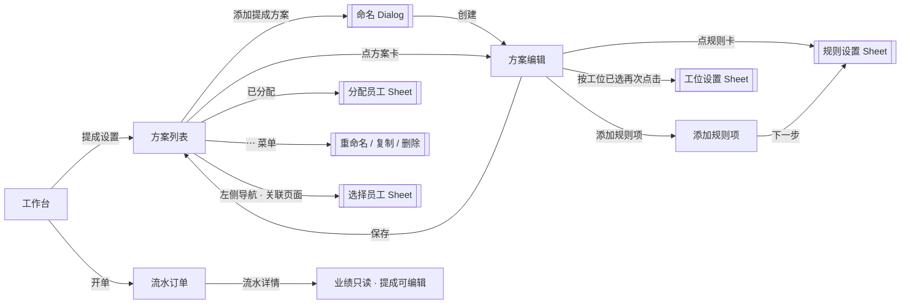

# PRD：提成设置 · 员工管理 · 员工薪资（独立原型 · 三链路）

| 字段 | 内容 |
|------|------|
| 交互原型（唯一可视依据） | 本目录 `index.html`（独立原型 · hub 三链路） |
| 画布 | 390 × 844 |
| 目的 | 供前端 / 后端 / 测试及 AI 工具落地独立原型全部功能；**只需本文 + 交互原型** |
| 关联（非必读） | 同目录 `PRD-项目创建与管理.md`（价目）；`PRD-会员卡管理.md`（卡模板） |

---

## 怎么读这份 PRD

正文按模块编排。**不用通读全文**，按角色跳章即可。

| # | 模块 | 前端 | 后端 | 测试 | 说明 |
|---|------|:----:|:----:|:----:|------|
| 1 | 背景 / 目标 / 范围 / 能力映射 | ✓ | ✓ | ✓ | 重构叙事、防范围蔓延 |
| 2 | 用户场景与成功标准 | ✓ | 了解 | ✓ | 测「业务对不对」 |
| 3 | 信息架构与页面清单 | ✓ | 了解 | ✓ | 做哪些页 |
| 4 | 状态机 | ✓ | **必看** | **必看** | 方案/规则块/编辑态/工位/分配 |
| 5 | 交互细则 / 异常流 | ✓ | 了解 | ✓ | 校验、toast、拦截 |
| 6 | 功能规格 | ✓ | 了解 | ✓ | 逐屏字段与跳转；§6.1–6.6 提成设置 · §6.11 员工管理 · §6.12 员工薪资 |
| 7 | 数据模型与接口约定 | ✓ | **必看** | ✓ | 字段、能力清单、时序 |
| 8 | 业务规则 | ✓ | **必看** | **必看** | 计提规则、多方案取高、业绩四部分、权限 |
| 9 | 文案清单与权限 | ✓ | 部分 | ✓ | 文案；角色权限矩阵 |
| 10 | 验收 P0 + 造数场景 | 了解 | 了解 | **必看** | Given→When→Then |
| 11 | 非功能（极简） | ✓ | ✓ | ✓ | |
| 12 | 交付物 | ✓ | — | ✓ | 仅 PRD + 原型 |
| 13 | **历史数据迁移** | 了解 | **必看** | **必看** | 结构必迁、不保证金额一致；阶梯暂不迁；结果弹窗 |

**先读这几条（贯穿全文）**

1. 本期为**新版提成设置**（原型「提成设置」），采用 **多方案** 模型：每个提成方案可整体分配给若干员工，方案内按「项目 / 产品 / 办卡 / 充卡 / **快速消费**」**5 项默认** + N 条**覆盖规则项**配置提成。**每人可分配多个提成方案**；开单计提时对该员工所属全部方案按**订单行**分别计算，**计算项重叠时取提成金额更高者**（并列按方案列表顺序先出现者胜出；见 §8）。不同行分别取高后可相加。**快速消费**在 UI 为第 5 张默认卡，数据上是系统项目覆盖项（`system: true`，`refId=quick`），不可删除。
2. **提成计算不再依赖旧「业绩设置」**：旧「业绩设置」功能（简单模式 / 进阶基础设置）**本期被完全移除**，工作台不再提供入口；其“按业绩计算提成”的旧口径一律废除。存量配置按 **模块 13** 折叠迁入新提成方案，保证迁移前后提成金额一致。
3. 系统内「业绩」与「业绩提成」**解耦**：业绩**只作为经营统计维度**，**不参与提成计算**，也**不可人工编辑**（见 §8 规则 16）。业绩统计金额口径为对应项的**开单原价（标价）加总**（不用实收）。展示分列：「员工薪资明细 · 业绩统计」与「员工业绩提成明细 · 月合计业绩」按支付方式 **现金 / 卡付 / 团购 / 签单**（签单 = 经理签单 + 记为欠款）；「提成统计」按提成设置 5 类（项目 / 产品 / 办卡 / 充卡 / 快速消费，项目列扣快消）。服务摘要 = 项目 + 快速消费（人次 / **实收**）；售卡摘要 = 办卡 + 充卡（数量 / **实收**，不含产品）。见 §6.10。
4. **流水订单 / 提成明细**：订单行「业绩」**只读**；「提成」可编辑（**店主 / 合伙人**），**保存即生效**，写入 `commEditLogs`（操作人 / 时间 / 前后值 / 原因选填）；**无**待确认 / 同意 / 驳回。覆盖页：开单流水详情、流水订单修改、项目流水修改、员工业绩提成明细（见 §6.8、§6.10、§8 规则 18–19）。
5. **提成生效时点**：开单（结算）时按员工所属方案自动计算提成并**写入订单行** `staffCommissions`；此后可在流水 / 业绩提成明细人工修正（有权限者，直接生效）。薪资侧「提成统计 / 提成分列」字段对齐提成设置 5 类，且 **「项目」列 = 项目类提成合计 − 快速消费提成**（快速消费另列；五列之和 = 提成总计）；详见 §6.10。
6. 每条提成规则的**提成范围**为支付方式多选：**现金 / 卡付 / 团购** 三类。范围外的支付方式对应订单行**不计提成**。
7. 原型工具栏「无数据 / 有数据」造数**仅演示**，不进正式产品。接口路径标 `【待联调确认】`，正式接口文档暂无交付时间；不臆造现网 URL。
8. 本期**仅单店**；旧「提成设置」中的**阶梯提成**方案 **完整保留并继续生效**（走旧阶梯引擎，不迁入新模型，见 §13.1）；旧**单项提成**按模块 13 迁为新方案。新老并存时：阶梯员工读旧引擎，已迁单项员工读新引擎。

交互行为与文案以 **本目录 `index.html`（及 `comm2.js`）当前表现** 为准。

---

# 模块 1　背景 / 目标 / 范围 / 能力映射
> 读者：前端 ✓ · 后端 ✓ · 测试 ✓

## 1.1 背景

旧提成为「阶梯比例」单方案模型，且提成计算依赖旧「业绩设置」产出的计算基数；「业绩设置」同时承担业绩口径配置，职责混叠、配置链路长，商户难以表达“不同分类、不同支付方式、不同工位”的差异化提成。

本期重构为**多方案提成设置**：

- **方案化**：一套提成规则即一个「提成方案」，可命名、复制、整方案分配员工；**每人可分配多个方案**，开单按行对多方案结果**取高**；适应多岗位（顾问 / 技师 / 销售）并存的门店。
- **规则块化**：方案内 5 项默认（项目 / 产品 / 办卡 / 充卡 / **快速消费**）+ 用户覆盖规则项（指定项目、产品、会员卡、整类分组）；快速消费在数据上为系统项目覆盖项。
- **口径独立**：提成基数 = 订单行**原价 / 实收**（按规则配置），不再经过旧「业绩设置」；旧「业绩设置」整体移除。
- **业绩解耦**：业绩按**原价加总**统计、只读、不参与提成；展示分列因页而异（支付方式或提成设置 5 类，见 §6.10）。
- **流水闭环**：开单自动写提成 → 流水详情可查看 / 人工修正（店主 / 合伙人）→ 改动留痕可审计。

## 1.2 目标

| 目标 | 说明 |
|------|------|
| 多方案并存 | 多套方案并存；**每人可分配多个方案**；同行重叠取金额更高者 |
| 规则可分层 | 5 项默认（含快速消费系统覆盖）+ 用户覆盖规则项 |
| 口径独立 | 计算基数（原价 / 实收）与支付范围（现金 / 卡付 / 团购）由规则自定，不依赖业绩设置 |
| 分配灵活 | 方案整体分配员工；工位（默认大 / 中 / 小工，可改名 / 删除，**不可新增**）参与按工位分配 |
| 业绩解耦 | 业绩按原价加总、只读、不参与提成；展示分列因页而异（支付方式或 5 类，见 §6.10） |
| 流水可审计 | 开单自动算提成写行；详情可查看，人工修正（店主 / 合伙人）留修改日志 |

## 1.3 本期做（In）

- 提成方案列表（新建 / 重命名 / 复制 / 删除；未分配员工提示）
- 方案编辑页：5 项默认规则卡（含快速消费）+ 覆盖规则项卡 + 「添加规则项」
- 规则设置 Sheet：提成范围（3 类支付方式）、计算基数（原价 / 实收）、分配模式（不分工位 / 按工位）、提成取值（按比例 % / 固定金额 ¥）、点客 / 散客参数（按工位时逐工位）
- 工位设置 Sheet：改名（恢复默认 / 确定）、删除（至少保留 1 个）；**不可新增工位**
- 添加规则项页：类型 Tab（项目 / 产品 / 会员卡）+ 分组筛选 + 多选（含整类分组）+ 已配置项禁用
- 分配员工 Sheet（员工池多选、全选、清空；已在其他方案者可勾选，副文为 **file-multiple 图标 + 方案名**（无「也在：」字面））
- 规则卡「固定」标签：提成参数=**固定金额**时，规则卡计算基数标签改显「固定」（`#A7E6A7`），忽略计算基数设置；提成参数统一在规则设置 Sheet 的「提成取值」分段中设置
- 左侧导航「**关联页面**」区域（位于「页面链路」与「文档」之间）+ 三个并列入口：「选择员工（3工位）」「选择员工（2工位）」「选择员工（1工位）」；共用灰底页 + Sheet（纯演示）
- 试算口径：示例订单行按员工方案集合计算提成（原型试算引擎）
- 流水订单 / 薪资关联口径（§6.8 / §6.10）：**规格保留（本系统现有页面）**
- 关联页面口径对齐：员工薪资明细（业绩统计 / 提成统计）、员工业绩提成明细（见 §6.10；非本包 UI）
- 工作台移除「业绩设置」入口；旧单项提成配置下线；**阶梯提成入口与方案保留并继续生效**
- **历史数据迁移（模块 13）**：业绩设置 + 单项提成 → 新提成方案；多层等价校验门禁通过后方可切换读路径
- 权限：`achCommSet` 仅店主 / 合伙人；流水提成编辑仅店主 / 合伙人
- **hub 链路二 · 员工管理**：员工列表（拖动排序；底栏「头衔管理」+「角色管理」；列表内「+ 创建员工」）/ **头衔管理** / **角色管理**（12 项敏感权限按角色配置）/ 员工详情 / 创建·编辑·完善员工；**头衔**与**角色**分离；敏感权限**完全跟随角色**（`EmployeeStore.roleSensitivePerms`），**无**个人覆盖；员工表单**无**敏感权限区
- **hub 链路三 · 员工薪资**：员工薪资列表 / **员工薪资明细** / 结算周期（发薪日）/ 员工业绩提成明细 / 设奖惩 / 奖惩明细；与提成设置 5 类及支付四格口径对齐（§6.12）
- **三链路数据联动**：`EmployeeStore.staff` 为员工权威源；员工表单「提成方案」写回 `Comm2Demo` 方案 `assigneeIds`；薪资列表与提成分配共用员工池

## 1.4 本期不做（Out）

- 员工薪资核算页的完整规格（**hub 链路三见 §6.12**；§6.10 为跨系统口径参考）
- 左侧导航「关联页面 · 选择员工（3/2/1 工位）」Sheet（**非 hub 三链路**，另文档或附录）
- 流水订单三页完整 UI（§6.8 / §6.10.3 保留口径参考，**不在本原型 hub**）
- 业绩排行 / 业绩报表（仅业绩四部分统计口径在本文定义）
- 多门店提成配置与同步（**本期仅单店**）
- 正式提成结算单 / 工资条打印
- 原型的「无数据 / 有数据」造数开关
- **阶梯提成迁入新模型**（本期仅保留旧引擎生效；新阶梯能力另期设计后再迁）
- 新提成规则块内「扣成本」一等公民字段（迁移用快照折叠；长期增强另期）

## 1.5 旧 → 新能力映射（不写废弃产品名）

| 旧体系常见能力（语义） | 新体系如何配置 |
|------------------------|----------------|
| 单一固定提成比例 | 多方案：每方案 5 项默认规则（项目 / 产品 / 办卡 / 充卡 / **快速消费**） |
| 按“业绩”计算提成 | 移除：提成基数由规则「原价 / 实收」直接定义，与业绩解耦；存量经 §13 公式折叠 |
| 业绩设置（高级+按项%） | 迁入各 RuleBlock 的 `baseMode` + 覆盖规则折算后的提成比例（见 §13） |
| 单项提成（点客/散客/%/¥/工位） | 迁入 `CatRule` / 按项 `overrides` |
| 阶梯提成 | **不迁移**；配置保留，结算继续走旧阶梯引擎 |
| 特殊项目单独提成 | 覆盖规则项：指定项目 / 产品 / 会员卡 / 整类分组 |
| 快速消费单独提成 | 第 5 项默认「快速消费」；数据为系统项目覆盖项（`ov_sys_quick`），不吃「项目」默认 |
| 按工位分别设提成 | 分配模式 = 按工位分配，逐工位设点客 / 散客参数 |
| 全体员工一套规则 | 方案 + 分配员工；**可一人多方案，重叠取高** |
| 流水改业绩 / 改提成 | 业绩只读；提成可改（店主 / 合伙人）且留修改日志 |

映射不足时以原型字段与行为为准；存量迁移细节以模块 13 为准。

---

# 模块 2　用户场景与成功标准
> 读者：前端 ✓ · 后端 了解 · 测试 ✓

## 2.1 角色

| 角色 | 说明 |
|------|------|
| 店主（默认） | 全部能力：配置提成方案、分配员工、编辑流水提成 |
| 合伙人 | 同店主（含 `achCommSet`、流水提成编辑） |
| 店长 | 无提成配置权限；不可编辑流水提成 |
| 高级店员 / 店员 | 无提成配置权限；不可编辑流水提成；业绩全程只读 |

## 2.2 核心场景

| 场景 | 用户期望 | 成功标准 |
|------|----------|----------|
| 新建提成方案 | 输入名称即建方案并进入编辑 | 列表出现新方案；未分配前“未分配” |
| 配 5 项默认提成 | 项目 / 产品 / 办卡 / 充卡 / 快速消费分别设范围、基数、分配、参数 | 各规则卡摘要正确；保存后列表摘要更新 |
| 覆盖指定项目 | 某项目单独给更高提成 | 覆盖规则卡在编辑页出现且优先级高于默认 |
| 覆盖整类分组 | 把价目某自定义分组整类设统一提成 | 分组内所有项目 / 产品命中该覆盖 |
| 按工位分配 | 大 / 中 / 小工分别设点客散客参数 | 规则卡显示逐工位参数；工位改名全局生效 |
| 分配员工 | 把方案分配给人，**可一人多方案** | 已在其他方案者可勾选并以图标+方案名提示；列表“已分配”显示人名 |
| 快速消费独立计提 | 快消不吃「项目」默认 | 命中系统覆盖 `ov_sys_quick`；不可删除 |
| 经理签单按基数计提 | 经理签单实收=0；按命中块 baseMode：原价计、实收不计 | 试算行可见；不走三类 payScope |
| 流水查看与修正 | 详情看业绩（只读）与提成 | 业绩不可编辑、无编辑 icon；提成可编辑（店主 / 合伙人）且留修改日志 |
| 店员看流水 | 可查看，但不可改提成 | 编辑被权限拦截并 toast |
| 薪资明细对齐 | 业绩 / 提成统计与提成设置口径一致 | 业绩按原价加总；提成分列 5 类且「项目」扣快速消费（§6.10） |

---

# 模块 3　信息架构与页面清单
> 读者：前端 ✓ · 后端 了解 · 测试 ✓

```
提成设置（多方案）
 ├─ 方案列表
 │    ├─ 标题栏：提成设置 · 帮助（多方案规则）
 │    ├─ 未分配提示条（还有 N 人未分配任何提成方案）
 │    ├─ 方案卡：图标 · 名称 · 已分配员工
 │    │         · 分配入口 · ⋯ 菜单（重命名 / 复制方案 / 删除）
 │    └─ 底部「+ 添加提成方案」/ 空态
├─ 方案编辑
│    ├─ 5 张默认规则卡（项目 / 产品 / 办卡 / 充卡 / 快速消费）
│    ├─ 覆盖规则项卡（可删除；不含系统快消）+「+ 添加规则项」
│    └─ 底部「保存」
├─ 添加规则项
│    ├─ 类型 Tab：项目 / 产品 / 会员卡
│    ├─ 分组轨（全部 / 自定义组）+ 全选 · 已选 N 项 · 反选
│    ├─ 列表（名称 + 价格 / 面值；已配置项灰底白勾禁用；整类分组可勾）
│    └─ 底部「取消 / 下一步(N)」
├─ 规则设置 Sheet（分类 / 覆盖 / 添加规则项共用；变体见 §6.3）
│    ├─ 全量（点标题 / 添加规则项）：范围 + 基数 + 分配 + 提成参数…
│    ├─ 参数精简（点提成参数区）：无范围/基数；含分配 + 提成取值 + 点客/散客
│    └─ 取消 / 确定
├─ 工位设置 Sheet
│    ├─ 工位行：名称 · 改名 / 删除；编辑态：输入 · 恢复为默认 / 确定
│    └─ 完成（**无新增工位**）
├─ 分配员工 Sheet：员工卡多选（也在其他方案可勾选并提示）· 全选 / 清空 · 已选 N 人 · 确定
├─ 关联页面（左侧导航区域）
│    ├─ 选择员工（3工位）：点客/散客 → 大/中/小工（全宽三按钮 morph）
│    ├─ 选择员工（2工位）：点客/散客 → 大工/小工（双按钮 morph，对齐点客/散客）
│    └─ 选择员工（1工位）：仅点客/散客即完成（逻辑等同未设工位）；共用灰底 `screen-comm2-staff`
└─ 弹层：方案命名 / 重命名、删除方案确认、未保存返回、帮助说明；覆盖删除为左滑/长按+撤销 toast（§5.5）
```

### 3.0 页面流（示意）



| 页面/层 | 导航标题（原型） | 说明 |
|---------|------------------|------|
| 方案列表 | 提成设置 | 帮助；未分配提示条；底部「+ 添加提成方案」 |
| 方案编辑 | {方案名} | 5 默认规则卡（含快速消费）+ 用户覆盖规则项 +「+ 添加规则项」；底部「保存」 |
| 添加规则项 | 添加规则项 | 类型 Tab / 分组轨 / 全选·反选 / 下一步 |
| 规则设置 | 分类名 / 覆盖名 / 添加规则项 · 设置 | 底部「取消 / 确定」 |
| 工位设置 | 工位设置 | 底部「完成」 |
| 分配员工 | 分配员工 | 底部「取消 / 确定」 |
| 选择员工（3工位） | 选择员工（3工位） | 共用灰底 + Sheet；点客/散客 → 大/中/小工 |
| 选择员工（2工位） | 选择员工（2工位） | 共用灰底 + Sheet；点客/散客 → 大工/小工（双按钮 morph） |
| 选择员工（1工位） | 选择员工（1工位） | 共用灰底 + Sheet；仅点客/散客，摘要无工位名 |
| 流水详情 | 流水详情 | 业绩 / 提成指标；修改记录入口 |

功能链路演示节点（FLOW_MAP「提成设置」）：`comm2-list` / `comm2-edit` / `comm2-pick` / `comm2-staff`（原型内嵌 FLOW_NAV 亦有 `comm2` 系列）；捕获深链 `?capture=comm2-advisor` 直开「顾问标准提成」编辑页。

实现路由建议（名称可调整）：`comm2-scheme-list` / `comm2-scheme-edit` / `comm2-rule-pick` / `comm2-rule-sheet` / `comm2-station-sheet` / `comm2-assign-sheet`。

> **注**：`comm2-staff-picker`（选择员工 3/2/1 工位）**不在 hub 三链路范围**，见 §6.7（参考）。

### 3.1 Hub 功能入口（`screen-hub`）

| 卡片 | FLOW 入口 | 说明 |
|------|-----------|------|
| 提成设置 | `comm2-list` | 方案列表为链路一首屏 |
| 员工管理 | `staff-list` | 员工列表为链路二首屏 |
| 员工薪资 | `staff-salary` | 薪资列表为链路三首屏 |

左侧桌面导航与 hub 卡片等价；每条链路内 `↓` 表示演示跳转顺序。

### 3.2 链路二：员工管理

```
员工管理
 ├─ 员工列表（screen-emp-list）
 │    ├─ 行：拖动柄 · 头像 · 姓名 · 状态 chip · 副文（性别·头衔）
 │    ├─ incomplete →「去完善」
 │    ├─ 列表内「+ 创建员工」（员工卡下方灰虚线描边红字；宽同卡片、间距 12px）
 │    ├─ 底栏双按钮：次要「头衔管理」+ 主要「角色管理」（标题栏无「职位管理」）
 │    └─ 长按拖动排序 · 点行 → 员工详情
 ├─ 头衔管理（screen-emp-roles）
 │    ├─ 头衔列表 · 添加 / 重命名 / 删除（≤6 字；被占用不可删）
 ├─ 角色管理（screen-emp-role-perms）
 │    ├─ 四角色：合伙人 / 店长 / 高级店员 / 店员（店主不出现）
 │    └─ 点行 → 角色权限编辑（screen-emp-role-perm-edit）：12 项敏感权限 Switch
 ├─ 员工详情（screen-emp-detail）→ 编辑员工
 ├─ 创建员工（formMode=create）：无状态；隐藏性别/年龄/年限；头衔/提成方案 sheet 空态可跳转
 ├─ 编辑员工（formMode=edit）：含状态；无敏感权限折叠区
 └─ 完善员工（formMode=refine）：顶栏提示 · 保存后 incomplete=false
```

**FLOW**：`staff-list` / `staff-roles` / `staff-role-perms` / `staff-role-perm-edit` / `staff-detail` / `staff-create` / `staff-refine`。

### 3.3 链路三：员工薪资

```
员工薪资
 ├─ 列表（screen-emp-salary）：全店合计 · 月份 · 结算周期 · 员工卡 2×2 提成
 ├─ 员工薪资明细（screen-emp-pay-detail）
 ├─ 结算周期（screen-emp-pay-cycle）
 ├─ 员工业绩提成明细（screen-emp-salary-detail）
 ├─ 设奖惩（screen-emp-rewards）
 └─ 奖惩明细（screen-emp-reward-detail）
```

**FLOW**：`staff-salary` / `staff-pay-detail` / `staff-pay-cycle` / `staff-salary-detail` / `staff-rewards` / `staff-reward-detail`。

### 3.4 三链路数据联动

| 数据 | 权威源 | 联动 |
|------|--------|------|
| 员工 | `EmployeeStore.staff[]` | 三链路共读；管理端写入后薪资、assigneeIds 同步 |
| 方案分配 | `Comm2Demo.assigneeIds` | 员工表单 ↔ 方案编辑「分配员工」 |
| 薪资周期 | `EmployeeStore.payCycle` | 列表月份 / 结算周期 / 明细共用 |
| 奖惩 | `EmployeeStore.rewards[month][]` | 设奖惩 / 明细 / 薪资摘要 |
| 敏感权限 | `EmployeeStore.roleSensitivePerms` | 角色管理维护；按员工 `perm` 只读解析；**无**个人覆盖；enforcement **【待联调】** |

---

# 模块 4　状态机
> 读者：前端 ✓ · 后端 **必看** · 测试 **必看**

## 4.1 方案生命周期

```
未保存草稿 ──保存──► 已保存方案 ──重命名──► 已保存（改名）
已保存 ──复制──► 新副本（未分配员工）
已保存 ──删除──► 移除（确认后）
```

| 状态 | 说明 |
|------|------|
| 草稿（`store._draft`） | 「添加提成方案」命名后进入编辑；保存后入列表顶部 |
| 已保存 | 进入编辑即持 `_snapshot`；未保存返回可还原 |
| 已分配 | `assigneeIds` 非空；员工**可**出现在多个方案 |
| 未分配 | `assigneeIds` 为空；列表「已分配：未分配」；计入未分配提示（不属于**任何**方案） |

## 4.2 编辑脏状态

- 进入编辑页对任一规则 / 覆盖 / 工位 / 范围等产生写入即置脏（`_dirty`）。
- 返回时若脏 → Dialog「尚未保存」「尚未保存，确定要返回吗？」「留在本页 / 不保存」。
- 选择「不保存」：草稿丢弃，或已保存方案还原为进入时快照（`_snapshot`）。
- 「保存」成功：toast「提成方案已保存」→ 回列表；快照更新。

## 4.3 规则块（默认 / 覆盖）内部状态

| 字段组 | 取值 | 说明 |
|--------|------|------|
| 提成范围 `payScope` | `{cash, memberCard, groupBuy}` 各布尔 | 至少选 1 类；取消最后 1 类被拦截 |
| 计算基数 `baseMode` | `list` 原价 / `paid` 实收 | 规则卡彩色标签「原价」「实收」；**当提成取值=固定金额时，该标签改显「固定」（`#A7E6A7`），忽略计算基数设置** |
| 分配模式 `pickMode` | `avg` 平均 / `station` 按工位 | 按工位时逐工位参数生效 |
| 提成取值 `valueMode` | `pct` 比例 / `amount` 固定金额 | 切换保留双字段（点客 / 散客）；**固定金额时规则卡计算基数标签显示「固定」** |

## 4.4 覆盖规则项（Override）

```
添加：选择目标（项目/产品/会员卡/整类分组）→ 设置 → 确定 → 写入 overrides，置脏
命中：订单行匹配 targets 之一即命中；多 target 命中同一行仍只计一次
删除：左滑 / 长按菜单立即移除 + 撤销 toast（§5.5），置脏；无确认 Dialog 主路径
```

- 覆盖规则的**优先级高于**默认规则（§8 规则 5 解析顺序）。
- 「已配置」判定：目标已被任何覆盖引用（或所属分组整类被引用）→ 添加规则项列表中**灰底圆白勾禁用**，不可再次添加。

## 4.5 工位

```
默认 3 工位：senior 大工 / mid 中工 / junior 小工
改名 ──► stationLabels 更新，全方案规则卡即时生效
删除 ──► 确认后移除；各规则卡上该工位参数一并清除；至少保留 1 个
不可新增工位
```

- 删除确认文案：「删除后，各规则卡上该工位的提成参数将一并清除，确定删除？」。
- 改名输入 maxlength 4；空名 toast「名称不能为空」；「恢复为默认」在已是默认名时禁用。
- 按工位模式下，订单行工位缺失或已删：取方案 `stationIds` **首个工位**对应参数；若该工位参数块亦不存在 → `defaultPair()`（§8 规则 7）。
- **不可新增**：工位设置 Sheet 无「+ 新增工位」入口。

## 4.6 分配状态

- 员工池 = 开单员工池（`EmployeeDemo.getBillingStaffPool`；回退内置 st1–st5）。
- **多方案可并存**：同一员工可出现在多个方案的 `assigneeIds`；分配 Sheet 不灰显禁用，副文为图标 + 其他方案名（`aria-label` 含「也在其他方案」）。
- 分配 Sheet：全选勾选当前可见员工池全部人；确定直接写回本方案 `assigneeIds`（不校验互斥）。
- 进入列表时**不再**做一人一方案自动清洗。
- 未分配 = 员工池中不属于任何方案的员工；列表顶部提示「还有 **N** 人未分配任何提成方案」，点击查看名单 Dialog。
- 确定后 toast「已分配 N 人」或「已清空分配」。

## 4.7 流水订单指标状态

| 指标 | 状态 |
|------|------|
| 业绩 | **只读展示**；不再可编辑 |
| 提成 | 可编辑（店主 / 合伙人权限）；改动写订单行并记录修改日志 |

---

# 模块 5　交互细则 / 异常流
> 读者：前端 ✓ · 后端 了解 · 测试 ✓

## 5.1 通用

- 返回：列表返回工作台；编辑页返回列表（脏则拦截）；子层逐级返回。
- 金额 / 比例输入：走**金额键盘**（`amountKeypad`，`input-amount` 类）；不得弹系统数字键盘。
- 文本：方案名称 ≤ **20** 字；工位名 ≤ **4** 字（原型 maxlength=4；工位映射帮助文案提示最多 3 字以原型为准）。
- 比例范围：点客 / 散客比例 **0–100%**；固定金额 **≥ 0**。

## 5.2 校验失败（Toast）

| 条件 | 提示 |
|------|------|
| 方案名称为空（新建 / 重命名） | 请输入方案名称 |
| 规则点客比例无效（非数字 / <0） | 请输入有效的点客比例 |
| 规则散客比例无效 | 请输入有效的散客比例 |
| 固定金额模式点客金额无效 | 请输入有效的点客金额 |
| 固定金额模式散客金额无效 | 请输入有效的散客金额 |
| 比例 > 100% | 比例需在 0–100% |
| 取消某块最后一个支付方式 | 至少选一种支付方式 |
| 保存时某默认类范围为 0 | 「{类名}」至少选一种支付方式 |
| 保存时某覆盖范围为 0 | 覆盖规则「{标题}」至少选一种支付方式 |
| 工位改名后为空 | 名称不能为空 |
| 工位数已达上限新增 | 最多 5 个工位 |
| 权限不足（编辑流水提成） | 当前为「{角色}」，无法修改提成（以原型文案为准） |

## 5.3 拦截与确认

| 时机 | 行为 |
|------|------|
| 返回未保存编辑页 | Dialog「尚未保存」；留在本页 / 不保存 |
| 删除方案 | Dialog「确认删除该方案？」「删除后不可恢复。」 |
| 删除覆盖规则项 | 无确认 Dialog：左滑 / 长按菜单直接删 + 撤销 toast（§5.5） |
| 删除工位 | confirm「删除后，各规则卡上该工位的提成参数将一并清除，确定删除？」 |
| 编辑流水提成（权限不足） | toast 拦截，数据不变 |
| 点击已配置（灰底白勾）规则目标 | 不可点击（disabled） |

## 5.4 空态

| 页面 | 空态文案 |
|------|----------|
| 方案列表无方案 | 还没有提成方案 / 点下方按钮添加 |
| 添加规则项某分类无内容 | 该分类下暂无内容 |
| 添加规则项列表无分组 | 分组轨隐藏（仅「全部」） |

---

## 5.5 覆盖规则删除（左滑 / 长按 + 撤销）

> 以独立原型为准；**无**「确认删除该规则项」主路径 Dialog。

| 方式 | 行为 |
|------|------|
| **左滑** | 用户覆盖卡外层 `.comm2-rule-swipe`；向左滑超阈值（约卡片宽 40% 或快速甩出）→ 飞出动画 → 立即从 `overrides` 移除 |
| **长按** | 长按约 480ms → 卡片右侧下拉菜单「删除」→ 立即移除 |
| **撤销** | toast「已删除规则项」+「撤销」按钮，约 **2.5s**（`RULE_UNDO_MS`）；点击撤销按原索引插回；超时后不可撤销 |
| **系统项** | 快速消费（`system`）不可删；无删除菜单 / 左滑宿主 |

- 撤销栈：原型保留**最近一次**删除；连续删除后仅最后一次可撤销。
- 离开编辑页（不保存 / 保存成功回列表）后撤销栈清空。
- 手势进行中消费 click，避免误开 Sheet；与卡面胶囊点击互斥（胶囊 `pointerdown` 不启动手势）。


# 模块 6　功能规格
> 读者：前端 ✓ · 后端 了解 · 测试 ✓

下列字段、按钮、跳转均须与原型一致；视觉以原型为准（规则卡两行布局见 §6.2；基数为连体段控选中莫兰迪橙 `#E89D64`；范围为独立 chip 圆角 8px、高度 26px 对齐基数、选中品牌描边；固定金额时基数区只读「固定」灰标）。

## 6.1 方案列表

**结构**

- 标题栏：返回 ·「提成设置」· 帮助（多方案规则）。
- 未分配提示条（`comm2UnassignedTip`）：存在未分配员工时显示「还有 **N** 人未分配任何提成方案」+ 右侧 chevron；点击弹 Dialog 列出名单；无未分配时隐藏。
- 方案卡（`emp-comm-card`）：
  - 主区：图标（提成图）· 方案名称 · 提成规则摘要「5 项默认」或「5 项默认 · N 条覆盖」。
  - 分配行：「已分配」+ 员工名（` · ` 连接；空为「未分配」）。
  - ⋯ 菜单（`comm2MenuMask`）：重命名 / 复制方案 / 删除；取消在 foot。
- 底部：品牌红「+ 添加提成方案」（→ 命名 Dialog）。
- 空态：还没有提成方案 / 点下方按钮添加。

**菜单动作**

| 动作 | 行为 |
|------|------|
| 重命名 | Dialog「重命名方案」，预填当前名；确定 toast「方案已重命名」 |
| 复制方案 | 生成「{原名} 副本」，`assigneeIds` 清空；toast「方案已复制」 |
| 删除 | Dialog「确认删除该方案？」；确认 toast「方案已删除」 |

## 6.2 方案编辑

- 标题 = 方案名。
- 卡片区：5 张默认规则卡（项目 / 产品 / 办卡 / 充卡 / 快速消费）+ 用户覆盖规则项卡 + 底部「+ 添加规则项」。
- 交互分区见下；覆盖删除见 §5.5。
- 底部「保存」：校验全部默认 / 覆盖范围 ≥1 类 → toast「提成方案已保存」→ 回列表。

### 6.2.1 规则卡布局总则（对齐原型）

规则卡为**两行结构**（默认左竖条品牌色；覆盖 `#FF8A3D`；用户覆盖外包左滑容器）：

```
┌─▌ 标题（≤6 字完整）                      [原价|实收] 或「固定」 ┐
│   点客 10%  散客 10%                [现金][卡付][团购]（单行） │
└─▌                                                              ┘

按工位时参数竖排三行：
┌─▌ 标题                                   [原价|实收]
│   大工 15%·12%                      [现金][卡付][团购]
│   中工 12%·10%
│   小工 8%·8%
└─▌
```

| 行 | 左 | 右 |
|----|----|----|
| **行1** | 标题（图标+文案） | 右侧定宽 **120px** 内：原价/实收连体段控（或「固定」）；**无**「基数」文字标签 |
| **行2** | 提成参数；按工位时大工/中工/小工各占一行；`flex:1` 不压右侧；**参数区左缘与标题图标左缘对齐** | 右侧定宽 **120px**；三 chip 均分单行；与参数间距 ≥10px，**禁止重叠** |

| 热区 | 行为 |
|------|------|
| 标题 | 打开**全量**规则设置 Sheet（含范围、基数） |
| 提成参数区 | 打开**参数精简** Sheet（**无**范围、基数；含分配模式 + 提成取值 + 点客/散客等） |
| 基数段控 | **整段任意点击**切换 `list` ↔ `paid`（置脏）；固定金额时只读「固定」 |
| 范围 chip | 卡面多选切换 `payScope`（至少 1 类，否则 toast）；三 chip **同一行** |
| 比例/固定 | **仅在 Sheet**「提成取值」切换 |

### 6.2.2 标题

| 规则 | 说明 |
|------|------|
| 结构 | 分类图标 + 标题；覆盖为多目标「、」连接 |
| ≤6 字 | **必须完整显示**（`min-width: 6em`；不加省略类） |
| >6 字 | 至少保留约 6 字宽 + `…`（`is-ellipsis`）；`title` 属性含全文 |
| 计字 | 中英数标点各计 1（`Array.from` 码点） |

### 6.2.3 提成参数展示

| 规则 | 说明 |
|------|------|
| 短标 | 不分工位：全称「点客」/「散客」；按工位：工位全称「大工」/「中工」/「小工」（**不再取首字**；自定义工位名亦用全称） |
| 对齐 | 参数区左缘与标题图标左缘对齐（**勿**按标题文字缩进） |
| 数值 | 字号加大、主文字色；比例带 `%`，固定带 `¥`；工位段为 `值·值` |
| 按工位 | **竖排三行**；范围 chip 相对参数区整体**中轴对齐**；不与范围横向重叠 |
| 不分工位 | 「点客」「散客」横排于行2左侧 |

### 6.2.4 控件样式

| 控件 | 样式 |
|------|------|
| 基数段控 | 连体胶囊；选中白底 + 字色 `#E89D64`；**整段点击切换**；卡面**无**「基数」文案 |
| 范围 chip | 独立圆角 **8px**、高 **26px**、字号 11px；卡面**无**「范围」文案；右侧槽 **120px**、三 chip 均分**强制单行**；与参数区有间距、不重叠；未选灰底灰边；选中品牌描边 + 浅粉底 + 品牌字 |
| 固定金额 | 基数区只读灰标「固定」 |

### 6.2.5 覆盖规则卡

| 项 | 说明 |
|----|------|
| 删除 | 左滑飞出或长按菜单（§5.5）；**无**右侧垃圾桶主路径 |
| 系统快消 | 不可删、无左滑宿主 |

## 6.3 规则设置 Sheet（分类 / 覆盖 / 添加规则项共用）

Sheet 分两种变体（同一 `comm2CatSheetMask`）：

| 变体 | 入口 | 含范围/基数 | 其他区 |
|------|------|:-----------:|--------|
| **全量** `full` | 点规则卡**标题**；「添加规则项 · 设置」 | ✓ | 分配模式 + 会员卡（覆盖卡时）+ 提成取值 + 点客/散客（+工位） |
| **参数精简** `params` | 点规则卡**提成参数区** | ✗ | 分配模式 + 会员卡（覆盖卡时）+ 提成取值 + 点客/散客（+工位）；标题后缀「· 提成参数」 |

| 区 | 控件 | 说明 |
|----|------|------|
| 提成范围 | chips 多选（现金 / 卡付 / 团购） | 仅全量；至少 1 类 |
| 计算基数 | 分段：原价模式 / 实收模式 | 仅全量；固定金额时卡上仍显「固定」 |
| 分配模式 | 分段：不分工位 / 按工位分配 | 按工位已选中时**再次点击** → 工位设置 Sheet |
| 会员卡 | 分段：办卡 / 充卡 | **仅**覆盖规则且目标为会员卡时显示 |
| 提成取值 | 分段：按比例 % / 固定金额 ¥ | 切换保留双字段 |
| 点客 / 散客 | 双输入框 | 不分工位一组；按工位每工位一组 |

标题：默认分类为类名；覆盖为覆盖标题；添加规则项为「添加规则项 · 设置」。取消 / 确定在 foot。

**确定（默认 / 覆盖）**：校验输入 → 写回块 → toast「已更新规则」→ 关 Sheet → 重绘卡片并高亮该卡（flash）。
**确定（添加规则项）**：见 §6.5。

## 6.4 工位设置 Sheet

| 控件 | 行为 |
|------|------|
| 工位行（非编辑态） | 工位名 + 「改名」/「删除」（仅 1 个工位时删除禁用） |
| 工位行（编辑态） | 输入框（maxlength 4，聚焦全选）+「恢复为默认」（已是默认名禁用）/「确定」 |
| 新增工位 | **本期不可新增**（无入口） |
| 完成 | 关 Sheet，回到规则设置 / 编辑页 |

改名 / 删除后：重绘工位 Sheet、编辑卡片，若规则 Sheet 打开则刷新其参数区。

## 6.5 添加规则项

**入口**：编辑页「+ 添加规则项」。

**页面**：
- 类型 Tab：**项目 / 产品 / 会员卡**（默认项目）。
- 分组轨：全部 + 自定义分组（会员卡为卡分组），无分组时隐藏。
- 工具行：全选 · 已选 N 项 · 反选。
- 列表项：名称 + 副行（项目 / 产品为价格 `¥x`；会员卡为「面值 ¥x」/「已下架」）。
- 整类行：当前分组顶部「整类 · {组名}」可整体勾选。
- 已配置项：**灰底圆 + 白勾**（`is-configured`），disabled，不可选；被整类覆盖涵盖的单项目同样禁用。
- 底部：取消 / **下一步（N）**（N=已选数；为 0 时禁用）。

**交互**：
- 勾选单项：互斥清理——勾选单项时，移除覆盖它的整类组勾选；勾选整类组时，移除组内单项勾选。
- 会员卡类型下，勾选时带当前 `cardRole`（办卡 / 充卡在下一步设置 Sheet 中可切）。
- 「下一步」→ 规则设置 Sheet（标题「添加规则项 · 设置」）→ 确定 → 生成覆盖规则项写入 `overrides`，toast「已添加规则项」→ 回编辑页。

**覆盖项数据**：`targets` 保存目标（kind / refId / name；整类为 `group` + `groupKind`；会员卡带 `cardRole`）；标题 = 目标名以「、」连接。

## 6.6 分配员工 Sheet

- 员工池多选；全选 / 清空；已选 N 人；确定写回 `assigneeIds`。
- **一人可多方案**：不灰显禁用。
- 若员工已在其他方案：副文展示 **file-multiple 图标**（`assets/icons/file-multiple.svg`，12×12，字色 `#C4795A`）+ 其他方案名（`、` 连接）；`aria-label` 为「也在其他方案：…」。
- 未在其他方案：副文为头衔文案。

## 6.7 关联页面 · 选择员工 Sheet（3 / 2 / 1 工位）

> **范围**：**不在 hub 三链路**（左侧导航「关联页面」仅演示）。与提成方案编辑无数据联动。

左侧导航「**关联页面**」区域中三个并列入口，与提成方案编辑链路无数据联动，**仅作关联功能演示**。三者**共用**灰底页 `screen-comm2-staff` 与同一 Sheet 壳，按入口切换 `stationMode`。

**入口**：
| 导航 | flow | 工位步 |
|------|------|--------|
| 选择员工（3工位） | `comm2-staff-3` | 点客/散客 → **大工 / 中工 / 小工**（全宽三按钮） |
| 选择员工（2工位） | `comm2-staff-2` | 点客/散客 → **大工 / 小工**（双按钮，morph 宽度对齐点客/散客） |
| 选择员工（1工位） | `comm2-staff-1` | **仅**点客/散客即完成（逻辑等同未设工位，不出工位面） |

**页面宿主**：先切灰底页（`#F7F7F7`），再开 Sheet；不叠在方案列表/编辑上。关闭后回进入前页面。

**Sheet 结构**：标题随版本（「选择员工（N工位）」）；5 名演示员工（含头像）；初始全部未选；底部「完成」。

**交互动效**（卡片 morph 自开单页；2 工位 role 面按双按钮宽展开）：
- 点卡片 → `is-pinching` → `is-expanding` → 「点客 / 散客」；scrim 可取消。
- **3 / 2 工位**：选点客/散客后再 morph 出工位按钮；选中后摘要「点客·大工」等。
- **1 工位**：选点客/散客后直接选中，摘要仅「点客」或「散客」。
- 已选卡片「✕」可清除。

**行为**：「完成」→ toast「已选 N 人」→ 关 Sheet → 回进入前页面；遮罩同；不与 `assigneeIds` 联动。

## 6.8 流水订单：业绩只读 + 提成编辑

> **本系统现有页面**：下列规格约束本系统流水页；本目录 `index.html` 不含完整流水 UI。

**范围**（工作台路径）：
- 流水订单 → 门店流水 → **开单流水详情**
- 流水订单 → 门店流水 → **流水订单修改**
- 流水订单 → 门店流水 → 流水订单修改 → **项目流水修改**

以及流水详情 / 编辑项内员工指标行（与 §6.10.3 配图一致）。

| 指标 | 行为 |
|------|------|
| 业绩 | **只读**：不可点、不可改；**去掉**表示可编辑的铅笔 / 编辑 icon；样式不得暗示可点（如可编辑胶囊态） |
| 提成 | 可点金额键盘编辑；**仅店主 / 合伙人**；每次修改写订单行 `staffCommissions` 并追加修改日志 |

- 开单流水详情展开员工行：可见「现金类」等支付标签旁的「业绩 / 提成」并排胶囊；业绩只读、提成可点（本期**不改**行头「现金类」等支付标签文案，另单处理）。
- 流水订单修改：卡片可保留「编辑」入口进入项目流水修改；卡片上业绩胶囊不可点、无编辑暗示。
- 项目流水修改：业绩行去掉铅笔 icon 并禁止改值；提成行保留铅笔 icon 与编辑能力。
- 修改日志：复用流水现有修改记录（`editLogs`，结构 `{id, time, operator, summary}`）；提成改动时 `summary` 记「修改提成：{旧值}→{新值}」，`operator` 取当前登录员工，`time` 取当前时间；流水详情「修改记录 · N」/「修改订单 · 查看」入口可查看。
- 权限不足（店长 / 高级店员 / 店员）点击提成：toast 拦截，值不变。
- 原型流水编辑提示文案「…再为项目设置服务人与业绩」中“业绩可设置”表述与本期“业绩只读”不符，随本期调整为仅提及成（最终文案以原型联调为准）。

## 6.9 帮助弹窗（原型文案）

| 弹窗 | 内容 |
|------|------|
| 多方案规则（列表页帮助） | ①每人可分配多个提成方案（已在其他方案以图标+方案名提示，仍可勾选）；②计算项重叠按行取金额更高者（并列按列表顺序）；③按行过滤支付范围；④方案内覆盖优先；⑤不同业务行分别取高后可相加 |
| 计算基数说明（规则 Sheet「原价模式」旁） | 原价模式：范围内开单（项目、产品、会员卡开卡、快速消费、商城订单、充卡/续次/延期）按**原价**加总作基数（快速消费原价=实收；商城按订单原价；充卡/续次/延期按原价）；实收模式：范围相同，按**实收金额**加总 |
| 分配模式说明 | 不分工位：开单无需选工位，按点客 / 散客统一提成；按工位分配：按大 / 中 / 小工分别设置提成 |

## 6.10 关联页面变更（薪资 / 流水 · 对齐提成设置）

> **本系统现有页面**：本章约束本系统薪资 / 流水关联页；配图见 `assets/related/`。本目录原型仅演示提成方案配置。薪资页完整交互另模块；**此处仅锁定口径与字段对齐**。

### 6.10.0 通用口径

| 概念 | 口径 |
|------|------|
| 业绩金额 | 对应分类 / 分列项的**开单原价（标价）加总**；**不用实收**；与提成设置「原价模式」的标价定义一致 |
| 业绩与提成 | 业绩只读、不参与提成计算；提成来自订单行 `staffCommissions`（开单自动算 + 有权限人工修正） |
| 提成分列 5 类 | **项目 / 产品 / 办卡 / 充卡 / 快速消费**（对齐提成设置默认卡） |
| 「项目」提成净值 | **项目列展示值 = 项目类提成合计 − 快速消费提成**；「快速消费」单独成列；**五列之和 = 提成总计**（不加总两次） |
| 「项目」业绩（5 类场景） | **项目列 = 项目类原价合计（不含快速消费）**；快速消费单独成列；**五列之和 = 业绩总计** |
| 提成展示实时生成 | **页面展示的「当前提成」数值（薪资卡提成分列 / 提成统计 / 月合计提成 / 流水行提成）必须实时按订单行 `staffCommissions` 与方案规则计算生成**，供展示查看；不得使用静态快照 / 缓存快照或预置数值 |

### 6.10.1 工作台 → 员工薪资 → 员工薪资明细

**入口**：员工薪资列表 → 点员工卡；顶栏次级「业绩提成明细」进入逐笔页。

| 区块 | 规格 |
|------|------|
| 身份与月份 | 头像 + 姓名 + 头衔；月份 pill（与列表同周期） |
| 薪资卡 | 当月合计 = 基本 + 提成总计 + 奖惩净额；三列展示基本 / 提成 / 奖惩 |
| 业绩统计 | **总计** + 横向比例条：**现金 / 卡付 / 团购 / 签单**（签单 = 经理签单 + 记为欠款）；金额 = **原价加总** |
| 提成统计 | **总计** + 横向比例条：**项目 / 产品 / 办卡 / 充卡 / 快速消费**；项目列扣快消；五列之和 = 提成总计 |
| 服务 / 售卡 | 服务 = 项目 + 快速消费（人次 + **实收**金额）；售卡 = 办卡 + 充卡（数量 + **实收**，**不含产品**） |
| 奖惩 | 最近 5 条；**无「查看全部」**；整卡点击 → 奖惩明细 |
| 列表页配套 | 删「生效中」；卡面「合计」左置 + 提成 2×2（项目 / 产品 / 办卡·充卡 / 快速消费，无进度条）；结算周期页结算日/发薪日均可 **1–31**（当月无该日则 clamp 月末；仅店主/合伙人可改发薪日） |

### 6.10.2 工作台 → 员工薪资 → 员工业绩提成明细

| 区块 | 规格 |
|------|------|
| 月合计 · 业绩 | 与 §6.10.1 一致：现金 / 卡付 / 团购 / 签单（原价） |
| 月合计 · 提成 | 与 §6.10.1 一致：五类（项目扣快消） |
| 日列表 | 日期头：业绩 / 提成；行：时间 · 名称 · 业绩 · 提成；有改动显示「改」标记可开修改记录 |
| 编辑 | 店主/合伙人改**提成**保存即生效；业绩只读；原因选填；无待确认筛与同意/驳回 |
| 视角（正式产品） | **无标题栏「员工视角 / 店主视角」切换**。页面按登录身份自动落位：店主 / 合伙人进入本页时固定为店主视角（可改提成）；员工进入本页时固定为员工视角（只读，可查看修改记录）。两端互不串视。 |

> **原型演示说明（非交付范围）**：交互原型标题栏右侧的「员工视角 / 店主视角」切换，**仅供演示联调时对照两端差异**，正式开发页面**不得**提供该入口。正式产品中：店主、合伙人始终看到店主视角的本页；员工始终看到员工视角的本页。

### 6.10.3 工作台 → 流水订单 → 门店流水（三页）

**配图**：
- 开单流水详情（收起态）：`assets/related/MuMu-20260828-100043-464.png`
- 开单流水详情（展开员工业绩 / 提成）：`assets/related/MuMu-20260828-172659-652.png`
- 流水订单修改：`assets/related/MuMu-20260828-100802-339.png`
- 项目流水修改：`assets/related/MuMu-20260828-101035-436.png`

| 页面 | 变更 |
|------|------|
| 开单流水详情 | 展开员工行后出现「现金类」+「业绩」+「提成」并排区：业绩**只读**（无铅笔 / 无编辑暗示）；提成**可编辑**（店主 / 合伙人）；行头支付标签文案本期不改 |
| 流水订单修改 | 卡片上业绩胶囊只读、不可点；可保留「编辑」进入项目流水修改；提成仍可经编辑链路修改 |
| 项目流水修改 | 业绩行**删除铅笔 icon**并禁止输入；提成行保留铅笔 icon 与编辑；「指定」开关等其他控件不变 |

行为细则与权限、修改日志同 §6.8。

> **hub 原型说明**：§6.10.1 / §6.10.2 口径已并入 **§6.12**（以 `index.html` 为准）。§6.8 / §6.10.3 流水页**不在 hub**，保留作跨系统参考。

## 6.11 员工管理（hub 链路二）

> 屏幕 id 前缀 `screen-emp-*`；逻辑见 `employee.js` + `staff-fragment.html`。

### 6.11.0 术语

| 字段 | 原型文案 | 说明 |
|------|----------|------|
| 头衔 | 原「职位」；用户可见一律「头衔」 | 展示用岗位名（美容师等）；**头衔管理**维护，≤6 字；sheet 标题「选择头衔」 |
| 角色 | 原「权限」 | 五档：`店主` / `合伙人` / `店长` / `高级店员` / `店员`；敏感权限完全跟随角色配置 |
| 提成方案 | — | 单选；写回 `Comm2Demo` 对应方案 `assigneeIds` |

### 6.11.1 员工列表

| 元素 | 规格 |
|------|------|
| 行内容 | 拖动柄 · 头像 · 姓名 · 状态 chip（在岗/休假/离职）· 副文「性别·头衔」 |
| 去完善 | `incomplete=true` 时行尾显示，进 `formMode=refine` |
| 排序 | 长按行进入拖动；松手提交顺序至 `EmployeeStore.staff` 数组顺序 |
| 点击 | 进入员工详情 |
| 「+ 创建员工」 | 列表内、员工卡**下方**：灰虚线描边 + 红字；宽度同员工卡；与上一卡间距 **12px**（**不在**标题栏） |
| 底栏 | 双按钮：次要「头衔管理」→ `screen-emp-roles`；主要「角色管理」→ `screen-emp-role-perms` |
| 标题栏 | **无**「职位管理」/「头衔管理」入口 |

### 6.11.2 头衔管理（`screen-emp-roles`）

- 标题「**头衔管理**」；列表展示全部头衔；支持添加、重命名、删除。
- 名称 ≤6 字；已有员工使用的头衔不可删除（toast 拦截）。
- 唯一头衔（如「店主」）占用规则以原型 `uniqueRole` 为准。

### 6.11.3 角色管理（`screen-emp-role-perms` / `screen-emp-role-perm-edit`）

- **列表页** `screen-emp-role-perms`：仅展示 **合伙人 / 店长 / 高级店员 / 店员**（**店主不出现**）；行副文「敏感权限 · 12 项」。
- **编辑页** `screen-emp-role-perm-edit`：维护该角色 12 项敏感权限 Switch；保存写入 `EmployeeStore.roleSensitivePerms[角色名]`。
- **生效**：员工敏感能力**完全跟随**其 `perm`（角色）在 `roleSensitivePerms` 中的配置；**废除** `staff.sensitivePerms` 个人覆盖；改角色即改读路径，无需个人表单。
- 12 项 key / 标签 / 关闭语义同下表（与旧个人 Switch 表一致，仅存储位置变更）：

| key | 标签 | 关闭时语义（产品） |
|-----|------|-------------------|
| staffLogin | 员工端登录 | 不可登录员工端 App；账号仍可由店主端管理 |
| memberPhoneView | 查看顾客手机号 | 中间四位打码 |
| memberStatsView | 查看会员数及办卡明细 | 含看板、办卡/充卡流水、经营报表 |
| customerListView | 查看客户列表 | 与会员统计**独立**控制 |
| cardRefund | 退卡 | 不可退卡 |
| billVoid | 单据作废 | 含挂单作废；作废后业绩/提成回滚 |
| cardOps | 卡相关操作（办卡/充卡） | 办卡/充卡/续次/延期（不含退卡） |
| orderHold | 挂单 | 不可创建或操作任何挂单 |
| viewOthersBill | 查看他人开单 | 本店全部员工开单/流水只读 |
| cashierBill | 收银开单 | 不可进入收银台并完成结账 |
| debtManage | 欠款/还款 | 不可登记欠款与收款还款 |
| viewOthersPerf | 查看他人业绩 | 仅可看本人；**改提成仍仅店主/合伙人/店长** |

**各角色初始默认**（角色管理可改写；店主逻辑全开但不进本列表）：

| 角色 | 默认关闭项 | 默认开启 |
|------|------------|----------|
| 店主 | — | 全部（不进角色管理） |
| 合伙人 | 查看他人业绩 | 其余 11 项 |
| 店长 | 查看顾客手机号、查看他人业绩 | 其余 10 项 |
| 高级店员 | 查看顾客手机号、查看会员数及办卡明细、查看他人开单、欠款/还款、查看他人业绩 | 其余 7 项 |
| 店员 | 除下述 5 项外全部关闭 | 员工端登录、查看客户列表、卡相关操作、挂单、收银开单 |

> **enforcement**：角色级存储与 UI 本期完成；与各业务模块耦合 **【待联调确认】**。

### 6.11.4 创建 / 编辑 / 完善员工（`screen-emp-form`）

| 字段 | 创建 | 编辑 | 完善 |
|------|:----:|:----:|:----:|
| 头像 / 剑号 / 宝剑 | ✓ | ✓ | ✓ |
| 员工姓名* / 手机号* | ✓ | ✓ | ✓ |
| 性别 / 年龄段 / 从业年限 | 隐藏 | 平铺 | 平铺 |
| 头衔* / 角色* | ✓ | ✓ | ✓ |
| 提成方案 / 基本工资* | ✓ | ✓ | ✓ |
| 状态 | 隐藏（固定逻辑在岗） | ✓ | ✓ |
| 敏感权限 | **不显示**（三态均无折叠区） | — | — |

**校验**：姓名 ≤20 字；手机号 11 位大陆号；基本工资 0–999,999.99；新建不可选「店主」；本店已有店主时不可把他人改为店主。

**空态（创建）**：头衔 sheet / 提成方案 sheet 无数据时提示空态，并提供跳转入口（「去头衔管理」/ 去提成方案等，以原型为准）。

**保存**：创建 push 新 `staff`；编辑/完善 `Object.assign`；同步 `assigneeIds`；完善成功 `incomplete=false`；**不写** `sensitivePerms`。

### 6.11.5 权限说明（helpLines）

角色选择 / 说明弹层仍用各角色 **helpLines** 能力文案（`PERM_DEFS.helpLines`）。**可与**角色管理 12 项敏感权限**不同步**（helpLines 描述广义能力，不要求与 Switch 一一对应）。

| 约束 | 说明 |
|------|------|
| 合伙人 | 能力含**查看顾客手机号**（helpLines / caps 均体现） |
| 店员 | helpLines **不再**写「不能延期卡」 |
| 其余 | 沿用旧能力文案（开单结算、价目/卡项、创建员工等） |

### 6.11.6 员工详情

- 只读展示头像、基础字段、提成方案名等；「编辑」→ `formMode=edit`。
- 离职等危险操作走确认 Dialog（以原型为准）。

---

## 6.12 员工薪资（hub 链路三）

> 屏幕 id `screen-emp-salary` 等；以当前 `index.html` 实现为准。

### 6.12.0 通用口径（与 §6.10.0 一致）

| 概念 | 口径 |
|------|------|
| 业绩金额 | **开单原价加总**；不用实收 |
| 业绩 | 只读、不参与提成计算 |
| 提成分列 | 项目 / 产品 / 办卡 / 充卡 / 快速消费；**项目列 = 项目类提成 − 快速消费提成** |
| 业绩分列（明细/提成页） | 现金 / 卡付 / 团购 / **签单**（经理签单 + 欠款） |
| 服务 / 售卡摘要 | 服务 = 项目+快消（人次/**实收**）；售卡 = 办卡+充卡（数量/**实收**，不含产品） |
| 提成修改 | 店主/合伙人/店长可改提成；**保存即生效**；`commEditLogs` 留痕；**无**待确认流 |

### 6.12.1 员工薪资列表

| 区块 | 规格 |
|------|------|
| 顶部 | **删「生效中」整块**；全店合计薪酬 + 月份 pill + 结算周期入口（摘要含发薪日） |
| 员工卡 | 左：头像+姓名；**合计**金额左置同行；下：**2×2 提成四格**（项目/产品/办卡·充卡/快速消费），无进度条 |
| 点击卡 | → **员工薪资明细**（非直达业绩提成明细） |
| 设奖惩 | 列表标题栏入口 → `screen-emp-rewards` |

### 6.12.2 员工薪资明细（`screen-emp-pay-detail`）

| 区块 | 规格 |
|------|------|
| 入口 | 薪资列表点员工卡 |
| 顶栏 | 标题「员工薪资明细」；次级按钮 **「业绩提成明细」** |
| 身份 | 大头像 + 姓名 + 头衔 + 月份 pill |
| 薪资卡 | 当月合计 = 基本 + 提成总计 + 奖惩净额；三列展示 |
| 业绩统计 | 总计 + 横向比例条：**现金/卡付/团购/签单**（原价） |
| 提成统计 | 总计 + 比例条：**五类**（项目扣快消） |
| 服务/售卡 | 双卡摘要（见 6.12.0） |
| 奖惩 | 最近 5 条；**无「查看全部」**；整卡点击 → 奖惩明细 |

### 6.12.3 结算周期

| 项 | 规格 |
|----|------|
| 模式 | 自然月 / 自定义周期 |
| 每月结算日 | 仅**自定义**模式显示；左侧 **pie-chart-02** 图标；可选 **1–31** |
| 每月发薪日 | 钱包图标；可选 **1–31**；**仅店主/合伙人可改** |
| 无该日 | 当月无对应日（如 2 月 31）→ **clamp 到月末**；配置仍记「第 N 日」 |
| 恢复默认 | **删除**发薪日「恢复默认」入口 |

### 6.12.4 员工业绩提成明细

| 区块 | 规格 |
|------|------|
| 员工视角 banner | 若当月存在他人修改提成：品牌橙贴边 banner（bell 图标 +「去查看」循环跳转 + 关闭） |
| 月合计 | 业绩四格 + 提成五类（与 6.12.2 口径一致）；标题与内容间距紧凑 |
| 日列表 | 仅日期 pill（**删**日期下业绩/提成汇总行） |
| 行卡片 | 分类标签：**项**蓝 `#4A90D9` / **产**红 `#F32F41` / **卡**绿 `#3CB371` / **快**=橙色闪电图标（无方底）；标题行右侧时间；业绩/提成同行；提成侧 **edit-02**（仅店主/合伙人） |
| 调整提成 Sheet | 标题「调整提成」；业绩只读 + 提成输入；edit-02 唤起金额键盘；**删**「当前生效」与底部说明 |
| 视角 | **正式产品无标题栏视角切换**；原型 switch 仅演示（见 §6.10.2 说明） |

### 6.12.5 设奖惩 / 奖惩明细

| 页 | 规格 |
|----|------|
| 设奖惩 | 日期/员工/奖励\|扣除/金额/备注；底部「最近记录」**默认收起**；「查看记录」展开最近条目 |
| 奖惩明细 | 当月全部记录列表（以原型为准） |
| 徽章 | 奖 / 扣统一：**奖**蓝圆徽章 / **扣**红圆徽章（薪资明细卡、设奖惩、明细列表一致） |
| 金额 | 奖励正、扣除负；展示带 +/- |
| 薪资明细入口 | 奖惩卡**无「查看全部」**；整卡进入奖惩明细 |

### 6.12.6 权限摘要（薪资链路）

| 能力 | 店主 | 合伙人 | 店长 | 高级店员/店员 |
|------|:----:|:------:|:----:|:-------------:|
| 查看薪资列表/明细 | ✓ | ✓ | 以角色敏感权限为准 | 以角色敏感权限为准 |
| 结算周期/发薪日编辑 | ✓ | ✓ | ✗ | ✗ |
| 改提成 | ✓ | ✓ | ✓ | ✗ |
| 设奖惩 | ✓ | ✓ | 以原型为准 | ✗ |

---

# 模块 7　数据模型与接口约定
> 读者：前端 ✓ · 后端 **必看** · 测试 ✓

## 7.1 提成方案 `Scheme`

| 字段 | 类型 | 说明 |
|------|------|------|
| id | string | 唯一；新建为 `c2_{timestamp}` |
| name | string | 方案名；≤20 字 |
| stationIds | string[] | 工位 id 列表；默认 `['senior','mid','junior']`；**不可新增**；可删至 ≥1 |
| stationLabels | object | `{ [stationId]: { label } }`；缺省回退默认标签（大工 / 中工 / 小工） |
| defaults | object | 4 类分类默认规则块，键：`labor` 项目 / `sales` 产品 / `issue` 办卡 / `card` 充卡（见 7.2） |
| overrides | OverrideRule[] | 覆盖规则项（见 7.3）；**必含**系统项 `ov_sys_quick`（快速消费，`system: true`） |
| assigneeIds | string[] | 分配员工 id；可空；**同一员工可出现在多个方案** |
| _v3 | boolean | 数据模型版本标记（迁移用） |

## 7.2 规则块 `RuleBlock`（defaults 值 & override 主体共用）

| 字段 | 类型 | 说明 |
|------|------|------|
| payScope | object | `{ cash, memberCard, groupBuy }` 各布尔；**至少 1 个 true** |
| baseMode | 'list' \| 'paid' | 原价模式 / 实收模式；规则卡标签「原价」/「实收」 |
| pickMode | 'avg' \| 'station' | 不分工位 / 按工位分配 |
| rule | CatRule | 见 7.2.1 |
| cardRole | 'issue' \| 'card' | 仅覆盖会员卡规则；办卡 / 充卡（影响归属类与命中） |

### 7.2.1 分类规则 `CatRule`

| 字段 | 类型 | 说明 |
|------|------|------|
| valueMode | 'pct' \| 'amount' | 按比例 % / 固定金额 ¥ |
| designated | number | 点客比例（pct 模式） |
| nonDesignated | number | 散客比例（pct 模式） |
| designatedAmt | number | 点客金额（amount 模式） |
| nonDesignatedAmt | number | 散客金额（amount 模式） |
| stations | object | `{ [stationId]: { designated, nonDesignated, designatedAmt, nonDesignatedAmt } }`；按工位分配时逐工位取值 |

## 7.3 覆盖规则项 `OverrideRule`

| 字段 | 类型 | 说明 |
|------|------|------|
| id | string | 唯一；用户项 `ov_{timestamp}`；系统快消固定 `ov_sys_quick` |
| system | boolean | 可选；`true` 表示系统项（快速消费），UI 进默认区、不可删 |
| belongCat | 'labor'\|'sales'\|'issue'\|'card' | 归属分类（决定图标与解析兜底）；快消为 `labor` |
| title | string | 目标名「、」连接；长标题省略号截断；快消固定「快速消费」 |
| payScope / baseMode / pickMode / rule | 同 7.2 | |
| targets | Target[] | 命中目标（见 7.3.1）；快消为 `[{ kind:'project', refId:'quick', name:'快速消费' }]` |

### 7.3.1 目标 `Target`

| 字段 | 类型 | 说明 |
|------|------|------|
| kind | 'project'\|'product'\|'card'\|'group' | 项目 / 产品 / 会员卡 / 整类分组 |
| refId | string | 价目项目 / 产品 id，或会员卡模板 id，或分组 id |
| name | string | 展示名 |
| cardRole | 'issue'\|'card' | 仅会员卡目标 |
| groupKind | 'project'\|'product' | 仅整类分组目标（区分项目组 / 产品组） |

## 7.4 流水订单扩展字段（与提成相关）

订单行（`FLOW_ORDERS.items[]`）已含：

| 字段 | 说明 |
|------|------|
| staffIds / staffDesignated / staffRoles | 员工、点散客标记、工位（role） |
| staffAchievements | 每员工业绩（**只读**） |
| staffCommissions | 每员工提成（可编辑，店主 / 合伙人） |
| editLogs | 修改记录 `{id, time, operator, summary}`；提成人工改动追加「修改提成：旧→新」 |

订单级 `achievement` / `commission` 为汇总展示。业绩不再可编辑；提成编辑写 `staffCommissions` 并追加 `editLogs`（操作人 / 时间 / 前后值）。

## 7.5 能力清单（路径【待联调确认】；正式文档暂无交付时间）

| 能力 | 说明 |
|------|------|
| 方案 CRUD | 新建 / 重命名 / 复制 / 删除；校验名称非空 ≤20 |
| 方案默认规则读写 | 4 类块：payScope / baseMode / pickMode / rule |
| 覆盖规则 CRUD | 增删改；目标解析（项目 / 产品 / 会员卡 / 整类分组） |
| 工位管理 | 增删改名；全方案联动；≤5 个；删除连带清理各规则块该工位参数 |
| 员工分配 | 方案 ↔ 员工多对多；未分配查询 |
| 价目 / 卡模板桥接 | 添加规则项读取项目 / 产品 / 会员卡目录与分组（未隐藏项） |
| 提成计算 | 开单按方案集合逐行计提写入订单行（见 §8 规则 1–8） |
| 流水提成编辑 | 店主 / 合伙人；写订单行 + 修改日志 |
| 业绩展示 | 订单行业绩只读（现金 / 卡付 / 团购 四部分合计） |

## 7.7 员工 `Staff`（`EmployeeStore.staff[]`）

| 字段 | 类型 | 说明 |
|------|------|------|
| id | string | `st` + timestamp 等 |
| name / short | string | 姓名 ≤20；short 用于头像字 |
| phone | string | 11 位手机号 |
| gender / ageBand / yearsExp | string/number | 可选；创建页不采集 |
| role | string | **头衔**（岗位名） |
| perm | string | **角色**（五档之一） |
| status | string | 在岗 / 休假 / 离职 |
| baseSalary | number | 基本工资 |
| scheme / schemeId | string | 提成方案展示名与 id |
| schemeIds | string[] | 可选；多方案绑定扩展 |
| avatar / swordTitle / swordId | string | 头像与宝剑展示 |
| incomplete | boolean | 是否待完善 |

> **已废除** `staff.sensitivePerms`：敏感权限不再个人覆盖。

## 7.8 敏感权限 `EmployeeStore.roleSensitivePerms`

- 结构：`{ [角色名]: { [key]: boolean } }`；key 表见 §6.11.3。
- 角色管理可编辑四角色（合伙人/店长/高级店员/店员）；店主固定全开、不进列表。
- 运行时按员工 `perm` 只读解析；**无**个人覆盖字段。
- 初始默认见 §6.11.3 默认表。

## 7.9 薪资周期 `PayCycle`（`EmployeeStore.payCycle`）

| 字段 | 说明 |
|------|------|
| mode | `calendar` \| `custom` |
| settleDay | **1–31**（自定义结算日）；当月无该日则 clamp 月末 |
| payDayOfMonth | **1–31** 发薪日；当月无该日则 clamp 月末 |

## 7.10 奖惩 `Reward`（`EmployeeStore.rewards[monthKey][]`）

| 字段 | 说明 |
|------|------|
| id | 唯一 |
| staffId | 员工 |
| date | YYYY-MM-DD |
| title | 备注摘要 |
| amount |  signed；奖励正、扣除负 |
| type | `reward` \| `deduct` |

## 7.11 三链路同步时序

```
员工管理保存 staff
  → 更新 EmployeeStore.staff
  → syncSchemeAssigned：Comm2Demo 方案 assigneeIds 追加/清理
  → 薪资列表 / 提成方案分配 UI 下次 render 反映

提成设置保存 assigneeIds
  → 员工详情/表单「提成方案」字段 syncStaffSchemeFromComm2

设奖惩保存
  → rewards[month] unshift
  → 薪资明细奖惩摘要 / 奖惩明细列表更新
```

## 7.6 时序（示意）

```
商户保存方案
  → API 写方案（defaults/overrides/assigneeIds/stations）
  → 返回列表，toast 成功

开单结算（员工 A 属方案 S1、S2）
  → 对每订单行：S1、S2 各自解析覆盖/默认块 → 按支付范围过滤 → 计算金额
  → 按该员工全部方案分别解析并计算金额，按行取金额最大者写入 staffCommissions[staffId]（建议含 winnerSchemeId）
  → 流水详情展示；店主/合伙人可修正并写修改日志

添加规则项
  → 读价目项目/产品（未隐藏）、会员卡模板及分组
  → 多选目标 → 设置 → 写 overrides → 回编辑页
```

---

# 模块 8　业务规则
> 读者：前端 ✓ · 后端 **必看** · 测试 **必看**

1. **多方案可并存**：一个员工可同时属于多个方案；开单计提时读取其所属**全部方案**。
2. **按行过滤**：对每个候选方案，每笔订单行先按**支付方式**对照该方案命中块的「提成范围」；不在范围则该方案本行**不计**、不参与取高。**经理签单行（`sign=true`，实收=0）不参与三类 payScope 过滤**，是否计提由命中块 `baseMode` 决定（规则 29）。
3. **重叠取最高（按行 · 比金额）**：同一员工、同一订单行，对各所属方案分别解析块并算出提成金额后，取 **金额最大** 者写入本行；多方案**不加总**。比较单位为最终金额（`pct` 与 `amount`、原价与实收均先算完再比）。金额并列时按方案在列表中的顺序，**先出现的方案胜出**。建议落库字段含 `winnerSchemeId`（原型试算已带；正式流水 UI 本期可不强调展示）。
4. **不同行可相加**：不同业务行各自取高后，行与行之间可相加汇总。
5. **覆盖优先于默认（方案内）**：解析顺序——先按目标匹配覆盖规则项（含系统快速消费 `refId=quick`；单项目 / 产品 / 会员卡按 `kind+refId`；整类分组按 `groupKind+refId`），未命中回落到分类默认块（项目→`labor`、产品→`sales`、办卡→`issue`、充卡→`card`）。快速消费行（`kind=quick` / 名称「快速消费」）**只命中系统覆盖**，不吃项目默认。方案之间再执行规则 3。
6. **计算基数**：`baseMode=list` 用该行**原价**加总；`baseMode=paid` 用该行**实收**加总（§6.9 帮助口径）。`valueMode=amount`（固定金额）时**不乘基数**，直接取点客/散客固定额（按工位时取对应工位固定额）。
7. **分配取值**：`pickMode=avg`（UI「不分工位」）用规则级点客 / 散客；`pickMode=station` 用订单行 `station` 对应工位参数；**工位缺失或已删**：用方案 `stationIds[0]` 对应参数，若无则 `defaultPair()`（与原型 `schemeLineAmount` 一致）。
8. **金额计算**：`pct` → `round(base × rate / 100)`；`amount` → 固定金额（点客用 `designatedAmt` / 散客用 `nonDesignatedAmt`）。
9. **范围合法性**：任一默认块 / 覆盖块的 `payScope` 至少 1 类；保存时全校验。
10. **已配置防重**：目标已被覆盖（含被整类分组覆盖、含系统快速消费）→ 添加规则项列表**灰底白勾禁用**，不可重复添加。（防重范围仍为**方案内**。）
11. **整类与单项互斥**：添加规则项勾选整类组会清掉组内单项勾选；勾选单项会清掉涵盖它的整类勾选。
12. **工位**：可改名 / 删除（至少 1 个）；**不可新增**；删除工位同时清除各规则块该工位参数。
13. **未分配提示**：员工池中存在不属于**任何**方案的员工 → 列表提示「还有 N 人未分配任何提成方案」；全部至少有一个方案则隐藏。
14. **复制语义**：复制方案清空分配（`assigneeIds=[]`），规则与工位原样（含系统快速消费）。
15. **支付范围三类**：现金、卡付、团购；原型 `COMM2_PAY_SCOPE` 与此一致。**经理签单为独立支付方式（相当于免单），不进入三类多选**；计提见规则 29。
16. **业绩与提成解耦**：业绩**不参与提成计算**、**不可人工编辑**；金额口径为对应项**开单原价加总**（见 §6.10.0）。展示分列：员工薪资明细 / 员工业绩提成明细的业绩按支付四格（现金 / 卡付 / 团购 / 签单）；提成按 5 类且「项目」列扣减快速消费提成（§6.10）。服务 / 售卡摘要金额为**实收**。
17. **旧「业绩设置」移除**：工作台「业绩设置」入口删除；旧口径（按业绩算提成）一律不再使用。
18. **流水提成编辑权限**：仅**店主 / 合伙人**；其余角色点击提成编辑被 toast 拦截。
19. **流水修改日志**：提成每次人工改动写 `editLogs`（复用现有修改记录，结构 `{id, time, operator, summary}`），`summary` 记录前后值（如「修改提成：8.00→10.00」），详情「修改记录」可查。
20. **本期仅单店**；方案数据不跨店同步。
21. **快速消费系统卡**：UI 为第 5 张默认卡；数据为 `overrides` 中 `id=ov_sys_quick`、`system:true`、`targets=[{kind:'project', refId:'quick'}]`；初始参数与「项目」默认相同；**不可删除**。
22. **关联页字段对齐**（本系统现有页面）：员工薪资明细 / 员工业绩提成明细的提成分列、员工薪资明细的业绩统计分列，必须与提成设置 5 类一致；流水三页业绩只读去编辑 icon（§6.8、§6.10）。
23. **敏感权限**：完全跟随 `EmployeeStore.roleSensitivePerms[角色]`（§6.11.3）；**无**个人 Switch / `staff.sensitivePerms`；业务 enforcement 待联调。
24. **三链路员工单源**：`EmployeeStore.staff` 为权威；员工管理增删改后薪资列表与 `assigneeIds` 一致，无需二次导入。
25. **头衔与角色分离**：表单「头衔」来自头衔管理；「角色」为五档 perm；二者独立校验与展示。
23. **卡面直改置脏**：基数段控整段切换、范围 chip 多选立即写入并 `markDirty`，无需进 Sheet；与 Sheet 内修改等价。
24. **多覆盖冲突（方案内）**：同一订单行可被多条 `overrides` 匹配时，取 **数组顺序第一个**命中块；再与默认比较（覆盖优先）。跨方案仍按规则 3 取高。
25. **金额为 0 仍参与取高**：支付范围命中后算出 0 元，仍作为候选；仅范围未命中才 `skipped`、不参与比较。
26. **固定金额与 baseMode**：`valueMode=amount` 时卡上显示「固定」；`baseMode` 仍可保存在块上且 Sheet 可改，但 **`schemeLineAmount` 不使用基数**。按工位时取对应工位 `designatedAmt` / `nonDesignatedAmt`。
27. **员工 0 方案或全被滤掉**：该行提成金额为 0，`winnerSchemeId` 为空 / 不写入胜出方案。
28. **删除撤销**：见 §5.5；超时或离页后不可撤销。
29. **经理签单按 baseMode**：经理签单订单行（`sign=true`，实收=0）**不走三类 payScope**。命中覆盖/默认块后：`baseMode=list` → 按原价计提；`baseMode=paid` → 基数为 0，比例模式下金额为 0（`skipped='sign'`，note「实收模式下经理签单不计提成」）；`valueMode=amount` 时仍取固定额。无方案级 `signComm` 字段。

## 8.1 试算口径（原型试算引擎）

原型内置 9 条示例订单行（`COMM2_TRIAL_LINES`）用于演示与验证：开卡·尊享组合卡、充卡·老客续充、深层补水护理、染发、剑琅玻尿酸精华液、团购体验·洗头、卡付·时尚洗吹、**快速消费**、**经理签单·深层补水护理**（原价 268 / 实收 0，`sign=true`）。

计提验证步骤：取员工所属**全部**方案（列表顺序）→ 每行对每个方案解析覆盖/默认块 → 非经理签单行按支付范围过滤，经理签单行按命中块 `baseMode` 过滤 → 计算金额 → **取金额最大者**（并列保留列表更靠前方案）→ 汇总。结果行带 `winnerSchemeId`。此口径与 §8 一致，作为联调参考样例（非正式接口）。

## 8.2 演示数据（造数参考）

原型内置 3 个演示方案：

| 方案 | 要点 |
|------|------|
| 顾问标准提成 | 项目 / 产品默认 12%/10% 等；办卡 / 充卡 0；分配给 st1、st2 |
| 卡付劳动专项 | 项目 / 产品范围仅「卡付」3%；办卡 / 充卡全范围 0；分配给 **st1、st3**（st1 多方案演示） |
| 资深技师综合方案 | 项目按工位（大工 15/12、中工 12/10、小工 8/8）；产品实收模式；办卡 15/12、充卡 8/8；5 条覆盖（深层补水 18/15、染烫+精华液 20/15、尊享组合卡办卡 12/10、洗头固定 ¥5、烫染整类按工位）；分配给 st4 |

资深技师方案项目为原价模式时，经理签单·深层补水护理行按深层补水覆盖 18% × 原价 268 计提 ¥48.24；若改为实收模式则该行比例提成为 0。

正式环境自备等价数据；演示开关不进产品。

---

# 模块 9　文案清单与权限
> 读者：前端 ✓ · 后端 部分 · 测试 ✓

## 9.1 文案清单（须与原型一致）

**导航/按钮**：提成设置、添加提成方案、添加规则项、保存、取消、确定、完成、下一步、全选、反选、清空、重命名、复制方案、删除、改名、恢复为默认、分配员工、已分配、未分配、已选 N 项、已选 N 人、还有 N 人未分配任何提成方案、**基数、范围**、5 项默认、5 项默认 · N 条覆盖、项目、产品、会员卡、办卡、充卡、整类 · {组名}、修改记录、迁移完成、迁移结果提醒、重新创建方案、稍后处理、**关联页面、选择员工（3工位）、选择员工（2工位）、选择员工（1工位）**、**头衔管理、角色管理、选择头衔、+ 创建员工、查看记录**。

**规则卡**：原价、实收、**固定**、点客、散客、大工、中工、小工、**基数**、**范围**、提成范围、计算基数、分配模式、不分工位、按工位分配、按比例 %、固定金额 ¥、现金、卡付、团购、提成参数。

**Dialog/Sheet**：方案名称、重命名方案、请输入方案名称、确认删除该方案？、删除后不可恢复。、尚未保存、尚未保存，确定要返回吗？、留在本页、不保存、多方案规则、计算基数说明、分配模式说明、未分配任何提成方案、暂无在岗员工、**选择员工、点客、散客、大工、中工、小工**。

**Toast**：请输入方案名称、方案已重命名、方案已复制、方案已删除、提成方案已保存、已更新规则、已添加规则项、已删除规则项、撤销、已分配 N 人、已清空分配、**已选 N 人**、至少选一种支付方式、「{类}」至少选一种支付方式、覆盖规则「{标题}」至少选一种支付方式、请输入有效的点客比例/金额、请输入有效的散客比例/金额、比例需在 0–100%、名称不能为空、已删除工位、不可新增工位。

**流水**：业绩（只读）、提成、修改提成、当前为「{角色}」，无法修改提成（以原型为准）。

**空态**：还没有提成方案、点下方按钮添加、该分类下暂无内容。

## 9.2 权限

| 角色 | 提成设置（新版） | 流水提成编辑 | 流水业绩 |
|------|:----:|:----:|:----:|
| 店主 | ✓ | ✓ | 只读 |
| 合伙人 | ✓ | ✓ | 只读 |
| 店长 | ✗ | ✗ | 只读 |
| 高级店员 | ✗ | ✗ | 只读 |
| 店员 | ✗ | ✗ | 只读 |

权限点：`achCommSet`（业绩/提成设置）——店主 / 合伙人；流水提成编辑复用该权限口径（按本期确认）。入口处（工作台「提成设置」）无权限则拦截。

本期交互原型按 **店主** 路径演示。

---

# 模块 10　验收 P0 + 造数场景
> 读者：测试 **必看**

## 10.1 造数

| 场景 | 说明 |
|------|------|
| 空数据 | 无任何方案（原型「无数据」） |
| 有数据 | 3 个演示方案（§8.2）+ 员工池含未分配员工 |

正式环境自备等价数据；演示开关不进产品。

## 10.2 Given → When → Then（P0）

1. **Given** 方案列表为空，**When** 添加提成方案并命名「测试方案」，**Then** 进入编辑页，5 项默认规则卡齐全；保存后列表出现方案卡、摘要「5 项默认」。
2. **Given** 编辑「测试方案」，**When** 改项目类范围去掉「现金」只剩「卡付、团购」，**Then** 卡片**第二行**提成范围胶囊同步；保存成功。
3. **Given** 项目类规则，**When** 点散客比例输入 120，**Then** toast「比例需在 0–100%」，不写入。
4. **Given** 项目类范围仅剩 1 类，**When** 再取消该类，**Then** toast「至少选一种支付方式」，范围仍保留该类。
5. **Given** 项目类固定金额模式，**When** 输入点客 ¥5、散客 ¥3 保存，**Then** 规则卡摘要「点客¥5·散客¥3」。
6. **Given** 项目类分配模式「按工位分配」，**When** 再次点击，**Then** 打开工位设置 Sheet。
7. **Given** 工位设置，**When** 把「大工」改名「总监」确定，**Then** 所有规则卡按工位参数行显示「总监 X·Y」（全称，非首字）；再改名「恢复为默认」可用且恢复为「大工」。
8. **Given** 工位设置 Sheet，**When** 查看底部，**Then** 无「+ 新增工位」入口。
9. **Given** 按工位分配的方案，**When** 删除某工位并确认，**Then** 工位移除、各规则块该工位参数清除；至少保留 1 个时删除禁用。
10. **Given** 添加规则项（项目 Tab），**When** 勾选项目 A 与项目 B 下一步并确定，**Then** 新增覆盖规则卡「A、B」；再进添加规则项，A、B 显示灰底白勾禁用。
11. **Given** 分组轨选择自定义组 G，**When** 勾选「整类 · G」，**Then** 组内单项勾选被清空；下一步确定后生成整类覆盖；组内未覆盖单项在列表中禁用。
12. **Given** 会员卡 Tab，**When** 勾选某卡下一步，**Then** 设置 Sheet 出现「办卡 / 充卡」分段；切「充卡」确定后覆盖卡归属充卡类（图标为充卡）。
13. **Given** 方案 S 已分配员工 A，**When** 打开方案 S2 的分配 Sheet，**Then** A **可勾选**，副文显示图标 +「S」（或含多个方案名）；全选会选中 A。
14. **Given** 员工 A 同时属于方案 S1（项目默认 12%）与 S2（项目仅卡付 3%），**When** 开单一行卡付劳动，**Then** 两方案均算出金额后取较高者写入该行；现金劳动行仅 S1 有效则用 S1。
15. **Given** 员工 A 两方案对同一行算出金额相等，**When** 计提，**Then** 胜出方案为列表中更靠前的方案（`winnerSchemeId` 对应该方案）。
16. **Given** 编辑页 5 张默认卡含「快速消费」，**When** 试图删除快速消费，**Then** 无删除按钮 / toast「系统规则不可删除」；快消行命中系统覆盖而非项目默认。
17. **Given** 覆盖规则优先于默认，**When** 同一项目有默认 10% 与覆盖 20%，**Then** 方案内计提用 20%；若另有方案更高金额，再取跨方案更高者。
18. **Given** 编辑页有改动，**When** 返回，**Then** Dialog「尚未保存」；「不保存」丢弃改动并回列表。
19. **Given** 已保存方案，**When** 重命名、复制、删除，**Then** 分别 toast「方案已重命名 / 已复制 / 已删除」；副本分配清空。
20. **Given** 流水详情，**When** 查看业绩字段，**Then** 只读展示，不可点、不可编辑。
21. **Given** 店主 / 合伙人，**When** 点击流水提成并输入新值，**Then** 提成更新且「修改记录」出现该次改动（操作人 / 时间 / 前后值）。
22. **Given** 店员 / 店长，**When** 点击流水提成，**Then** toast 权限拦截，值不变。
23. **Given** 命中块 `baseMode=paid`，**When** 计提经理签单订单行（实收=0），**Then** 比例模式下金额 0（`skipped='sign'`）；`baseMode=list` 时按原价正常计提。
24. **Given** 工作台，**When** 查看入口，**Then** **无**「业绩设置」；新版「提成设置」与旧「提成设置」（阶梯）并存。
25. **Given** 店员 / 店长 / 高级店员，**When** 点击工作台「提成设置」，**Then** 权限拦截（toast），不进入。
26. **Given** 方案列表有未分配员工，**When** 查看列表顶部，**Then** 提示「还有 N 人未分配任何提成方案」；点击弹名单；每人至少进一个方案后提示消失。
27. **Given** 门店有阶梯提成方案，**When** 执行单项迁移 Job，**Then** 阶梯配置 hash 不变、阶梯员工结算仍走旧阶梯引擎。
28. **Given** 单项提成 + 业绩设置已折叠且层 A–D 校验全过，**When** 切换读路径，**Then** 仅已迁单项员工走新引擎；样本提成与旧单项引擎分位全等。
29. **Given** 某项目 cost>0 已按快照价折叠，**When** 查看迁移报告，**Then** 该项出现在「改价敏感」清单。
30. **Given** 同卡充值/续次/续费提成参数不一致且订单难区分，**When** 迁移，**Then** 状态 `needs_review`，该方案不自动发布。
31. **Given** 员工同时绑定阶梯与单项（脏数据），**When** 迁移门禁，**Then** 阻断该员工切换，默认优先阶梯直至人工处理。
32. **Given** 覆盖规则标题「染发、烫发、剑琅玻尿酸精华液」，**When** 卡片横向空间不足，**Then** 行1 标题 >6 字以 `…` 截断且至少保留约 6 字宽；`title` 含全文；行1 右侧基数控件完整可见。
33. **Given** 按工位分配且三工位均有参数，**When** 查看规则卡，**Then** 「大工」「中工」「小工」全称竖排三行于行2左侧，范围 chip 相对参数区整体中轴对齐；数值完整可见；参数区左缘与标题图标左缘对齐。
34. **Given** 任意规则卡，**When** 查看布局，**Then** 行1=标题+基数、行2=参数+范围；范围独立 chip；无整卡 chevron 主路径。
35. **Given** 不分工位规则，**When** 查看参数，**Then** 展示「点客」「散客」全称短标 + 数值；参数区左缘与标题图标左缘对齐。
36. **Given** 规则卡，**When** 点击行1「基数」段控或行2「卡付」chip，**Then** 即时切换并置脏；点标题打开全量 Sheet；点参数区打开参数精简 Sheet。
37. **Given** 员工薪资明细 · 业绩统计，**When** 查看横向比例条，**Then** 字段为现金 / 卡付 / 团购 / 签单（签单含经理签单+欠款）；金额为原价加总；四列之和 = 总计。
38. **Given** 员工薪资明细 · 提成统计，**When** 查看横向比例条，**Then** 字段为项目 / 产品 / 办卡 / 充卡 / 快速消费；项目列 = 项目类提成 − 快速消费提成；五列之和 = 总计。
39. **Given** 员工薪资明细 · 服务/售卡，**When** 查看摘要，**Then** 服务 = 项目+快消（人次/实收）；售卡 = 办卡+充卡（数量/实收，不含产品）。
40. **Given** 店主在业绩提成明细改提成，**When** 保存，**Then** 直接生效并出现「改」标记；点击可查看修改记录；无待确认流程。
41. **Given** 结算周期页，**When** 店主设结算日/发薪日，**Then** 均可选 1–31；仅店主/合伙人可改发薪日；当月无该日则 clamp 月末；**无**「恢复默认」。
39. **Given** 员工业绩提成明细 · 月合计，**When** 查看业绩分列，**Then** 仍为现金类 / 卡付 / 团购 / 经理签单 / 记为欠款，但金额为对应项原价加总。
40. **Given** 员工业绩提成明细 · 月合计，**When** 查看提成分列，**Then** 为项目 / 产品 / 办卡 / 充卡 / 快速消费，且项目列已扣快速消费；五列之和 = 提成总计。
41. **Given** 开单流水详情展开员工行，**When** 查看业绩 / 提成，**Then** 业绩只读、无编辑 icon；提成可点（店主 / 合伙人）。
42. **Given** 流水订单修改卡片，**When** 点击「编辑」进入项目流水修改，**Then** 业绩行无铅笔且不可改；提成行保留铅笔可改。
43. **Given** 项目流水修改，**When** 试图修改业绩，**Then** 无输入入口 / 无响应；修改提成成功并写修改日志。
44. **Given** 用户覆盖规则卡，**When** 左滑超过删除阈值，**Then** 卡片飞出删除并出现带「撤销」的 toast；2.5s 内点撤销则恢复。
45. **Given** 用户覆盖规则卡，**When** 长按弹出菜单点「删除」，**Then** 立即删除并可撤销（同 44）。
46. **Given** 员工已在方案 S，**When** 打开 S2 分配 Sheet，**Then** 副文为 file-multiple 图标 +「S」（可多方案名），仍可勾选。
47. **Given** 员工不属于任何方案，**When** 开单计提试算，**Then** 各行提成 0 且无 winnerSchemeId。
48. **Given** 固定金额 + 按工位，**When** 计提，**Then** 取对应工位固定额，不乘原价/实收。
49. **Given** 同方案两条覆盖均可命中一行，**When** 解析，**Then** 使用 overrides 数组中更靠前的一条。
50. **Given** 两方案算出金额均为 0 且均范围命中，**When** 取高，**Then** 列表更靠前的方案胜出（金额相等规则）。
51. **Given** 规则卡，**When** 查看布局，**Then** 行1=标题+基数段控、行2=参数+范围 chip；右侧槽宽 120px；三 chip 单行均分；与参数有间距不重叠；卡面无「基数」「范围」文字；≤6 字标题完整显示。
52. **Given** 规则卡基数段控，**When** 点击已选中的「原价」或整段任意位置，**Then** 切换为实收（反之亦然）。
53. **Given** 按工位规则卡，**When** 查看参数，**Then** 「大工」「中工」「小工」全称竖排三行，不与范围重叠；参数区左缘与标题图标左缘对齐。
54. **Given** 点标题打开 Sheet，**When** 查看，**Then** 含提成范围与计算基数；点参数区打开的 Sheet **不含**范围与基数。
55. **Given** 命中块原价模式，**When** 计提经理签单·深层补水（原价268），**Then** 按覆盖比例计提（如 18%→¥48.24）。
56. **Given** 迁移对比有差异，**When** 进入提成设置，**Then** 弹窗提醒差异并提供「重新创建方案」；无差异则弹窗告知完美迁移。

### 10.3 链路二 · 员工管理 P0

57. **Given** 员工列表，**When** 长按拖动某员工到新位置松手，**Then** `EmployeeStore.staff` 顺序与 UI 一致。
58. **Given** 员工列表，**When** 查看底栏与列表，**Then** 底栏为「头衔管理」+「角色管理」；「+ 创建员工」在员工卡下方灰虚线红字按钮；标题栏无职位/头衔管理入口。
59. **Given** 创建员工，**When** 不填姓名保存，**Then** toast「请输入员工姓名」。
60. **Given** 创建员工，**When** 角色选「店主」，**Then** toast 拦截「新建员工不可设为店主」。
61. **Given** 创建员工且头衔列表为空，**When** 打开头衔 sheet，**Then** 空态提示并提供「去头衔管理」跳转。
62. **Given** 角色管理列表，**When** 查看，**Then** 仅合伙人/店长/高级店员/店员；无店主；点行进入 12 项 Switch 编辑。
63. **Given** 角色管理改店员「查看客户列表」为开并保存，**When** 该角色员工执行相关能力，**Then** 跟随 `roleSensitivePerms['店员']`；员工表单无敏感权限区、无 `staff.sensitivePerms`。
64. **Given** 编辑任意非店主员工，**When** 进入表单，**Then** 无「敏感权限」折叠区块。
65. **Given** 员工选提成方案 A，**When** 保存，**Then** 方案 A 的 `assigneeIds` 含该员工 id；提成设置分配 Sheet 同步。

### 10.4 链路三 · 员工薪资 P0

66. **Given** 薪资列表，**When** 查看顶部，**Then** 无「生效中」区块；有全店合计与发薪日摘要。
67. **Given** 薪资列表员工卡，**When** 查看下半，**Then** 2×2 四格提成无进度条；项目格为净值（扣快消）。
68. **Given** 点员工卡，**When** 进入，**Then** 打开「员工薪资明细」非业绩提成明细。
69. **Given** 薪资明细，**When** 点「业绩提成明细」，**Then** 进入逐笔页；月合计业绩/提成口径与明细页一致。
70. **Given** 薪资明细奖惩卡，**When** 查看/点击，**Then** 无「查看全部」；整卡进入奖惩明细；奖/扣徽章为蓝/红。
71. **Given** 结算周期自定义模式，**When** 设结算日=31、发薪日=31，**Then** 均可选；短月实际落月末；无「恢复默认」。
72. **Given** 业绩提成明细快消行，**When** 查看标签，**Then** 橙色闪电图标（非「快」字方底）。
73. **Given** 店主在明细改提成，**When** 保存，**Then** 立即生效、行显「改」、可开修改记录；无待确认。
74. **Given** 设奖惩页，**When** 进入，**Then** 「最近记录」默认收起；点「查看记录」展开；奖蓝扣红徽章。
75. **Given** 员工视角且当月有他人改提成，**When** 打开业绩提成明细，**Then** 顶栏下显示品牌橙 banner（可关闭、可去查看）。

---

# 模块 11　非功能（极简）
> 读者：前端 ✓ · 后端 ✓ · 测试 ✓

- 画布与动效对齐原型 390×844。
- 方案数量与员工分配为单店量级；列表无需分页（方案数量少）。
- 埋点：无专表；若现网统一规范另案。
- 图片 / 上传：本模块无上传。
- 金额精度：提成金额建议保留两位小数（round2）；比例 0–100；**迁移与新旧引擎必须共用同一 `moneyRound`**（见 §13.6.0）。
- **本期仅单店**。

---

# 模块 12　交付物

| 交付 | 说明 |
|------|------|
| 本文 `PRD-提成设置.md` | 开发与测试准稿（hub 三链路 + 模块 13 迁移） |
| 独立原型本目录 `index.html` | **唯一可视依据**（提成设置 + 员工管理 + 员工薪资） |
| `PRD-提成设置.html` | 阅读预览（与 .md 同步） |
| 关联页配图 `assets/related/` | 薪资明细 / 业绩提成明细 / 流水三页现状截图（源：`提成关联页面/`） |
| 迁移 Job + 等价校验器 | 后端交付；门禁报告见 §13.6–13.8 |

开发与测试只需 **PRD + 原型**（迁移实现另附 Job/校验器）。与价目 / 会员卡交叉时，覆盖规则目标数据以 `PRD-项目创建与管理.md`、`PRD-会员卡管理.md` 为准，提成逻辑以本文为准。冲突时以原型界面为准修正 PRD。

---

# 模块 13　历史数据迁移（业绩设置 + 单项提成 → 新提成设置）
> 读者：前端 了解 · 后端 **必看** · 测试 **必看**  
> **结构必迁、不保证金额一致**；迁移完成后弹窗告知结果。

## 13.1 目标与边界

**目标**：把旧「业绩设置 + 单项提成」**全部落成**新模型方案卡（`defaults` + `overrides` + `assigneeIds`）。**不追求**迁移前后提成金额逐分一致；差异写入报告，**不阻断上线**。

| 范围 | 处理 |
|------|------|
| 业绩设置 + **单项提成** | **转换**为新 `Scheme` |
| **阶梯提成** | **暂不迁入**（后续原型迭代阶梯能力）；现网阶梯仍走旧引擎 |
| 新「业绩」统计 | 与提成解耦，不参与提成 |

### 13.1.1 阶梯（暂不迁入）

- 阶梯配置只读保留，迁移 Job **禁止**改写阶梯表
- 结算：绑阶梯员工 → 旧阶梯引擎；已迁单项员工 → 新引擎
- 新列表可只读展示阶梯标签（「阶梯·沿用旧版」）；编辑进旧阶梯页
- 后续将在原型中制作阶梯提成功能，实现全面更新迭代

### 13.1.2 已确认业务口径

| 项 | 结论 |
|----|------|
| cost / achPct | **丢弃**；能直写则写 `baseMode`+`rate/amount`；否则 override 取旧 **comm 原值**（不折叠） |
| 「不计算」 | 对应分类 rate/amount 全 0，payScope 仍三类全开 |
| 充值/续次/续费不一致 | 能识别订单类型 → 多条覆盖；不能 → 充卡默认 + 报告，**不阻断** |
| 商城/赠金/赠送/抵用券 | 最近似分类写入；无法识别 → 跳过 + 报告 |
| 经理签单 | 实收=0；按命中块 `baseMode`（原价计 / 实收不计）；**忽略**旧 `payScope.sign`，不写 `signComm` |
| 方案归属 | 一套旧单项方案 → 一张新 Scheme；员工归属保留 |
| 回滚 | **无** `useLegacyItemCommission`；迁移后统一读新引擎 |

---

## 13.2 新旧公式（参考，不作门禁）

旧引擎可含成本与业绩%；新引擎无对应字段。迁移**不**用快照价折叠保证恒等；仅作结构映射初值。

```
新: base = list|paid；payScope 过滤；pct → base×rate/100；amount → 固定¥
经理签单: 跳过 payScope；baseMode=list → 用原价；paid → 比例结果为 0
```

---

## 13.3 数据结构映射

分类 / 高级设置 / 单项提成 → `defaults` / `overrides` 同 §7 字段表，但：

- **勿**再写 `payScope.sign` 或方案级 `signComm`
- payScope 默认仅 `cash / memberCard / groupBuy`
- 充卡三类合并差异 → 报告，不阻断发布

---

## 13.4 特殊项

同前：商城→产品；赠金/赠送/抵用券→最近似或跳过+报告；无法识别不猜测。

---

## 13.5 迁移算法

```
读取门店旧配置
├─ 阶梯 → 原样保留（不迁入新模型）
└─ 单项 → 生成 Scheme
         → baseMode / CatRule / overrides（comm 原值，不折叠 cost/achPct）
         → assigneeIds
         → 结构校验（§13.6）
         → 试算对比旧引擎（抽样）→ match | diff
              → 弹窗告知用户（§13.7）
```

**幂等**：`Scheme._v3` + `migrationBatchId`。阶梯数据永不被 batch 覆盖。

---

## 13.6 结构校验（替代原层 A–E 金额门禁）

通过条件（任一项失败 → 出报告，**仍可上线**，由运营处理）：

| 检查 | 条件 |
|------|------|
| 字段齐全 | defaults 四类 + 系统快消；payScope ≥1；工位 ≥1 |
| 比例语义 | rate 0–100；金额 ≥0 |
| 员工 | assigneeIds 可解析 |

**删除**：原层 A–E「迁移不改数」硬门槛与 300 样本双跑门禁。

---

## 13.7 迁移结果弹窗（产品必做）

迁移 Job 完成后，用户进入「提成设置」时**弹窗一次**（按门店标记已读）：

| 对比结果 | 文案要点 | 操作 |
|----------|----------|------|
| **一致（完美迁移）** | 已完美迁移，计算结果与旧方案一致 | 「知道了」 |
| **有差异** | 新版规则与旧方案存在计算差异；请检查基数/范围/参数或重新创建 | 「稍后处理」/「重新创建方案」（→ 命名新建） |

原型演示：`?migrationResult=match` / `?migrationResult=diff`。

---

## 13.8 交付物与实施顺序

1. 字段映射 + 结构校验器 + 对比报告（JSON/CSV）  
2. 迁移 Job（保护阶梯；无回滚开关）  
3. 结果弹窗（一致 / 差异 + 重新创建入口）  
4. UI：阶梯只读标签（若有）  

顺序：锁定旧字段 → `foldLegacyToScheme`（结构）→ 抽样对比出报告 → 切新引擎 → 下线旧单项入口 → 弹窗告知。
