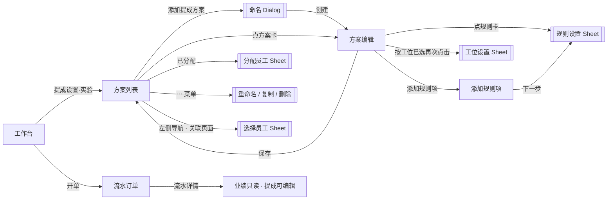

# PRD：提成设置（商户端 · 多方案版）

| 字段 | 内容 |
|------|------|
| 文档版本 | v1.2 |
| 日期 | 2026-08-28 |
| 交互原型（唯一可视依据） | 同目录 `demo.html`（中文镜像：`剑琅联盟-RTB重构.html`；功能链路「提成设置·实验」`commission2`，及「开单记账」流水详情） |
| 画布 | 390 × 844 |
| 目的 | 供前端 / 后端 / 测试及 AI 工具落地「新版提成设置」；**只需本文 + 交互原型** |
| 关联（非必读） | 同目录 `PRD-项目创建与管理.md`（覆盖规则项的项目/产品目标取自价目数据）；`PRD-会员卡管理.md`（覆盖规则的会员卡目标取自卡模板） |

---

## 怎么读这份 PRD

正文按模块编排。**不用通读全文**，按角色跳章即可。

| # | 模块 | 前端 | 后端 | 测试 | 说明 |
|---|------|:----:|:----:|:----:|------|
| 1 | 背景 / 目标 / 范围 / 能力映射 | ✓ | ✓ | ✓ | 重构叙事、防范围蔓延 |
| 2 | 用户场景与成功标准 | ✓ | 了解 | ✓ | 测「业务对不对」 |
| 3 | 信息架构与页面清单 | ✓ | 了解 | ✓ | 做哪些页 |
| 4 | 状态机 | ✓ | **必看** | **必看** | 方案/规则块/编辑态/工位/分配 |
| 5 | 交互细则 / 异常流 | ✓ | 了解 | ✓ | 校验、toast、拦截 |
| 6 | 功能规格 | ✓ | 了解 | ✓ | 逐屏字段与跳转 |
| 7 | 数据模型与接口约定 | ✓ | **必看** | ✓ | 字段、能力清单、时序 |
| 8 | 业务规则 | ✓ | **必看** | **必看** | 计提规则、一人一方案、业绩四部分、权限 |
| 9 | 文案清单与权限 | ✓ | 部分 | ✓ | 文案；角色权限矩阵 |
| 10 | 验收 P0 + 造数场景 | 了解 | 了解 | **必看** | Given→When→Then |
| 11 | 非功能（极简） | ✓ | ✓ | ✓ | |
| 12 | 交付物 | ✓ | — | ✓ | 仅 PRD + 原型 |

**先读这几条（贯穿全文）**

1. 本期为**新版提成设置**（原型「提成设置·实验」`commission2`），采用 **多方案** 模型：每个提成方案可整体分配给若干员工，方案内按「项目 / 产品 / 办卡 / 充卡 / **快速消费**」**5 项默认** + N 条**覆盖规则项**配置提成。**每人只能分配一个提成方案**；开单计提时只读该员工所属唯一方案。不同行 / 互不覆盖的计算项可相加（见 §8）。**快速消费**在 UI 为第 5 张默认卡，数据上是系统项目覆盖项（`system: true`，`refId=quick`），不可删除。
2. **提成计算不再依赖旧「业绩设置」**：旧「业绩设置」功能（简单模式 / 进阶基础设置）**本期被完全移除**，工作台不再提供入口；其“按业绩计算提成”的旧口径一律废除。
3. 系统内「业绩」与「业绩提成」**解耦**：业绩 = 流水订单按支付方式归类的金额合计，由 **现金 / 卡付 / 团购 / 签单** 4 部分组成（签单 = 线上「经理签单」+「记为欠款」）；业绩**只作为经营统计维度**，不参与提成计算，也**不可人工编辑**（见 §8 规则 16）。
4. **流水订单**：订单行内「业绩」**只读展示**，不再可编辑；「提成」仍可编辑，但需权限（**店主 / 合伙人**），且每次改动记录**修改日志**（操作人 / 时间 / 前后值），流水详情可查看（见 §6.8、§8 规则 18–19）。
5. **提成生效时点**：开单（结算）时按员工所属方案自动计算提成并**写入订单行** `staffCommissions`；此后可在流水详情人工修正（有权限者）。薪资核算取订单行提成汇总（薪资联动本期 PRD 只给口径，不展开完整薪资规格，见模块 2）。
6. 每条提成规则的**提成范围**为支付方式多选：**现金 / 卡付 / 团购 / 签单** 四类（签单 = 经理签单 + 记为欠款）。范围外的支付方式对应订单行**不计提成**。
7. 原型工具栏「无数据 / 有数据」造数**仅演示**，不进正式产品。接口路径标 `【待联调确认】`，正式接口文档暂无交付时间；不臆造现网 URL。
8. 本期**仅单店**；旧「提成设置」（阶梯比例版 `commission`）**保留为独立模块**，不在本文展开；新老两套并存时以本文为准。

交互行为与文案以 **`demo.html` 当前表现** 为准。

---

# 模块 1　背景 / 目标 / 范围 / 能力映射
> 读者：前端 ✓ · 后端 ✓ · 测试 ✓

## 1.1 背景

旧提成为「阶梯比例」单方案模型，且提成计算依赖旧「业绩设置」产出的计算基数；「业绩设置」同时承担业绩口径配置，职责混叠、配置链路长，商户难以表达“不同分类、不同支付方式、不同工位”的差异化提成。

本期重构为**多方案提成设置**：

- **方案化**：一套提成规则即一个「提成方案」，可命名、复制、整方案分配员工；**每人只能分配一个方案**，适应多岗位（顾问 / 技师 / 销售）并存的门店。
- **规则块化**：方案内 5 项默认（项目 / 产品 / 办卡 / 充卡 / **快速消费**）+ 用户覆盖规则项（指定项目、产品、会员卡、整类分组）；快速消费在数据上为系统项目覆盖项。
- **口径独立**：提成基数 = 订单行**原价 / 实收**（按规则配置），不再经过旧「业绩设置」；旧「业绩设置」整体移除。
- **业绩解耦**：业绩回归“支付方式统计”属性（现金 / 卡付 / 团购 / 签单四部分），只读、不参与提成、不可手工改。
- **流水闭环**：开单自动写提成 → 流水详情可查看 / 人工修正（店主 / 合伙人）→ 改动留痕可审计。

## 1.2 目标

| 目标 | 说明 |
|------|------|
| 多方案并存 | 多套方案并存；**每人只能分配一个方案**（不可跨方案） |
| 规则可分层 | 5 项默认（含快速消费系统覆盖）+ 用户覆盖规则项 |
| 口径独立 | 计算基数（原价 / 实收）与支付范围（现金 / 卡付 / 团购 / 签单）由规则自定，不依赖业绩设置 |
| 分配灵活 | 方案整体分配员工；工位（默认大 / 中 / 小工，可改名 / 删除，**不可新增**）参与按工位分配 |
| 业绩解耦 | 业绩 = 现金 + 卡付 + 团购 + 签单；只读展示，不参与提成、不可编辑 |
| 流水可审计 | 开单自动算提成写行；详情可查看，人工修正（店主 / 合伙人）留修改日志 |

## 1.3 本期做（In）

- 提成方案列表（新建 / 重命名 / 复制 / 删除；未分配员工提示）
- 方案编辑页：5 项默认规则卡（含快速消费）+ 覆盖规则项卡 + 「添加规则项」
- 规则设置 Sheet：提成范围（4 类支付方式）、计算基数（原价 / 实收）、分配模式（不分工位 / 按工位）、提成取值（按比例 % / 固定金额 ¥）、点客 / 散客参数（按工位时逐工位）
- 工位设置 Sheet：改名（恢复默认 / 确定）、删除（至少保留 1 个）；**不可新增工位**
- 添加规则项页：类型 Tab（项目 / 产品 / 会员卡）+ 分组筛选 + 多选（含整类分组）+ 已配置项禁用
- 分配员工 Sheet（员工池多选、全选、清空；**已被其他方案占用的员工灰显不可选**）
- 规则卡「固定」标签：提成参数=**固定金额**时，规则卡计算基数标签改显「固定」（`#A7E6A7`），忽略计算基数设置；规则卡内置「比例% / 固定¥」评审切换（演示交互）
- 左侧导航「**关联页面**」区域（位于「页面链路」与「文档」之间）+ 「选择员工」Sheet（员工卡翻转选择：点客 / 散客 → 大工 / 中工 / 小工；纯演示，toast「已选 N 人」）
- 试算口径：示例订单行按员工方案集合计算提成（原型试算引擎）
- 流水订单：业绩只读展示；提成可编辑（店主 / 合伙人）；修改日志记录与查看
- 工作台移除「业绩设置」入口；旧「提成设置」保留
- 权限：`achCommSet` 仅店主 / 合伙人；流水提成编辑仅店主 / 合伙人

## 1.4 本期不做（Out）

- 员工薪资核算页的完整规格（提成汇总口径见「先读这几条」第 5 条，薪资页其余逻辑另模块）
- 业绩排行 / 业绩报表（仅业绩四部分统计口径在本文定义）
- 多门店提成配置与同步（**本期仅单店**）
- 正式提成结算单 / 工资条打印
- 原型的「无数据 / 有数据」造数开关
- 历史提成数据的迁移方案（**暂无**）

## 1.5 旧 → 新能力映射（不写废弃产品名）

| 旧体系常见能力（语义） | 新体系如何配置 |
|------------------------|----------------|
| 单一固定提成比例 | 多方案：每方案 5 项默认规则（项目 / 产品 / 办卡 / 充卡 / **快速消费**） |
| 按“业绩”计算提成 | 移除：提成基数由规则「原价 / 实收」直接定义，与业绩解耦 |
| 特殊项目单独提成 | 覆盖规则项：指定项目 / 产品 / 会员卡 / 整类分组 |
| 快速消费单独提成 | 第 5 项默认「快速消费」；数据为系统项目覆盖项（`ov_sys_quick`），不吃「项目」默认 |
| 按工位分别设提成 | 分配模式 = 按工位分配，逐工位设点客 / 散客参数 |
| 全体员工一套规则 | 方案 + 分配员工；**一人一方案** |
| 流水改业绩 / 改提成 | 业绩只读；提成可改（店主 / 合伙人）且留修改日志 |

映射不足时以原型字段与行为为准。

---

# 模块 2　用户场景与成功标准
> 读者：前端 ✓ · 后端 了解 · 测试 ✓

## 2.1 角色

| 角色 | 说明 |
|------|------|
| 店主（默认） | 全部能力：配置提成方案、分配员工、编辑流水提成 |
| 合伙人 | 同店主（含 `achCommSet`、流水提成编辑） |
| 店长 | 无提成配置权限；不可编辑流水提成 |
| 高级店员 / 店员 | 无提成配置权限；不可编辑流水提成；业绩全程只读 |

## 2.2 核心场景

| 场景 | 用户期望 | 成功标准 |
|------|----------|----------|
| 新建提成方案 | 输入名称即建方案并进入编辑 | 列表出现新方案；未分配前“未分配” |
| 配 5 项默认提成 | 项目 / 产品 / 办卡 / 充卡 / 快速消费分别设范围、基数、分配、参数 | 各规则卡摘要正确；保存后列表摘要更新 |
| 覆盖指定项目 | 某项目单独给更高提成 | 覆盖规则卡在编辑页出现且优先级高于默认 |
| 覆盖整类分组 | 把价目某自定义分组整类设统一提成 | 分组内所有项目 / 产品命中该覆盖 |
| 按工位分配 | 大 / 中 / 小工分别设点客散客参数 | 规则卡显示逐工位参数；工位改名全局生效 |
| 分配员工 | 把方案分配给人，**一人一方案** | 已占用员工灰显「已在「方案名」」；列表“已分配”正确 |
| 快速消费独立计提 | 快消不吃「项目」默认 | 命中系统覆盖 `ov_sys_quick`；不可删除 |
| 流水查看与修正 | 详情看业绩（只读）与提成 | 业绩不可编辑；提成可编辑（店主 / 合伙人）且留修改日志 |
| 店员看流水 | 可查看，但不可改提成 | 编辑被权限拦截并 toast |

---

# 模块 3　信息架构与页面清单
> 读者：前端 ✓ · 后端 了解 · 测试 ✓

```
提成设置（多方案）
 ├─ 方案列表
 │    ├─ 标题栏：提成设置 · 帮助（多方案规则）·「实验」tag
 │    ├─ 未分配提示条（还有 N 人未分配提成）
 │    ├─ 方案卡：图标 · 名称 · 提成规则摘要（5 项默认( + N 条覆盖)）· 已分配员工
 │    │         · 分配入口 · ⋯ 菜单（重命名 / 复制方案 / 删除）
 │    └─ 底部「+ 添加提成方案」/ 空态
├─ 方案编辑
│    ├─ 5 张默认规则卡（项目 / 产品 / 办卡 / 充卡 / 快速消费）
│    ├─ 覆盖规则项卡（可删除；不含系统快消）+「+ 添加规则项」
│    ├─ 规则卡右侧「比例% / 固定¥」评审切换（即时切换提成取值，标签随显「固定」）
│    └─ 底部「保存」
├─ 添加规则项
│    ├─ 类型 Tab：项目 / 产品 / 会员卡
│    ├─ 分组轨（全部 / 自定义组）+ 全选 · 已选 N 项 · 反选
│    ├─ 列表（名称 + 价格 / 面值；已配置项灰底白勾禁用；整类分组可勾）
│    └─ 底部「取消 / 下一步(N)」
├─ 规则设置 Sheet（分类 / 覆盖 / 添加规则项共用）
│    ├─ 提成范围（现金 / 卡付 / 团购 / 签单 多选 chips）
│    ├─ 计算基数（原价模式 / 实收模式；提成取值=固定金额时规则卡标签改显「固定」）
│    ├─ 分配模式（不分工位 / 按工位分配 → 工位设置）
│    ├─ 会员卡（办卡 / 充卡；仅会员卡覆盖规则显示）
│    ├─ 提成取值（按比例 % / 固定金额 ¥）+ 点客 / 散客 输入
│    └─ 取消 / 确定
├─ 工位设置 Sheet
│    ├─ 工位行：名称 · 改名 / 删除；编辑态：输入 · 恢复为默认 / 确定
│    └─ 完成（**无新增工位**）
├─ 分配员工 Sheet：员工卡多选（已占用灰显）· 全选 / 清空 · 已选 N 人 · 确定
├─ 关联页面（左侧导航区域）
│    └─ 选择员工 Sheet：员工卡翻转选择（点客 / 散客 → 大工 / 中工 / 小工）· 清空 · 完成（toast「已选 N 人」）
└─ 弹层：方案命名 / 重命名、删除确认、未保存返回、删除规则项、帮助说明
```

### 3.0 页面流（示意）



| 页面/层 | 导航标题（原型） | 说明 |
|---------|------------------|------|
| 方案列表 | 提成设置 | 帮助 +「实验」tag；未分配提示条；底部「+ 添加提成方案」 |
| 方案编辑 | {方案名} | 5 默认规则卡（含快速消费）+ 用户覆盖规则项 +「+ 添加规则项」；底部「保存」 |
| 添加规则项 | 添加规则项 | 类型 Tab / 分组轨 / 全选·反选 / 下一步 |
| 规则设置 | 分类名 / 覆盖名 / 添加规则项 · 设置 | 底部「取消 / 确定」 |
| 工位设置 | 工位设置 | 底部「完成」 |
| 分配员工 | 分配员工 | 底部「取消 / 确定」 |
| 选择员工（关联页面） | 选择员工 | 左侧导航「关联页面」入口；员工卡翻转选择（点客 / 散客 → 大工 / 中工 / 小工）；底部「完成」 |
| 流水详情 | 流水详情 | 业绩 / 提成指标；修改记录入口 |

功能链路演示节点（FLOW_MAP「提成设置」）：`comm2-list` / `comm2-edit` / `comm2-pick` / `comm2-staff`（原型内嵌 FLOW_NAV 亦有 `comm2` 系列）；捕获深链 `?capture=comm2-advisor` 直开「顾问标准提成」编辑页。

深链：`demo.html?flow=<节点 id>`（可选 `&capture=1`）。流水详情相关节点归属「开单记账」分组。

实现路由建议（名称可调整）：`comm2-scheme-list` / `comm2-scheme-edit` / `comm2-rule-pick` / `comm2-rule-sheet` / `comm2-station-sheet` / `comm2-assign-sheet` / `comm2-staff-picker`。

---

# 模块 4　状态机
> 读者：前端 ✓ · 后端 **必看** · 测试 **必看**

## 4.1 方案生命周期

```
未保存草稿 ──保存──► 已保存方案 ──重命名──► 已保存（改名）
已保存 ──复制──► 新副本（未分配员工）
已保存 ──删除──► 移除（确认后）
```

| 状态 | 说明 |
|------|------|
| 草稿（`store._draft`） | 「添加提成方案」命名后进入编辑；保存后入列表顶部 |
| 已保存 | 进入编辑即持 `_snapshot`；未保存返回可还原 |
| 已分配 | `assigneeIds` 非空；员工不可跨方案 |
| 未分配 | `assigneeIds` 为空；列表「已分配：未分配」；计入未分配提示 |

## 4.2 编辑脏状态

- 进入编辑页对任一规则 / 覆盖 / 工位 / 范围等产生写入即置脏（`_dirty`）。
- 返回时若脏 → Dialog「尚未保存」「尚未保存，确定要返回吗？」「留在本页 / 不保存」。
- 选择「不保存」：草稿丢弃，或已保存方案还原为进入时快照（`_snapshot`）。
- 「保存」成功：toast「提成方案已保存（实验）」→ 回列表；快照更新。

## 4.3 规则块（默认 / 覆盖）内部状态

| 字段组 | 取值 | 说明 |
|--------|------|------|
| 提成范围 `payScope` | `{cash, memberCard, groupBuy, sign}` 各布尔 | 至少选 1 类；取消最后 1 类被拦截 |
| 计算基数 `baseMode` | `list` 原价 / `paid` 实收 | 规则卡彩色标签「原价」「实收」；**当提成取值=固定金额时，该标签改显「固定」（`#A7E6A7`），忽略计算基数设置** |
| 分配模式 `pickMode` | `avg` 平均 / `station` 按工位 | 按工位时逐工位参数生效 |
| 提成取值 `valueMode` | `pct` 比例 / `amount` 固定金额 | 切换保留双字段（点客 / 散客）；**固定金额时规则卡计算基数标签显示「固定」** |

## 4.4 覆盖规则项（Override）

```
添加：选择目标（项目/产品/会员卡/整类分组）→ 设置 → 确定 → 写入 overrides，置脏
命中：订单行匹配 targets 之一即命中；多 target 命中同一行仍只计一次
删除：确认「确认删除该规则项？」→ 移除，置脏
```

- 覆盖规则的**优先级高于**默认规则（§8 规则 5 解析顺序）。
- 「已配置」判定：目标已被任何覆盖引用（或所属分组整类被引用）→ 添加规则项列表中**灰底圆白勾禁用**，不可再次添加。

## 4.5 工位

```
默认 3 工位：senior 大工 / mid 中工 / junior 小工
改名 ──► stationLabels 更新，全方案规则卡即时生效
删除 ──► 确认后移除；各规则卡上该工位参数一并清除；至少保留 1 个
不可新增工位
```

- 删除确认文案：「删除后，各规则卡上该工位的提成参数将一并清除，确定删除？」。
- 改名输入 maxlength 4；空名 toast「名称不能为空」；「恢复为默认」在已是默认名时禁用。
- 按工位模式下，工位删除导致订单行无法命中该工位 → 回退规则级点客 / 散客（§8 规则 7 兜底）。
- **不可新增**：工位设置 Sheet 无「+ 新增工位」入口。

## 4.6 分配状态

- 员工池 = 开单员工池（`EmployeeDemo.getBillingStaffPool`；回退内置 st1–st5）。
- **一人一方案**：同一员工不可同时出现在多个方案的 `assigneeIds`；进入列表时若发现冲突，保留最先出现的方案并 toast「已按一人一方案自动整理」。
- 分配 Sheet：已被其他方案占用的员工 **灰显不可选**，副文「已在「{方案名}」」；全选仅勾选未占用员工；确定时再校验。
- 未分配 = 员工池中不属于任何方案的员工；列表顶部提示「还有 **N** 人未分配提成」，点击查看名单 Dialog。
- 确定后 toast「已分配 N 人」或「已清空分配」。

## 4.7 流水订单指标状态

| 指标 | 状态 |
|------|------|
| 业绩 | **只读展示**；不再可编辑 |
| 提成 | 可编辑（店主 / 合伙人权限）；改动写订单行并记录修改日志 |

---

# 模块 5　交互细则 / 异常流
> 读者：前端 ✓ · 后端 了解 · 测试 ✓

## 5.1 通用

- 返回：列表返回工作台；编辑页返回列表（脏则拦截）；子层逐级返回。
- 金额 / 比例输入：走**金额键盘**（`amountKeypad`，`input-amount` 类）；不得弹系统数字键盘。
- 文本：方案名称 ≤ **20** 字；工位名 ≤ **4** 字（原型 maxlength=4；工位映射帮助文案提示最多 3 字以原型为准）。
- 比例范围：点客 / 散客比例 **0–100%**；固定金额 **≥ 0**。

## 5.2 校验失败（Toast）

| 条件 | 提示 |
|------|------|
| 方案名称为空（新建 / 重命名） | 请输入方案名称 |
| 规则点客比例无效（非数字 / <0） | 请输入有效的点客比例 |
| 规则散客比例无效 | 请输入有效的散客比例 |
| 固定金额模式点客金额无效 | 请输入有效的点客金额 |
| 固定金额模式散客金额无效 | 请输入有效的散客金额 |
| 比例 > 100% | 比例需在 0–100% |
| 取消某块最后一个支付方式 | 至少选一种支付方式 |
| 保存时某默认类范围为 0 | 「{类名}」至少选一种支付方式 |
| 保存时某覆盖范围为 0 | 覆盖规则「{标题}」至少选一种支付方式 |
| 工位改名后为空 | 名称不能为空 |
| 工位数已达上限新增 | 最多 5 个工位 |
| 权限不足（编辑流水提成） | 当前为「{角色}」，无法修改提成（以原型文案为准） |

## 5.3 拦截与确认

| 时机 | 行为 |
|------|------|
| 返回未保存编辑页 | Dialog「尚未保存」；留在本页 / 不保存 |
| 删除方案 | Dialog「确认删除该方案？」「删除后不可恢复。」 |
| 删除覆盖规则项 | Dialog「确认删除该规则项？」「删除后不可恢复。」 |
| 删除工位 | confirm「删除后，各规则卡上该工位的提成参数将一并清除，确定删除？」 |
| 编辑流水提成（权限不足） | toast 拦截，数据不变 |
| 点击已配置（灰底白勾）规则目标 | 不可点击（disabled） |

## 5.4 空态

| 页面 | 空态文案 |
|------|----------|
| 方案列表无方案 | 还没有提成方案 / 点下方按钮添加 |
| 添加规则项某分类无内容 | 该分类下暂无内容 |
| 添加规则项列表无分组 | 分组轨隐藏（仅「全部」） |

---

# 模块 6　功能规格
> 读者：前端 ✓ · 后端 了解 · 测试 ✓

下列字段、按钮、跳转均须与原型一致；视觉以原型为准（基数彩色标签：原价 `#FFB6B6`、实收 `#BBB6FF`、**固定 `#A7E6A7`（提成参数为固定金额时）**，圆角 4px；提成参数文字 `#8D8D8D`）。

## 6.1 方案列表

**结构**

- 标题栏：返回 ·「提成设置」· 帮助（多方案规则）·「实验」tag。
- 未分配提示条（`comm2UnassignedTip`）：存在未分配员工时显示「还有 **N** 人未分配提成」+ 右侧 chevron；点击弹 Dialog 列出名单；无未分配时隐藏。
- 方案卡（`emp-comm-card`）：
  - 主区：图标（提成图）· 方案名称 · 提成规则摘要「5 项默认」或「5 项默认 · N 条覆盖」。
  - 分配行：「已分配」+ 员工名（` · ` 连接；空为「未分配」）。
  - ⋯ 菜单（`comm2MenuMask`）：重命名 / 复制方案 / 删除；取消在 foot。
- 底部：品牌红「+ 添加提成方案」（→ 命名 Dialog）。
- 空态：还没有提成方案 / 点下方按钮添加。

**菜单动作**

| 动作 | 行为 |
|------|------|
| 重命名 | Dialog「重命名方案」，预填当前名；确定 toast「方案已重命名」 |
| 复制方案 | 生成「{原名} 副本」，`assigneeIds` 清空；toast「方案已复制」 |
| 删除 | Dialog「确认删除该方案？」；确认 toast「方案已删除」 |

## 6.2 方案编辑

- 标题 = 方案名。
- 卡片区：5 张默认规则卡（项目 / 产品 / 办卡 / 充卡 / 快速消费）+ 用户覆盖规则项卡（右侧删除按钮）+ 底部「+ 添加规则项」。
- 规则卡（`comm2-rule-bar`）两行：
  - 行 1：标题（覆盖项长标题省略号截断，`title` 提示全文）+ 右侧**提成范围胶囊**（现金 / 卡付 / 团购 / 签单；为空显示「—」）。
  - 行 2：**计算基数彩色标签**（原价 `#FFB6B6` / 实收 `#BBB6FF`；**当该规则提成参数为「固定金额」时标签显示「固定」`#A7E6A7`，此时忽略计算基数设置**；圆角 4px）+ 提成参数（不分工位：`点客X·散客Y`；按工位：逐工位 `工位名 X·Y` 分行，右对齐 `#8D8D8D`）+ chevron。
- 规则卡右侧（删除按钮左侧）为**提成参数评审切换**（`比例%` / `固定¥` 两段按钮，随该规则当前取值高亮）：点击即时在「按比例」与「固定金额」之间切换该规则的提成取值，计算基数标签随之在 原价/实收 与 固定 之间切换。**此为原型评审演示交互，业务上以规则设置 Sheet 的「提成取值」为准**。
- 点规则卡 → 规则设置 Sheet；覆盖项点删除 → 删除确认。
- 底部「保存」：校验全部默认 / 覆盖范围 ≥1 类 → toast「提成方案已保存（实验）」→ 回列表。

## 6.3 规则设置 Sheet（分类 / 覆盖 / 添加规则项共用）

| 区 | 控件 | 说明 |
|----|------|------|
| 提成范围 | chips 多选（现金 / 卡付 / 团购 / 签单） | 至少 1 类；选中态品牌色 |
| 计算基数 | 分段：原价模式 / 实收模式 | `baseMode`；分段保持可切换，**但当提成取值切换为「固定金额」时，规则卡上的计算基数标签改显「固定」，不再随分段变化** |
| 分配模式 | 分段：不分工位 / 按工位分配 | 按工位已选中时**再次点击** → 打开工位设置 Sheet；齿轮浅灰内嵌 |
| 会员卡 | 分段：办卡 / 充卡 | **仅**覆盖规则且目标为会员卡时显示（`showCardRole`）；决定 `cardRole` 与归属类（办卡→`issue` / 充卡→`card`） |
| 提成取值 | 分段：按比例 % / 固定金额 ¥ | 切换保留双字段；**固定金额时规则卡计算基数标签显示「固定」** |
| 点客 / 散客 | 双输入框（`input-amount`，金额键盘） | 不分工位：规则级一组；按工位：**每工位一组**（`工位名` 行） |

标题：默认分类为类名；覆盖为覆盖标题；添加规则项为「添加规则项 · 设置」。取消 / 确定在 foot。

**确定（默认 / 覆盖）**：校验输入 → 写回块 → toast「已更新规则」→ 关 Sheet → 重绘卡片并高亮该卡（flash）。
**确定（添加规则项）**：见 §6.5。

## 6.4 工位设置 Sheet

| 控件 | 行为 |
|------|------|
| 工位行（非编辑态） | 工位名 + 「改名」/「删除」（仅 1 个工位时删除禁用） |
| 工位行（编辑态） | 输入框（maxlength 4，聚焦全选）+「恢复为默认」（已是默认名禁用）/「确定」 |
| 新增工位 | **本期不可新增**（无入口） |
| 完成 | 关 Sheet，回到规则设置 / 编辑页 |

改名 / 删除后：重绘工位 Sheet、编辑卡片，若规则 Sheet 打开则刷新其参数区。

## 6.5 添加规则项

**入口**：编辑页「+ 添加规则项」。

**页面**：
- 类型 Tab：**项目 / 产品 / 会员卡**（默认项目）。
- 分组轨：全部 + 自定义分组（会员卡为卡分组），无分组时隐藏。
- 工具行：全选 · 已选 N 项 · 反选。
- 列表项：名称 + 副行（项目 / 产品为价格 `¥x`；会员卡为「面值 ¥x」/「已下架」）。
- 整类行：当前分组顶部「整类 · {组名}」可整体勾选。
- 已配置项：**灰底圆 + 白勾**（`is-configured`），disabled，不可选；被整类覆盖涵盖的单项目同样禁用。
- 底部：取消 / **下一步（N）**（N=已选数；为 0 时禁用）。

**交互**：
- 勾选单项：互斥清理——勾选单项时，移除覆盖它的整类组勾选；勾选整类组时，移除组内单项勾选。
- 会员卡类型下，勾选时带当前 `cardRole`（办卡 / 充卡在下一步设置 Sheet 中可切）。
- 「下一步」→ 规则设置 Sheet（标题「添加规则项 · 设置」）→ 确定 → 生成覆盖规则项写入 `overrides`，toast「已添加规则项」→ 回编辑页。

**覆盖项数据**：`targets` 保存目标（kind / refId / name；整类为 `group` + `groupKind`；会员卡带 `cardRole`）；标题 = 目标名以「、」连接。

## 6.6 分配员工 Sheet

- 标题「分配员工」；工具行：全选 · 已选 N 人 · 清空。
- 员工卡：头像 + 姓名 + 职位（缺省「未设置职位」）+ 勾选。
- 空员工池：「暂无在岗员工」。
- 确定：写回 `assigneeIds`；toast「已分配 N 人」/「已清空分配」；关 Sheet；重绘列表。

## 6.7 关联页面 · 选择员工 Sheet

左侧导航「**关联页面**」区域（位于「页面链路」与「文档」之间）中的独立入口，与提成方案编辑链路无数据联动，**仅作关联功能演示**（后续可继续补充关联页面）。

**入口**：左侧导航「关联页面 · 选择员工」（`data-flow=comm2-staff`）。

**Sheet 结构**：
- 标题「选择员工」。
- 员工卡网格：**5 名演示员工**（顾清扬 / 林屿森 / 何苏叶 / 阿Ken / Lisa），**初始全部未选**。
- 底部「完成」。

**交互动效**（与开单结账「选择服务员工」同款）：
- 点卡片 → 卡片放大翻转出「**点客 / 散客**」双选项（其余卡片置灰）；点散客卡片另有 scrim 取消。
- 选「点客 / 散客」→ 翻面出「**大工 / 中工 / 小工**」三选项；选择工位后卡片缩小复位为选中态（左上角红色对勾，标题行显示「点客·大工」等摘要）。
- 已选卡片右上角「✕」可清除选择。

**行为**：
- 「完成」→ toast「已选 N 人」→ 关 Sheet。
- 点遮罩关闭 Sheet。
- 纯演示：**不与方案 / 员工分配（`assigneeIds`）数据联动**。

## 6.8 流水订单：业绩只读 + 提成编辑

**范围**：流水详情页（`flowDetailBody`）及流水编辑项内员工指标。

| 指标 | 行为 |
|------|------|
| 业绩 | 只读文本展示（不可点、不可改；数据来自订单行，由支付方式自动归类，见 §8 规则 16） |
| 提成 | 可点金额键盘编辑；**仅店主 / 合伙人**；每次修改写订单行 `staffCommissions` 并追加修改日志 |

- 修改日志：复用流水现有修改记录（`editLogs`，结构 `{id, time, operator, summary}`）；提成改动时 `summary` 记「修改提成：{旧值}→{新值}」，`operator` 取当前登录员工，`time` 取当前时间；流水详情「修改记录 · N」入口可查看（原型已有 `data-flow-edit-log` 入口）。
- 权限不足（店长 / 高级店员 / 店员）点击提成：toast 拦截，值不变。
- 原型流水编辑提示文案「…再为项目设置服务人与业绩」中“业绩可设置”表述与本期“业绩只读”不符，随本期调整为仅提及成（最终文案以原型联调为准）。

## 6.9 帮助弹窗（原型文案）

| 弹窗 | 内容 |
|------|------|
| 多方案规则（列表页帮助） | ①每人只能分配一个提成方案（已占用员工灰显）；②按行过滤：每笔订单行先按支付方式对照该员工所属方案「提成范围」，不在范围不计提成；③覆盖优先（含系统「快速消费」）；④不同业务行或互不覆盖的计算项可分别计入后相加 |
| 计算基数说明（规则 Sheet「原价模式」旁） | 原价模式：范围内开单（项目、产品、会员卡开卡、快速消费、商城订单、充卡/续次/延期）按**原价**加总作基数（快速消费原价=实收；商城按订单原价；充卡/续次/延期按原价）；实收模式：范围相同，按**实收金额**加总 |
| 分配模式说明 | 不分工位：开单无需选工位，按点客 / 散客统一提成；按工位分配：按大 / 中 / 小工分别设置提成 |

---

# 模块 7　数据模型与接口约定
> 读者：前端 ✓ · 后端 **必看** · 测试 ✓

## 7.1 提成方案 `Scheme`

| 字段 | 类型 | 说明 |
|------|------|------|
| id | string | 唯一；新建为 `c2_{timestamp}` |
| name | string | 方案名；≤20 字 |
| stationIds | string[] | 工位 id 列表；默认 `['senior','mid','junior']`；**不可新增**；可删至 ≥1 |
| stationLabels | object | `{ [stationId]: { label } }`；缺省回退默认标签（大工 / 中工 / 小工） |
| defaults | object | 4 类分类默认规则块，键：`labor` 项目 / `sales` 产品 / `issue` 办卡 / `card` 充卡（见 7.2） |
| overrides | OverrideRule[] | 覆盖规则项（见 7.3）；**必含**系统项 `ov_sys_quick`（快速消费，`system: true`） |
| assigneeIds | string[] | 分配员工 id；可空；**员工不可跨方案** |
| _v3 | boolean | 数据模型版本标记（迁移用） |

## 7.2 规则块 `RuleBlock`（defaults 值 & override 主体共用）

| 字段 | 类型 | 说明 |
|------|------|------|
| payScope | object | `{ cash, memberCard, groupBuy, sign }` 各布尔；**至少 1 个 true**；`sign` = 经理签单 + 记为欠款 |
| baseMode | 'list' \| 'paid' | 原价模式 / 实收模式；规则卡标签「原价」/「实收」 |
| pickMode | 'avg' \| 'station' | 不分工位 / 按工位分配 |
| rule | CatRule | 见 7.2.1 |
| cardRole | 'issue' \| 'card' | 仅覆盖会员卡规则；办卡 / 充卡（影响归属类与命中） |

### 7.2.1 分类规则 `CatRule`

| 字段 | 类型 | 说明 |
|------|------|------|
| valueMode | 'pct' \| 'amount' | 按比例 % / 固定金额 ¥ |
| designated | number | 点客比例（pct 模式） |
| nonDesignated | number | 散客比例（pct 模式） |
| designatedAmt | number | 点客金额（amount 模式） |
| nonDesignatedAmt | number | 散客金额（amount 模式） |
| stations | object | `{ [stationId]: { designated, nonDesignated, designatedAmt, nonDesignatedAmt } }`；按工位分配时逐工位取值 |

## 7.3 覆盖规则项 `OverrideRule`

| 字段 | 类型 | 说明 |
|------|------|------|
| id | string | 唯一；用户项 `ov_{timestamp}`；系统快消固定 `ov_sys_quick` |
| system | boolean | 可选；`true` 表示系统项（快速消费），UI 进默认区、不可删 |
| belongCat | 'labor'\|'sales'\|'issue'\|'card' | 归属分类（决定图标与解析兜底）；快消为 `labor` |
| title | string | 目标名「、」连接；长标题省略号截断；快消固定「快速消费」 |
| payScope / baseMode / pickMode / rule | 同 7.2 | |
| targets | Target[] | 命中目标（见 7.3.1）；快消为 `[{ kind:'project', refId:'quick', name:'快速消费' }]` |

### 7.3.1 目标 `Target`

| 字段 | 类型 | 说明 |
|------|------|------|
| kind | 'project'\|'product'\|'card'\|'group' | 项目 / 产品 / 会员卡 / 整类分组 |
| refId | string | 价目项目 / 产品 id，或会员卡模板 id，或分组 id |
| name | string | 展示名 |
| cardRole | 'issue'\|'card' | 仅会员卡目标 |
| groupKind | 'project'\|'product' | 仅整类分组目标（区分项目组 / 产品组） |

## 7.4 流水订单扩展字段（与提成相关）

订单行（`FLOW_ORDERS.items[]`）已含：

| 字段 | 说明 |
|------|------|
| staffIds / staffDesignated / staffRoles | 员工、点散客标记、工位（role） |
| staffAchievements | 每员工业绩（**只读**） |
| staffCommissions | 每员工提成（可编辑，店主 / 合伙人） |
| editLogs | 修改记录 `{id, time, operator, summary}`；提成人工改动追加「修改提成：旧→新」 |

订单级 `achievement` / `commission` 为汇总展示。业绩不再可编辑；提成编辑写 `staffCommissions` 并追加 `editLogs`（操作人 / 时间 / 前后值）。

## 7.5 能力清单（路径【待联调确认】；正式文档暂无交付时间）

| 能力 | 说明 |
|------|------|
| 方案 CRUD | 新建 / 重命名 / 复制 / 删除；校验名称非空 ≤20 |
| 方案默认规则读写 | 4 类块：payScope / baseMode / pickMode / rule |
| 覆盖规则 CRUD | 增删改；目标解析（项目 / 产品 / 会员卡 / 整类分组） |
| 工位管理 | 增删改名；全方案联动；≤5 个；删除连带清理各规则块该工位参数 |
| 员工分配 | 方案 ↔ 员工多对多；未分配查询 |
| 价目 / 卡模板桥接 | 添加规则项读取项目 / 产品 / 会员卡目录与分组（未隐藏项） |
| 提成计算 | 开单按方案集合逐行计提写入订单行（见 §8 规则 1–8） |
| 流水提成编辑 | 店主 / 合伙人；写订单行 + 修改日志 |
| 业绩展示 | 订单行业绩只读（现金 / 卡付 / 团购 / 签单 四部分合计） |

## 7.6 时序（示意）

```
商户保存方案
  → API 写方案（defaults/overrides/assigneeIds/stations）
  → 返回列表，toast 成功

开单结算（员工 A 属方案 S1、S2）
  → 对每订单行：S1、S2 各自解析覆盖/默认块 → 按支付范围过滤 → 计算金额
  → 按该员工唯一方案解析覆盖/默认块并计算金额，写入该行 staffCommissions[staffId]
  → 流水详情展示；店主/合伙人可修正并写修改日志

添加规则项
  → 读价目项目/产品（未隐藏）、会员卡模板及分组
  → 多选目标 → 设置 → 写 overrides → 回编辑页
```

---

# 模块 8　业务规则
> 读者：前端 ✓ · 后端 **必看** · 测试 **必看**

1. **一人一方案**：一个员工同时只能属于一个方案；开单计提时只读其所属**唯一方案**。脏数据冲突时保留最先出现的方案并剔除其余。
2. **按行过滤**：每笔订单行先按**支付方式**对照命中块的「提成范围」；不在范围则本行不计提成。
3. **（废除）重叠取最高**：因一人一方案，不再存在「同人多方案取最高」。
4. **不同行可相加**：不同业务行、或互不覆盖的计算项，可分别计入后相加。
5. **覆盖优先于默认**：解析顺序——先按目标匹配覆盖规则项（含系统快速消费 `refId=quick`；单项目 / 产品 / 会员卡按 `kind+refId`；整类分组按 `groupKind+refId`），未命中回落到分类默认块（项目→`labor`、产品→`sales`、办卡→`issue`、充卡→`card`）。快速消费行（`kind=quick` / 名称「快速消费」）**只命中系统覆盖**，不吃项目默认。
6. **计算基数**：`baseMode=list` 用该行**原价**加总；`baseMode=paid` 用该行**实收**加总（§6.9 帮助口径）。签单（经理签单 / 记为欠款）订单行若规则范围含「签单」，**照常参与计提**，基数口径同上。
7. **分配取值**：`pickMode=avg`（UI「不分工位」）用规则级点客 / 散客；`pickMode=station` 用订单行工位对应工位的点客 / 散客；工位缺失时回退规则级点客 / 散客。
8. **金额计算**：`pct` → `round(base × rate / 100)`；`amount` → 固定金额（点客用 `designatedAmt` / 散客用 `nonDesignatedAmt`）。
9. **范围合法性**：任一默认块 / 覆盖块的 `payScope` 至少 1 类；保存时全校验。
10. **已配置防重**：目标已被覆盖（含被整类分组覆盖、含系统快速消费）→ 添加规则项列表**灰底白勾禁用**，不可重复添加。
11. **整类与单项互斥**：添加规则项勾选整类组会清掉组内单项勾选；勾选单项会清掉涵盖它的整类勾选。
12. **工位**：可改名 / 删除（至少 1 个）；**不可新增**；删除工位同时清除各规则块该工位参数。
13. **未分配提示**：员工池中存在不属于任何方案的员工 → 列表提示「还有 N 人未分配提成」；全部有方案则隐藏。
14. **复制语义**：复制方案清空分配（`assigneeIds=[]`），规则与工位原样（含系统快速消费）。
15. **支付范围四类**：现金、卡付、团购、签单（= 经理签单 + 记为欠款）；原型 `COMM2_PAY_SCOPE` 以本期扩展为准（现金 / 卡付 / 团购 / 签单）。
16. **业绩与提成解耦**：业绩 = 现金 + 卡付 + 团购 + 签单四部分合计，只读展示、**不参与提成计算**、不可人工编辑。
17. **旧「业绩设置」移除**：工作台「业绩设置」入口删除；旧口径（按业绩算提成）一律不再使用。
18. **流水提成编辑权限**：仅**店主 / 合伙人**；其余角色点击提成编辑被 toast 拦截。
19. **流水修改日志**：提成每次人工改动写 `editLogs`（复用现有修改记录，结构 `{id, time, operator, summary}`），`summary` 记录前后值（如「修改提成：8.00→10.00」），详情「修改记录」可查。
20. **本期仅单店**；方案数据不跨店同步。
21. **快速消费系统卡**：UI 为第 5 张默认卡；数据为 `overrides` 中 `id=ov_sys_quick`、`system:true`、`targets=[{kind:'project', refId:'quick'}]`；初始参数与「项目」默认相同；**不可删除**。

## 8.1 试算口径（原型试算引擎）

原型内置 8 条示例订单行（`COMM2_TRIAL_LINES`）用于演示与验证：开卡·尊享组合卡、充卡·老客续充、深层补水护理、染发、剑琅玻尿酸精华液、团购体验·洗头、卡付·时尚洗吹、**快速消费**。

计提验证步骤：取员工所属唯一方案 → 每行解析覆盖/默认块 → 支付范围过滤 → 计算金额 → 汇总。此口径与 §8 一致，作为联调参考样例（非正式接口）。

## 8.2 演示数据（造数参考）

原型内置 3 个演示方案：

| 方案 | 要点 |
|------|------|
| 顾问标准提成 | 项目 / 产品默认 12%/10% 等；办卡 / 充卡 0；分配给 st1、st2 |
| 卡付劳动专项 | 项目 / 产品范围仅「卡付」3%；办卡 / 充卡全范围 0；分配给 st3 |
| 资深技师综合方案 | 项目按工位（大工 15/12、中工 12/10、小工 8/8）；产品实收模式；办卡 15/12、充卡 8/8；5 条覆盖（深层补水 18/15、染烫+精华液 20/15、尊享组合卡办卡 12/10、团购体验固定 ¥5、烫染整类按工位）；分配给 st4 |

正式环境自备等价数据；演示开关不进产品。

---

# 模块 9　文案清单与权限
> 读者：前端 ✓ · 后端 部分 · 测试 ✓

## 9.1 文案清单（须与原型一致）

**导航/按钮**：提成设置、添加提成方案、添加规则项、保存、取消、确定、完成、下一步、全选、反选、清空、重命名、复制方案、删除、改名、恢复为默认、分配员工、已分配、未分配、已选 N 项、已选 N 人、还有 N 人未分配提成、5 项默认、5 项默认 · N 条覆盖、项目、产品、会员卡、办卡、充卡、整类 · {组名}、修改记录、**关联页面、选择员工**。

**规则卡**：原价、实收、**固定**、点客、散客、提成范围、计算基数、分配模式、不分工位、按工位分配、按比例 %、固定金额 ¥、**比例% / 固定¥（评审切换）**、现金、卡付、团购、签单、提成参数。

**Dialog/Sheet**：方案名称、重命名方案、请输入方案名称、确认删除该方案？、删除后不可恢复。、确认删除该规则项？、删除后不可恢复。、尚未保存、尚未保存，确定要返回吗？、留在本页、不保存、多方案规则、计算基数说明、分配模式说明、未分配提成、暂无在岗员工、**选择员工、点客、散客、大工、中工、小工**。

**Toast**：请输入方案名称、方案已重命名、方案已复制、方案已删除、提成方案已保存（实验）、已更新规则、已添加规则项、已删除规则项、已分配 N 人、已清空分配、**已选 N 人**、至少选一种支付方式、「{类}」至少选一种支付方式、覆盖规则「{标题}」至少选一种支付方式、请输入有效的点客比例/金额、请输入有效的散客比例/金额、比例需在 0–100%、名称不能为空、最多 5 个工位、已删除工位。

**流水**：业绩（只读）、提成、修改提成、当前为「{角色}」，无法修改提成（以原型为准）。

**空态**：还没有提成方案、点下方按钮添加、该分类下暂无内容。

## 9.2 权限

| 角色 | 提成设置（新版） | 流水提成编辑 | 流水业绩 |
|------|:----:|:----:|:----:|
| 店主 | ✓ | ✓ | 只读 |
| 合伙人 | ✓ | ✓ | 只读 |
| 店长 | ✗ | ✗ | 只读 |
| 高级店员 | ✗ | ✗ | 只读 |
| 店员 | ✗ | ✗ | 只读 |

权限点：`achCommSet`（业绩/提成设置）——店主 / 合伙人；流水提成编辑复用该权限口径（按本期确认）。入口处（工作台「提成设置·实验」）无权限则拦截。

本期交互原型按 **店主** 路径演示。

---

# 模块 10　验收 P0 + 造数场景
> 读者：测试 **必看**

## 10.1 造数

| 场景 | 说明 |
|------|------|
| 空数据 | 无任何方案（原型「无数据」） |
| 有数据 | 3 个演示方案（§8.2）+ 员工池含未分配员工 |

正式环境自备等价数据；演示开关不进产品。

## 10.2 Given → When → Then（P0）

1. **Given** 方案列表为空，**When** 添加提成方案并命名「测试方案」，**Then** 进入编辑页，5 项默认规则卡齐全；保存后列表出现方案卡、摘要「5 项默认」。
2. **Given** 编辑「测试方案」，**When** 改项目类范围去掉「现金」只剩「卡付、团购、签单」，**Then** 卡片范围胶囊同步；保存成功。
3. **Given** 项目类规则，**When** 点散客比例输入 120，**Then** toast「比例需在 0–100%」，不写入。
4. **Given** 项目类范围仅剩 1 类，**When** 再取消该类，**Then** toast「至少选一种支付方式」，范围仍保留该类。
5. **Given** 项目类固定金额模式，**When** 输入点客 ¥5、散客 ¥3 保存，**Then** 规则卡摘要「点客¥5·散客¥3」。
6. **Given** 项目类分配模式「按工位分配」，**When** 再次点击，**Then** 打开工位设置 Sheet。
7. **Given** 工位设置，**When** 把「大工」改名「总监」确定，**Then** 所有规则卡按工位参数行显示「总监 X·Y」；再改名「恢复为默认」可用且恢复为「大工」。
8. **Given** 工位设置 Sheet，**When** 查看底部，**Then** 无「+ 新增工位」入口。
9. **Given** 按工位分配的方案，**When** 删除某工位并确认，**Then** 工位移除、各规则块该工位参数清除；至少保留 1 个时删除禁用。
10. **Given** 添加规则项（项目 Tab），**When** 勾选项目 A 与项目 B 下一步并确定，**Then** 新增覆盖规则卡「A、B」；再进添加规则项，A、B 显示灰底白勾禁用。
11. **Given** 分组轨选择自定义组 G，**When** 勾选「整类 · G」，**Then** 组内单项勾选被清空；下一步确定后生成整类覆盖；组内未覆盖单项在列表中禁用。
12. **Given** 会员卡 Tab，**When** 勾选某卡下一步，**Then** 设置 Sheet 出现「办卡 / 充卡」分段；切「充卡」确定后覆盖卡归属充卡类（图标为充卡）。
13. **Given** 方案 S 已分配员工 A，**When** 打开方案 S2 的分配 Sheet，**Then** A 灰显并显示「已在「S」」，不可勾选；全选不会选中 A。
14. **Given** 员工 A 仅属方案 S1，**When** 开单命中该行，**Then** 只按 S1 计提，不存在跨方案取最高。
15. **Given** 编辑页 5 张默认卡含「快速消费」，**When** 试图删除快速消费，**Then** 无删除按钮 / toast「系统规则不可删除」；快消行命中系统覆盖而非项目默认。
16. **Given** 覆盖规则优先于默认，**When** 同一项目有默认 10% 与覆盖 20%，**Then** 计提用 20%。
17. **Given** 编辑页有改动，**When** 返回，**Then** Dialog「尚未保存」；「不保存」丢弃改动并回列表。
18. **Given** 已保存方案，**When** 重命名、复制、删除，**Then** 分别 toast「方案已重命名 / 已复制 / 已删除」；副本分配清空。
19. **Given** 流水详情，**When** 查看业绩字段，**Then** 只读展示，不可点、不可编辑。
20. **Given** 店主 / 合伙人，**When** 点击流水提成并输入新值，**Then** 提成更新且「修改记录」出现该次改动（操作人 / 时间 / 前后值）。
21. **Given** 店员 / 店长，**When** 点击流水提成，**Then** toast 权限拦截，值不变。
22. **Given** 流水订单行支付方式为「经理签单」且规则范围含「签单」，**When** 计提，**Then** 按该行原价 / 实收照常计提。
23. **Given** 工作台，**When** 查看入口，**Then** **无**「业绩设置」；「提成设置·实验」与旧「提成设置」并存。
24. **Given** 店员 / 店长 / 高级店员，**When** 点击工作台「提成设置·实验」，**Then** 权限拦截（toast），不进入。
25. **Given** 方案列表有未分配员工，**When** 查看列表顶部，**Then** 提示「还有 N 人未分配提成」；点击弹名单；全部分配后提示消失。

---

# 模块 11　非功能（极简）
> 读者：前端 ✓ · 后端 ✓ · 测试 ✓

- 画布与动效对齐原型 390×844。
- 方案数量与员工分配为单店量级；列表无需分页（方案数量少）。
- 埋点：无专表；若现网统一规范另案。
- 图片 / 上传：本模块无上传。
- 金额精度：提成金额建议保留两位小数（round2）；比例 0–100。
- **本期仅单店**。

---

# 模块 12　交付物

| 交付 | 说明 |
|------|------|
| 本文 `PRD-提成设置.md` | 开发与测试准稿 |
| 交互原型 `demo.html` | 唯一可视依据；功能链路「提成设置·实验」（`commission2`）+ 流水详情 |

开发与测试只需 **PRD + 原型**。与价目 / 会员卡交叉时，覆盖规则目标数据以 `PRD-项目创建与管理.md`、`PRD-会员卡管理.md` 为准，提成逻辑以本文为准。冲突时以原型界面为准修正 PRD。
